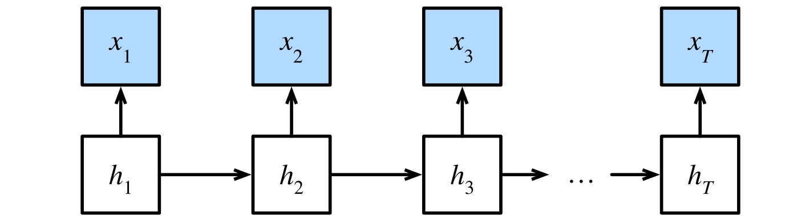
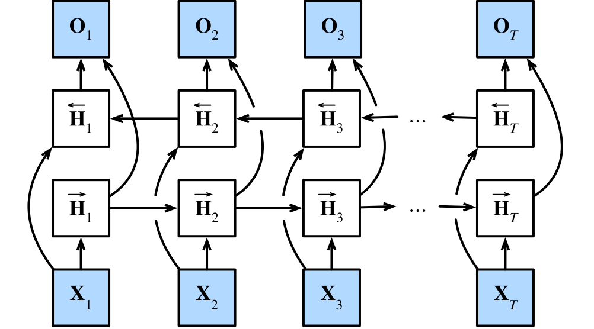
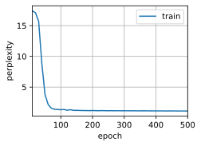

#  
<!--more-->
# 4 双向循环神经网络

- 序列学习中，我们以往假设的目标是：在给定观测的情况下（例如，在时间序列的上下文中或在语言模型的上下文中），对下一个输出进行建模。还能有其他的应用。我们考虑以下三个在文本序列中填空的任务。

    - 我_ _ _。

    - 我_ _ _饿了。

    - 我_ _ _饿了，我可以吃半头猪。

- 根据可获得的信息量，我们可以用不同的词填空，如“很高兴”、“不”和“非常”。很明显，每个短语的“下文”传达了重要信息，而这些信息关乎到选择哪个词来填空，如何利用这一点呢？例如，如果要做好命名实体识别（例如，识别“Green”指的是“格林先生”还是绿色），不同长度的上下文范围重要性是相同的。

## 4.1 隐马尔可夫模型中的动态规划

- 如果我们想用概率图模型来解决这个问题，可以设计一个隐变量模型：在任意时间步t，假设存在某个隐变量ht，通过概率$ P(x_t \mid h_t) $控制我们观测到的$ x_t $。此外，任何$ h_ t \rightarrow h_ {t + 1} $转移都是由一些状态转移概率$ P(h_ {t + 1} \mid h_ t) $控制的。这个概率图模型就是一个隐马尔可夫模型（hidden Markov model，HMM）:




- 因此，对于有T个观测值的序列，我们在观测状态和隐状态上具有以下联合概率分布：

$$ P(x_1, \ldots, x_ T, h_1, \ldots, h_ T) = \prod_ {t = 1} ^ T P(h_ t \mid h_ {t - 1}) P(x_ t \mid h_ t) , where P(h_1 \mid h_0) = P(h_1) $$

- 现在，假设我们观察到了所有的$x_ i$，除了$x_ j$。并且我们的目标是计算$ P(x_ j \mid x_ { -j } )$，其中$ x_ { -j } = (x_1, \ldots, x_ { j - 1 }, x_ { j + 1 }, \ldots, x_ T) $。由于$ P(x_ j \mid x_ { -j } )$中没有隐变量，因此我们考虑对$h_ 1, \ldots, h_ T$选择构成的所有可能的组合进行求和。如果任何$h_ i$可以接受k个不同的值（有限的状态数），这意味着我们需要对$ k ^ T $个项求和。可以通过动态规划来解决这个问题。

- 首先对隐变量$h_ 1, \ldots, h_ T$依次求和：

$$ \begin{aligned} & P(x_1, \ldots, x_ T) \\\\ = & \sum_ {h_1, \ldots, h_ T} P(x_1, \ldots, x_ T, h_1, \ldots, h_ T) \\\\ = & \sum_ {h_1, \ldots, h_ T} \prod_ {t = 1} ^ T P(h_ t \mid h_ {t - 1}) P(x_ t \mid h_ t) \\\\ = & \sum_ {h_2, \ldots, h_ T} \underbrace { \left( \sum_ {h_1} P(h_1) P(x_1 \mid h_1) P(h_2 \mid h_1) \right) } _ { \pi_ 2(h_2) \overset { \text {def }} {=} } P(x_2 \mid h_2) \prod_ {t = 3} ^ T P(h_ t \mid h_ {t - 1}) P(x_ t \mid h_ t) \\\\ = & \sum_ {h_3, \ldots, h_ T} \underbrace { \left( \sum_ {h_2} \pi_ 2(h_2) P(x_2 \mid h_2) P(h_3 \mid h_2) \right) } _ { \pi_ 3(h_3) \overset { \text {def }} {=} } P(x_3 \mid h_3) \prod_ {t = 4} ^ T P(h_ t \mid h_ {t - 1}) P(x_ t \mid h_ t) \\\\ \vdots \\\\ = & \sum_ {h_ T} \pi_ T(h_ T)P(x_ T \mid h_ T) \end{aligned} $$

- 通常，我们将前向递归（forward recursion）写为：

$$ \pi_ {t + 1}(h_ {t + 1}) = \sum_ {h_ t} \pi_ t(h_ t) P(x_ t \mid h_ t) P(h_ {t + 1} \mid h_ t) $$

- 递归被初始化为$\pi_ 1(h_ 1) = P(h_ 1)$。符号简化，也可以写成$\pi_ {t + 1} = f(\pi_ t, x_ t)$，其中$f$是一些可学习的函数。这看起来就像我们在循环神经网络中讨论的隐变量模型中的更新方程。

- 与前向递归一样，我们也可以使用后向递归对同一组隐变量求和:

$$ \begin{aligned} & P(x_1, \ldots, x_ T) \\\\ = & \sum_ {h_1, \ldots, h_ T} P(x_1, \ldots, x_ T, h_1, \ldots, h_ T) \\\\ = & \sum_ {h_1, \ldots, h_ T} \prod_ {t = 1} ^ T P(h_ t \mid h_ {t - 1}) P(x_ t \mid h_ t) \\\\ = & \sum_ {h_1, \ldots, h_ {T - 1}} \prod_ {t = 1} ^ {T - 1} P(h_ t \mid h_ {t - 1}) P(x_ t \mid h_ t) \underbrace { \left( \sum_ {h_ T} P(h_ T \mid h_ {T - 1}) P(x_ T \mid h_ T) \right) } _ { \rho_ {T - 1}(h_ {T - 1}) \overset { \text {def }} {=} } \\\\ = & \sum_ {h_1, \ldots, h_ {T - 2}} \prod_ {t = 1} ^ {T - 2} P(h_ t \mid h_ {t - 1}) P(x_ t \mid h_ t) \underbrace { \left( \sum_ {h_ {T - 1}} P(h_ {T - 1} \mid h_ {T - 2}) P(x_ {T - 1} \mid h_ {T - 1}) \rho_ {T - 1}(h_ {T - 1}) \right) } _ { \rho_ {T - 2}(h_ {T - 2}) \overset { \text {def }} {=} } \\\\ \vdots \\\\ = & \sum_ {h_1} P(h_ 1) P(x_1 \mid h_ 1) \rho_1(h_ 1) \end{aligned} $$

- 因此，我们可以将后向递归（backward recursion）写为：
$$ \rho_ {t - 1}(h_ {t - 1}) = \sum_ {h_ t} P(h_ t \mid h_ {t - 1}) P(x_ t \mid h_ t) \rho_ t(h_ t) $$

- 初始化$\rho_ T(h_ T) = 1$。前向和后向递归都允许我们对T个隐变量在$O(kT)$时间内求和。结合前向和后向递归，我们能够计算

$$ P(x_ j \mid x_ { -j } ) \propto \sum_ {h_ j} \pi_ j(h_ j) \rho_ j(h_ j) P(x_ j \mid h_ j) $$

- 因为符号简化的需要，后向递归也可以写为$\rho_ {t - 1} = g(\rho_ t, x_ t)$，其中$g$是一个可学习的函数。这看起来就像我们在循环神经网络中讨论的隐变量模型中的更新方程，只是不像我们在循环神经网络中看到的那样前向运算，而是后向计算。事实上，知道未来数据何时可用对隐马尔可夫模型是有益的。

## 4.2 双向模型

- 我们希望在循环神经网络中拥有一种机制，使之能够提供与隐马尔可夫模型类似的前瞻能力。只需要增加一个“从最后一个词元开始从后向前运行”的循环神经网络。双向循环神经网络（bidirectional RNNs）添加了反向传递信息的隐藏层，以便更灵活地处理此类信息。




- 这与隐马尔可夫模型中的动态规划的前向和后向递归没有太大区别。其主要区别是，在隐马尔可夫模型中的方程具有特定的统计意义。双向循环神经网络没有这样容易理解的解释，我们只能把它们当作通用的、可学习的函数。

### 4.2.1 定义

- 对于任意时间步t，给定一个小批量的输入数据$ \mathbf {X} _ t \in \mathbb {R} ^ {n \times d} $（样本数：n，每个示例中的输入数d）。隐藏层激活函数为$ \phi $。在双向架构中，我们设该时间步的前向和反向隐状态分别为$ \overrightarrow {H} _ t \in \mathbb {R} ^ {n \times h} $和$ \overleftarrow {H} _ t \in \mathbb {R} ^ {n \times h} $。这里，h是隐藏单元的数量。前向和反向隐藏状态的计算如下：

$$ \begin{aligned} \overrightarrow {H} _ t & = \phi \left( \mathbf {X} _ t \mathbf {W} _ {xh} ^ {(f)} + \overrightarrow {H} _ {t - 1} \mathbf {W} _ {hh} ^ {(f)} + \mathbf {b} _ h ^ {(f)} \right) , \\\\ \overleftarrow {H} _ t & = \phi \left( \mathbf {X} _ t \mathbf {W} _ {xh} ^ {(b)} + \overleftarrow {H} _ {t + 1} \mathbf {W} _ {hh} ^ {(b)} + \mathbf {b} _ h ^ {(b)} \right) . \end{aligned} $$

- 接下来，将前向隐状态$ \overrightarrow {H} _ t $和反向隐状态$ \overleftarrow {H} _ t $连接起来，获得需要送入输出层的隐状态$ H _ t \in \mathbb {R} ^ {n \times 2h} $。在具有多个隐藏层的深度双向循环神经网络中，该信息作为输入传递到下一个双向层。最后，输出层计算:

$$ \mathbf {O} _ t = \mathbf {H} _ t \mathbf {W} _ {hq} + \mathbf {b} _ q . $$

### 4.2.2 模型的计算代价及其应用

- 双向循环神经网络的一个关键特性是：使用来自序列两端的信息来估计输出。但是在对下一个词元进行预测的情况中，这样的模型并不是我们所需的。因为在预测下一个词元时，我们终究无法知道下一个词元的下文是什么，所以将不会得到很好的精度。在训练期间，我们能够利用过去和未来的数据来估计现在空缺的词；而在测试期间，我们只有过去的数据，因此精度将会很差。

- 另一个严重问题是，双向循环神经网络的计算速度非常慢。其主要原因是网络的前向传播需要在双向层中进行前向和后向递归，并且网络的反向传播还依赖于前向传播的结果。因此，梯度求解将有一个非常长的链。

- 双向层的使用在实践中非常少，并且仅仅应用于部分场合。例如，填充缺失的单词、词元注释（例如，用于命名实体识别）以及作为序列处理流水线中的一个步骤对序列进行编码（例如，用于机器翻译）。

## 4.3 双向循环神经网络的错误应用

- 由于双向循环神经网络使用了过去的和未来的数据，所以我们不能盲目地将这一语言模型应用于任何预测任务。尽管模型产出的困惑度是合理的，该模型预测未来词元的能力却可能存在严重缺陷。


```python
import torch
from torch import nn
from d2l import torch as d2l
import os
os.environ["KMP_DUPLICATE_LIB_OK"]  =  "TRUE"

# 加载数据
batch_size, num_steps, device = 32, 35, d2l.try_gpu()
train_iter, vocab = d2l.load_data_time_machine(batch_size, num_steps)

# 通过设置“bidirective=True”来定义双向LSTM模型
vocab_size, num_hiddens, num_layers = len(vocab), 256, 2
num_inputs = vocab_size
lstm_layer = nn.LSTM(num_inputs, num_hiddens, num_layers, bidirectional=True)
model = d2l.RNNModel(lstm_layer, len(vocab))
model = model.to(device)

# 训练模型
num_epochs, lr = 500, 1
d2l.train_ch8(model, train_iter, vocab, lr, num_epochs, device)
```

    perplexity 1.1, 3297.3 tokens/sec on cpu
    time travellerererererererererererererererererererererererererer
    travellerererererererererererererererererererererererererer
    


    


    

