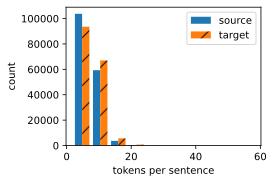

#  
<!--more-->
# 5 机器翻译与数据集

- 机器翻译是语言模型最成功的基准测试。因为机器翻译正是将输入序列转换成输出序列的 序列转换模型（sequence transduction）的核心问题。

- 机器翻译（machine translation）指的是将序列从一种语言自动翻译成另一种语言。与之前的语料库是单一语言的语言模型问题存在不同，机器翻译的数据集是由源语言和目标语言的文本序列对组成的。因此，我们需要一种完全不同的方法来预处理机器翻译数据集，而不是复用语言模型的预处理程序。

## 5.1 下载和预处理数据集

- 首先，下载一个由Tatoeba项目的双语句子对组成的“英－法”数据集，数据集中的每一行都是制表符分隔的文本序列对，序列对由英文文本序列和翻译后的法语文本序列组成。请注意，每个文本序列可以是一个句子，也可以是包含多个句子的一个段落。


```python
import os
import torch
from d2l import torch as d2l

#@save
d2l.DATA_HUB['fra-eng'] = (d2l.DATA_URL + 'fra-eng.zip', '94646ad1522d915e7b0f9296181140edcf86a4f5')

#@save
def read_data_nmt():
    """载入“英语－法语”数据集"""
    data_dir = d2l.download_extract('fra-eng')
    with open(os.path.join(data_dir, 'fra.txt'), 'r', encoding='utf-8') as f:
        return f.read()

raw_text = read_data_nmt()
print(raw_text[:75])
```

    Downloading ..\data\fra-eng.zip from http://d2l-data.s3-accelerate.amazonaws.com/fra-eng.zip...
    Go.	Va !
    Hi.	Salut !
    Run!	Cours !
    Run!	Courez !
    Who?	Qui ?
    Wow!	Ça alors !
    
    

- 原始文本数据需要经过几个预处理步骤。例如，我们用空格代替不间断空格（non‐breakingspace），使用小写字母替换大写字母，并在单词和标点符号之间插入空格。


```python
#@save
def preprocess_nmt(text):
    """预处理“英语－法语”数据集"""
    def no_space(char, prev_char):
        return char in set(',.!?') and prev_char != ' '
    
    # 使用空格替换不间断空格
    # 使用小写字母替换大写字母
    text = text.replace('\u202f', ' ').replace('\xa0', ' ').lower()
    # 在单词和标点符号之间插入空格
    out = [' ' + char if i > 0 and no_space(char, text[i - 1]) else char for i, char in enumerate(text)]
    return ''.join(out)

text = preprocess_nmt(raw_text)
print(text[:80])
```

    go .	va !
    hi .	salut !
    run !	cours !
    run !	courez !
    who ?	qui ?
    wow !	ça alors !
    

## 5.2 词元化

- 在机器翻译中，我们更喜欢单词级词元化。tokenize_nmt函数对前num_examples个文本序列对进行词元，其中每个词元要么是一个词，要么是一个标点符号。此函数返回两个词元列表：source和target：source[i]是源语言（这里是英语）第i个文本序列的词元列表，target[i]是目标语言（这里是法语）第i个文本序列的词元列表。


```python
#@save
def tokenize_nmt(text, num_examples=None):
    """标记化“英语－法语”数据数据集。"""
    source, target = [], []
    for i, line in enumerate(text.split('\n')):
        if num_examples and i > num_examples:
            break
        parts = line.split('\t')
        if len(parts) == 2:
            source.append(parts[0].split(' '))
            target.append(parts[1].split(' '))
    return source, target

source, target = tokenize_nmt(text)
source[:6], target[:6]
```


    ([['go', '.'],
      ['hi', '.'],
      ['run', '!'],
      ['run', '!'],
      ['who', '?'],
      ['wow', '!']],
     [['va', '!'],
      ['salut', '!'],
      ['cours', '!'],
      ['courez', '!'],
      ['qui', '?'],
      ['ça', 'alors', '!']])


- 绘制每个文本序列所包含的词元数量的直方图。


```python
import os
os.environ["KMP_DUPLICATE_LIB_OK"] = "TRUE"

#@save
def show_list_len_pair_hist(legend, xlabel, ylabel, xlist, ylist):
    """绘制列表长度的直方图"""
    d2l.set_figsize()
    _, _, patches = d2l.plt.hist([[len(l) for l in xlist], [len(l) for l in ylist]])
    d2l.plt.xlabel(xlabel)
    d2l.plt.ylabel(ylabel)
    for patch in patches[1].patches:
        patch.set_hatch('/')
    d2l.plt.legend(legend)

show_list_len_pair_hist(['source', 'target'], 'tokens per sentence', 'count', source, target)
```


    

    


## 5.3 词表

- 分别为源语言和目标语言构建两个词表。使用单词级词元化时，词表大小将明显大于使用字符级词元化时的词表大小。为了缓解这一问题，这里我们将出现次数少于2次的低频率词元视为相同的未知（“<unk>”）词元。除此之外，我们还指定了额外的特定词元，例如在小批量时用于将序列填充到相同长度的填充词元（“<pad>”），以及序列的开始词元（“<bos>”）和结束词元（“<eos>”）。这些特殊词元在自然语言处理任务中比较常用。


```python
src_vocab = d2l.Vocab(source, min_freq=2, reserved_tokens=['<pad>', '<bos>', '<eos>'])
len(src_vocab)
```


    10012


## 5.4 加载数据集

- 语言模型中的序列样本都有一个固定的长度，无论这个样本是一个句子的一部分还是跨越了多个句子的一个片断。这个固定长度是由num_steps（时间步数或词元数量）参数指定的。在机器翻译中，每个样本都是由源和目标组成的文本序列对，其中的每个文本序列可能具有不同的长度。

- 为了提高计算效率，我们仍然可以通过截断（truncation）和 填充（padding）方式实现一次只处理一个小批量的文本序列。假设同一个小批量中的每个序列都应该具有相同的长度num_steps，那么如果文本序列的词元数目少于num_steps时，我们将继续在其末尾添加特定的“<pad>”词元，直到其长度达到num_steps；反之，我们将截断文本序列时，只取其前num_steps 个词元，并且丢弃剩余的词元。这样，每个文本序列将具有相同的长度，以便以相同形状的小批量进行加载。


```python
# 截断或填充文本序列
#@save
def truncate_pad(line, num_steps, padding_token):
    """截断或填充文本序列"""
    if len(line) > num_steps:
        return line[:num_steps]  # 截断
    return line + [padding_token] * (num_steps - len(line))  # 填充

truncate_pad(src_vocab[source[0]], 10, src_vocab['<pad>'])
```


    [47, 4, 1, 1, 1, 1, 1, 1, 1, 1]


- 定义一个函数，可以将文本序列转换成小批量数据集用于训练。我们将特定的“<eos>”词元添加到所有序列的末尾，用于表示序列的结束。当模型通过一个词元接一个词元地生成序列进行预测时，生成的“<eos>”词元说明完成了序列输出工作。此外，我们还记录了每个文本序列的长度，统计长度时排除了填充词元


```python
#@save
def build_array_nmt(lines, vocab, num_steps):
    """将机器翻译的文本序列转换成小批量。"""
    lines = [vocab[l] for l in lines]
    lines = [l + [vocab['<eos>']] for l in lines]
    array = torch.tensor([truncate_pad(l, num_steps, vocab['<pad>']) for l in lines])
    valid_len = (array != vocab['<pad>']).type(torch.int32).sum(1)
    return array, valid_len
```

## 5.5 训练模型

- 定义load_data_nmt函数来返回数据迭代器，以及源语言和目标语言的两种词表。


```python
#@save
def load_data_nmt(batch_size, num_steps, num_examples=600):
    """返回翻译数据集的迭代器和词汇表"""
    text = preprocess_nmt(read_data_nmt())
    source, target = tokenize_nmt(text, num_examples)
    src_vocab = d2l.Vocab(source, min_freq=2, reserved_tokens=['<pad>', '<bos>', '<eos>'])
    tgt_vocab = d2l.Vocab(target, min_freq=2, reserved_tokens=['<pad>', '<bos>', '<eos>'])
    src_array, src_valid_len = build_array_nmt(source, src_vocab, num_steps)
    tgt_array, tgt_valid_len = build_array_nmt(target, tgt_vocab, num_steps)
    data_arrays = (src_array, src_valid_len, tgt_array, tgt_valid_len)
    data_iter = d2l.load_array(data_arrays, batch_size)
    return data_iter, src_vocab, tgt_vocab
```

- 读出“英语－法语”数据集中的第一个小批量数据。


```python
train_iter, src_vocab, tgt_vocab = load_data_nmt(batch_size=2, num_steps=8)
for X, X_valid_len, Y, Y_valid_len in train_iter:
    print('X:', X.type(torch.int32))
    print('X的有效长度:', X_valid_len)
    print('Y:', Y.type(torch.int32))
    print('Y的有效长度:', Y_valid_len)
    break

```

    X: tensor([[ 9, 21,  4,  3,  1,  1,  1,  1],
            [99, 12,  4,  3,  1,  1,  1,  1]], dtype=torch.int32)
    X的有效长度: tensor([4, 4])
    Y: tensor([[0, 4, 3, 1, 1, 1, 1, 1],
            [0, 4, 3, 1, 1, 1, 1, 1]], dtype=torch.int32)
    Y的有效长度: tensor([3, 3])
    
