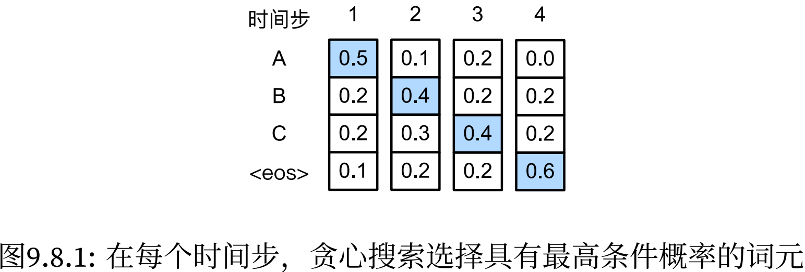
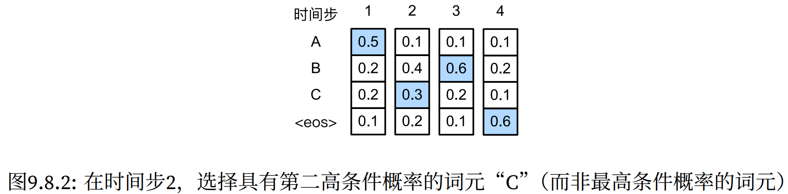
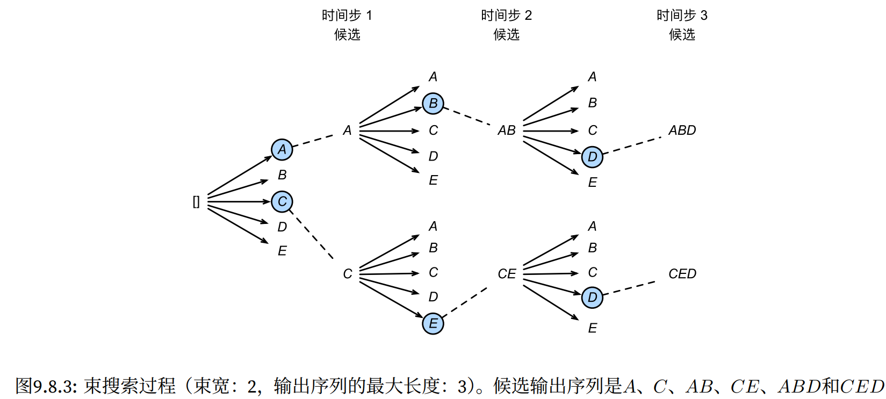

#  
<!--more-->
# 8 束搜索

- 在任意时间步t′，解码器输出$y_ {t′}$的概率取决于时间步t′之前的输出子序列$y_ 1, \ldots, y_ {t′−1}$和对输入序列的信息进行编码得到的上下文变量c。为了量化计算代价，用Y表示输出词表，其中包含“\<eos>”，所以这个词汇集合的基数|Y|就是词表的大小。我们还将输出序列的最大词元数指定为T′。因此，我们的目标是从所有$O( |Y|^ {T′} )$个可能的输出序列中寻找理想的输出（假设输出词表大小是2，序列长度是2，那么可能序列就是2^2=4个）。当然，对于所有输出序列，在“\<eos>”之后的部分（非本句）将在实际输出中丢弃。

## 8.1 贪心搜索
- 对于输出序列的每一时间步t′，我们都将基于贪心搜索从Y中找到具有最高条件概率的词元

    - 输出序列的条件概率是 0.5×0.4×0.4×0.6 = 0.048
    
        
        

- 现实中，最优序列（optimal sequence）应该是最大化$ \prod_ {t′=1} ^ {T′} P(y_ {t′} | y_ 1, \ldots, y_ {t′−1}, c) $的输出序列。贪心法无法保证。

    - 因为在任意时间步t′，解码器输出$y_ {t′}$的概率取决于时间步t′之前的输出子序列$y_ 1, \ldots, y_ {t′−1}$和对输入序列的信息进行编码得到的上下文变量c。所以当在第二个时间步选择第二高条件概率的词元时后面的概率会发生改变，导致整体概率改变

    - 条件概率为 0.5 × 0.3 × 0.6 × 0.6 = 0.054

        
        

## 8.2 穷举搜索

- 计算复杂度为$O( |Y|^ {T′} )$，在实践中不可行

## 8.3 束搜索

- 贪心与穷举的折中，贪心搜索的改进，它有一个超参数，名为束宽（beam size）k。在时间步1，我们选择具有最高条件概率的k个词元。然后从此开始一直分k叉树。最后从k|y|个序列中选择具有最高条件概率的k个序列。

    
    