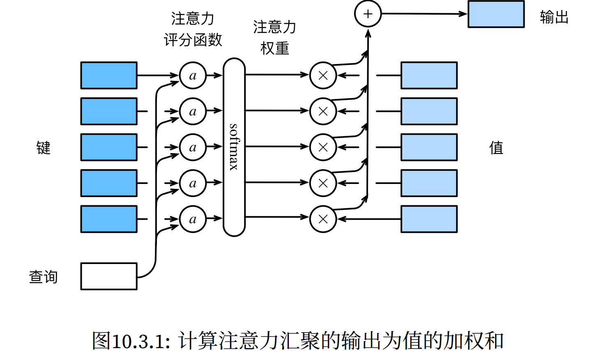

#  
<!--more-->
# 3 注意力评分函数

- 上一节使用了高斯核来对查询和键之间的关系建模。高斯核指数部分可以视为注意力评分函数，简称评分函数（scoring function），然后把这个函数的输出结果输入到softmax函数中进行运算。

- 通过上述步骤，将得到与键对应的值的概率分布（即注意力权重）。最后，注意力汇聚的输出就是基于这些注意力权重的值的加权和。从宏观来看，上述算法可以用来实现注意力机制框架。下图说明了如何将注意力汇聚的输出计算成为值的加权和，其中a表示注意力评分函数。由于注意力权重是概率分布，因此加权和其本质上是加权平均值。




- 假设有一个查询$q\in\mathbb{R}^ q$和m个键值对$(k_1,v_1),\ldots,(k_m,v_m)$，其中$k_ i \in \mathbb{R}^ k$，$v_ i \in \mathbb{R}^ v$。注意力汇聚函数$f$就被表示成值的加权和：

$$f ( \mathbf{ q } , ( k_1 , v_1 ) , \ldots , ( \mathbf{ k }_ m , \mathbf{ v }_ m ) ) = \sum _{ i = 1 } ^ m \alpha ( \mathbf{ q } , \mathbf{ k }_ i ) \mathbf{ v }_ i \in \mathbb{R}^ v$$

- 其中查询$ \mathbf{ q }$和键$ \mathbf{ k }_ i$的注意力权重是通过注意力评分函数a将两个向量映射成标量，再经过softmax运算得到的：

$$ \alpha ( \mathbf{ q } , \mathbf{ k }_ i ) = \text{softmax} ( a ( \mathbf{ q } , \mathbf{ k }_ i ) ) = \frac{ \exp ( a ( \mathbf{ q } , \mathbf{ k }_ i ) ) }{ \sum _{ j = 1 } ^ m \exp ( a ( \mathbf{ q } , \mathbf{ k }_ j ) ) }$$

- 选择不同的注意力评分函数a会导致不同的注意力汇聚操作。


```python
import math
import torch
from torch import nn
from d2l import torch as d2l
```

## 3.1 掩蔽softmax操作

- 在某些情况下，并非所有的值都应该被纳入到注意力汇聚中。例如，为了高效处理小批量数据集，某些文本序列被填充了没有意义的特殊词元。为了仅将有意义的词元作为值来获取注意力汇聚，可以指定一个有效序列长度（即词元的个数），以便在计算softmax时过滤掉超出指定范围的位置。(类似掩码)

- 定义masked_softmax函数实现掩蔽softmax操作，其中任何超出有效长度的位置都被掩蔽并置为0。


```python
#@save
def masked_softmax(X, valid_lens):
    '''通过在最后一个轴上掩蔽元素来执行softmax操作'''
    # X: 3D张量, valid_lens: 1D或2D张量
    if valid_lens is None:
        return nn.functional.softmax(X, dim=-1)
    else:
        shape = X.shape
        if valid_lens.dim() == 1:
            valid_lens = torch.repeat_interleave(valid_lens, shape[1])
        else:
            valid_lens = valid_lens.reshape(-1)
        # 在最后的轴上，被掩蔽的位置上的值被设置为一个非常大的负值，从而其softmax输出为0
        X = d2l.sequence_mask(X.reshape(-1, shape[-1]), valid_lens, value=-1e6)
        return nn.functional.softmax(X.reshape(shape), dim=-1)
```

- 考虑由两个2 × 4矩阵表示的样本，有效长度分别为2和3。经过掩蔽softmax操作，超出有效长度的值都被掩蔽为0。


```python
print(masked_softmax(torch.rand(2, 2, 4), torch.tensor([2, 3])))
print(masked_softmax(torch.rand(2, 2, 4), torch.tensor([[1, 3], [2, 4]])))
```

    tensor([[[0.4885, 0.5115, 0.0000, 0.0000],
             [0.5573, 0.4427, 0.0000, 0.0000]],
    
            [[0.3304, 0.2857, 0.3839, 0.0000],
             [0.3908, 0.4395, 0.1697, 0.0000]]])
    tensor([[[1.0000, 0.0000, 0.0000, 0.0000],
             [0.3514, 0.3923, 0.2562, 0.0000]],
    
            [[0.5376, 0.4624, 0.0000, 0.0000],
             [0.2854, 0.2800, 0.2354, 0.1991]]])
    

## 3.2 加性注意力

- 当查询和键是不同长度的矢量时，可以使用加性注意力作为评分函数:

$$a ( \mathbf{ q } , \mathbf{ k } ) = \mathbf{ w } _ v ^ T \tanh ( \mathbf{ w } _ q \mathbf{ q } + \mathbf{ w } _ k \mathbf{ k } )$$

- 其中$\mathbf{ w } $是可学习参数。将查询和键连结起来后输入到一个mlp中，mlp包含一个隐藏层，其隐藏单元数是一个超参数h。通过使用tanh作为激活函数，并且禁用偏置项。


```python
#@save
class AdditiveAttention(nn.Module):
    '''加性注意力'''
    def __init__(self, key_size, query_size, num_hiddens, dropout, **kwargs) -> None:
        super(AdditiveAttention, self).__init__(**kwargs)
        self.W_k = nn.Linear(key_size, num_hiddens, bias=False)
        self.W_q = nn.Linear(query_size, num_hiddens, bias=False)
        self.w_v = nn.Linear(num_hiddens, 1, bias=False)
        self.dropout = nn.Dropout(dropout)

    def forward(self, queries, keys, values, valid_lens):
        queries, keys = self.W_q(queries), self.W_k(keys)
        # 在queries.unsqueeze(2)后，
        # `queries` 的形状：(`batch_size`, 查询的个数, 1, `num_hiddens`)
        # `key` 的形状：(`batch_size`, 1, “键－值”对的个数, `num_hiddens`)
        # 使用广播方式进行求和
        features = queries.unsqueeze(2) + keys.unsqueeze(1) #(batch_size, 查询的个数, “键-值”对的个数, num_hiddens)
        features = torch.tanh(features)
        # `self.w_v` 仅有一个输出，因此从形状中移除最后一个维度。
        # `scores` 的形状：(`batch_size`, 查询的个数, “键-值”对的个数)
        scores = self.w_v(features).squeeze(-1)
        self.attention_weights = masked_softmax(scores, valid_lens) #(batch_size, 查询的个数, “键-值”对的个数)
        # print(self.attention_weights) #第一行有valid_lens[0]个值，后面的都是0, 第二行有valid_lens[1]个值，后面的都是0
        # `values` 的形状：(`batch_size`, “键－值”对的个数`, value_dim)
        return torch.bmm(self.dropout(self.attention_weights), values) #(batch_size, 查询的个数, value_dim)
```

- 例子，查询、键和值的形状为（批量大小，步数或词元序长度，特征大小），实际输出为(2, 1, 20)、(2, 10, 2)和(2, 10, 4)。注意力汇聚输出的形状为（批量大小，查询的步数，值的维度）。


```python
queries, keys = torch.normal(0, 1, (2, 1, 20)), torch.ones((2, 10, 2))
# `values` 的小批量数据集中，两个值矩阵是相同的
values = torch.arange(40, dtype=torch.float32).reshape(1, 10, 4).repeat(2, 1, 1)
valid_lens = torch.tensor([2, 6])

attention = AdditiveAttention(key_size=2, query_size=20, num_hiddens=8, dropout=0.1)
attention.eval()
attention(queries, keys, values, valid_lens) #(2,1,4)
```


    tensor([[[ 2.0000,  3.0000,  4.0000,  5.0000]],
    
            [[10.0000, 11.0000, 12.0000, 13.0000]]], grad_fn=<BmmBackward0>)


- 尽管加性注意力包含了可学习的参数，但由于本例子中每个键都是相同的，所以注意力权重是均匀的，由指定的有效长度决定。


```python
import os
os.environ["KMP_DUPLICATE_LIB_OK"] = "TRUE"

d2l.show_heatmaps(attention.attention_weights.reshape((1, 1, 2, 10)), xlabel='Keys', ylabel='Queries')
```


    

    


## 3.3 缩放的点积注意力

- 使用点积可以得到计算效率更高的评分函数，但是点积操作要求**查询和键具有相同的长度d**。

- 假设查询和键的所有元素都满足零均值和单位方差，那么两个向量的点积的均值为0，方差为d。为确保无论向量长度如何，点积的方差在不考虑向量长度的情况下仍然是1，我们再将点积除以$\sqrt{d}$，则缩放点积注意力（scaled dot‐product attention）评分函数为：

$$a ( \mathbf{ q } , \mathbf{ k } ) = \mathbf{ q } ^ T \mathbf{ k } / \sqrt{d}$$

- 从小批量的角度，基于n个查询和m个键－值对计算注意力，其中查询和键的长度为d，值的长度为v。$ \mathbf{ Q } \in \mathbb{R}^{ n \times d }$、$ \mathbf{ K } \in \mathbb{R}^{ m \times d }$和$ \mathbf{ V } \in \mathbb{R}^{ m \times v }$的缩放点积注意力是：

$$ \text{softmax} \left( \frac{ \mathbf{ Q } \mathbf{ K } ^ T }{ \sqrt{d} } \right) \mathbf{ V } \in \mathbb{R}^{ n \times v }$$


```python
#@save
class DotProductAttention(nn.Module):
    """缩放点积注意力"""
    def __init__(self, dropout, **kwargs) -> None:
        super(DotProductAttention,self).__init__(**kwargs)
        self.dropout = nn.Dropout(dropout)

    def forward(self, queries, keys, values, valid_lens=None):
        # q: (`batch_size`, 查询的个数, `d`)
        # k: (`batch_size`, “键－值”对的个数, `d`)
        # v: (`batch_size`, “键－值”对的个数`, value_dim)
        # valid_lens: (`batch_size`,) or (`batch_size`, 查询的个数)
        d = queries.shape[-1]
        # 设置transpose_b = True为了交换keys的最后两个维度
        scores = torch.bmm(queries, keys.transpose(1,2)) / math.sqrt(d)
        self.attention_weights = masked_softmax(scores, valid_lens)
        return torch.bmm(self.dropout(self.attention_weights), values)
    
queries = torch.normal(0, 1, (2, 1, 2))
attention = DotProductAttention(dropout=0.5)
attention.eval()
print(attention(queries, keys, values, valid_lens))
d2l.show_heatmaps(attention.attention_weights.reshape((1,1,2,10)), xlabel='Keys', ylabel='Queries')
```

    tensor([[[ 2.0000,  3.0000,  4.0000,  5.0000]],
    
            [[10.0000, 11.0000, 12.0000, 13.0000]]])
    


    

    

