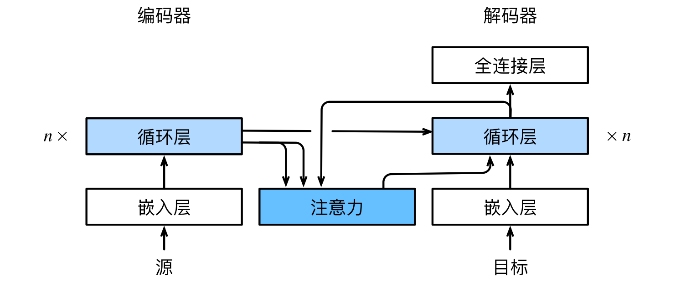

#  
<!--more-->
# 4 Bahdanau 注意力

- 对于机器翻译问题，使用基于两个循环神经网络的编码器‐解码器架构，编码器将长度可变的序列转换为固定形状的上下文变量，然后解码器根据生成的词元和上下文变量按词元生成输出序列词元。然而，即使并非所有输入词元都对解码某个词元都有用，在每个解码步骤中仍使用编码相同的上下文变量。有什么方法能改变上下文变量呢？

- Bahdanau等提出了一个没有严格单向对齐限制的可微注意力模型。在预测词元时，如果不是所有输入词元都相关，模型将仅对齐输入序列中与当前预测相关的部分。这是通过将上下文变量视为注意力集中的输出来实现的。

## 4.1 模型

- 在[序列到序列学习](../8_moden_rnn/7_seq2seq.md)模型的基础上做如下更改：

    - 上下文变量$\boldsymbol{c}$在任何解码时间步t′都会被$\boldsymbol{c}_ {t′}$替换。

- 假设输入序列中有T个词元，解码时间步t′的上下文变量是注意力集中的输出：

$$ \boldsymbol{ c }_ { t ^ ′ } = \sum _ { t  = 1 }^ T \alpha \left( {\boldsymbol{ s }_{ t ^ ′ - 1 }, \boldsymbol{ h }_t} \right) \boldsymbol{ h }_t $$

- 其中，时间步t′ − 1时的解码器隐状态$\boldsymbol{ s }_{ t ^ ′ - 1 }$是**查询**，编码器隐状态$\boldsymbol{ h }_t$是**键**，也是**值**，注意力权重$\alpha$是使用加性注意力评分函数计算的。

- Bahdanau注意力的架构：




## 4.2 定义注意力解码器

- 只需重新定义解码器即可。


```python
import torch
from torch import nn
from d2l import torch as d2l

#@save
class AttentionDecoder(d2l.Decoder):
    '''带有注意力机制解码器的基本接口'''
    def __init__(self, **kwargs):
        super(AttentionDecoder,self).__init__(**kwargs)

    @property
    def attention_weights(self): #property装饰器可以将返回变量的方法转换为类的属性
        raise NotImplementedError
```

- 实现带有Bahdanau注意力的循环神经网络解码器，初始化解码器的状态，需要输入：

    - 编码器在所有时间步的最终层隐状态，将作为注意力的键和值；

    - 上一时间步的编码器全层隐状态，将作为初始化解码器的隐状态；

    - 编码器有效长度，避免在注意力汇聚中填充词元。

- 在每个解码时间步骤中，解码器上一个时间步的最终层隐状态将用作查询。因此，注意力输出和输入嵌入都连结为循环神经网络解码器的输入。


```python
class Seq2SeqAttentionDecoder(AttentionDecoder):
    def __init__(self, vocab_size, embed_size, num_hiddens, num_layers, dropout=0, **kwargs):
        super(Seq2SeqAttentionDecoder,self).__init__(**kwargs)
        self.attention = d2l.AdditiveAttention(num_hiddens, num_hiddens, num_hiddens, dropout)
        self.embedding = nn.Embedding(vocab_size, embed_size)
        self.rnn = nn.GRU(embed_size + num_hiddens, num_hiddens, num_layers, dropout=dropout)
        self.dense = nn.Linear(num_hiddens, vocab_size)

    def init_state(self, enc_outputs, enc_valid_lens, *args):
        outputs, hidden_state = enc_outputs
        # `outputs`的形状为(`batch_size`, `num_steps`, `num_hiddens`).
        # `hidden_state`的形状为(`num_layers`, `batch_size`, `num_hiddens`)
        return (outputs.permute(1,0,2), hidden_state, enc_valid_lens)
    
    def forward(self, X, state):
        enc_outputs, hidden_state, enc_valid_lens = state
        # `enc_outputs`的形状为 (`batch_size`, `num_steps`, `num_hiddens`).
        # `hidden_state`的形状为 (`num_layers`, `batch_size`, `num_hiddens`)
        X = self.embedding(X).permute(1,0,2) #(num_steps,batch_size,embed_size)
        outputs, self._attention_weights = [], []
        for x in X:
            # hidden_state[-1]:(batch_size,num_hiddens)
            query = torch.unsqueeze(hidden_state[-1], dim=1) #(batch_size,1,num_hiddens)
            context = self.attention(query, enc_outputs, enc_outputs, enc_valid_lens) #(batch_size,1,num_hiddens)
            x = torch.cat((context, torch.unsqueeze(x, dim=1)), dim=-1) # 在特征维度上连结
            out, hidden_state = self.rnn(x.permute(1,0,2), hidden_state)
            outputs.append(out)
            self._attention_weights.append(self.attention.attention_weights)
        outputs = self.dense(torch.cat(outputs, dim=0)) # (num_steps,batch_size,vocab_size)
        return outputs.permute(1,0,2), [enc_outputs, hidden_state, enc_valid_lens]
    
    @property
    def attention_weights(self):
        return self._attention_weights
    
# 使用包含7个时间步的4个序列输入的小批量测试解码器
encoder = d2l.Seq2SeqEncoder(vocab_size=10, embed_size=8, num_hiddens=16, num_layers=2)
encoder.eval()
decoder = Seq2SeqAttentionDecoder(vocab_size=10, embed_size=8, num_hiddens=16, num_layers=2)
decoder.eval()
X = torch.zeros((4, 7), dtype=torch.long) # (`batch_size`, `num_steps`)
state = decoder.init_state(encoder(X), None)
output, state = decoder(X, state)
output.shape, len(state), state[0].shape, len(state[1]), state[1][0].shape
```


    (torch.Size([4, 7, 10]), 3, torch.Size([4, 7, 16]), 2, torch.Size([4, 16]))


## 4.3 训练


```python
import os
os.environ["KMP_DUPLICATE_LIB_OK"] = "TRUE"

embed_size, num_hiddens, num_layers, dropout = 32, 32, 2, 0.1
batch_size, num_steps = 64, 10
lr, num_epochs, device = 0.005, 250, d2l.try_gpu()

train_iter, src_vocab, tgt_vocab = d2l.load_data_nmt(batch_size, num_steps)
encoder = d2l.Seq2SeqEncoder(len(src_vocab), embed_size, num_hiddens, num_layers, dropout)
decoder = Seq2SeqAttentionDecoder(len(tgt_vocab), embed_size, num_hiddens, num_layers, dropout)
net = d2l.EncoderDecoder(encoder, decoder)
d2l.train_seq2seq(net, train_iter, lr, num_epochs, tgt_vocab, device)

```

    loss 0.020, 5397.9 tokens/sec on cpu
    


    

    


- 测试


```python
engs = ['go .', "i lost .", 'he\'s calm .', 'i\'m home .']
fras = ['va !', 'j\'ai perdu .', 'il est calme .', 'je suis chez moi .']
for eng, fra in zip(engs, fras):
    translation, dec_attention_weight_seq = d2l.predict_seq2seq(net, eng, src_vocab, tgt_vocab, num_steps, device, True)
    print(f'{eng} => {translation}, ', f'bleu {d2l.bleu(translation, fra, k=2):.3f}')
```

    go . => va !,  bleu 1.000
    i lost . => j'ai perdu .,  bleu 1.000
    he's calm . => il est paresseux .,  bleu 0.658
    i'm home . => je suis chez moi .,  bleu 1.000
    

- 训练结束后，下面通过可视化注意力权重会发现，每个查询都会在键值对上分配不同的权重，这说明在每个解码步中，输入序列的不同部分被选择性地聚集在注意力池中。


```python
attention_weights = torch.cat([step[0][0] for step in dec_attention_weight_seq], 0).reshape((1, 1, -1, num_steps))
# 加上一个包含序列结束词元
d2l.show_heatmaps(attention_weights[:, :, :, :len(engs[-1].split()) + 1].cpu(), xlabel='Key posistion', ylabel='Query posistion')
```


    

    

