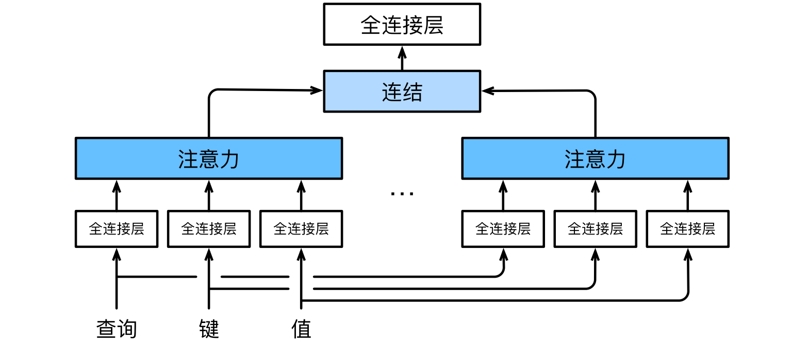

#  
<!--more-->
# 5 多头注意力

- 当给定相同的查询、键和值的集合时，我们希望模型可以基于相同的注意力机制学习到不同的行为，然后将不同的行为作为知识组合起来，捕获序列内各种范围的依赖关系（例如，短距离依赖和长距离依赖关系）。因此，允许注意力机制组合使用查询、键和值的不同 子空间表示（representation subspaces）可能是有益的。

- 多头注意力（multihead attention）：为此，与其只使用单独一个注意力汇聚，我们可以用独立学习得到的h组不同的**线性投影**来变换查询、键和值。然后，这h组变换后的查询、键和值将并行地送到注意力汇聚中。最后，将这h个注意力汇聚的输出拼接在一起，并且通过另一个可以学习的线性投影进行变换，以产生最终输出。对于h个注意力汇聚输出，每一个注意力汇聚都被称作一个**头**（head）。




## 5.1 模型

- 给定查询$ \mathbf{ q } \in \mathbb{ R }^{ d _ { q } } $、键$ \mathbf{ k } \in \mathbb{ R }^{ d _ { k } } $和值$ \mathbf{ v } \in \mathbb{ R }^{ d _ { v } } $，每个注意力头$ \mathbf{ h } _ { i } $（$ i = 1,2, \ldots , h $）的计算如下：

$$ \mathbf{ h } _ { i } = f \left( \mathbf{ W } _ { i } ^ { q } \mathbf{ q } , \mathbf{ W } _ { i } ^ { k } \mathbf{ k } , \mathbf{ W } _ { i } ^ { v } \mathbf{ v } \right) $$

- 其中$ \mathbf{ W }$是可学习参数，f是注意力汇聚函数。最后，我们将所有头的输出连接起来，并通过另一个可学习的线性变换$ \mathbf{ W } _ { o } $来得到最终输出：

$$ \mathbf{ W } _ { o } \left[ \mathbf{ h } _ { 1 } ; \mathbf{ h } _ { 2 } ; \ldots ; \mathbf{ h } _ { h } \right]  ^ { \top } $$

- 基于这种设计，每个头都可能会关注输入的不同部分，可以表示比简单加权平均值更复杂的函数。


```python
import math
import torch
from torch import nn
from d2l import torch as d2l
```

## 5.2 实现

- 通常选择**缩放点积注意力**作为每一个注意力头。为了避免计算代价和参数代价的大幅增长，设定$p _ { q } = p _ { k } = p _ { v } = p _ { o } / h$，其中$p _ { q }$、$p _ { k }$、$p _ { v }$和$p _ { o }$分别是查询、键、值和输出的维度。如果将查询、键和值的线性变换的输出数量设置为$p _ q h = p _ k h = p _ v h = p _ o$，则可以并行计算h个头。


```python
#@save
class MultiHeadAttention(nn.Module):
    '''多头注意力'''
    def __init__(self, key_size, query_size, value_size, num_hiddens, num_heads, dropout, bias=False, **kwargs):
        # num_hiddens:p_o
        super(MultiHeadAttention, self).__init__(**kwargs)
        self.num_heads = num_heads
        self.attention = d2l.DotProductAttention(dropout)
        self.W_q = nn.Linear(query_size, num_hiddens, bias=bias)
        self.W_k = nn.Linear(key_size, num_hiddens, bias=bias)
        self.W_v = nn.Linear(value_size, num_hiddens, bias=bias)
        self.W_o = nn.Linear(num_hiddens, num_hiddens, bias=bias)

    def forward(self, queries, keys, values, valid_lens):
        # queries: (batch_size, num_queries or num_keys, num_hiddens)
        # valid_lens: either (batch_size, ) or (batch_size, num_queries)
        # 经过变换后，输出的queries，keys，values　的形状:
        # (batch_size * num_heads, num_queries or num_keys, num_hiddens/num_heads)
        queries = transpose_qkv(self.W_q(queries), self.num_heads)
        keys = transpose_qkv(self.W_k(keys), self.num_heads)
        values = transpose_qkv(self.W_v(values), self.num_heads)

        if valid_lens is not None:
            # 在轴0，将第一项（标量或者矢量）复制num_heads次，
            # 然后将第二项和第三项复制num_heads次
            valid_lens = torch.repeat_interleave(valid_lens, repeats=self.num_heads, dim=0)
        
        #output (batch_size * num_heads, num_queries, num_hiddens/num_heads)
        output = self.attention(queries, keys, values, valid_lens)

        #output_concat: (batch_size, num_queries, num_hiddens)
        output_concat = transpose_output(output, self.num_heads)
        return self.W_o(output_concat) # (batch_size, num_queries, num_hiddens)

# 为了能够使多个头并行计算，定义两个转置函数transpose_output函数反转了transpose_qkv函数的操作
#@save
def transpose_qkv(X, num_heads):
    '''为了多注意力头的并行计算而变换形状'''
    X = X.reshape(X.shape[0], X.shape[1], num_heads, -1) #(batch_size, num_queries or num_keys, num_hiddens)

    X = X.permute(0, 2, 1, 3) #(batch_size, num_heads, num_queries or num_keys, num_hiddens/num_heads)
    return X.reshape(-1, X.shape[2], X.shape[3]) #(batch_size * num_heads, num_queries or num_keys, num_hiddens/num_heads)

#@save
def transpose_output(X, num_heads):
    '''逆转transpose_qkv函数的操作'''
    X = X.reshape(-1, num_heads, X.shape[1], X.shape[2]) #(batch_size, num_heads, num_queries, num_hiddens/num_heads)
    X = X.permute(0, 2, 1, 3) #(batch_size, num_queries, num_heads, num_hiddens/num_heads)
    return X.reshape(X.shape[0], X.shape[1], -1) #(batch_size, num_queries, num_hiddens)
```

- 使用键和值相同的小例子来测试


```python
num_hiddens, num_heads = 100, 5
attention = MultiHeadAttention(num_hiddens, num_hiddens, num_hiddens, num_hiddens, num_heads, 0.5)
attention.eval()
```


    MultiHeadAttention(
      (attention): DotProductAttention(
        (dropout): Dropout(p=0.5, inplace=False)
      )
      (W_q): Linear(in_features=100, out_features=100, bias=False)
      (W_k): Linear(in_features=100, out_features=100, bias=False)
      (W_v): Linear(in_features=100, out_features=100, bias=False)
      (W_o): Linear(in_features=100, out_features=100, bias=False)
    )


```python
batch_size, num_queries, num_kvpairs, valid_lens = 2, 4, 6, torch.tensor([3, 2])
X = torch.ones((batch_size, num_queries, num_hiddens))
Y = torch.ones((batch_size, num_kvpairs, num_hiddens))
attention(X, Y, Y, valid_lens).shape
```


    torch.Size([2, 4, 100])


