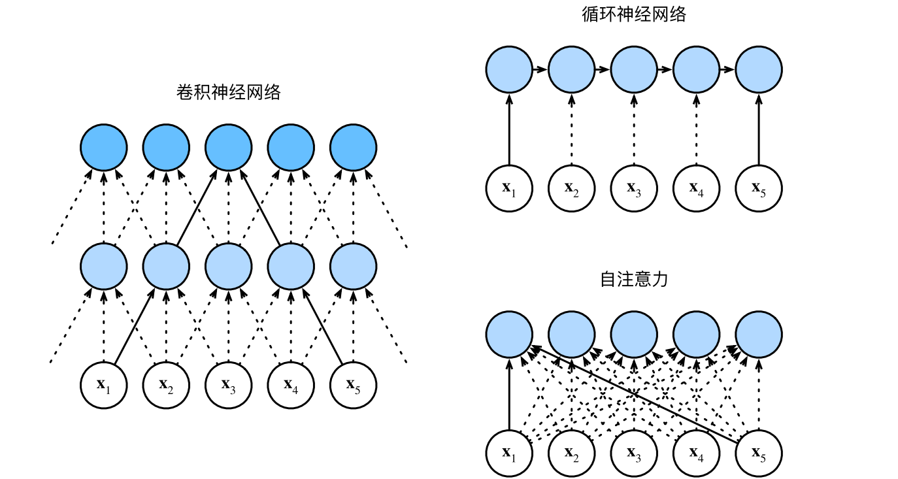

#  
<!--more-->
# 6 自注意力和位置编码

- 有了注意力机制之后，我们将词元序列输入注意力池化中，以便同一组词元同时充当查询、键和值。具体来说，每个查询都会关注所有的键－值对并生成一个注意力输出。由于查询、键和值来自同一组输入，因此被称为**自注意力**（self‐attention），也被称为**内部注意力**（intra‐attention）。本节将使用自注意力进行序列编码，以及如何使用序列的顺序作为补充信息。


```python
import math
import torch
from torch import nn
from d2l import torch as d2l
```

## 6.1 自注意力

- 给定一个由词元组成的输入序列$ \mathbf{ x }_ 1, \ldots, \mathbf{ x }_ n $，其中任意词元$ \mathbf{ x }_ i \in \mathbb{ R }^ d $（$ d $是词元的向量维度）。该序列的自注意力输出为一个长度相同的序列$ \mathbf{ y }_ 1, \ldots, \mathbf{ y }_ n $，其中：

$$ \mathbf{ y }_ i = f \left( \mathbf{ x }_ i, ( \mathbf {x} _1 , \mathbf { x }_ 1 ), ... ,( \mathbf {x} _n , \mathbf { x }_ n ) \right ) \in \mathbb{R} ^ d$$

- 基于多头注意力对一个张量完成自注意力的计算，张量的形状为（批量大小，时间步的数目或词元序列的长度，d）。


```python
num_hiddens, num_heads = 100, 5
attention = d2l.MultiHeadAttention(num_hiddens, num_hiddens, num_hiddens,num_hiddens, num_heads, 0.5)
attention.eval()
```


    MultiHeadAttention(
      (attention): DotProductAttention(
        (dropout): Dropout(p=0.5, inplace=False)
      )
      (W_q): Linear(in_features=100, out_features=100, bias=False)
      (W_k): Linear(in_features=100, out_features=100, bias=False)
      (W_v): Linear(in_features=100, out_features=100, bias=False)
      (W_o): Linear(in_features=100, out_features=100, bias=False)
    )


```python
batch_size, num_queries, valid_lens = 2, 4, torch.tensor([3, 2])
X = torch.ones((batch_size, num_queries, num_hiddens))
attention(X, X, X, valid_lens).shape
```


    torch.Size([2, 4, 100])


## 6.2 比较cnn,rnn和self-attention

- 目标都是将由n个词元组成的序列映射到另一个长度相等的序列，其中的每个输入词元或输出词元都由d维向量表示。比较他们的计算复杂性、顺序操作和最大路径长度。顺序操作会妨碍并行计算，而任意的序列位置组合之间的路径越短，则能更轻松地学习序列中的远距离依赖关系。




- cnn

    - 假设卷积核大小：k。由于序列长度是n，输入和输出的通道数量都是d

        - 计算复杂度：$O(knd^2)$

        - 顺序操作：$O(1)$个顺序操作

        - 最大路径长度：$O(n/k)$ (例如上图x1和x5处于卷积核大小为3的双层卷积神经网络的感受野内。)

- rnn

    - 当更新rnn的隐状态时，d × d权重矩阵和d维隐状态的乘法计算复杂度为$O(d^2)$。由于序列长度为n，因此rnn的计算复杂度为$O(nd^2)$。

    - 有$O(n)$个顺序操作无法并行化

    - 最大路径长度也是$O(n)$

- self-attention

    - 查询、键和值都是n × d矩阵。假设使用缩放点积注意力，其中n × d矩阵乘以d×n矩阵。之后输出的n×n矩阵乘以n×d矩阵。因此，自注意力具有$O(n^ 2 d)$的计算复杂度。

    - 每个词元都通过自注意力直接连接到任何其他词元。因此，有$O(1)$个顺序操作可以并行计算

    - 最大路径长度为$O(1)$

- cnn和self-attention都拥有并行计算的优势，而且自注意力的最大路径长度最短。

## 6.3 位置编码

- 在处理词元序列时，rnn是逐个的重复地处理词元的，而self-attention则因为并行计算而放弃了顺序操作。为了使用序列的顺序信息，通过在输入表示中添加**位置编码**（positional encoding）来注入绝对的或相对的位置信息。位置编码可以通过学习得到也可以直接固定得到。

- 基于正弦函数和余弦函数的固定位置编码：

    - 输入表示$ \mathbf{ X } \in \mathbb{ R }^{ n \times d } $包含一个序列中n个词元的d维嵌入表示。位置编码使用相同形状的位置嵌入矩阵$ \mathbf{ P } \in \mathbb{ R }^{ n \times d } $输出$ \mathbf{ X } + \mathbf{ P } $，矩阵第i行、第2j列和2j + 1列上的元素为：

    $$ \begin{aligned} \mathbf{ P }_ { i, 2j } = \sin \left( \frac{ i }{ 10000^ { 2j / d } } \right) , \\\\ \mathbf{ P }_ { i, 2j + 1 } = \cos \left( \frac{ i }{ 10000^ { 2j / d } } \right) . \end{aligned} $$


```python
#@save
class PositionalEncoding(nn.Module):
    """位置编码"""
    def __init__(self, num_hiddens, dropout, max_len=1000) -> None:
        super(PositionalEncoding, self).__init__()
        self.dropout = nn.Dropout(dropout)
        # 创建一个足够长的`P`
        self.P = torch.zeros((1, max_len, num_hiddens))
        # x (max_len, num_hiddens/2)
        X = torch.arange(max_len, dtype=torch.float32).reshape(-1, 1) / torch.pow(
            10000, torch.arange(0, num_hiddens, 2, dtype=torch.float32) / num_hiddens)
        self.P[:, :, 0::2] = torch.sin(X) # 偶数列
        self.P[:, :, 1::2] = torch.cos(X) # 奇数列

    def forward(self, X):
        X = X + self.P[:, :X.shape[1], :].to(X.device)
        return self.dropout(X)
```

- 在位置嵌入矩阵$ \mathbf{ P } $中，行代表词元在序列中的位置，列代表位置编码的不同维度。从下面的例子中可以看到第6列和第7列的频率高于第8列和第9列。第6列和第7列之间的偏移量（第8列和第9列相同）是由于正弦函数和余弦函数的交替。


```python
import os
os.environ["KMP_DUPLICATE_LIB_OK"] = "TRUE"

encoding_dim, num_steps = 32, 60
pos_encoding = PositionalEncoding(encoding_dim, 0)
pos_encoding.eval()
X = pos_encoding(torch.zeros((1, num_steps, encoding_dim)))
P = pos_encoding.P[:, :X.shape[1], :]
d2l.plot(torch.arange(num_steps), P[0, :, 6:10].T, xlabel='Row (position)',
         figsize=(6, 2.5), legend=["Col %d" % d for d in torch.arange(6, 10)])
```


    

    


### 6.3.1 绝对位置信息

- 编码维度单调降低的频率与绝对位置信息的关系：

    - 看二进制，竖着看：

        - 个位： 0 -> 1 -> 0 -> 1
        - 十位： 0 -> 0 -> 1 -> 1
        - 百位： 0 -> 0 -> 0 -> 0
    - 发现：在低位，0与1的交替频率很高；在高位，0与1的交替频率很低


```python
for i in range(8):
    print(f'{i}的二进制是：{i:>03b}')
```

    0的二进制是：000
    1的二进制是：001
    2的二进制是：010
    3的二进制是：011
    4的二进制是：100
    5的二进制是：101
    6的二进制是：110
    7的二进制是：111
    

- 与下面的热图所示相似，只是位置编码通过使用三角函数在编码维度上降低频率。
- 由于输出是浮点数，因此，此类连续表示比二进制表示法更节省空间。


```python
P = P[0,:,:].unsqueeze(0).unsqueeze(0)
d2l.show_heatmaps(
    P,xlabel='Column (encoding dimension)',
    ylabel='Row(position)', figsize=(3.5, 4), cmap='Blues'
)
```


    

    


### 6.3.2 相对位置信息

- 上述的位置编码还允许模型学习得到输入序列中的相对位置信息。这是因为对于任何确定的位置偏移$\sigma$，位置$ i + \sigma$处的位置编码可以线性投影位置$i$处的位置编码来表示。

- 数学解释：令$ \omega_ j = \frac{ 1 }{ 10000 ^ { \frac { 2j } { d } } }$，对于任何确定的位置偏移$ \sigma $，位置编码中的任何一对$ \left ( p_ { (i,2j) } , p _ { ( i , 2j+1)} \right )$都可以线性投影到$ \left ( p_ { (i + \sigma, 2j) } , p _ { ( i + \sigma , 2j+1)} \right )$:

$$\begin{aligned}
&\begin{bmatrix}\cos(\delta\omega_j)&\sin(\delta\omega_j)\\-\sin(\delta\omega_j)&\cos(\delta\omega_j)\end{bmatrix}\begin{bmatrix}p_{i,2j}\\p_{i,2j+1}\end{bmatrix} \\
=&\begin{bmatrix}\cos(\delta\omega_j)\sin(i\omega_j)+\sin(\delta\omega_j)\cos(i\omega_j)\\-\sin(\delta\omega_j)\sin(i\omega_j)+\cos(\delta\omega_j)\cos(i\omega_j)\end{bmatrix} \\
=&\begin{bmatrix}\sin\left((i+\delta)\omega_j\right)\\\cos\left((i+\delta)\omega_j\right)\end{bmatrix} \\
=&\begin{bmatrix}p_{i+\delta,2j}\\p_{i+\delta,2j+1}\end{bmatrix},
\end{aligned}$$

- 2 x 2投影矩阵不依赖于任何位置的索引$i$
