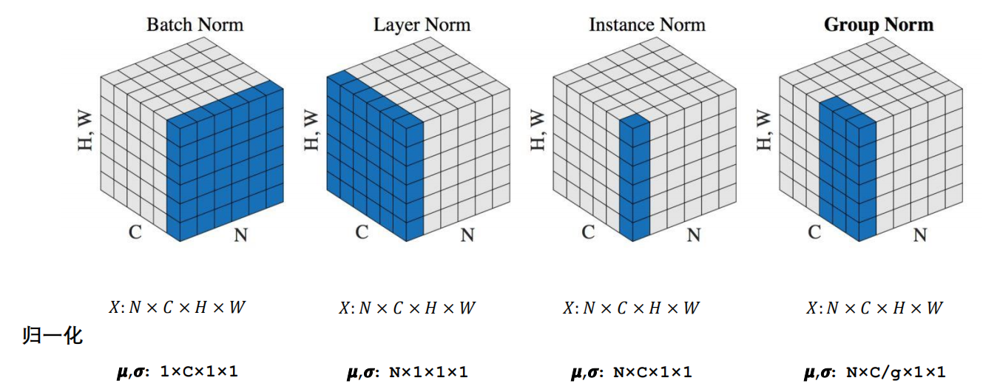

#### 

<!--more-->

# batch normalization与layer normalization

## 0. 归一化

### 0.1 什么是归一化

- Normalization： 规范化或标准化 
  -  把输入数据X，在**输送给神经元之前**先对其进行**平移**和**伸缩变换**，将X的**分布**规范化成在**固定区间**范围的**标准分布**。 
  - 框架：$h = f \left( g \cdot \frac{x-\mu}{\sigma}+b \right)$
    - $\mu$：平移参数
    - $\sigma$：缩放参数
    - $b$：再平移参数
    - $g$：再缩放参数
  - 得到的数据符合均值为$b$，方差为$g^2$的分布

### 0.2 为什么需要归一化

- 神经网络的Block大部分都是矩阵运算，一个向量经过矩阵运算后值会越来越大，为了网络的稳定性，我们需要及时把值拉回正态分布。 
  - BatchNorm：通过对batch size这个维度归一化来让分布稳定下来。
  - LayerNorm：通过对Hidden size这个维度归一化来让某层的分布稳定。 
- 深度网络每一层网络是相对独立的，也就是说每一层网络可以单独看成一个Classifier.不停对上一层的输出数据进行分类，每一层输出的数据分布又不一样，这就会出现Internal Covariate Shift（内部协变量偏移，这个概念是BN论文里第一次提出）. 随着网络的层数不断增大，这种误差就会不断积累，最终导致效果欠佳。显然对数据预处理只能解决第一层的问题，之后需要Normalization等方法来解决。




| Batch Norm                   | Layer Norm                    | Instance Norm         | Group Norm                                        |
| ---------------------------- | ----------------------------- | --------------------- | ------------------------------------------------- |
| batch方向做归一化            | channel方向做归一化           | 一个channel内做归一化 | 先将channel方向分group<br>然后每个group内做归一化 |
| 计算$N\cdot H \cdot W$的均值 | 计算$C \cdot H \cdot W$的均值 | 计算$H \cdot W$的均值 | 计算$\frac{C}{g} \cdot H \cdot W$的均值           |

### 0.3 为什么nlp中常用LN层

-  NLP中句子不同位置(对应的通道C)的概率分布其实是不一样的。而且LN不依赖batch，而是单独的对每个数据单独处理，所以，更适合变长序列(NLP 中会出现padding 的方式来处理变长数据，所以对这些padding的0的维度，对齐进行norm 意义不大)的任务。 
- BatchNorm是对一个batch-size样本内的每个特征做归一化，LayerNorm是对每个样本的所有特征做归一化。BN 的转换是针对单个神经元可训练的：不同神经元的输入经过再平移和再缩放后分布在不同的区间；而 LN 对于一整层的神经元训练得到同一个转换：所有的输入都在同一个区间范围内。如果不同输入特征不属于相似的类别（比如颜色和大小），那么 LN 的处理可能会降低模型的表达能力。

- BN抹杀了不同特征之间的大小关系，但是保留了不同样本间的大小关系；LN抹杀了不同样本间的大小关系，但是保留了一个样本内不同特征之间的大小关系。（理解： BN对batch数据的同一特征进行标准化，变换之后，纵向来看，不同样本的同一特征仍然保留了之前的大小关系，但是横向对比样本内部的各个特征之间的大小关系不一定和变换之前一样了，因此抹杀或破坏了不同特征之间的大小关系，保留了不同样本之间的大小关系；LN对单一样本进行标准化，样本内的特征处理后原来数值大的还是相对较大，原来数值小的还是相对较小，不同特征之间的大小关系还是保留了下来，但是不同样本在各自标准化处理之后，两个样本对应位置的特征之间的大小关系将不再确定，可能和处理之前就不一样了，所以破坏了不同样本间的大小关系）
  

## 1. cv中的归一化

### 1.1 二维

```
[
	[4, 3, 2],
	[3, 3, 2],
	[2, 2, 2]
]
```

- 维度: (batch, feature)

- #### batch normalization:

  - 跨batch处理

  ```
  # 处理feature 0
  从batch 0中取出feature 0 :4
  从batch 1中取出feature 0 :3
  从batch 2中取出feature 0 :2
  对[
  	4,
  	3,
  	2,
  ]进行归一化, 中间一个肯定是0:
  [
  	x1,
  	0,
  	-x1,
  ]
  
  # 处理feature 1
  从batch 0中取出feature 1 :3
  从batch 1中取出feature 1 :3
  从batch 2中取出feature 1 :2
  处理后前两个肯定一样:
  [
  	a, 
  	a, 
  	b,
  ]
  
  # 处理feature 2
  从batch 0中取出feature 2 :2
  从batch 1中取出feature 2 :2
  从batch 2中取出feature 2 :2
  这三个数相等, 归一化后都是0:
  [
  	0,
  	0,
  	0,
  ]
  
  #最后结果:
  [
  	[x1,  a, 0]
  	[0,   a, 0]
  	[-x1, b, 0]
  ]
  ```

- #### layer normalization

  - 按batch处理

  ```
  [4, 3, 2] 归一化
  [3, 3, 2] 归一化
  [2, 2, 2] 归一化
  ```


### 1.2 三维

```
[
	[
		[1.0, 4.0, 7.0],
        [0.0, 2.0, 4.0]
    ],
    [
    	[1.0, 3.0, 6.0],
        [2.0, 3.0, 1.0]
    ]
]

```

- 维度: (batch, feature, h*w)

- #### batch normalization

  - 跨batch处理

  ```
  # 处理feature 0
  从batch 0中取出feature 0 :[1.0, 4.0, 7.0]
  从batch 1中取出feature 0 :[1.0, 3.0, 6.0]
  进行归一化, 两个1原来的位置归一化后的结果肯定一样:
  [
  	[
  		[a1, x2, x3],
          [          ]
      ],
      [
      	[a1, x4, x5],
          [          ]
      ]
  ]
  
  # 处理feature 1
  从batch 0中取出feature 1 : [0.0, 2.0, 4.0]
  从batch 1中取出feature 1 : [2.0, 3.0, 1.0]
  归一化后两个2的位置肯定一样:
  [
  	[
  		[a1, x2, x3],
          [x6, b1, x7]
      ],
      [
      	[a1, x4, x5],
          [b1, x8, x9]
      ]
  ]
  ```

- #### layer normalization
  - 按batch处理

    ```
    归一化处理batch0
    	[
    		[1.0, 4.0, 7.0],
            [0.0, 2.0, 4.0]
    	]
    
    	
    	
    归一化处理batch1
        [
        	[1.0, 3.0, 6.0],
            [2.0, 3.0, 1.0]
        ]
    
    
    ```

  - 在nlp中是对batch 0中的feature 0归一化, 然后对batch 0的feature 1归一化, 然后对batch 1的feature 0归一化...