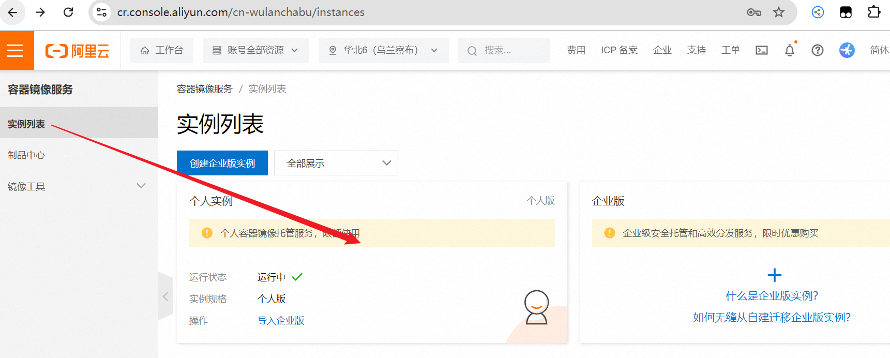
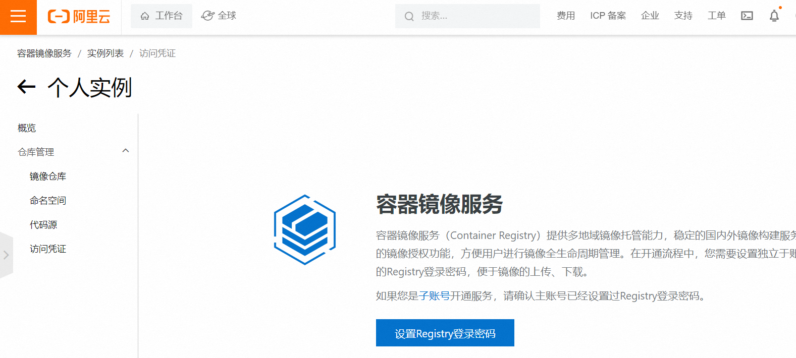

#

<!--more-->

# 10- 提交镜像

## 10.1 提交docker hub

1. 创建一个账号：https://hub.docker.com/

2. 登录并提交

   ```shell
   docker login -u 用户名 -p 密码
   docker images
   docker push mytomcat
   ```

   ```
   Using default tag: latest
   The push refers to repository [docker.io/library/mytomcat]
   5f70bf18a086: Preparing
   1d10c6666f28: Preparing
   c0ec51da0a62: Preparing
   c140235d1958: Preparing
   6ce99e03cb64: Preparing
   c3fa683261fe: Waiting
   174f56854903: Waiting
   denied: requested access to the resource is denied
   ```

   - 发现无法上传，需要打个标签：( Docker 镜像采用内容寻址，只要镜像内容相同，无论有多少不同的标签指向它，在底层存储上只有一份实际的镜像数据。`docker tag`只是为同一个镜像内容创建了一个新的引用方式，也就是新的标签。 )

     ```shell
     docker tag mytomcat 用户名/mytomcat
     docker push 用户名/mytomcat
     ```

     

## 10.2 提交阿里云

- 进入阿里云控制台，展开左上角的列表，搜索：`容器镜像服务`：

  

  

  

  

  - 创建后选择本地仓库，创建镜像仓库后，有教程。

    ```shell
    # 推出之前登录的docker hub
    docker logout
    # 登录阿里云
    docker login --username=用户名 registry.cn-wulanchabu.aliyuncs.com
    docker tag mytomcat registry.cn-wulanchabu.aliyuncs.com/lankeren035/lankeren035:1.0
    docker push registry.cn-wulanchabu.aliyuncs.com/lankeren035/lankeren035:1.0
    ```

  - 传完后在左侧镜像版本里面可以看到