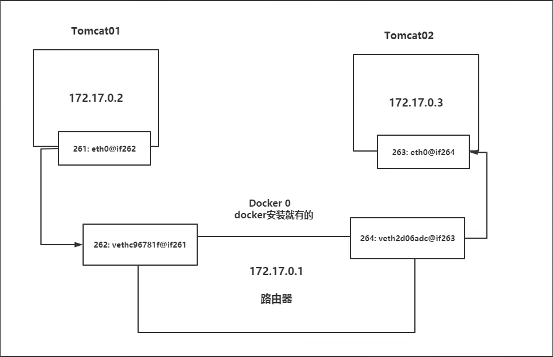

#

<!--more-->

# 11- docker网络

## 11.1 docker0

- 查看ip地址：

  ```shell
  ip addr
  ```

  ```
  1: lo: <LOOPBACK,UP,LOWER_UP> mtu 65536 qdisc noqueue state UNKNOWN group default qlen 1000
      link/loopback 00:00:00:00:00:00 brd 00:00:00:00:00:00
      inet 127.0.0.1/8 scope host lo
         valid_lft forever preferred_lft forever
      inet6 ::1/128 scope host
         valid_lft forever preferred_lft forever
  2: eth0: <BROADCAST,MULTICAST,UP,LOWER_UP> mtu 1500 qdisc fq_codel state UP group default qlen 1000
      link/ether 00:16:3e:04:3e:35 brd ff:ff:ff:ff:ff:ff
      altname enp0s5
      altname ens5
      inet 172.26.198.99/20 metric 100 brd 172.26.207.255 scope global dynamic eth0
         valid_lft 315144250sec preferred_lft 315144250sec
      inet6 fe80::216:3eff:fe04:3e35/64 scope link
         valid_lft forever preferred_lft forever
  3: docker0: <BROADCAST,MULTICAST,UP,LOWER_UP> mtu 1500 qdisc noqueue state UP group default
      link/ether 02:42:43:b2:78:18 brd ff:ff:ff:ff:ff:ff
      inet 172.17.0.1/16 brd 172.17.255.255 scope global docker0
         valid_lft forever preferred_lft forever
      inet6 fe80::42:43ff:feb2:7818/64 scope link
         valid_lft forever preferred_lft forever
  ```

  - 其中`1`是本地回环地址，`2`是阿里云内网地址，`3`是docker0地址，docker0地址相当于docker的一个路由器地址。

- 创建一个容器

  ```shell
  #注意版本，如果用新的版本可能没有ip addr命令
  docker -d -P --name tomcat01 tomcat:7.0
  docker exec -it tomcat01 ip addr
  ```

  ```
  1: lo: <LOOPBACK,UP,LOWER_UP> mtu 65536 qdisc noqueue state UNKNOWN group default qlen 1000
      link/loopback 00:00:00:00:00:00 brd 00:00:00:00:00:00
      inet 127.0.0.1/8 scope host lo
         valid_lft forever preferred_lft forever
      inet6 ::1/128 scope host
         valid_lft forever preferred_lft forever
  168: eth0@if169: <BROADCAST,MULTICAST,UP,LOWER_UP> mtu 1500 qdisc noqueue state UP group default
      link/ether 02:42:ac:11:00:02 brd ff:ff:ff:ff:ff:ff link-netnsid 0
      inet 172.17.0.2/16 brd 172.17.255.255 scope global eth0
         valid_lft forever preferred_lft forever
  ```

  - 此时再查看host的ip：

    ```shell
    ip addr
    ```

    ```
    169: veth32bacd8@if168: <BROADCAST,MULTICAST,UP,LOWER_UP> mtu 1500 qdisc noqueue master docker0 state UP group default
        link/ether aa:d9:ea:35:bc:b8 brd ff:ff:ff:ff:ff:ff link-netnsid 0
        inet6 fe80::a8d9:eaff:fe35:bcb8/64 scope link
           valid_lft forever preferred_lft forever
    ```

    - 发现：

      | host                   | 镜像            |
      | ---------------------- | --------------- |
      | 169: veth32bacd8@if168 | 168: eth0@if169 |
      | docker0: 172.17.0.1/16 | 172.17.0.2/16   |

- 由于他们在同一个网段，因此应该可以相互ping通，容器与容器也可以相互ping通：

  ```shell
  ping 172.17.0.2
  ```

### 原理

- 每启动一个docker容器，docker就会给容器分配一个ip，我们只要安装了docker就会有一个网卡：docker0，桥接模式，用的是evth-pair技术。

- evth-pair就是一堆虚拟设备借口，他们都是承兑出现的，一端连着协议，一端彼此相连。OpenStac, Docker容器之间的连接，OVS的连接都是使用evth-pair技术

  
  
  

- 其中的docker0是与物理网卡直连的（NAT）


## 11.2 --link（不建议）

- 再创建一个容器

  ```shell
  docker run -d -P --name tomcat02 tomcat:7.0
  ```

- ping tomcat01：

  ```shell
  docker exec -it tomcat02 ping 172.17.0.2 #通过ip可以ping通
  docker exec -it tomcat02 ping tomcat01 #通过名称无法ping通
  ```

- 使用`--link`参数相当于创建容器时将`tomcat01 : 172.17.0.2`写道他的host文件：

  ```shell
  docker run -d -P --name tomcat03 --link tomcat01 tomcat:7.0
  docker exec -it tomcat03 ping tomcat01
  docker exec -it tomcat01 ping tomcat03 #反向不通
  ```

- 查看：

  ```shell
  docker network ls #查看网络情况，复制bridge项的id（docker0）
  docker inspect 项目id #在container中可以看到网络情况
  docker inspect tomcat03 #可以看到links选项
  docker exec -it tomcat03 cat /etc/hosts #可以看到域名解析
  ```

  

- 现在不建议使用`--link`了，自定义网络不适用docker0，docker0不支持容器名连接访问。


### 11.3 自定义网络

```
docker network --help
```

- 网络连接模式：

  - bridge：桥接，（docker默认，自己创建也使用bridge模式）
  - none：不配置网络
  - host：和宿主机共享网络
  - container：容器网络联通（用的少，局限很大）

- 测试

  ```shell
  docker stop $(docker ps -aq)
  docker rm $(docker ps -aq)
  #默认使用docker0桥接，这样无法使用名称ping通
  #docker run -d -P --name tomcat01 --net bridge tomcat:7.0
  
  docker network ls
  docker network create --driver bridge --subnet 192.167.0.0/16 --gateway 192.167.0.1 mynet
  docker network ls #可以看到多了一个mynet
  docker run -d -P --name tomcat01 --net mynet tomcat:7.0
  docker run -d -P --name tomcat02 --net mynet tomcat:7.0
  docker exec -it tomcat01 ping tomcat02 #发现可以ping通
  ```

- 使用自定义网络的好处：不同的集群使用不同的网络。


## 11.4 网络连通

```shell
docker network connect --help
```

- 创建一个容器，并连到mynet

  ```shell
  docker run -d -P --name tomcat03 tomcat:7.0
  docker exec -it tomcat03 ping tomcat01
  #连接
  docker network connect mynet tomcat03
  docker exec -it tomcat03 ping tomcat01
  ```

  