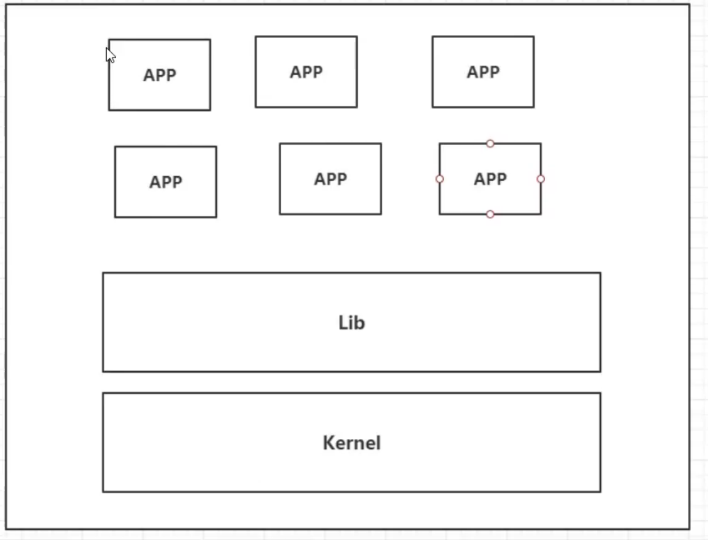
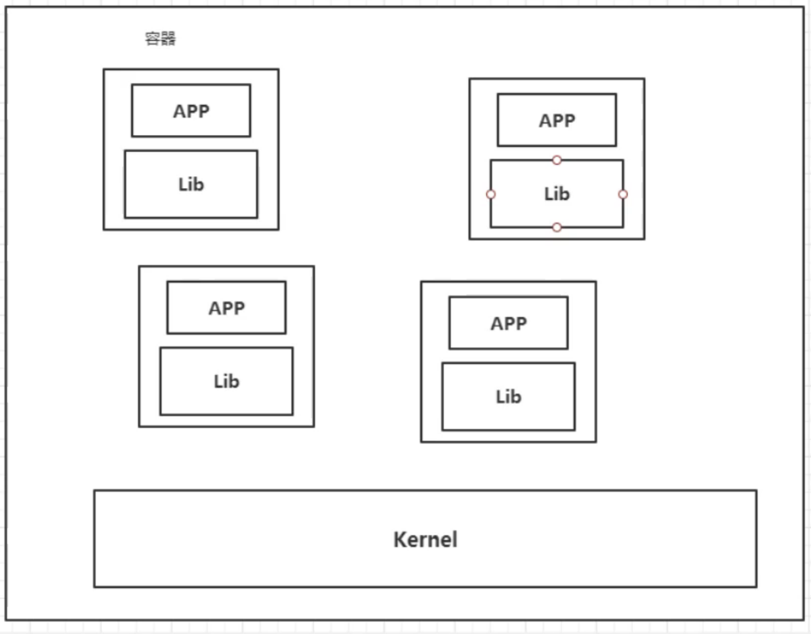
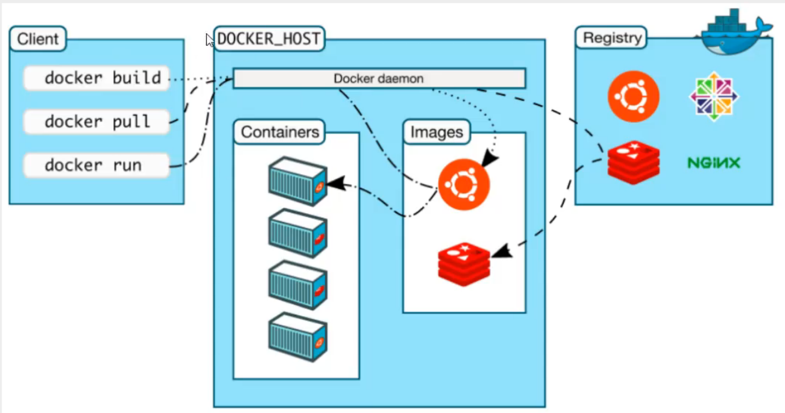

# 
<!--more-->

# 1- docker概述

## 1.1 docker为什么会出现

- 环境配置十分麻烦，每个机器都要部署环境，费时费力。发布一个项目时能不能带上环境安装打包。
  - 传统：开发jar，运维来做
  - 现在：开发打包步数上线，一套流程做完
  - java -> jar (环境) -> 打包项目带上环境（镜像）-> docker仓库 -> 下载我们发布的镜像直接运行即可

- docker的思想来自集装箱
  - 例如你在服务器上有多个项目，他们之间可能有交叉，发生端口冲突
  - docker的核心思想是打包装箱，每个箱子是相互隔离的，通过隔离机制，可以将服务器利用到极致

## 1.2 docker的历史

- 2010年，几个搞IT的年轻人，在美国成立了一家公司`dotcloud`做一些pass的云计算服务。他们将自己的技术（容器化技术）命名为Docker。docker刚诞生的时候，没有引起行业的注意，活不下去。于是2013年就将源代码开源。越来越多的人发现了docker的优点，于是docker就火了。

- docker火的原因：十分轻巧。在容器技术出来之前，我们都是使用虚拟机技术。

  - 虚拟机：在windows中安装一个vmware，通过这个软件虚拟出来一台或者堕胎电脑，比较笨重。

  - 虚拟机和容器技术都属于虚拟化技术。

    | vm                                                           | docker                                                       |
    | ------------------------------------------------------------ | ------------------------------------------------------------ |
    | linux centos原生镜像（一个电脑），隔离，需要开启多个虚拟机，几个G，几分钟 | 隔离，镜像（最核心的环境 4M + jdk + mysql)十分小巧，运行镜像就可以了， 几个M, 秒级启动 |
    | 传统虚拟机，虚拟出硬件，运行一个完整的操作系统，然后再这个系统上安装和运行软件 | 容器内的应用直接运行在宿主机的内容，容器是没有自己的内核的，也没有虚拟硬件，所以更轻便。容器是相互隔离的，每个容器内都有一个属于自己的文件系统，互不影响 |

  - docker是基于Go语言开发的，`dockerhub`类似于github

## 1.3 docker vs 虚拟机技术

- 虚拟机技术的缺点：

  - 资源占用多
  -  冗余步骤多
  - 启动慢

- 容器化技术不是模拟一个完整的操作系统

  - 之前的虚拟机技术：

    

    

  - docker

    

    

    - 应用更快速的交付和部署：
      - 传统：一堆帮助文档，安装程序
      - docker：打包镜像发布测试，一件运行
    - 更便捷的升级和扩容：
      - 使用docker之后，我们部署应用就像搭积木一样，项目大包围一个镜像。
    - 更简单的系统运维：
      - 再容器化之后，我们的开发，测试环境都是高度一直到 
    - 更高效的计算资源利用：
      - docker是内核级别的虚拟化，可以在一个物理机上运行很多的容器实例，将服务器的性能压榨到极致。

## 1.4 docker的基本组成

- 镜像（image）：
  - docker镜像就好比是一个模板，可以通过这个模板来创建容器服务，例如：tomcat镜像 -> run -> tomcat01容器（提供服务器），通过这个镜像可以创建多个容器（最终服务运行或者项目运行就是在容器中的 ）
- 容器（container）
  - docker利用容器技术，独立运行一个或者一组应用，通过镜像来创建的。容器有启动，停止，删除这些基本命令。目前就可以把这个容器理解为一个简易的linux系统
- 仓库（repository）：
  - 仓库就是存放镜像的地方，分为公有仓库和私有仓库。