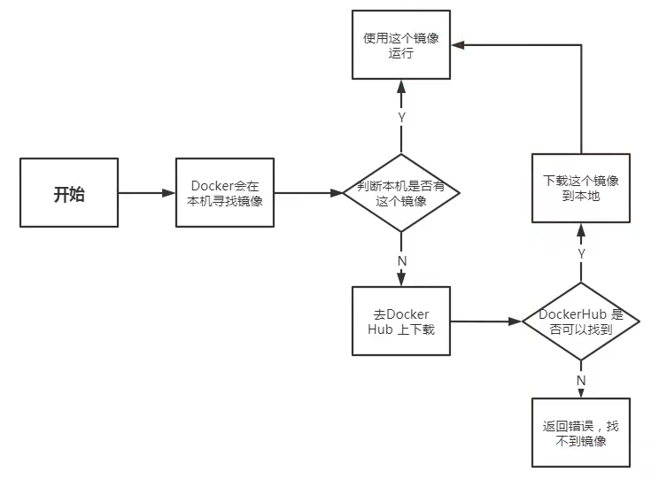
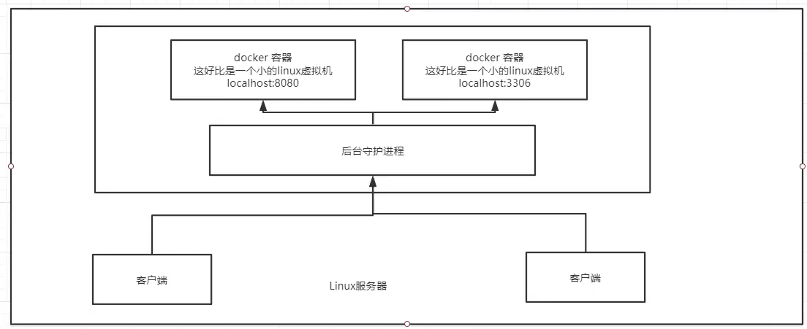
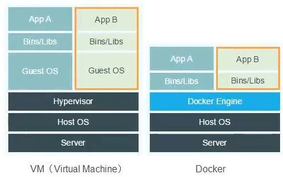

#

<!--more-->

# 2- docker安装

## 2.1 安装

- 参照文档：https://docs.docker.com/manuals/

- 例如我是用的是Ubuntu：docker engine -> install -> ubuntu


1. 首先确认环境是否匹配

2. 卸载之前版本

	- 如果你之前用apt-get安装的docker

       - 卸载有冲突的包：

          ```shell
          for pkg in docker.io docker-doc docker-compose docker-compose-v2 podman-docker containerd runc; do sudo apt-get remove $pkg; done
          ```

       - 卸载docker，清除数据：

          ```shell
          sudo apt-get purge docker-ce docker-ce-cli containerd.io docker-buildx-plugin docker-compose-plugin docker-ce-rootless-extras
          sudo rm -rf /var/lib/docker # 默认docker资源路径
          sudo rm -rf /var/lib/containerd
          ```
       
  - 如果你用snap安装的docker：
  
    ```shell
    # 删除docker
    sudo snap remove docker
    # 删除残余的配置文件或数据
    sudo rm -rf /var/lib/docker
    sudo rm -rf /etc/docker
    sudo rm -rf /run/docker
    sudo rm -rf /var/run/docker.sock
    # snap通常会缓存一些已安装的包数据
    sudo snap set system refresh.retain=2
    sudo rm -rf /var/lib/snapd/cache/*
    # 检查和删除 Docker 服务
    sudo systemctl stop docker
    sudo systemctl disable docker
    
    ```
  
3. 安装

   - 根据说明文档，有多种安装方式，这里选择使用apt仓库（使用阿里云镜像：`http://mirrors.aliyun.com/docker-ce/linux/ubuntu`）

     ```shell
     # Add Docker's official GPG key:
     sudo apt-get update
     sudo apt-get install ca-certificates curl
     sudo install -m 0755 -d /etc/apt/keyrings
     sudo curl -fsSL http://mirrors.aliyun.com/docker-ce/linux/ubuntu/gpg -o /etc/apt/keyrings/docker.asc
     sudo chmod a+r /etc/apt/keyrings/docker.asc
     
     # Add the repository to Apt sources:
     # 设置镜像仓库
     echo \
       "deb [arch=$(dpkg --print-architecture) signed-by=/etc/apt/keyrings/docker.asc] http://mirrors.aliyun.com/docker-ce/linux/ubuntu \
       $(. /etc/os-release && echo "$VERSION_CODENAME") stable" | \
       sudo tee /etc/apt/sources.list.d/docker.list > /dev/null
     sudo apt-get update
     
     # 安装
     # ce是社区版， ee是企业版
     sudo apt-get install docker-ce docker-ce-cli containerd.io docker-buildx-plugin docker-compose-plugin
     
     # 指定版本
     #VERSION_STRING=5:27.1.1-1~ubuntu.24.04~noble
     #sudo apt-get install docker-ce=$VERSION_STRING docker-ce-cli=$VERSION_STRING containerd.io docker-buildx-plugin docker-compose-plugin
     ```

4. 检查

   ```shell
   systemctl start docker
   source ~/.bashrc
   docker version
   ```

   

5. 配置镜像加速（Docker 镜像拉取使用的是 `registry` 镜像源，而不是软件包的镜像源。）

    ```shell
    echo '{ "registry-mirrors": ["https://ra9q5uam.mirror.aliyuncs.com"] }' | sudo tee /etc/docker/daemon.json > /dev/null
    sudo systemctl daemon-reload
    sudo systemctl restart docker

    ```

	- 可登录阿里云，搜索[`镜像加速器`](https://help.aliyun.com/zh/acr/user-guide/accelerate-the-pulls-of-docker-official-images?spm=5176.21213303.J_qCOwPWspKEuWcmp8qiZNQ.21.5fd72f3dqrhBQI&scm=20140722.S_help@@%E6%96%87%E6%A1%A3@@60750._.ID_help@@%E6%96%87%E6%A1%A3@@60750-RL_%E9%95%9C%E5%83%8F%E5%8A%A0%E9%80%9F%E5%99%A8-LOC_llm-OR_ser-V_3-RE_new4@@cardNew-P0_0)自行学习

6. 测试

   ```shell
   # 测试
   sudo docker run hello-world
   
   # 查看镜像是否下载了
   docker images
   ```


- `docker run`的运行流程：

  

  


## 2.2 底层原理

- docker是怎么工作的
  - docker是要给client-server结构的系统，docker的守护进程运行在主机上，通过socket从客户端访问。docker-server收到docker-client的指令就会执行这个命令。




- docker为什么比vm快

  - docker有着比虚拟机更少的抽象层，docker利用的是宿主机的内核，vm需要Guest OS。

    

    

