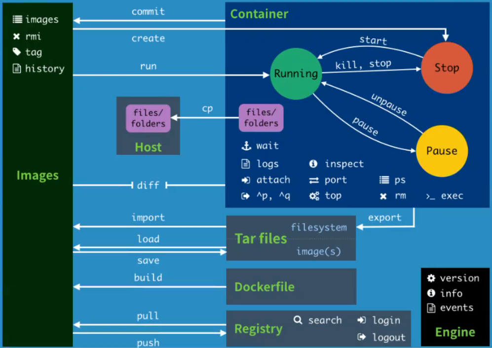

#

<!--more-->

# 3- docker命令




- 将当前用户添加到`docker`用户组，否则每次执行命令都要用`sudo`

  ```shell
  sudo groupadd docker
  sudo usermod -aG docker $USER
  newgrp docker
  ```

  

## 3.1 帮助命令

```shell
docker version #显示docker版本信息
docker info #显示docker系统信息，包括镜像和容器数量
docker 命令 --help #帮助命令

docker stats #查看cpu状态
```

- [帮助文档](https://docs.docker.com/reference/cli/docker/)


## 3.2 镜像命令

| 命令                               | 参数                                                      | 解释                                                         |
| ---------------------------------- | --------------------------------------------------------- | ------------------------------------------------------------ |
| `docker images`                    | -a，--all   #列出所有镜像 <br>-q， --quiet  #只显示镜像id | REPOSITORY：镜像的仓库源<br>TAG：镜像的标签<br>IMAGE ID：镜像id |
| docker search 内容                 | --filter=STARS=3000  #搜索stars大于3000的                 | 从docker hub搜索镜像                                         |
| docker pull 名称[:tag]             | -a<br>-q                                                  | 下载镜像, tag是版本                                          |
| docker rmi 名称/id1 名称/id2       | -f                                                        | 删除镜像                                                     |
| docker rmi -f $(docker images -aq) |                                                           | 删除全部镜像                                                 |


## docker pull

```shell
# 下载镜像： docker pull 镜像名[:tag]
docker pull mysql
```

```shell
using default tag: latest #如果不写tag, 默认latest
latest: pulling form library/mysql
5b54d594fba7: Pull complete #分层下载， docker image的核心，联合文件系统
07e7d6a8a868: Pull complete
dd8f4d07efa5: Pull complete
076d396a6205: Pull complete
cf6b2b93048f: Pull complete
530904b4a8b7: Pull complete
fb1e55059a95: Pull complete
4bd29a0dcde8: Pull complete
b94a001c6ec7: Pull complete
cb77cbeb422b: Pull complete
2a35cdbd42cc: Pull complete
Digest: sha256:dc255ca50a42b3589197000b1f9bab2b4e010158d1a9f56c3db6ee145506f625 # 签名信息，防伪标志
Status: Downloaded newer image for mysql:latest
docker.io/library/mysql:latest #真实地址 等价于：docker pull docker.io/library/mysql:latest
```

- 分层下载的好处是可以共用。


## 3.3 容器命令

- 有了镜像才可以创建容器：

  ```shell
  sudo docker pull centos
  ```

  | 命令                            | 参数                               | 说明                                                         |
  | ------------------------------- | ---------------------------------- | ------------------------------------------------------------ |
  | `docker run [可选参数] 容器`    |                                    | 新建容器并启动                                               |
  |                                 | --name="tomcat01"                  | 容器名字                                                     |
  |                                 | -d                                 | 后台方式运行                                                 |
  |                                 | -it                                | 使用交互方式运行，进入容器查看内容                           |
  |                                 | -p ip:主机端口:容器端口            |                                                              |
  |                                 | -p 主机端口:容器端口               |                                                              |
  |                                 | -p 容器端口                        |                                                              |
  |                                 | 容器端口                           |                                                              |
  |                                 | -P                                 | 随机指定端口                                                 |
  | docker run -it centos /bin/bash |                                    | 启动并进入centos容器（进入centos容器之后可以执行linux命令）  |
  | exit                            |                                    | 容器推出并停止                                               |
  | ctrl + P + Q                    |                                    | 容器推出但不停止                                             |
  | docker ps                       | [空格]：<br>-a：<br>-n=2：<br>-q   | 列出当前正在运行的容器<br>列出当前正在运行的容器+历史运行过的容器<br>显示最近创建的2个容器<br>只显示容器id |
  | docker rm 容器id                | -f                                 | 删除容器（正在运行的容器要通过-f删除）                       |
  |                                 | docker rm -f $(docker ps -aq)      | 删除所有容器                                                 |
  |                                 | docker ps -a -q \| xargs docker rm | 删除所有容器                                                 |
  | docker start 容器id             |                                    | 启动容器                                                     |
  | docker restart 容器id           |                                    | 重启容器                                                     |
  | docker stop 容器id              |                                    | 停止当前正在运行的容器                                       |
  | docker kill 容器id              |                                    | 强制停止当前容器                                             |

  

## 3.4 其他常用命令

### 1. 后台启动容器

```shell
docker run -d 容器名
```

- 使用docker ps发现刚刚运行的容器停止了。因为docker容器使用后台运行，就必须要有一个前台进程，docker发现没有应用就会自动停止。容器启动后，发现自己没有提供服务，就会立刻停止。

### 2. 查看日志

```shell
docker logs -ft --tail 数字 容器
```

- 发现没有日志信息（因为啥也没干）
- 重新运行：

```shell
docker stop 容器
docker run -d 容器名 /bin/bash -c "while true;do echo helloworld;sleep 1;done"
```

- 再显示日志可以看到一直显示`helloworld`:

  ```shell
  docker logs -tf --tail 10 容器id
  ```

  

### 3. 查看容器中进程信息

```shell
docker top 容器id
```


### 4. 查看容器的元数据

```shell
docker inspect 容器id
```

- 会输出镜像的很多详细信息


### 5. 进入当前正在运行的容器

| 命令                            | 区别                                     |
| ------------------------------- | ---------------------------------------- |
| docker exec -it 容器id bin/bash | 进入容器后开启一个新的终端               |
| docker attach 容器id            | 进入容器正在执行的终端，不会开启新的进程 |

- 我们通常容器都是使用后台方式运行的，需要进入容器，修改一些配置


### 6. 从容器复制文件到主机

```shell
docker cp 容器id:路径 主机路径
```

