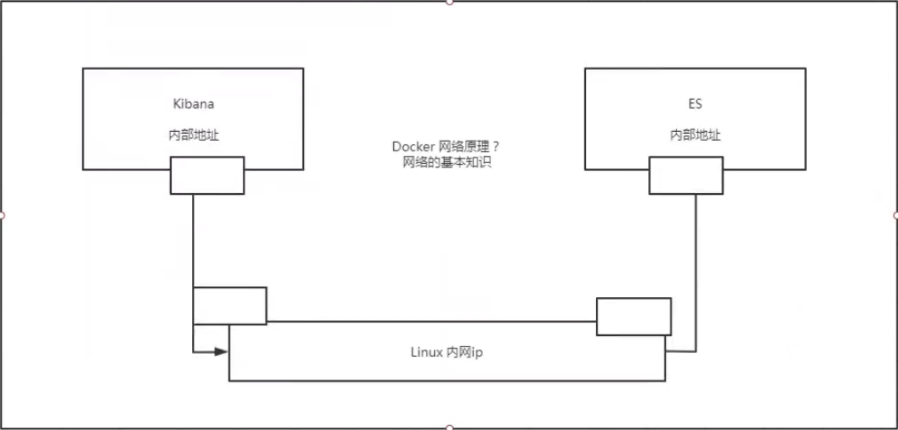

#

<!--more-->

# 4- docker练习

- 假设你使用的是阿里云服务器，你需要先开启某个端口的访问（例如这里选择3344与3355端口做测试）：`ecs控制台 -> 安全组 ->实例管理 -> 安全组详情 -> 入方向 `

## 4.1 部署nginx

```shell
# 搜索nginx
docker search nginx
# 下载
docker pull nginx
# 查看镜像
docker images
# 创建容器并运行
docker run --name nginx01 -p 3344:80 -d nginx
# 查看容器
docker ps
# 通过本地端口查看容器
curl localhost:3344
# 进入容器
docker exec -it nginx01 /bin/bash
# 退出容器
exit
# 停止容器
docker stop nginx01
```


## 4.2 部署tomcat

```shell
# 之前启动都是后台，停止容器之后容器还是可以查到。--rm一般用来测试，用完就删除容器
docker run -it --rm --name tomcat01 tomcat:9.0

# 启动容器
docker run -d -p 3355:8080 --name tomcat01 tomcat:9.0
```

- 发现浏览器输入：`ip:3355`虽然访问成功，但是没有主页内容。

  ```shell
  docker exec -it tomcat01 /bin/bash
  ll
  ```

- 发现`ll`命令无法使用。这是因为docker这里用的是阉割版的linux
- 同时，tomcat01容器中`/usr/local/tomcat/webapps`里面为空导致主页没有内容。这是阿里云镜像的原因。默认是最小的镜像，所有不必要的都要剔除掉，保证最小可运行的环境。

- 将webapps.dist里面的内容放到webapps就好了：

  ```shell
  cp -r webapps.dist/* webapps
  ```

  

```shell
exit
docker stop tomcat01
```


## 4.3 部署ES+Kibana

- 一些需要注意的：
  - es暴露的端口很多
  - es十分耗内存
  - es的数据一般需要放置到安全目录（挂载）
- 启动elasticsearch（内存占用较大，如果你的服务器配置较差，会卡住一段时间）

```shell
docker run -d --name elasticsearch -p 9200:9200 -p 9300:9300 -e "discovery.type=single-node" elasticsearch:7.6.2
curl localhost:9200 #测试es是否ok
```

- 发现linux很卡

  ```shell
  docker stats #查看cpu状态
  docker stop elasticsearch
  ```

- 限制内存使用

  ```shell
  docker run -d --name elasticsearch -p 9200:9200 -p 9300:9300 -e "discovery.type=single-node" -e ES_JAVA_OPTS="-Xms64m -Xms512m" elasticsearch:7.6.2
  ```

- 使用Kibana连接es，网络如何才能连接过去？

  

  