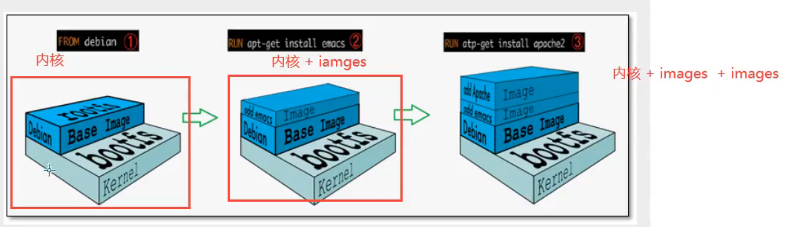
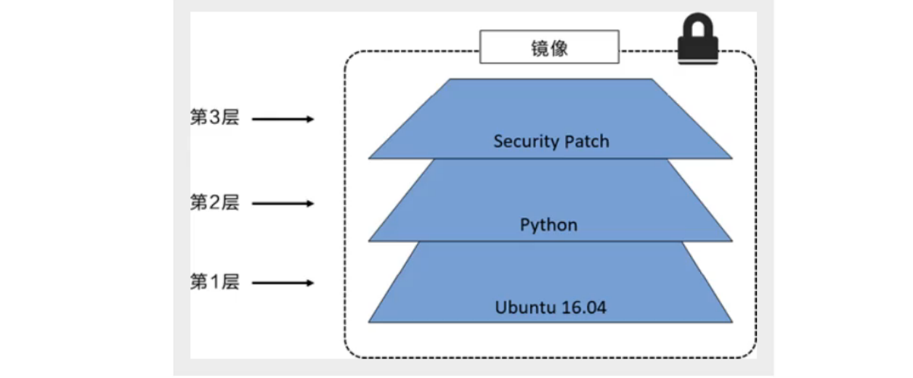
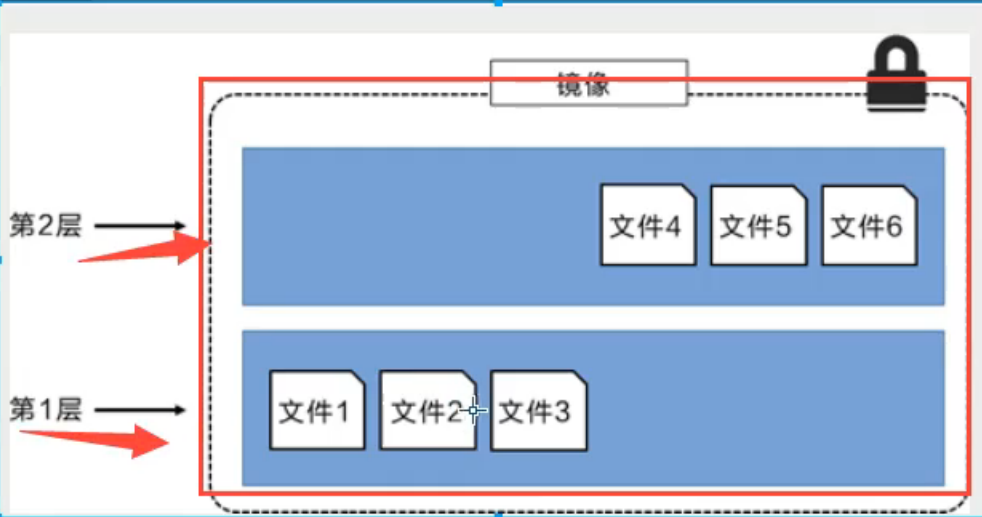
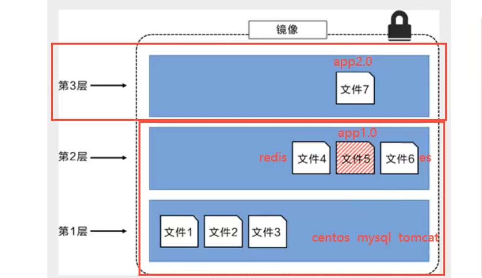
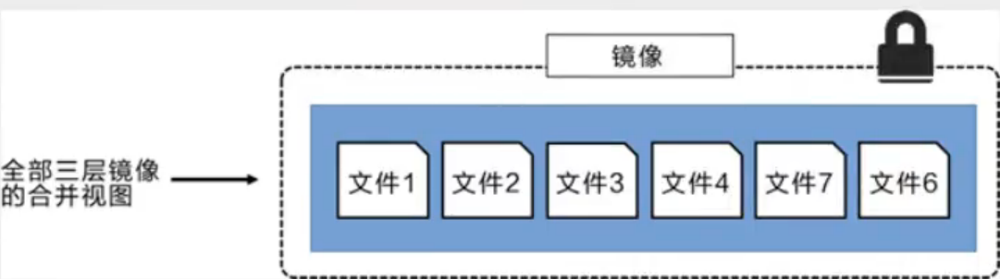
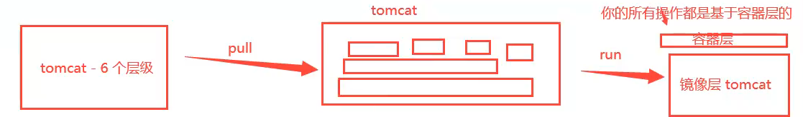

#

<!--more-->

# 6- docker镜像原理

- 镜像是一种轻量级、可执行的独立软件包，用来打包软件运行环境和基于运行环境开发的软件，它包含运行某个软件所需的所有内容，包括代码、运行时、库、环境变量和配置文件。所有的应用，直接打包docker镜像就可以直接跑起来。
- 如何得到镜像：
  - docker pull
  - 自己制作一个镜像DockerFile


## 6.1 镜像加载原理

- 联合文件系统（UnionFS）
  - 定义：联合文件系统是一种**分层**、轻量级并且高效的文件系统，它支持对文件系统的修改作为一次提交来一层层的叠加，同时可以将不同目录挂载到同一个虚拟文件系统下。联合文件系统是docker镜像的基础。镜像可以通过分层来进行继承，基于基础镜像（没有父镜像），可以制作各种具体的应用镜像。
  - 特性：一次同时加载多个文件系统，但从外面看起来，只能看到一个文件系统，联合加载会把各层文件系统叠加起来，这样最终的文件系统会包含所有底层的文件和目录。
  - 举例：例如我有两个镜像mysql镜像和tomcat镜像，他们用的centos内核是一样的，就可以从一个拷贝到另一个。下载helloworld镜像时，看到的一层层下载就是这个。

- 镜像加载原理

  

  
  - docker镜像由一层一层的文件系统组成（UnionFS）
    - bootfs（boot file system）：主要包括bootloader和kernel。bootloader主要是引导加载kernel，Linux刚启动时加载bootfs文件系统，在Docker镜像的最底层是bootfs。这一层与我们典型的Linux/unix系统是一样的，包含boot加载器和内核。当boot加载完成之后整个内核就都在内存中了，此时内存的使用权已由bootfs转交给内核，此时系统也会卸载bootfs
    - rootfs（root file system）：在bootfs之上。包含的就是典型Linux系统中的/dev, /proc, /bin, /etc等标准目录和文件。rootfs就是各种不同的操作系统的发行版本，比如Ubuntu，Centos等等。
  - 对于一个精简的OS，rootfs可以很小，只需要包含最基本的命令、工具和程序就可以了，因为最底层直接使用Host的kernel，自己只需要提供rootfs就可以了。由此可见对于不同的linux发行版，bootfs基本是一致的，rootfs会有差别，因此不同的发行版可以共用bootfs。（因此虚拟机是分钟级别的，因为他有bootfs；而容器是秒级的，它使用宿主机的bootfs）


## 6.2 分层理解

- 下载一个镜像`redis`：

  ```shell
  docker pull redis
  ```

  ```
  Using default tag: latest
  latest: Pulling from library/redis
  a2abf6c4d29d: Already exists
  c7a4e4382001: Pull complete
  4044b9ba67c9: Pull complete
  c8388a79482f: Pull complete
  413c8bb60be2: Pull complete
  1abfd3011519: Pull complete
  Digest: sha256:db485f2e245b5b3329fdc7eff4eb00f913e09d8feb9ca720788059fdc2ed8339
  Status: Downloaded newer image for redis:latest
  docker.io/library/redis:latest
  ```
  - 这里第一个显示`a2abf6c4d29d: Already exists`，这个可能是centos，因为之前的镜像里面也有这一层。

- 可以通过`docker image inspect`查看镜像分层的方式

  ```shell
  docker image inspect redis
  ```

  ```
  "Type": "layers",
              "Layers": [
                  "sha256:2edcec3590a4ec7f40cf0743c15d78fb39d8326bc029073b41ef9727da6c851f",
                  "sha256:9b24afeb7c2f21e50a686ead025823cd2c6e9730c013ca77ad5f115c079b57cb",
                  "sha256:4b8e2801e0f956a4220c32e2c8b0a590e6f9bd2420ec65453685246b82766ea1",
                  "sha256:529cdb636f61e95ab91a62a51526a84fd7314d6aab0d414040796150b4522372",
                  "sha256:9975392591f2777d6bf4d9919ad1b2c9afa12f9a9b4d260f45025ec3cc9b18ed",
                  "sha256:8e5669d8329116b8444b9bbb1663dda568ede12d3dbcce950199b582f6e94952"
              ]
  ```

  

- 理解：

  - 所有的docker镜像都起始于一个基础镜像层，当进行修改活增加新的内容时，就会在当前镜像层之上，创建新的镜像层。

  - 举例：假如基于Ubuntu创建了一个新的镜像，这就是新镜像的第一层；如果在该镜像中添加python包，就会在基础镜像层之上创建第二个镜像层；如果继续添加一个安全补丁，就会创建第三个镜像层：

    

    

    - 在添加额外的镜像层的同时，镜像始终保持是当前所有镜像的组合。下面举个例子，每个镜像包含3搁文件，而镜像包含了来自两个镜像层的6个文件（这里的镜像层跟之前图中的略有不同，主要为了便于展示文件）：

        

        

    - 假设文件5是一个app，这里对他进行更新，使用文件7，从外部看来整个镜像只有6个文件。
    
      
    
      
    
    - 这种情况下，上层镜像层中的文件覆盖了底层镜像层中的文件。这样就使得文件的更新版本作为一个新的镜像层添加到镜像中。
    
    - docker通过存储引擎（新版本采用快照机制）的方式来实现镜像层堆栈，并保证多镜像层对外展示为统一的文件系统。
    
    - Linux上可用的存储引擎有AUFS、Overlay2、Device Mapper、Btrfs一级ZFS。顾名思义，每种存储引擎都基于Linux中对应的文件系统或者快设备技术，并且每种存储引擎都有其独有的性能特点。
    
    - docker在windows上仅支持windowsfilter一种存储引擎，该引擎基于NTFS文件系统之上实现了分层和CoW。
    
    - 下图显示了与系统显示相同的三层镜像。所有镜像层堆叠合并，对外提供统一的视图：
    
      
    
      

- docker镜像都是只读的，当容器启动时，一个新的可写层被加载到镜像的顶部，这一层就是我们通常说的容器层，容器之下的都叫镜像层。

  

  