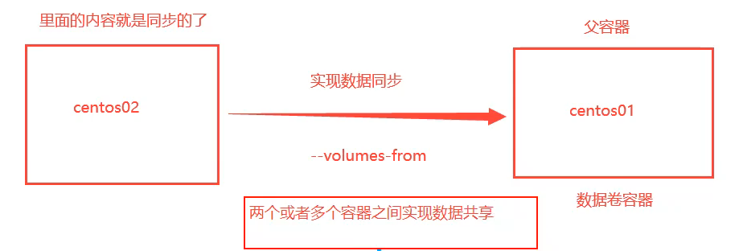

#

<!--more-->

# 7- 容器数据卷

## 7.1 挂载选项

- 通过`-v 本地路径:容器路径`参数实现

- 如果数据都在容器中，那么我们删除容器时，数据就会丢失。例如MySQL数据应该保存在本地。通过卷技术可以将容器中的目录挂在到Linux上。

```shell
docker run -it --name "centos" -v /home/test:/home centos /bin/bash
touch home/test.txt
exit
ls /home/test
docker inspect centos
```

```
"Mounts": [
            {
                "Type": "bind",
                "Source": "/home/test",
                "Destination": "/home",
                "Mode": "",
                "RW": true,
                "Propagation": "rprivate"
            }
        ],
```

- 例子，mysql同步数据

  ```shell
  # e配置环境（密码
  # 挂载两个路径：配置，数据
  docker run --name mysql01 -d -p 3306:3306 -v /home/mysql/conf:/etc/mysql/conf.d -v /home/mysql/data:/var/lib/mysql -e MYSQL_ROOT_PASSWORD=123456 mysql
  ```

  

## 7.2 具名和匿名挂载

- 匿名挂载：

  ```shell
  -v 容器路径
  ```

- 具名挂载

  ```shell
  -v 卷名:容器路径
  ```

- 指定路径挂载

  ```shell
  -v /宿主机路径:容器路径
  ```

- 扩展

  ```shell
  -v 容器路径:ro #只读, 只能通过宿主机操作，容器内部无法操作
  -v 容器路径:rw
  ```

- 通常默认挂载在`/var/lib/docker/volumes/卷名或卷id/_data`

- 查看信息

  ```shell
  docker volume ls #查看有哪些卷
  docker volume inspect 卷名 #查看挂载情况
  ```

  

## 7.3 Dockerfile挂载

- Dockerfile就是用来构建docker镜像的构建文件，脚本的一个命令就是一层：

  ```shell
  # 创建一个dockerfile文件
  # 文件中的内容：指令（大写） 参数
  # 匿名挂载 volume01和volume02
  
  mkdir test
  echo -e 'FROM centos\nVOLUME ["/volume01", "/volume02"]\nCMD [echo "-----end-----" && /bin/bash]' > test/dockerfile
  
  ```

- 通过上面的命令构建一个镜像：

  ```shell
  docker build -f test/dockerfile -t dockerfile_test:1.0 .
  ```

  

## 7.4 容器数据卷

- `--volumes-from`命令




```
docker run -it --name centos01 centos01 /bin/bash
docker run -it --name centos02 --volumes-from centos01 centos01 /bin/bash
```

- 多个容器之间的容器数据卷使用的是拷贝，因此删除一个容器之后另一个的共享数据依然存在。

- 实现多个mysql共享数据：

  ```shell
  docker run -d -p 3306:3306 -v /etc/mysql/conf.d -v /var/lib/mysql -e MYSQL_ROOT_PASSWORD=123456 --name mysql01 mysql
  docker run -d -p 3306:3306 -e MYSQL_ROOT_PASSWORD=123456 --name mysql02 --volumes-from mysql01 mysql
  ```

  - 持续化到本地的数据是不会删除的。