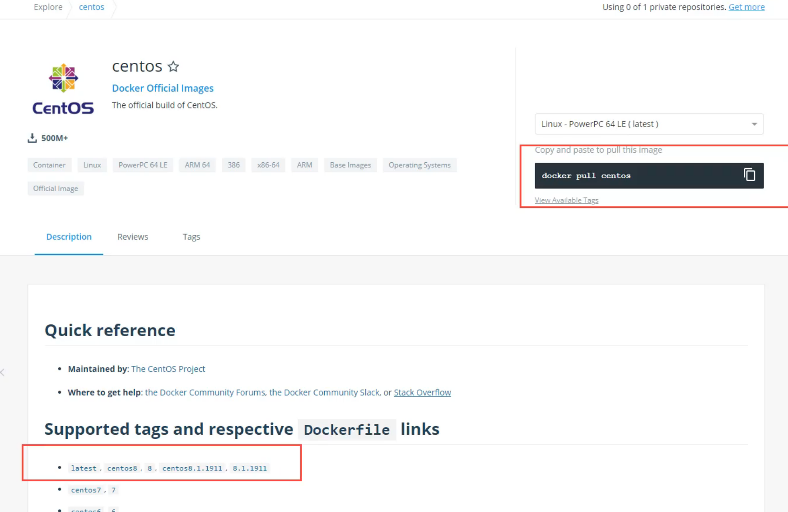
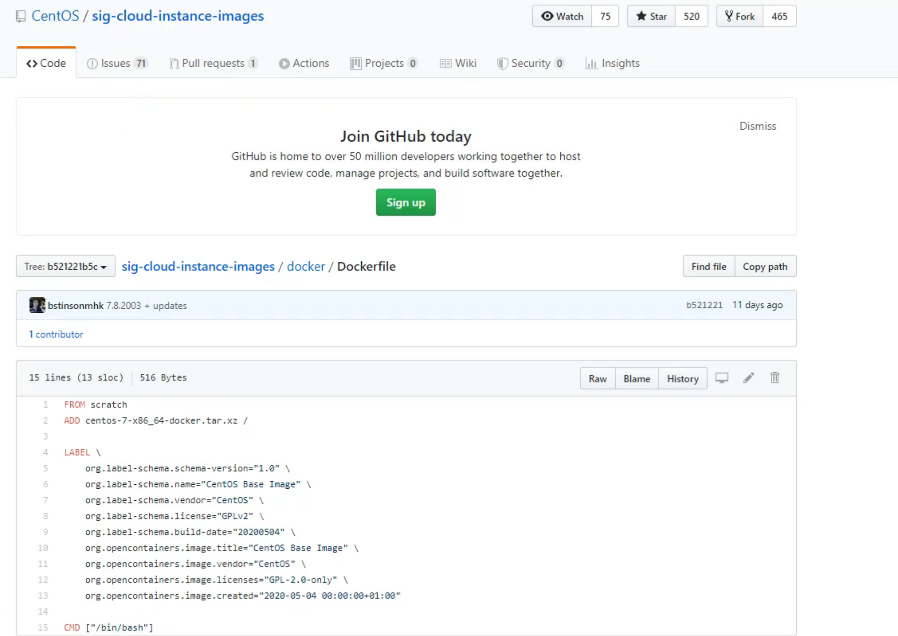
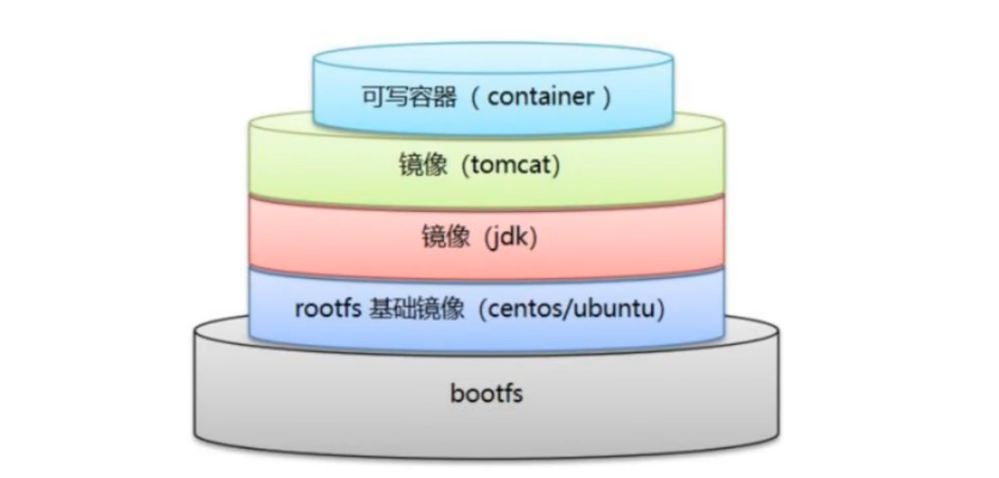

#

<!--more-->

# 8- Dockerfile

## 8.1 了解dockerfile

- dockerfile是用来构建docker镜像的文件，命令参数脚本，源文件。

- 例如查看centos官方镜像：点击下面的版本：

  

  
  - 可以看到对他的源码：（docker hub中99%的镜像都是从scratch这个基础镜像过来的。

  

  

- 基础知识：
  - 每个关键字必须大写
  - `#`表示注释
  - 每一个指令都会创建提交一个新的镜像层，并提交




## 8.2 dockerfile指令

| 指令       | 解释                                                         |
| ---------- | ------------------------------------------------------------ |
| FROM       | 基础镜像                                                     |
| MAINTAINER | 作者，姓名+邮箱                                              |
| RUN        | 镜像构建的时候需要运行的命令                                 |
| ADD        | 添加内容，如添加tomcat镜像，从本地添加压缩包                 |
| WORKDIR    | 镜像工作目录                                                 |
| VOLUME     | 挂载的目录                                                   |
| EXPOSE     | 暴露端口设置                                                 |
| CMD        | 指定容器启动的时候要运行的命令，只有最后一个会生效，可被替代（例如在dockerfile中写了`ls -a`，然后在运行的时候使用`ls`最终的效果就只有`ls -l`） |
| ENTRYPOINT | 指定容器启动的时候要运行的命令，可追加（例如在dockerfile中写了`ls -a`，然后在运行的时候使用`ls`最终的效果就是`ls -al`） |
| ONBUILD    | 当构建一个被继承dockerfile这个容器就会运行ONBUILD指令        |
| COPY       | 类似ADD，将文件拷贝到镜像中                                  |
| ENV        | 构建的时候设置环境变量                                       |

- 对比`CMD`与`ENTRYPOING`：

  ```shell
  echo -e "FROM centos\nCMD ls -a" > test/cmdtest
  echo -e "FROM centos\nENTRYPOINT ls -a" > test/entrypointtest
  docker build -f test/cmdtest -t cmdtest .
  docker build -f test/entrypointtest -t entrypointtest .
  docker run cmdtest -l #出错，因为单独的'-l'不是命令，
  #docker run cmdtest ls -al
docker run entrypointtest -l #ls -a追加 -l  -> ls -al
  ```
  
  

## 8.3 dockerfile编写

- 编写一个dockerfile，给基础的centos镜像加上`ifconfig`命令与`vim`

  ```shell
  FROM centos:7
  MAINTAINER admin<123456@qq.com>
  
  # 启动镜像就进入这个目录
  ENV MYPATH /usr/local
  WORKDIR $MYPATH
  
  # 禁用默认的 CentOS 源，并替换为阿里云源
  RUN sed -i 's|^mirrorlist=|#mirrorlist=|g' /etc/yum.repos.d/CentOS-Base.repo && \
      sed -i 's|^#baseurl=http://mirror.centos.org|baseurl=http://mirrors.aliyun.com|g' /etc/yum.repos.d/CentOS-Base.repo && \
      yum clean all && \
      yum makecache fast
  
  # 安装所需软件
  RUN yum install -y vim net-tools
  
  EXPOSE 80
  
  CMD echo $MYPATH
  CMD echo "-----end-------"
  CMD /bin/bash
```
  
  ```
  docker build -f test/dockerfile -t dockerfile_test .
  docker run -it --name test1 dockerfile_test /bin/bash
  ifconfig #可以使用了
  exit
  docker history dockerfile_test #查看镜像的构建过程
```
  
  

