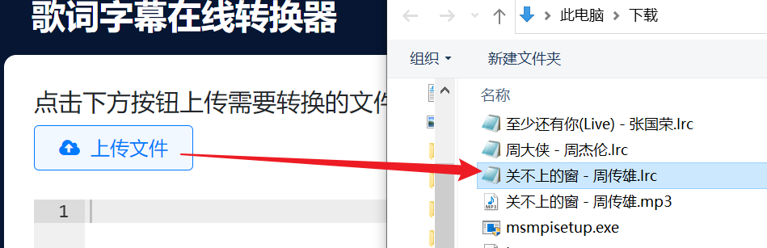
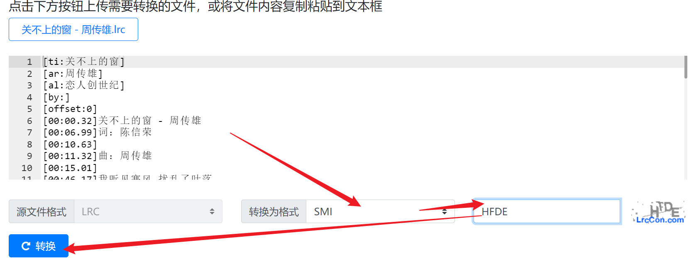
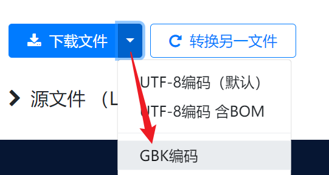
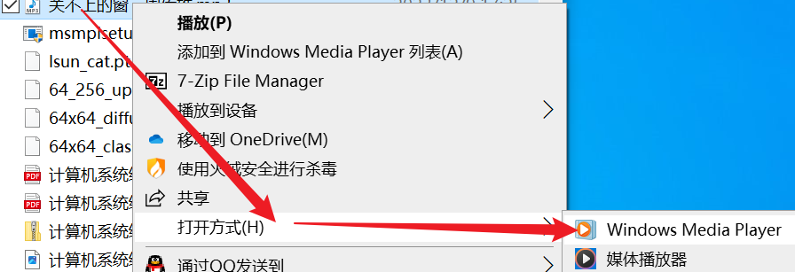
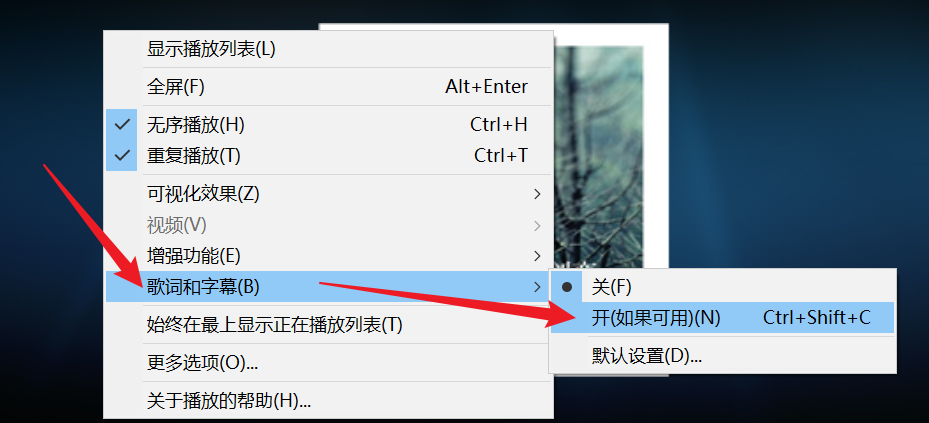

#
<!--more-->

- 需要提前下载歌词文件

## 1. 歌词文件

- 如果你的歌词文件是LRC文件，则需要转成SMI文件

  1. [在线转换](https://www.lrccon.com/convert?lang=zh-hans)(只能转单个，想转多个可以找找别的)

     

     

     

     

     注意编码
  
     
  
     
  
  2. 将SMI文件与歌曲mp3文件放在同一文件夹下

## 2. 设置播放器

1. 右键歌曲 -> 打开方式 -> windows media player

2.  右键 -> 歌词 -> 开

3.  

    

     

4. 关闭软件再重新打开音乐就ok了。