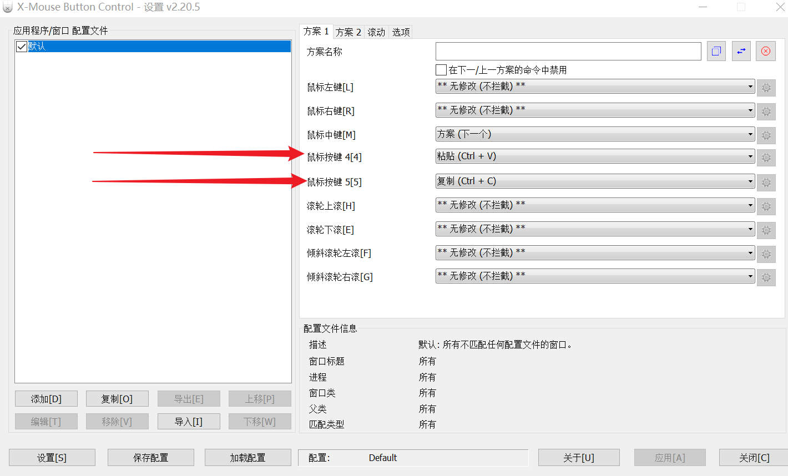
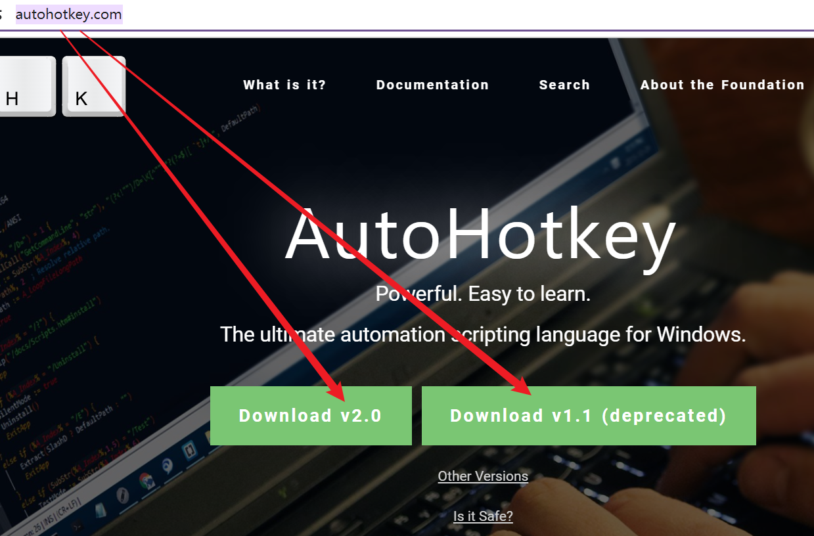
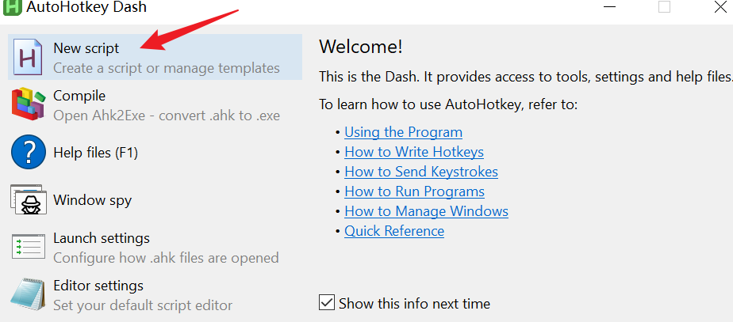

#
<!--more-->

# 更改鼠标侧键

- 原始的鼠标侧键是在浏览器/文件资源管理器中上一页下一页，想将其修改为其他快捷键。

## 1. X-Mouse Button Control

- [下载X-Mouse Button Control](https://www.highrez.co.uk/scripts/download.asp?package=XMouse)

- 找到侧键位置，更改即可

  

  

  - 此外还可以自己设置不同的方案等。

## 2. autohotkey

- [下载](https://www.autohotkey.com/)(两个都要下载)

   

   

- 新建一个文件：

     

     

- 写入如下内容，实现短按、长按不同功能：

  ```ahk
  #Persistent
  #UseHook
  
  XButton1::
  KeyWait, XButton1, T0.2
  If ErrorLevel ; 表示按键被长按
      Send, #{v} ; 模拟按下 Win+V
  Else
      Send, {Enter} ; 模拟按下 enter
  Return
  
  XButton2::
  KeyWait, XButton2, T0.2
  If ErrorLevel ; 表示按键被长按
      Send, ^{v} ; 模拟按下 Ctrl+V
  Else
      Send, ^{c} ; 模拟按下 Ctrl+C
  Return
  ```

  双击运行即可。
  
- 将该文件放到：`C:\Users\123\AppData\Roaming\Microsoft\Windows\Start Menu\Programs\Startup`开机自启动。