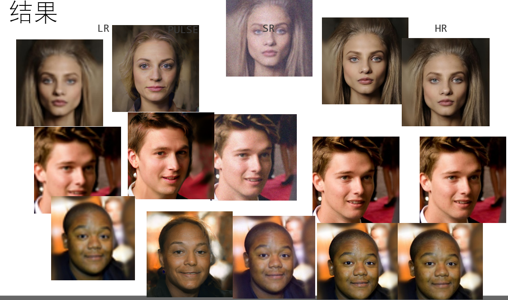
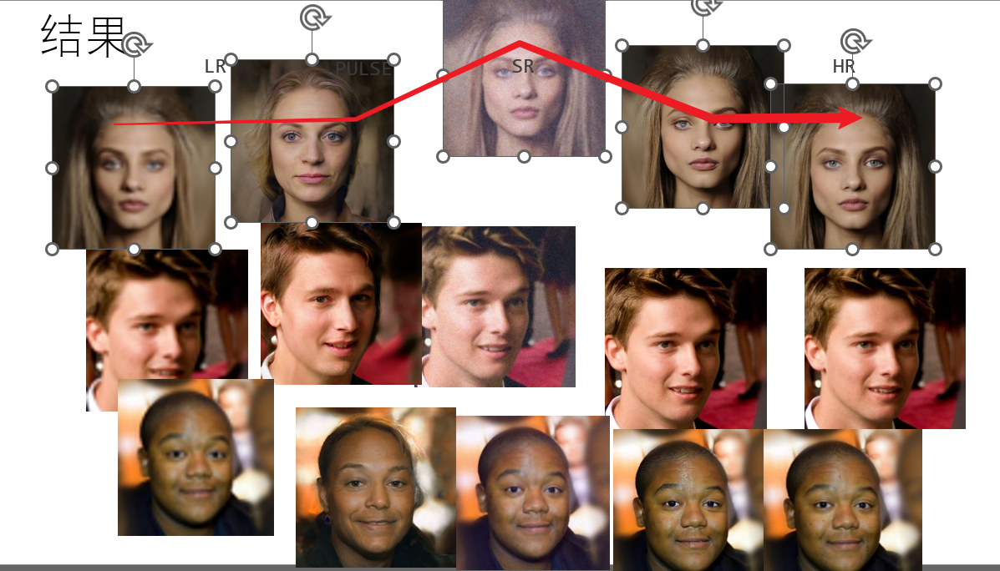
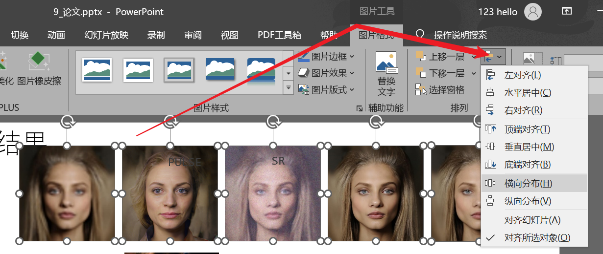
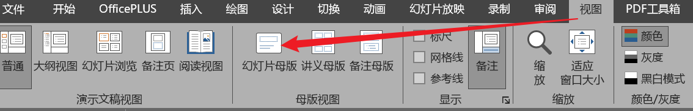
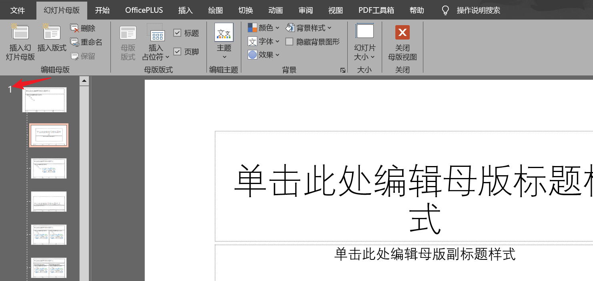

#  
<!--more-->
# 7 ppt笔记

#### 多张图片整齐排列：

- ctrl选中第一列所有横向图片：

- 图片工具 -> 图片格式 -> 对齐对象。先垂直居中，然后横向分布

- ctrl选中第一列所有纵向图片，合理选择对齐方式。

#### 一个内容放到多页ppt

- 选中1-3页 -> 设计 -> 右键一个主题1 -> 应用于选定的幻灯片

- 选中4-6页 -> 设计 -> 右键一个主题2 -> 应用于选定的幻灯片

- 视图 -> 幻灯片母版

- 你刚刚使用了几个主题，这里就有几个大区域，一个大区域下面有很多个小区域，在第一个大区域上插入图片，这个图片会在所有的使用了主题1的幻灯片上显示。

