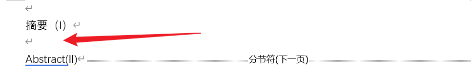

#
<!--more-->

# 1. 公式

## 1.1 使用latex公式

  

  

- 写latex公式
  
  - 写/ alt + = / ctrl + =

# 2. 保存pdf

## 2.1 保存pdf的时候添加导航栏

- word里面ctrl+f打开导航栏

- 另存为 ， 选择类型为pdf, 选项

  

  

- 选择标题

  
  
  

# 3. 页码

## 3.1 分割页码

- 如何将摘要编页码，目录无页码，正文编页码

  

  

- 分别在上图箭头处（每一节的结尾插入分节符）（选择分节符/下一页，不要选连续）

  

  

- 重复n次插入后，你获得了四个区块。每个区块里面的分页随便你插入何种类型的分页符。

  

  

- 双击页脚（假设你在页脚插入页码），在**每**个区块的的第一页**取消链接到前一节**，插入页码。（每个区块的第一页都要点击**取消链接到前一节**斩断联系。）

   

     

- 此时页码不是1，不要慌，点击页码，设置格式。就ok了

   

     

   

     

- 不需要页码的区块直接删除 

# 4. 表格

## 4.1 三线表

- 选择表格右键 -> 表格属性 -> 边框和底纹 -> 先选择磅数1.5，然后只选择上下边框

  

  

- 选择表格的第一行，然后属性，边框底纹，磅数0.75，选择上下边框