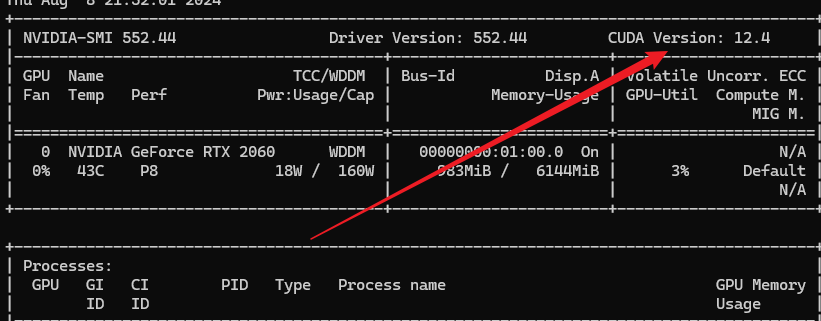
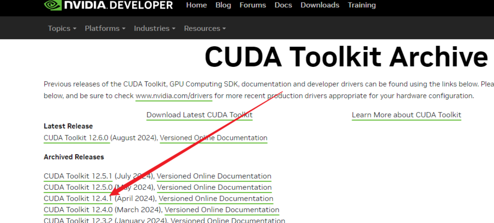
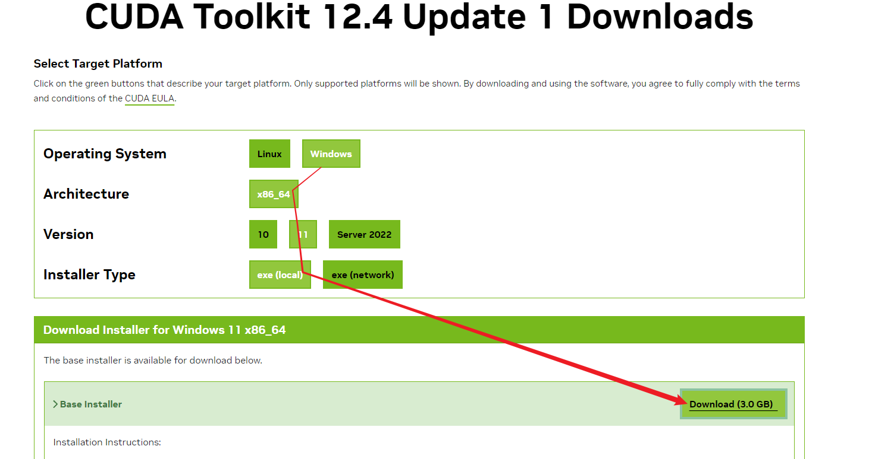
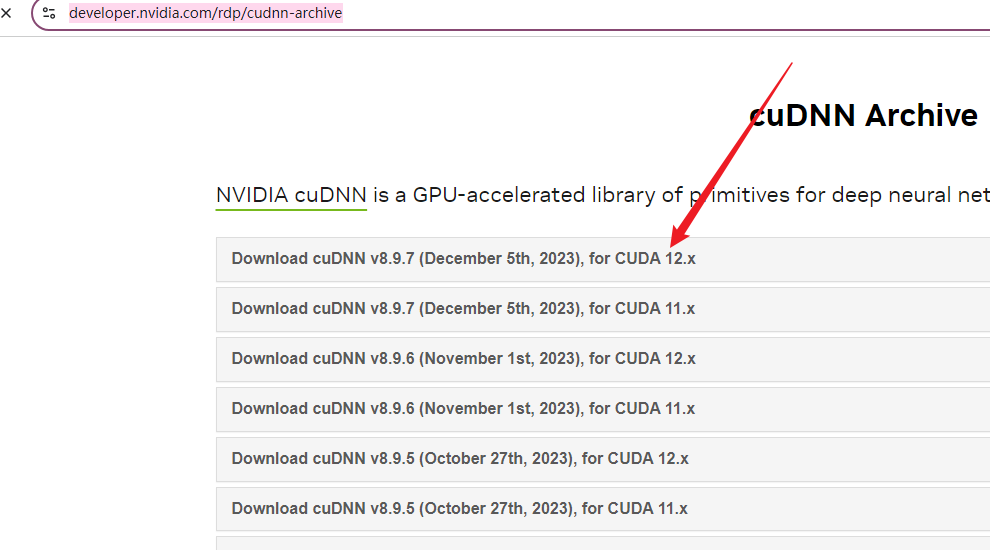
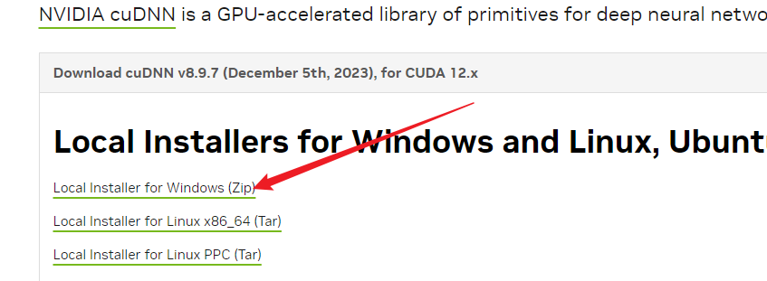
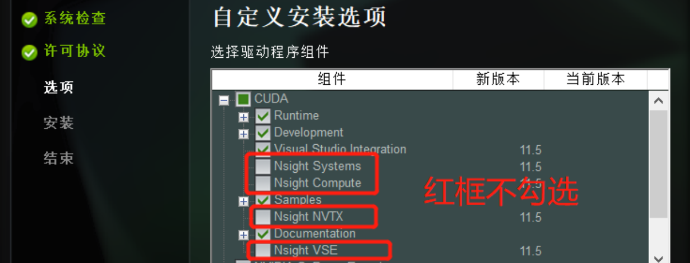
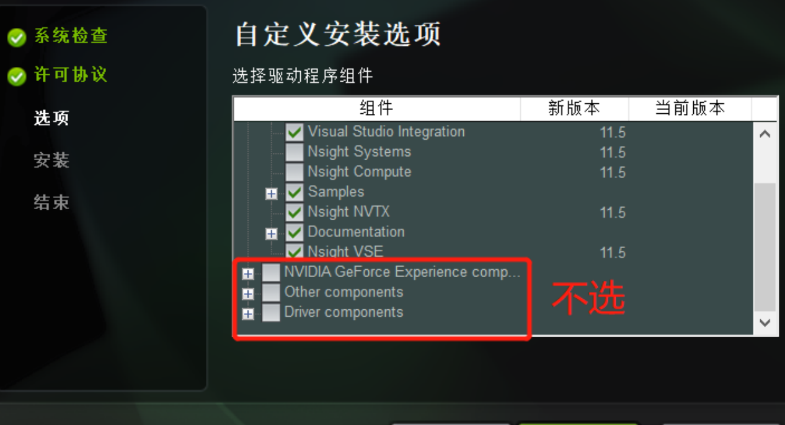
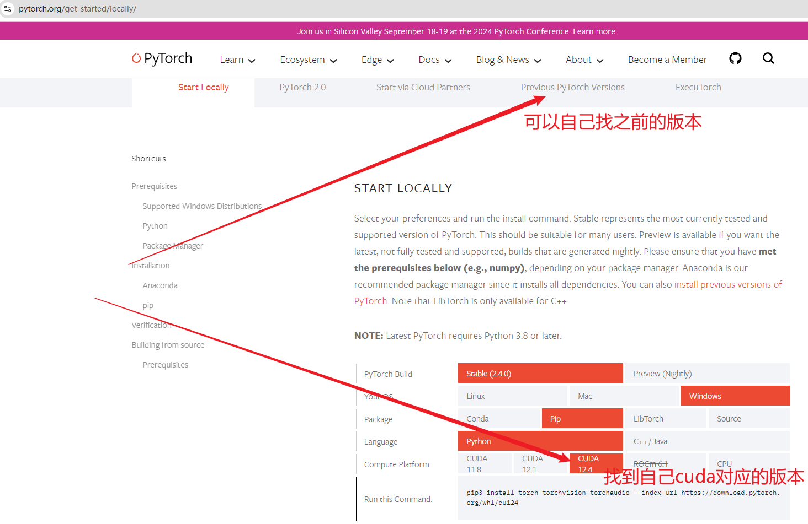

#
<!--more-->


# windows下使用nvidia GPU机器学习

- 需要安装: 
  - CUDA toolkit 
  - cuDNN


## 1 查看CUDA版本

```bash
nvidia-smi
```




## 2 下载 CUDA toolkit

- 下载

网址: https://developer.nvidia.com/cuda-toolkit-archive




- 选择

  

  


## 3 下载 cuDNN

- 下载:

  网址: https://developer.nvidia.com/rdp/cudnn-archive

   

     

- 选择

  

   


## 4 安装

### 4.1 安装cuda

- 双击下载的CUDA toolkit的exe文件, 一直往下走 -> 自定义安装

  

  

  

  

## 4.2 安装cudnn

-  cuDNN已经被集成在Pytorch中，无需单独安装，但是如果需要从源码编译就还是需要安装cuDNN
- 将下载的cudnn的压缩包里的文件夹里面的文件复制到cuda toolkit对应的同名文件夹下


## 5 验证cuda是否安装成功

- 如果终端一直没关过, 可以试试关闭再打开, 刷新一下. 

```bash
nvcc -V
```


## 6 安装pytorch GPU版




