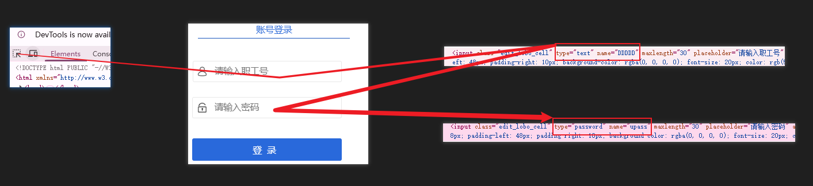

#
<!--more-->


##  服务器开机自动连接校园网

> - 我的服务器在学校里面，需要连接校园网才能进行远程连接，但是每次机房端点重启之后我就要手动去机房打开服务浏览器登录学校的网页登录我的账号才能连上校园网，然后才能进行远程连接。这样很麻烦，每次断电重启后我都要手动给服务器连接校园网。

### 1. 模拟浏览器登录

#### 1.1 安装环境

```shell
pip install playwright
playwright install chromium
python -m playwright install
```

#### 1.2 提取页面元素

- 打开登陆界面，提取页面元素：

  ```
  name="DDDDD" type="text"
  name="upass" type="password"
  ```

  

  

#### 1.3 写脚本

- 登录代码`login.py`，用你的登录地址与用户名和密码

  ```python
  from playwright.sync_api import sync_playwright
  import time
  
  USERNAME = "XXXX"   # 职工号/学号都试试
  PASSWORD = "XXXX"
  ADDRESS = "https://XXXX"
  
  with sync_playwright() as p:
      browser = p.chromium.launch(headless=False)
      page = browser.new_page()
  
      page.goto(ADDRESS, timeout=60000, wait_until="domcontentloaded")
  
      # 只匹配可见输入框：排除 hidden
      user = page.locator('input[name="DDDDD"][type="text"]')
      pwd  = page.locator('input[name="upass"][type="password"]')
  
      user.wait_for(state="visible", timeout=30000)
      pwd.wait_for(state="visible", timeout=30000)
  
      user.fill(USERNAME)
      pwd.fill(PASSWORD)
  
      # 有些页面是用表单提交，直接按回车最通用
      pwd.press("Enter")
  
      page.wait_for_timeout(5000)
      print("After login URL:", page.url)
      print("Title:", page.title())
  
      browser.close()
  
  ```

- 启动代码`autoconnect.py`，启动5次，直到成功，注意调用login.py的路径

  ```python
  import subprocess
  import sys
  import time
  from pathlib import Path
  from urllib.request import urlopen, Request
  
  # ====== 你可以改的参数 ======
  MAX_TRIES = 5
  INTERVAL_SECONDS = 10 * 60  # 10分钟
  LOGIN_SCRIPT = Path(__file__).with_name("login.py")  # 你的playwright登录脚本文件名
  # ===========================
  
  def has_internet(timeout=5) -> bool:
      """
      判断是否已联网：
      - 用一个HTTP请求测试（比 ping 更通用）
      - 有的环境 DNS 可能有问题，所以也可以换成访问一个固定 IP
      """
      test_urls = [
          "http://neverssl.com/",     # http，适合检测是否还被portal劫持
          "https://www.baidu.com/",   # https，备用
      ]
      for url in test_urls:
          try:
              req = Request(url, headers={"User-Agent": "Mozilla/5.0"})
              with urlopen(req, timeout=timeout) as resp:
                  # 只要能拿到响应就算通（portal 劫持通常会返回不一样内容，但至少能区分“完全断网”）
                  if resp.status in (200, 204, 301, 302):
                      return True
          except Exception:
              pass
      return False
  
  def run_login() -> int:
      """
      运行你的登录脚本。用当前 python 执行，避免环境不一致。
      """
      if not LOGIN_SCRIPT.exists():
          print(f"[ERROR] login script not found: {LOGIN_SCRIPT}")
          return 2
  
      print("[INFO] Running login script...")
      p = subprocess.run([sys.executable, str(LOGIN_SCRIPT)], capture_output=True, text=True)
      if p.stdout:
          print("[login stdout]", p.stdout.strip())
      if p.stderr:
          print("[login stderr]", p.stderr.strip())
      return p.returncode
  
  def main():
      # 先等网络栈起来一点点（开机很有用）
      time.sleep(10)
  
      for i in range(1, MAX_TRIES + 1):
          print(f"[INFO] Try {i}/{MAX_TRIES}")
  
          if has_internet():
              print("[INFO] Internet already OK. Exit.")
              return 0
  
          rc = run_login()
  
          # 给 portal 一点时间生效
          time.sleep(5)
  
          if has_internet():
              print("[INFO] Login success. Exit.")
              return 0
  
          if i < MAX_TRIES:
              print(f"[WARN] Not online yet (rc={rc}). Sleep {INTERVAL_SECONDS}s then retry...")
              time.sleep(INTERVAL_SECONDS)
  
      print("[ERROR] Reached max retries, still offline.")
      return 1
  
  if __name__ == "__main__":
      raise SystemExit(main())
  
  ```

  

#### 1.4 开机自启动

##### 1.4.1 windows开机自启动

###### A. 用任务计划程序

1. 打开：开始菜单 → 搜索 **任务计划程序**
2. 右侧点 **创建任务**（不要用“基本任务”）
3. **常规**
   - 名称：`CampusAutoLogin`
   - 勾选：**使用最高权限运行**
   - 配置：选择你的 Windows 版本
4. **触发器**
   - 新建 → “开始任务：**启动时**”
   - 可勾选“延迟任务”：建议 **30 秒**
5. **操作**
   - 新建 → “启动程序”
   - 程序/脚本：填你的 python 路径（非常重要）
     - 例如：`C:\Users\admin\miniconda3\python.exe`
   - 添加参数：
     - `C:\Users\admin\Desktop\code\autoconnect.py`
   - 起始于（可选但建议）：
     - `C:\Users\admin\Desktop\code`
6. **条件**
   - 取消勾选 “只有在计算机使用交流电源时才启动”（如果是台式机无所谓）
7. **设置**
   - 勾选：**如果任务失败，重新启动每隔…**（你也可以不用它，因为我们脚本内已经做了重试）
8. 保存后，右键任务 → **运行** 测试。

> 如果你希望“只有检测到断网才跑”，我们脚本已经做到：`has_internet()` 为 True 就直接退出。


###### B.  启动文件夹 

1.  `Win + R` 输入：`shell:startup` 

2. 在打开的文件夹里新建一个 `.bat`，例如 `autoconnect.bat`：

   ```bat
   @echo off
   cd /d C:\Users\admin\Desktop\code
   C:\Users\admin\miniconda3\python.exe autoconnect.py
   ```

   

##### 1.4.2 Linux 开机自启动

假设你把文件放到：

- `/opt/campus/login.py`
- `/opt/campus/autoconnect.py`

```shell
sudo mkdir -p /opt/campus
sudo cp login.py autoconnect.py /opt/campus/
sudo chmod 700 /opt/campus/*.py
sudo nano /etc/systemd/system/campus-autologin.service
```

粘贴（注意python路径）

```ini
[Unit]
Description=Campus Network Auto Login (Playwright)
After=network-online.target
Wants=network-online.target

[Service]
Type=oneshot
WorkingDirectory=/opt/campus
ExecStart=~/anaconda3/bin/python3 /opt/campus/autoconnect.py
# 如需写日志可以加：
# StandardOutput=append:/var/log/campus-autologin.log
# StandardError=append:/var/log/campus-autologin.log

[Install]
WantedBy=multi-user.target
```

```shell
sudo systemctl enable campus-autologin
```


### 2. 代码请求登录

#### 2.1  确认 Portal 登录页地址（触发跳转）

-  在服务器**未登录校园网**的状态下，打开浏览器，输入：` http://www.baidu.com ` 浏览器会自动跳转到校园网登录页，比如我这里是：

  ```
  https://portal.xxx.edu.cn/
  ```

  

#### 2.2  用浏览器抓包，找出“真正的登录请求” 

1. 按 `F12` 打开开发者工具（DevTools）

2. 切到 **Network**

3. 勾选  `Preserve log`

4. 点击清空（🧹）

5. 在页面输入账号密码，点击“登录”（或回车）

6. Network 会出现很多请求，重点找名字里像：
   - `login` / `doLogin` / `auth` / `portal` 等关键字 

7.  **登录请求**通常会包含账号/密码参数（字段名不一定一样） , 我这里最终定位到两条关键请求： 
   - `.../eportal/portal/login?...` —— 真正触发认证
   - `.../eportal/portal/Custom/online_data?...` —— 查询在线状态/会话

#### 2.3  把请求完整导出（Copy as cURL） 

1. 在 Network 里选中 `login` 那条

2. 右键 → `Copy` → **Copy as cURL**

3. 同样对 `online_data` 也复制一份

4.  你会得到类似（示例已打码）： 

   ```
   # online_data（在线状态）
   https://portal.xxx.edu.cn:802/eportal/portal/Custom/online_data?callback=dr1003&username=XXXXX&password=XXXXX&ip=...&mac=...
   
   # login（认证）
   https://portal.xxx.edu.cn:802/eportal/portal/login?callback=dr1004&login_method=1&user_account=%2C0%2CXXXXX&user_password=XXXXX&wlan_user_ip=...&wlan_user_mac=...&...
   ```

   

#### 2.4  验证密码是否加密（决定代码怎么填 password） 

- 看 Copy as cURL 的 URL 参数里密码长什么样：
  - 明文（可读字符串） → 直接用
  - 32 位十六进制 → 可能是 md5
  - 很长一串 base64/密文 → 可能是 RSA/加密算法，需要复现 JS

- 我这里确认：**密码是明文**（直接拼进请求即可）。


#### 2.5  用 curl 直接在命令行复现登录（先跑通再写脚本）

-  把 `Copy as cURL` 简化成一行（只保留必要 header，一般 `Referer` + `User-Agent` 就够）： 

  ```
  curl.exe -s --compressed "https://portal.csu.edu.cn:802/eportal/portal/login?callback=dr1004&login_method=1&user_account=%2C0%2CXXXXX&user_password=XXXXX&wlan_user_ip=183.169.116.8&wlan_user_ipv6=&wlan_user_mac=40b0767fbb67&wlan_ac_ip=&wlan_ac_name=&jsVersion=4.1.3&terminal_type=1&lang=zh-cn&v=607&lang=zh" -H "Referer: https://portal.csu.edu.cn/" -H "User-Agent: Mozilla/5.0"
  ```

-  如果成功，会看到类似： 

  ```
  dr1004({"result":1,"msg":"Portal协议认证成功！"});
  ```

  

> - **一定要在“未认证状态”测试 login**。
>   - 如果已经在线，重复 login 可能会返回各种错误码（我这里遇到过“联通错误代码99”），容易误判为“接口不对”。 
> -  `wlan_user_mac` 很关键。
>   - 我一开始用`login`那一条上的mac地址是 `000000000000` 会失败，后来选中`online_data`那一条，右键在新窗口打开，看到里面的`online_mac`字段才确认真实 MAC，拿过来覆盖到`login`那一条得到的cURL里面的`wlan_user_mac`字段上。

#### 2.6  把“抓包得到的信息”抽到配置文件，代码只保留通用逻辑 

- 配置文件，保存为config.json:

  ```json
  {
    "auth": {
      "username": "你的学号",            // 账号：你自己知道（手填）
      "password": "你的密码",            // 密码：你自己知道（手填）
      "password_mode": "plain"          // 从抓包看 user_password= 明文→plain；若是32位hex多为md5→md5
    },
  
    "portal": {
      "base": "https://portal.csu.edu.cn:802",   // 从 Copy as cURL/Request URL 的 “协议+域名+端口”
      "referer": "https://portal.csu.edu.cn/",   // 从 Copy as cURL 里的 -H "referer: ..." 或 Request Headers
      "verify_tls": true,                        // https证书正常→true；若自签证书 requests 报错才改 false
  
      "endpoints": {
        "login": "/eportal/portal/login",                // 从 Request URL 去掉 base 后剩下的路径
        "online": "/eportal/portal/Custom/online_data"   // 同上：online_data 请求路径
      },
  
      "login": {
        "method": "GET",                 // 从 Network->Headers->Request Method（你这条是 GET）
        "jsVersion": "4.1.3",            // 从 login URL 参数 jsVersion=4.1.3（抓包照抄）
        "account_format": ",0,{username}", // 从 user_account 的真实值解码得到：user_account=,0,学号
  
        "param_names": {
          "account": "user_account",     // 从 login URL 参数名 user_account=
          "password": "user_password",   // 从 login URL 参数名 user_password=
          "ip": "wlan_user_ip",          // 从 login URL 参数名 wlan_user_ip=
          "mac": "wlan_user_mac",        // 从 login URL 参数名 wlan_user_mac=
          "ipv6": "wlan_user_ipv6",      // 从 login URL 参数名 wlan_user_ipv6=
          "ac_ip": "wlan_ac_ip",         // 从 login URL 参数名 wlan_ac_ip=
          "ac_name": "wlan_ac_name"      // 从 login URL 参数名 wlan_ac_name=
        },
  
        "fixed_params": {
          "login_method": "1",           // 从 login URL 参数 login_method=1（固定）
          "terminal_type": "1",          // 从 login URL 参数 terminal_type=1（固定）
          "wlan_user_ipv6": "",          // 从 login URL 里 wlan_user_ipv6= 为空也带上（固定写法）
          "wlan_ac_ip": "",              // 从 login URL 里 wlan_ac_ip= 为空也带上（固定写法）
          "wlan_ac_name": ""             // 从 login URL 里 wlan_ac_name= 为空也带上（固定写法）
        },
  
        "repeat_params": {
          "lang": ["zh-cn", "zh"]        // 从 login URL 里出现两次 lang：...lang=zh-cn...&lang=zh
        }
      },
  
      "online": {
        "method": "GET",                 // 从 Network->Headers->Request Method（online_data 也是 GET）
        "jsVersion": "4.1.3",            // 从 online_data URL 参数 jsVersion=4.1.3（抓包照抄）
  
        "param_names": {
          "username": "username",        // 从 online_data URL 参数名 username=
          "password": "password",        // 从 online_data URL 参数名 password=
          "ip": "ip",                    // 从 online_data URL 参数名 ip=
          "mac": "mac"                   // 从 online_data URL 参数名 mac=
        },
  
        "fixed_params": {
          "wlan_ac_name": "",            // 从 online_data URL 参数 wlan_ac_name=（为空也带）
          "wlan_ac_ip": "",              // 从 online_data URL 参数 wlan_ac_ip=（为空也带）
          "login_method": "undefined",   // 从 online_data URL 参数 login_method=undefined
          "lang": "zh"                   // 从 online_data URL 参数 lang=zh
        }
      }
    },
  
    "network": {
      "auto_detect": true,               // 通用逻辑：自动取默认路由网卡的 IPv4+MAC（换机器也能用）
      "ip_override": "",                 // 需要固定IP时手填；否则留空让脚本自动取
      "mac_override": ""                 // 需要固定MAC时手填；否则留空让脚本自动取
    },
  
    "checks": {
      "internet_204_url": "http://connectivitycheck.gstatic.com/generate_204", // 用204判断是否放行（通用探测URL）
      "max_tries": 6,                    // 重试次数：经验值，可按需调大
      "retry_delay_seconds": 10,         // 每次失败后等待多久再试：经验值
      "boot_delay_seconds": 15           // 开机先等网络栈起来：经验值（避免太早请求失败）
    }
  }
  ```

  

- 启动脚本：campus_autologin_generic.py：

  ```python
  import hashlib
  import json
  import os
  import platform
  import random
  import re
  import subprocess
  import time
  from pathlib import Path
  from typing import Any, Dict, List, Optional, Tuple
  
  import requests
  
  HERE = Path(__file__).resolve().parent
  CFG_PATH = HERE / "config.json"
  LOG_PATH = HERE / "campus.log"
  
  UA = "Mozilla/5.0 (Windows NT 10.0; Win64; x64) CampusAutoLogin/2.0"
  
  def log(msg: str) -> None:
      line = f"[{time.strftime('%Y-%m-%d %H:%M:%S')}] {msg}"
      print(line)
      try:
          with LOG_PATH.open("a", encoding="utf-8") as f:
              f.write(line + "\n")
      except Exception:
          pass
  
  def load_cfg() -> Dict[str, Any]:
      if not CFG_PATH.exists():
          raise RuntimeError(f"Missing {CFG_PATH}")
      return json.loads(CFG_PATH.read_text(encoding="utf-8"))
  
  def jsonp_load(text: str) -> Dict[str, Any]:
      m = re.search(r"\((.*)\)\s*;?\s*$", text.strip(), re.S)
      payload = m.group(1) if m else text
      return json.loads(payload)
  
  def mask_url(url: str, keys=("password", "user_password")) -> str:
      # 避免日志里出现明文密码
      for k in keys:
          url = re.sub(rf"({re.escape(k)}=)[^&]+", r"\1***", url, flags=re.I)
      return url
  
  def password_transform(pw: str, mode: str) -> str:
      mode = (mode or "plain").lower()
      if mode == "plain":
          return pw
      if mode == "md5":
          return hashlib.md5(pw.encode("utf-8")).hexdigest()
      raise RuntimeError(f"Unsupported password_mode: {mode}")
  
  def get_ip_mac(cfg: Dict[str, Any]) -> Tuple[str, str]:
      net = cfg.get("network", {})
      ip_ov = (net.get("ip_override") or "").strip()
      mac_ov = (net.get("mac_override") or "").strip().replace("-", "").replace(":", "").lower()
      if ip_ov and mac_ov:
          return ip_ov, mac_ov
  
      if not net.get("auto_detect", True):
          raise RuntimeError("auto_detect=false but ip_override/mac_override not set.")
  
      sysname = platform.system().lower()
  
      if "windows" in sysname:
          ps = r"""
  $if = (Get-NetRoute -DestinationPrefix '0.0.0.0/0' | Sort-Object RouteMetric | Select-Object -First 1).ifIndex
  $ip = (Get-NetIPAddress -AddressFamily IPv4 -InterfaceIndex $if | Where-Object { $_.IPAddress -notlike '169.254*' } | Select-Object -First 1).IPAddress
  $mac = (Get-NetAdapter -InterfaceIndex $if | Select-Object -First 1).MacAddress
  @{ip=$ip; mac=$mac} | ConvertTo-Json -Compress
  """.strip()
          out = subprocess.check_output(["powershell", "-NoProfile", "-Command", ps], text=True).strip()
          j = json.loads(out)
          ip = j["ip"]
          mac = j["mac"].replace("-", "").lower()
          return ip, mac
  
      if "linux" in sysname:
          out = subprocess.check_output(["bash", "-lc", "ip route get 1.1.1.1 | head -n1"], text=True).strip()
          m_ip = re.search(r"\bsrc\s+(\d+\.\d+\.\d+\.\d+)", out)
          m_dev = re.search(r"\bdev\s+(\S+)", out)
          if not m_ip or not m_dev:
              raise RuntimeError(f"Cannot parse: {out}")
          ip = m_ip.group(1)
          dev = m_dev.group(1)
          mac = Path(f"/sys/class/net/{dev}/address").read_text().strip().replace(":", "").lower()
          return ip, mac
  
      raise RuntimeError(f"Unsupported OS: {sysname}")
  
  def internet_ok(cfg: Dict[str, Any]) -> bool:
      url = cfg["checks"]["internet_204_url"]
      try:
          r = requests.get(url, timeout=5, allow_redirects=False, headers={"User-Agent": UA})
          return r.status_code == 204
      except Exception:
          return False
  
  def request_jsonp(method: str, url: str, params: List[Tuple[str, str]], headers: Dict[str, str], verify_tls: bool) -> Dict[str, Any]:
      if method.upper() != "GET":
          raise RuntimeError("This generic template currently supports GET only.")
      r = requests.get(url, params=params, headers=headers, timeout=10, verify=verify_tls)
      return jsonp_load(r.text)
  
  def build_login_params(cfg: Dict[str, Any], ip: str, mac: str, username: str, password: str) -> List[Tuple[str, str]]:
      p = cfg["portal"]["login"]
      names = p["param_names"]
      fixed = p.get("fixed_params", {})
      repeat = p.get("repeat_params", {})
  
      callback = f"dr{random.randint(1000, 9999)}"
      v = str(random.randint(100, 9999))
  
      acct = p["account_format"].format(username=username)
  
      params: List[Tuple[str, str]] = []
      params.append(("callback", callback))
      # 固定参数
      for k, val in fixed.items():
          params.append((k, str(val)))
      # 动态参数（字段名可配置）
      params.append((names["account"], acct))
      params.append((names["password"], password))
      params.append((names["ip"], ip))
      params.append((names["mac"], mac))
      # 有些 portal 需要这些字段，即使为空也带上
      if "ipv6" in names:
          params.append((names["ipv6"], fixed.get(names.get("ipv6", ""), "")))
      if "ac_ip" in names:
          params.append((names["ac_ip"], fixed.get("wlan_ac_ip", "")))
      if "ac_name" in names:
          params.append((names["ac_name"], fixed.get("wlan_ac_name", "")))
  
      # jsVersion / v
      params.append(("jsVersion", p.get("jsVersion", "")))
      params.append(("v", v))
  
      # 重复参数（如 lang）
      for k, arr in repeat.items():
          for item in arr:
              params.append((k, str(item)))
  
      return params
  
  def build_online_params(cfg: Dict[str, Any], ip: str, mac: str, username: str, password: str) -> List[Tuple[str, str]]:
      p = cfg["portal"]["online"]
      names = p["param_names"]
      fixed = p.get("fixed_params", {})
  
      callback = f"dr{random.randint(1000, 9999)}"
      v = str(random.randint(100, 9999))
  
      params: List[Tuple[str, str]] = []
      params.append(("callback", callback))
      for k, val in fixed.items():
          params.append((k, str(val)))
  
      params.append((names["username"], username))
      params.append((names["password"], password))
      params.append((names["ip"], ip))
      params.append((names["mac"], mac))
  
      params.append(("jsVersion", p.get("jsVersion", "")))
      params.append(("v", v))
      return params
  
  def portal_online(cfg: Dict[str, Any], ip: str, mac: str, username: str, password: str) -> bool:
      portal = cfg["portal"]
      url = portal["base"].rstrip("/") + portal["endpoints"]["online"]
      headers = {"User-Agent": UA, "Referer": portal["referer"], "Accept": "*/*"}
      params = build_online_params(cfg, ip, mac, username, password)
  
      try:
          data = request_jsonp(portal["online"]["method"], url, params, headers, portal.get("verify_tls", True))
          if data.get("result") != 1:
              return False
          # 通用判定：优先 total，其次 data 数组长度
          total = data.get("total")
          if isinstance(total, int):
              return total > 0
          arr = data.get("data")
          return isinstance(arr, list) and len(arr) > 0
      except Exception as e:
          log(f"[online] error: {e}")
          return False
  
  def portal_login(cfg: Dict[str, Any], ip: str, mac: str, username: str, password: str) -> Dict[str, Any]:
      portal = cfg["portal"]
      url = portal["base"].rstrip("/") + portal["endpoints"]["login"]
      headers = {"User-Agent": UA, "Referer": portal["referer"], "Accept": "*/*"}
      params = build_login_params(cfg, ip, mac, username, password)
      # 不打印完整 URL（会带密码）
      safe = mask_url(requests.Request("GET", url, params=params).prepare().url or url)
      log(f"[login] GET {safe}")
      return request_jsonp(portal["login"]["method"], url, params, headers, portal.get("verify_tls", True))
  
  def main():
      cfg = load_cfg()
      time.sleep(int(cfg["checks"].get("boot_delay_seconds", 10)))
  
      username = cfg["auth"]["username"]
      password = password_transform(cfg["auth"]["password"], cfg["auth"].get("password_mode", "plain"))
  
      ip, mac = get_ip_mac(cfg)
      log(f"Detected ip={ip}, mac={mac}")
  
      # 1) 已放行就退出
      if internet_ok(cfg):
          log("Internet already OK (204). Exit.")
          return 0
  
      # 2) portal 已在线就退出（避免重复 login 触发错误码）
      if portal_online(cfg, ip, mac, username, password):
          log("Already online per portal. Exit.")
          return 0
  
      # 3) 不在线 → 尝试登录
      tries = int(cfg["checks"].get("max_tries", 6))
      delay = int(cfg["checks"].get("retry_delay_seconds", 10))
  
      for i in range(1, tries + 1):
          log(f"Login attempt {i}/{tries} ...")
          res = portal_login(cfg, ip, mac, username, password)
          log(f"login result={res.get('result')} ret_code={res.get('ret_code')} msg={res.get('msg')}")
  
          time.sleep(2)
          if internet_ok(cfg) or portal_online(cfg, ip, mac, username, password):
              log("Login success.")
              return 0
  
          time.sleep(delay)
  
      log("Login failed after retries.")
      return 1
  
  if __name__ == "__main__":
      raise SystemExit(main())
  
  ```

  