#
<!--more-->

- 需要提前准备好：IP/端口/user/password

## 1. 连接

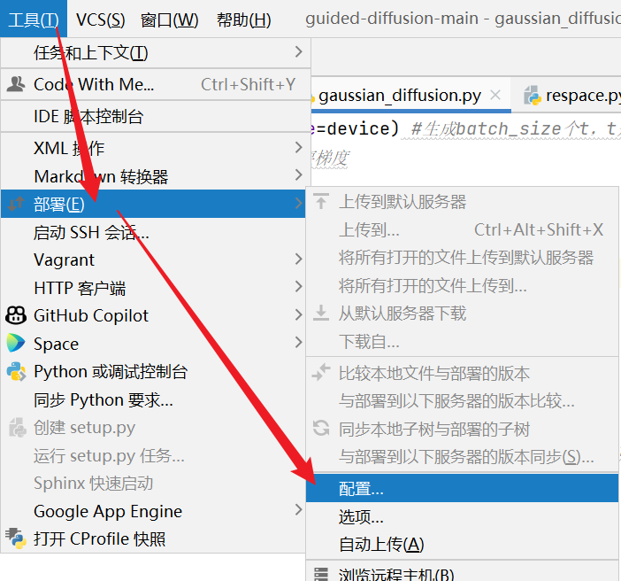

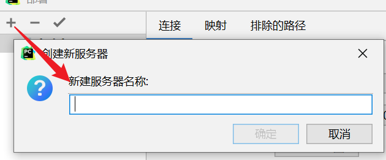

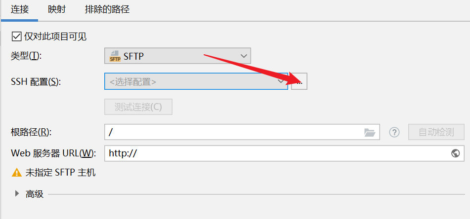

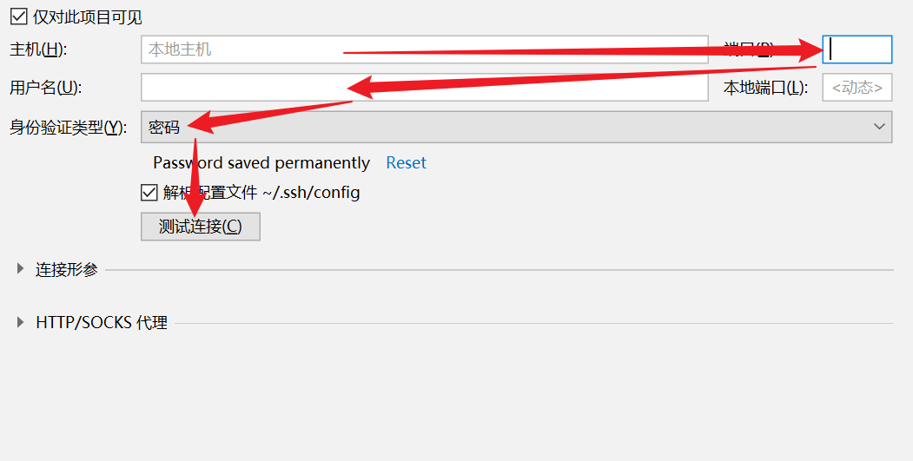

测试成功即可。

## 2. 打开服务器

- 打开终端

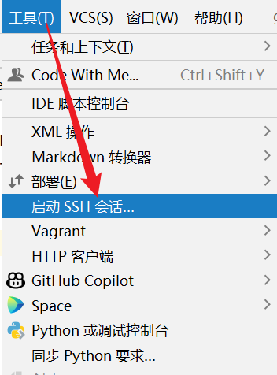

-  打开文件

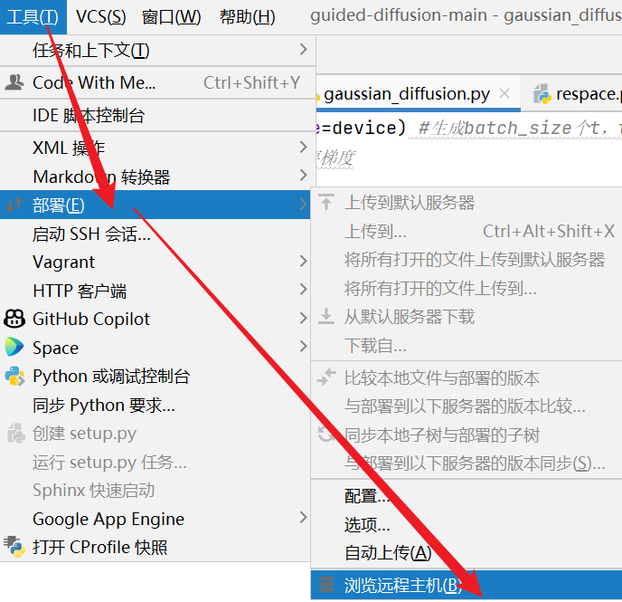

右侧就会显示。如果你想显示特定目录，请在连接的时候填写根路径。

## 3. 使用服务器运行代码

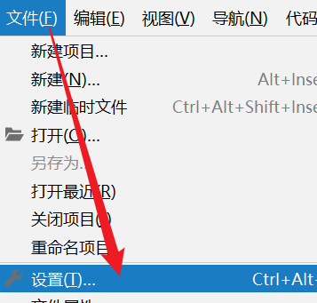

  

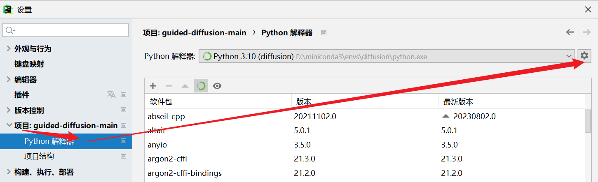

  

点击添加。

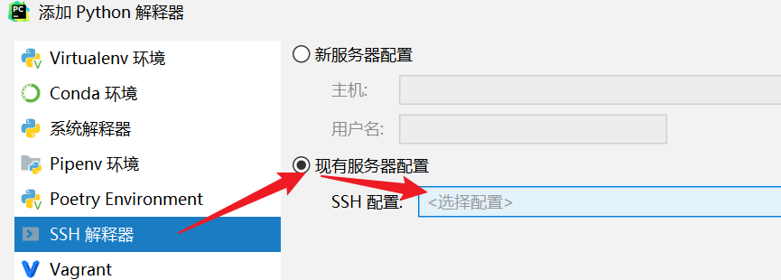

  

选择你的python解释器路径（通常在虚拟环境的/bin/python文件

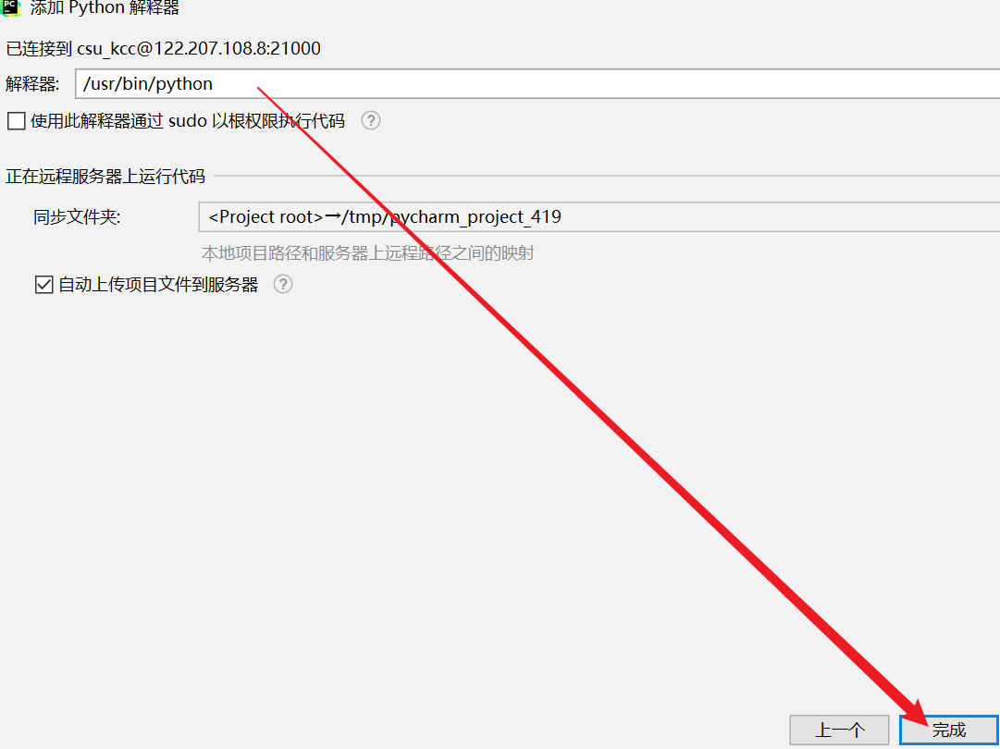

  

点击右下角即可更改python解释器。

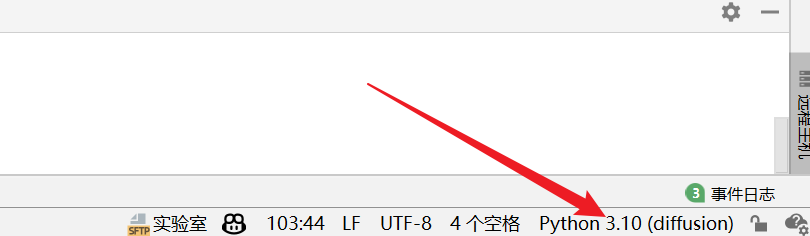

  

