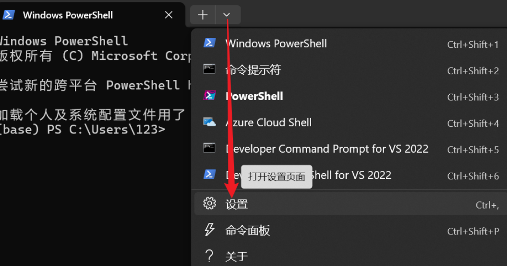
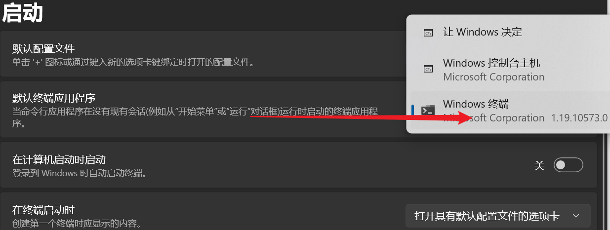

#

 <!--more-->

#  1. Windows powershell美化

- windows powershell编辑文件时颜色看不清（比如写python文件时，import语句看不见）

## 1. 微软商店下载windows terminal







# 2. powershell无法使用conda命令：

- 管理员启动powershell

  ```bash
  set-ExecutionPolicy RemoteSigned
  conda init powershell
  ```

  

# 3. 更改终端编码

- 临时更改：

  ```shell
  chcp 936 #GBK
  chcp 65001 #utf8
  ```

- 永久更改：

  - （略）更改注册表：` HKEY_CURRENT_USER\Console%SystemRoot%_system32_cmd.exe `

  - 更改配置文件：

    - 方法1，更改页面显示编码：powershell输入：

       ```shell
       Add-Content -Path $PROFILE -Value "`nchcp 936"
       ```

    - 方法2，更改powershell编码行为：powershell输入：
    
       ```shell
       Add-Content -Path $PROFILE -Value "`n[Console]::OutputEncoding = [System.Text.Encoding]::GetEncoding('GBK')`n[Console]::InputEncoding = [System.Text.Encoding]::GetEncoding('GBK')"
       ```
    
       