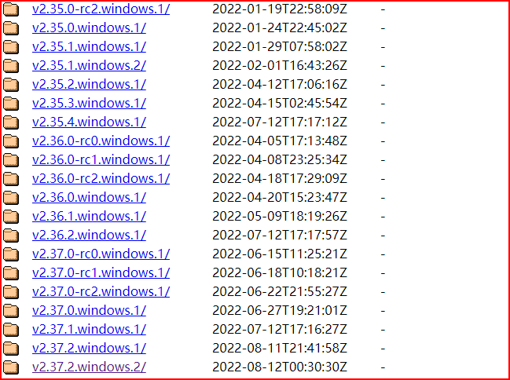
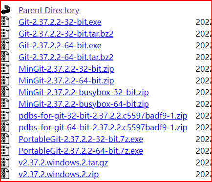
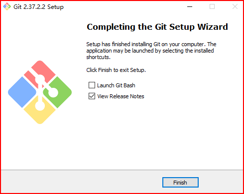
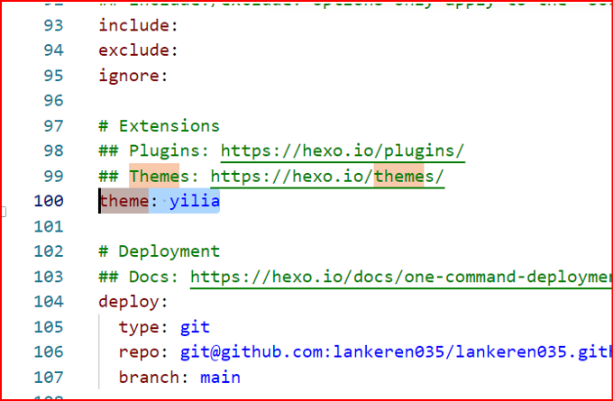

#

 <!-- more --> 

## 1.安装git

- 输入网址https://npm.taobao.org/mirrors/git-for-windows/（你也可以去官网下载）
- 点击你想下载的版本


- 下载exe文件


- 一路next即可



## 2.  准备 GitHub 仓库 

- 登录 GitHub → 新建仓库（比如命名 `test`）→ 仓库类型选public或private都行。

- 记住仓库地址：`https://github.com/lankeren035/test.git`。

## 3. 获取hexo模板

```shell
# 克隆模板到本地
git clone https://github.com/hexojs/hexo-starter.git my-hexo-blog
cd my-hexo-blog

# 删除模板自带的.git（避免和你的GitHub仓库冲突）
rm -rf .git  # Windows 用：rd /s /q .git

```

## 3. 关联github仓库

```shell
# 初始化git
git init
# 关联远程仓库（替换成你的仓库地址）
git remote add origin https://github.com/lankeren035/test.git

# 暂存修改
git add .
# 提交（备注改内容）
git commit -m "写了第一篇博客"
# 推到main分支
git branch -M main #Git 默认分支名在不同环境下有差异 —— 本地初始化后是 master，但 GitHub/Vercel 现在默认用 main
git push -u origin main
```


## 4.操作博客

- 新建博客：hexo n "test1.md"(保存在了blog\test\source\_posts\test1.md)（也可直接在该目录下新建.md文件）
- 编辑博客：使用vscode/typora等


## 5. Vercel 绑定 GitHub 仓库 

-  登录 Vercel：https://vercel.com/ 

- 创建一个账号，关联到github（可以通过github创建账号）

-  Application Preset 选择hexo，然后deploy就行。

- 这就相当于创建了一个项目，下面继续即可进入项目的设置界面，我们希望项目路径用一个自己的名字

  - 左侧domains，选择这条项目，edit，将域名路径改成自己的：`lankerentest.vercel.app`

- 后续你只需要在本地将源码上传到github这个仓库，他就会自动生成静态文件构建博客页面。

- 如果你发现提交github代码之后，用他原始的链接名字可以访问最新的，而用你自己改的名字（lankerentest.vercel.app）不是最新的，那可能是你的代码提交到preview版本，而preview连接到你的main分支；同时你的自定义链接（lankerentest.vercel.app）由于是production版本，它默认可能对应了别的分支，这时你需要将他对应的分支改成main：

  - 进入项目 → `Settings` → `Environments` → `Production` → `Branch Tracking` → 选 `main` → 保存。

    以后推 `main` 分支会自动部署为 Production，无需手动操作。

  - 

## 7.换主题

- 找到目标主题：github.com/litten/hexo-theme-yilia
- 命令行输入：`git clone https://github.com/litten/hexo-theme-yilia.git themes/yilia`则会在theme下创建yilia文件夹
- 在_config.yml中将theme后的改为yilia


- hexo g再hexo s通过本地看看
- 最后hexo d再把远端的也更新了