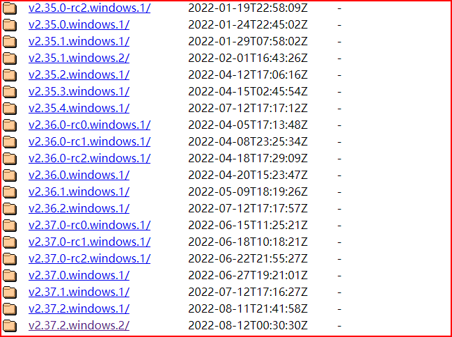
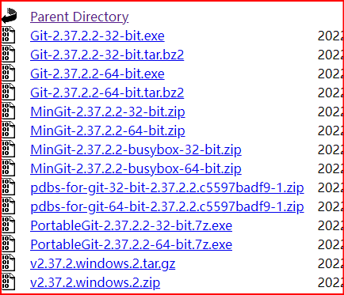
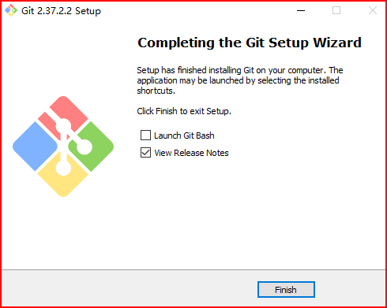
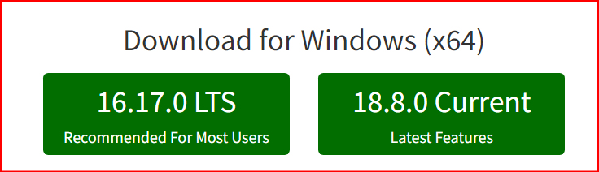
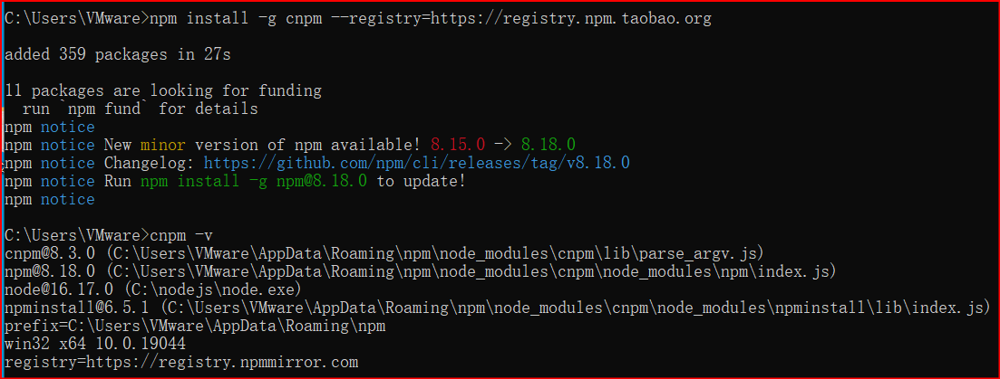
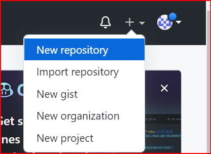
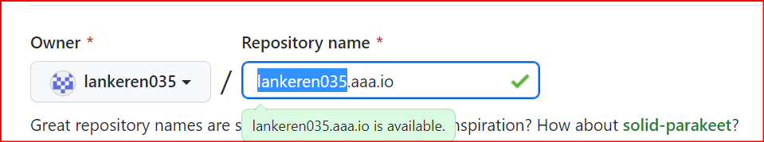
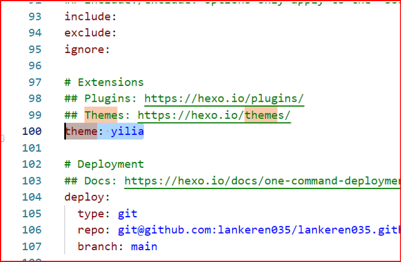

#

 <!-- more --> 

## 1.安装git

- 输入网址https://npm.taobao.org/mirrors/git-for-windows/（你也可以去官网下载）
- 点击你想下载的版本


- 下载exe文件


- 一路next即可


## 2.安装nodejs
- 输入网址：nodejs.org
- 按装左边长期支持版本


- 安装点击next即可
## 3.通过cnpm安装hexo
- 进入控制台使用管理员身份

- 输入：`npm install -g cnpm --registry=https://registry.npm.taobao.org`<回车>
  
  

  - 如果显示淘宝镜像过期输入：

    ```bash
    npm cache clean --force
    npm config set registry https://registry.npmmirror.com
    npm install -g cnpm
    ```

  - 如果显示:
    ```bash
    npm error code ERR_INVALID_URL
    npm error Invalid URL
    ````
    则需要设置代理:
    ```bash
    npm config delete proxy
    npm config delete https-proxy
    npm config set  proxy http://127.0.0.1:7890
    npm config set  https-proxy http://127.0.0.1:7890
    ```
    

- 输入：`cnpm install -g hexo-cli`<回车>
## 4.搭建博客
- 创建一个空文件夹(d:/blog/test)
- 进入该文件夹：cd /d d:/blog/test<回车>
- 初始化：hexo init<回车>
- 打开：hexo s<回车>
- 浏览器访问：http://localhost:4000/
- 命令行点击ctr+c输入y<回车>即可关闭
## 5.操作博客
- 新建博客：hexo n "test1.md"(保存在了blog\test\source\_posts\test1.md)（也可直接在该目录下新建.md文件）
- 编辑博客：使用vscode/typora等
## 6.将博客部署到GitHub
- 登录GitHub
- 新建仓库


- 注意前面部分要跟自己的名字一样（以后通过


- 安装插件：命令行输入：`cnpm install --save hexo-deployer-git`
- 找到_config.yml文件,将最后面加上：
```
type: git
  repo: git@github.com:lankeren035/lankeren035.github.io.git
  branch: main
```
- 输入hexo d即可部署到远端（在test文件夹下）
- 浏览器输入仓库名：lankeren035.github.io即可访问

## 7.换主题
- 找到目标主题：github.com/litten/hexo-theme-yilia
- 命令行输入：`git clone https://github.com/litten/hexo-theme-yilia.git themes/yilia`则会在theme下创建yilia文件夹
- 在_config.yml中将theme后的改为yilia


- hexo g再hexo s通过本地看看
- 最后hexo d再把远端的也更新了