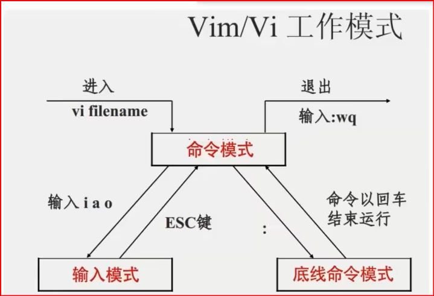
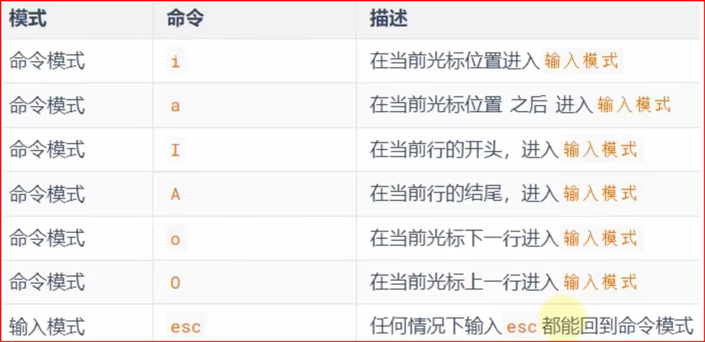
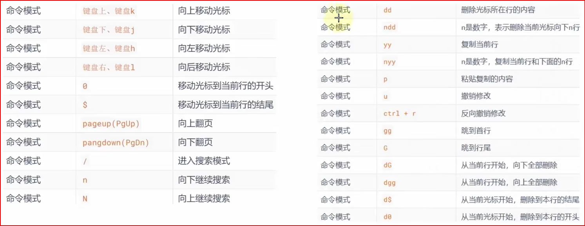
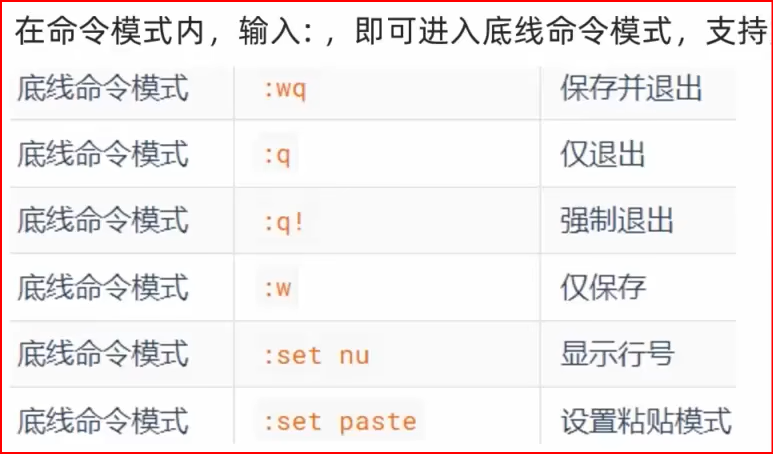

#

<!--more-->

# 1 基础命令

| 显示                   | ls -alh 路径                             |
| ---------------------- | ---------------------------------------- |
| 打开路径               | <a href='#cd'>cd 路径</a>                |
| 显示工作路径           | <a href='#pwd'>pwd</a>                    |
| 创建文件夹             | <a href='#mkdir'>mkdir -p 路径</a>          |
| 创建文件               | <a href='#touch'>touch 路径</a>             |
| 查看文件（也可写入）     | <a href='#cat'>cat 路径</a>               |
| 分页查看               | <a href='#more'>more 路径  </a>            |
| 复制                   | <a href='#cp'>cp -r 源 目的  </a>        |
| 移动文件               | <a href='#mv'>mv 源 目的（可重命名</a>） |
| 删除文件               | <a href='#rm'>rm -rf 路径</a>            |
| 文件中通过关键字搜索行 | <a href='#grep'>grep -n 关键字 路径 </a>   |
| 文件内容统计           | <a href='#wc'>wc -cmlw 路径   </a>       |
| 查看命令源文件         | <a href='#which'>which 命令 </a>            |
| 搜索文件               | <a href='#find'>find 起始路径 -name "test"  </a> |
| 打印                   | <a href='#echo'>echo</a>                   |
| 从尾部查看             | <a href='#tail'>tail -f -数字 路径  </a>   |
| 编辑文件               | <a href='#vi'>vi 路径</a>                |


## 1. 目录结构

根目录：/
```
/home/hellow/test.txt

```

## 2. 小tip

### 2-1 特殊符号

- . 当前目录

- .. 上级目录

- ~ home
- `作为命令执行
### 2-2 进入root用户

- 进入
```
su - root

123456
```
- 退出
```
exit
```
### 2-3管道符
```
|
cat 1.txt | grep "hello"
```
- 左边结果作为右边的输入

### 2-4重定向符
\>：右边文件内容清空，左边内容写入文件

\>>：追加
## 3. 命令
命令 [选项] [参数]
### <span id='ls'>1. ls命令（显示内容）</span>

`ls [-a -l -h] [路径]`

- a: all，列出全部文件（包括隐藏文件）
- l: list，以列表展现（权限，用户和用户组，大小，创建日期）
- h: 以易于阅读的形式，列出文件大小（搭配-l)
- 组合使用：如-la

### 2. <span id='cd'>cd命令（change directory）</span>

`cd [路径]`

- cd 回到用户HOME目录
- cd ../.. 返回上两级
- cd 路径
### <span id='pwd'>3. pwd命令（print work directory）</span>

`pwd`

### 4. <span id='mkdir'>mkdir命令（make directory）</span>

`mkdir [-p] 路径`

- 多层创建
### 5. <span id='touch'>touch命令（创建文件）</span>

`touch 路径`

### 6. <span id='cat'>cat命令（查看文件）</span>

`cat 路径`

- 将下列内容写入指定文件， `<<` 是 Bash 中的 "here document" 操作符，用来告诉 shell，从当前位置开始读取数据，直到遇到指定的结束标记（在这里是 `EOF`）。 

    ```shell
    cat << EOF >/mydata/redis/node-1/conf/redis.conf
    port 6379
    bind 0.0.0.0
    EOF
    ```


### <span id='more'>7. more命令（查看文件）</span>

`more 路径`（分页看，空格下一页，q退出）

### 8. <span id='cp'>cp命令（copy）</span>

`cp [-r] 源路径 目的地`

- r 递归，用于文件夹的复制
### 9. <span id='mv'>mv命令（move）</span>

`mv 源路径 目的地/（可重命名`）

### 10. <span id='rm'>rm命令（remove）</span>

`rm [-r -f] 参数1 参数2...`

- r 递归，用于删除文件夹
- f (force)强制删除
- 支持通配符：test* 表示以test开头
### 11. <span id='grep'>grep命令（文件中通过关键字搜索行）</span>

`grep [-n] "关键字" 文件路径`

- n：结果中显示行号
- 关键字：用于查找
- 路径：可做输入端口
### 12. <span id='wc'>wc命令（文件内容统计）</span>

`wc [-cmlw] 文件路径`

- c：统计bytes数量
- m：统计字符数量
- l：统计行数
- w：统计单词数
- 路径：可做输入端口
### 13. <span id='which'>which命令（查看命令的源文件）</span>

`which Linux命令`
### 14. <span id='find'>find命令（文件搜索）</span>
```
find 起始路径 -name "test*"
find 起始路径 -size +100k(大于100kb)
```
### 15. <span id='echo'>echo命令（打印）</span>

`echo 输出内容`

- echo `pwd：'的作用：将pwd作为命令执行
### 16. <span id='tail'>tail命令（从尾部查看）</span>

`tail [-f -数字] 路径`

- f 持续跟踪(会实时刷新)
- 数字 查看多少行（默认10）

## 4. <span id='vi'>vim编辑器</span>
```
vi 文件路径

vim 文件路径
```
- vim是vi的升级版  







## 5. <span id='help'>帮助</span>

`命令 --help`

- 查看用法

man 命令

- 操作手册