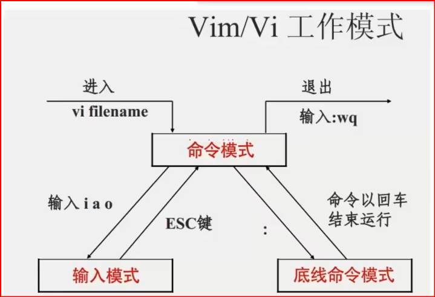

#

<!--more-->

## 1. 目录结构

根目录：/

```
/home/hellow/test.txt
```


## 2. 小tip
### 2-1 特殊符号
- . 当前目录

- .. 上级目录

- ~ home
- `作为命令执行
### 2-2 进入root用户
- 进入

```
su - root
123456
```

- 退出
```
exit
```
### 2-3管道符
```
|
cat 1.txt | grep "hello"
```

### 2-4重定向符
\>：右边文件内容清空，左边内容写入文件

\>>：追加
## 3. 命令
命令 [选项] [参数]
### 1. ls命令（显示内容）

`ls [-a -l -h] [路径]`

- a: all，列出全部文件（包括隐藏文件）
- l: list，以列表展现（权限，用户和用户组，大小，创建日期）
- h: 以易于阅读的形式，列出文件大小（搭配-l)
- 组合使用：如-la
### 2. cd命令（change directory)
`cd [路径]`

- cd 回到用户HOME目录
- cd ../.. 返回上两级
- cd 路径
### 3. pwd命令（print work directory)
`pwd`

### 4. mkdir命令（make directory)
`mkdir [-p] 路径`

- 多层创建
### 5. touch命令（创建文件）
`touch 路径`

### 6. cat命令（查看文件）
`cat 路径`

### 7. more命令（查看文件）
`more 路径`（分页看，空格下一页，q退出）

### 8. cp命令（copy)
`cp [-r] 源路径 目的地`

- r 递归，用于文件夹的复制
### 9. mv命令（move)
`mv 源路径 目的地/（可重命名）`

### 10. rm命令（remove)
`rm [-r -f] 参数1 参数2...`

- r 递归，用于删除文件夹
- f (force)强制删除
- 支持通配符：test* 表示以test开头
### 11. grep命令（文件中通过关键字搜索行）
`grep [-n] "关键字" 文件路径`

- n：结果中显示行号
- 关键字：用于查找
- 路径：可做输入端口
### 12. wc命令（文件内容统计）
`wc [-cmlw] 文件路径`

- c：统计bytes数量
- m：统计字符数量
- l：统计行数
- w：统计单词数
- 路径：可做输入端口
### 13. which命令（查看命令的源文件）
`which Linux命令`

### 14. find命令（文件搜索）
```
find 起始路径 -name "test*"
find 起始路径 -size +100k(大于100kb)
```
### 15. echo命令（打印）

`echo 输出内容`

- echo `pwd`：将pwd作为命令执行
### 16. tail命令（从尾部查看）
`tail [-f -数字] 路径`

- f 持续跟踪
- 数字 查看多少行（默认10）

## 4. vim编辑器
vi 文件路径

vim 文件路径





