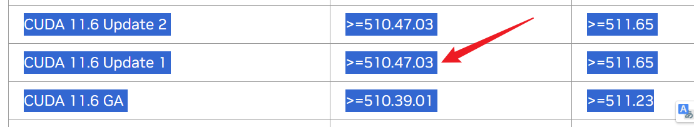
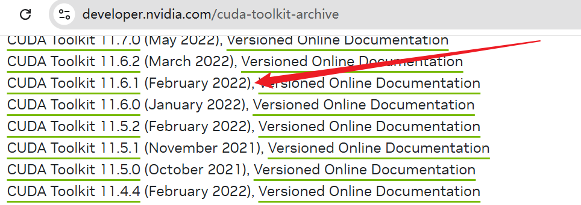
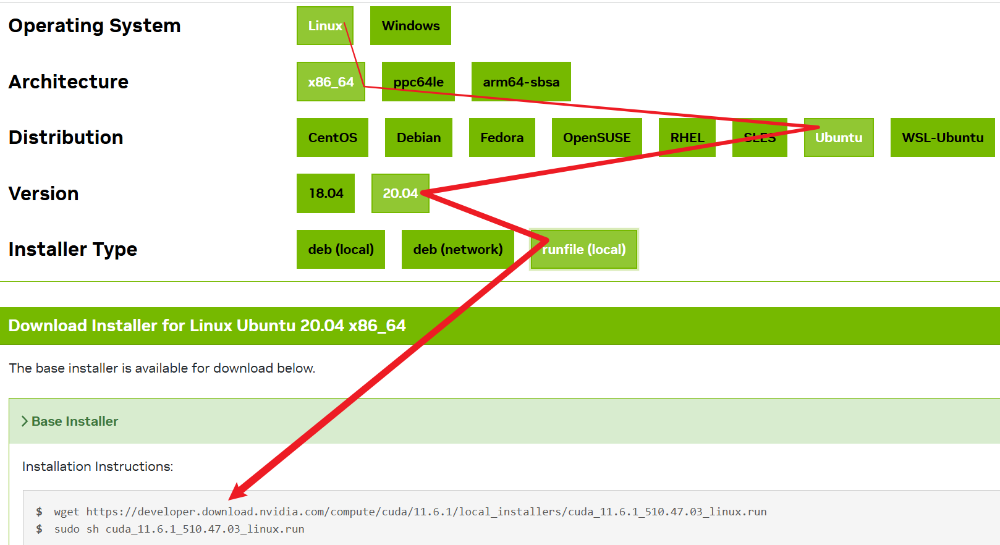
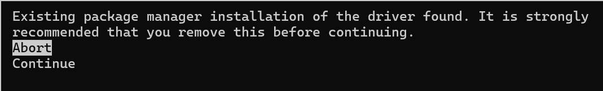
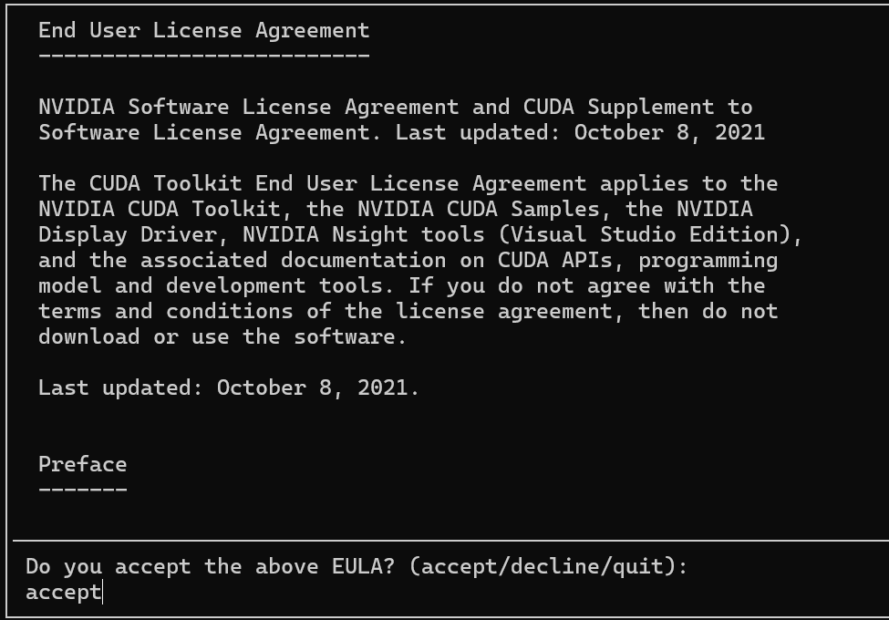
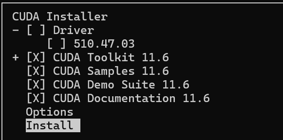
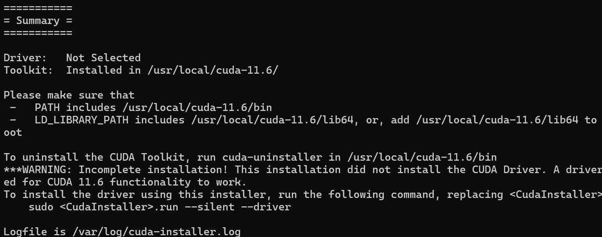
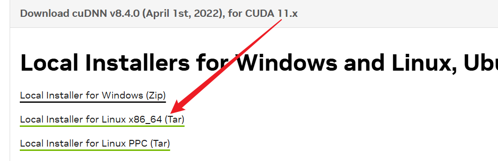

#

<!--more-->


# Linux中使用多个版本CUDA

- 跑代码发现需要使用cuda 11，在服务器上为了不影响其他用户，需要安装多个CUDA然后自行切换。

# 1. 下载对应版本CUDA

- 查看驱动版本

  ```shell
  nvidia-smi
  ```

  ```
  Driver Version: 535.183.01
  ```

- [查看对应cuda版本](https://docs.nvidia.com/cuda/cuda-toolkit-release-notes/index.html)： https://docs.nvidia.com/cuda/cuda-toolkit-release-notes/index.html 表三查看：

  

  

  - 版本符合

- [下载目标版本CUDA](https://developer.nvidia.com/cuda-toolkit-archive)：

  

  

  1. 根据你的环境选择：

  

  

  - 可以这样查看系统参数：

    ```shell
    uname -a
    ```

    ```
    Linux user-SYS-740GP-TNRT 5.15.0-125-generic #135~20.04.1-Ubuntu SMP Mon Oct 7 13:56:22 UTC 2024 x86_64 x86_64 x86_64 GNU/Linux
    ```

  2. 下载安装（换成你自己的地址）

     ```shell
     wget https://developer.download.nvidia.com/compute/cuda/11.6.1/local_installers/cuda_11.6.1_510.47.03_linux.run
     sudo sh cuda_11.6.1_510.47.03_linux.run
     ```

     - 点击向下按钮，然后enter继续安装

       

       

     - 输入accept然后enter

       

       

     - 看见选择页面，定位到Driver选项，点击enter取消勾选（前面带X表示勾选，**如果勾选他会把你现有的驱动替换**），定位到install然后enter

       

       

     - 安装成功：

       

       

# 2. 安装对应的 **cuDNN**  

- [查看对应版本]( https://developer.nvidia.com/cudnn-archive )： https://developer.nvidia.com/cudnn-archive ，点击展开即可查看对应版本：

  

  

- 下载压缩包（该步骤需要登录，所以这里选择在本地电脑下载压缩包然后上传服务器）：

  

  

- 解压安装（换成自己的文件名，版本号）

  ```shell
  tar -xvf cudnn-linux-x86_64-8.4.0.27_cuda11.6-archive.tar.xz #解压
  sudo cp cudnn-*-archive/include/cudnn*.h /usr/local/cuda-11.6/include
  sudo cp -P cudnn-*-archive/lib/libcudnn* /usr/local/cuda-11.6/lib64
  sudo chmod a+r /usr/local/cuda-11.6/include/cudnn*.h /usr/local/cuda-11.6/lib64/libcudnn*
  ```

  

# 3. 编写一个脚本更换CUDA

```shell
vim ~/.bashrc
```

- 写入：

  ```shell
  # 影响所有用户
  #export PATH=$PATH:/usr/local/cuda/bin
  #export LD_LIBRARY_PATH=$LD_LIBRARY_PATH:/usr/local/cuda/lib64
  #function switch_cuda {
  #    if [[ $1 =~ ^[0-9]+\.[0-9]+$ ]]; then
  #        sudo rm /usr/local/cuda
  #        sudo ln -s /usr/local/cuda-$1 /usr/local/cuda
  #        nvcc --version
  #    else
  #        echo invalid version
  #    fi
  #}
  
  # 只改变当前用户的CUDA版本
  export PATH=/usr/local/cuda-11.6/bin:$PATH
  export LD_LIBRARY_PATH=/usr/local/cuda-11.6/lib64:$LD_LIBRARY_PATH
  
  function switch_cuda {
      if [[ $1 =~ ^[0-9]+\.[0-9]+$ ]]; then
          export PATH=/usr/local/cuda-$1/bin:$PATH
          export LD_LIBRARY_PATH=/usr/local/cuda-$1/lib64:$LD_LIBRARY_PATH
          nvcc --version
      else
          echo "Invalid version"
      fi
  }
  ```

- 刷新终端

  ```shell
  source ~/.bashrc
  ```

- 更换CUDA

  ```shell
  switch_cuda 11.6
  #switch_cuda 12.0
  ```

  