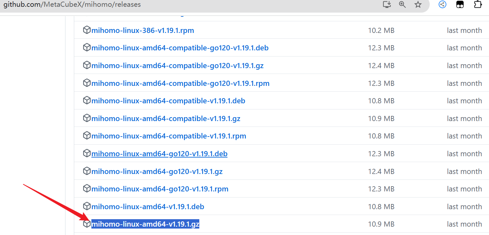
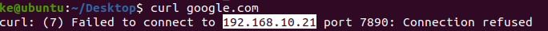
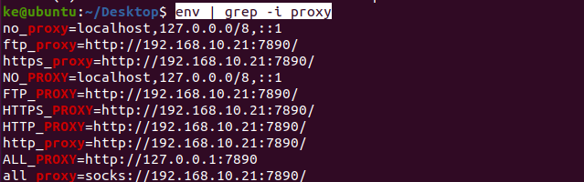

#

<!--more-->


#  Linux中使用clash代理

- 你需要访问github

## 1. 下载软件

- 这里使用的是Clash Meta

- [下载地址](https://github.com/MetaCubeX/mihomo/releases)

- 发现有很多版本，需要找到对应版本（通常是amd64）

  ```shell
  uname -m
  ```

  - 输出：

    - `x86_64`：表示 64 位 CPU 架构（适合 `amd64`）。

    - `i386` 或 `i686`：表示 32 位 CPU 架构（适合 `386`）。

    - `arm*`：表示 ARM 架构：

- 发现还有别的版本：
  - **普通版本**：适合大多数现代系统，推荐首先尝试此版本。
  - **`go120` 版本**：使用 Go 1.20 编译的版本。如果你的系统有更高的要求（如高性能需求），可以选择这个版本。
  - **`compatible` 版本**：提供对旧系统或依赖的兼容性支持。如果普通版本运行报错，可以尝试这个版本。

- 这里选择[普通版本：](https://github.com/MetaCubeX/mihomo/releases/download/v1.19.1/mihomo-linux-amd64-v1.19.1.gz)

  

  


## 2. 运行

```shell
gzip -d mihomo-linux-amd64-v1.19.1.gz #解压gz文件，注意文件名
sudo mkdir /opt/clash
sudo mv mihomo-linux-amd64-v1.19.1 /opt/clash/ #额外安装的软件一般放在 /opt下面
cd /opt/clash/
sudo mkdir /opt/clash/conf #放置配置文件

sudo curl -o /opt/clash/conf/config.yaml "订阅链接" #下载你的订阅链接，或者手动将配置文件内容写到/opt/clash/conf/config.yaml里面
./mihomo-linux-amd64-v1.19.1 -d ./conf #运行这个文件，并指明配置文件路径

```

- 出现错误：

  ```shell
  ERRO[2025-01-25T23:19:50.495547417-08:00] can't initial GeoIP: can't download MMDB: Get "https://github.com/MetaCubeX/meta-rules-dat/releases/download/latest/geoip.metadb": EOF 
  FATA[2025-01-25T23:19:50.495820572-08:00] Parse config error: rules[1475] [GEOIP,CN,DIRECT] error: can't download MMDB: Get "https://github.com/MetaCubeX/meta-rules-dat/releases/download/latest/geoip.metadb": EOF
  ```

- [手动下载该文件](https://github.com/MetaCubeX/meta-rules-dat)，下载[geoip.metadb](https://github.com/MetaCubeX/meta-rules-dat/releases/download/latest/geoip.metadb)放到`/opt/clash/conf`中

- 再次运行即可：

  ```shell
  ./mihomo-linux-amd64-v1.19.1 -d ./conf
  ```

- 在终端设置代理

  ```shell
  export ALL_PROXY="http://127.0.0.1:7890"
  curl huggingface.co #测试代理
  ```

- 发现测试不成功（地址好像不对）：

  

  

  - 检查环境变量：

    ```shell
    env | grep -i proxy
    ```

  - 发现很多冲突的环境变量：

    

    

  - 重新设置

    ```shell
    unset ALL_PROXY
    unset all_proxy
    unset HTTP_PROXY
    unset http_proxy
    unset HTTPS_PROXY
    unset https_proxy
    unset FTP_PROXY
    unset ftp_proxy
    unset NO_PROXY
    unset no_proxy
    unset all_PROXY
    export ALL_PROXY="http://127.0.0.1:7890"
    ```

    

## 3. 创建服务

- 创建服务文件：

  ```shell
  sudo vi /etc/systemd/system/clash.service
  ```

- 写入如下内容：

  ```shell
  [Service]
  Type=simple
  ExecStart=/opt/clash/mihomo-linux-amd64-v1.19.11 -d /opt/clash/conf
  Restart=always
  # 注释掉User/Group，跳过身份切换
  # User=用户名
  # Group=用户组
  LimitNOFILE=65535
  # 关闭ProtectHome防护，解决systemd级别的访问限制
  ProtectHome=no
  ```

- 启动服务

  ```shell
  sudo systemctl daemon-reload #重新加载 Systemd 配置
  sudo systemctl start clash #启动服务
  sudo systemctl status clash #检查服务状态
  
  ```

  - 如果运行的时候发生`(code=exited, status=217/USER)`，可以看看是不是已经有了这个服务，先删除这个文件（`/lib/systemd/system/clash.service`）或者是服务代码中的用户名或者用户组不对，可以注释掉，也有可能服务运行5此后系统给限制了。

  - 停止服务

    ```shell
    sudo systemctl stop clash
    ```

    

- 开机自启动

  ```shell
  sudo systemctl enable clash
  ```

- 每次开机需要重新设置环境变量：

  ```shell
  echo 'export ALL_PROXY=http://127.0.0.1:7890' >> ~/.bashrc #每次开启终端就会自动创建
  ```

  

