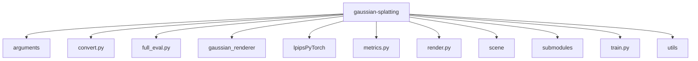

## 1. 总览

- 项目根目录：`C:\Users\admin\Desktop\code\gaussian-splatting`
- 扫描文件数：`1520`
- 代码文件数：`550`
- 类数量：`49`
- 函数 / 方法数量：`3151`

## 2. 顶层目录统计

| 顶层目录 | 文件数 | 代码文件数 | 类数 | 函数/方法数 |
|---|---|---|---|---|
| arguments | 1 | 1 | 5 | 7 |
| convert.py | 1 | 1 | 0 | 0 |
| full_eval.py | 1 | 1 | 0 | 0 |
| gaussian_renderer | 2 | 2 | 0 | 6 |
| lpipsPyTorch | 4 | 4 | 6 | 14 |
| metrics.py | 1 | 1 | 0 | 3 |
| render.py | 1 | 1 | 0 | 3 |
| scene | 5 | 5 | 7 | 55 |
| submodules | 1494 | 524 | 28 | 3004 |
| train.py | 1 | 1 | 0 | 4 |
| utils | 9 | 9 | 3 | 55 |

## 3. 粗粒度结构图

## 4. 使用建议

1. 先从本文件查看顶层目录划分。
2. 再进入 `files/` 看每个文件包含哪些类和函数。
3. 然后进入 `modules/` / `functions/` 补全具体逻辑解释。
4. 如果后续你手动画了调用图、训练流程图、数据流图，可以继续放到 `maps/` 目录下。
