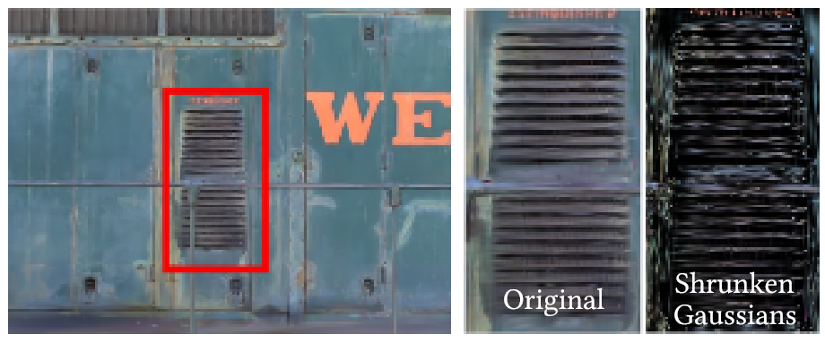
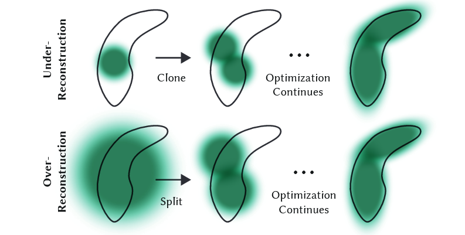
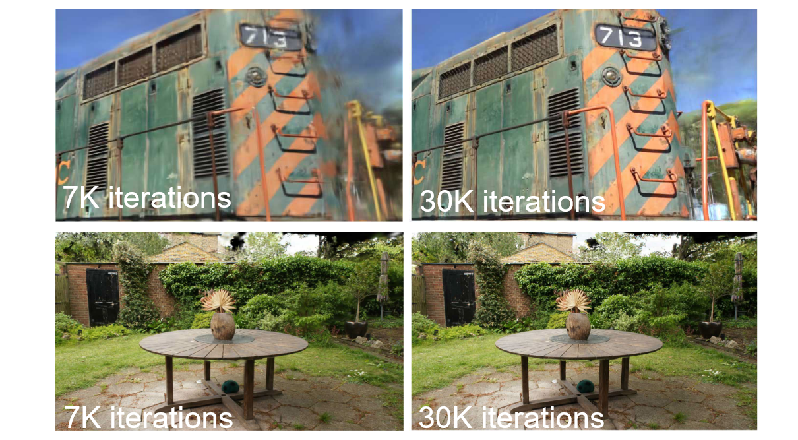
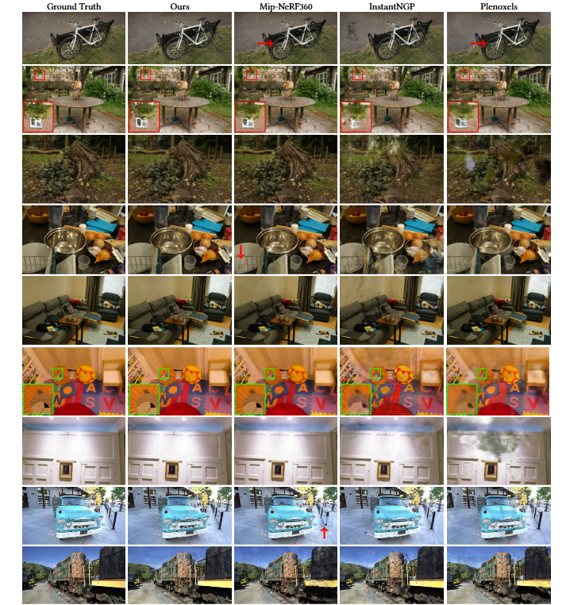
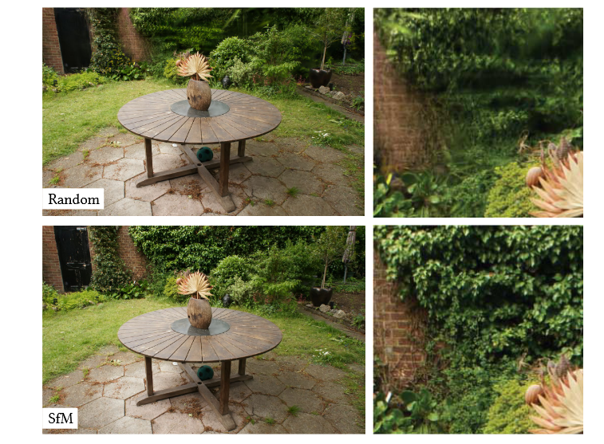
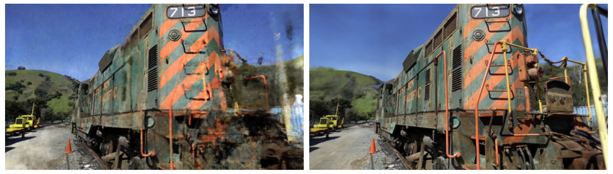
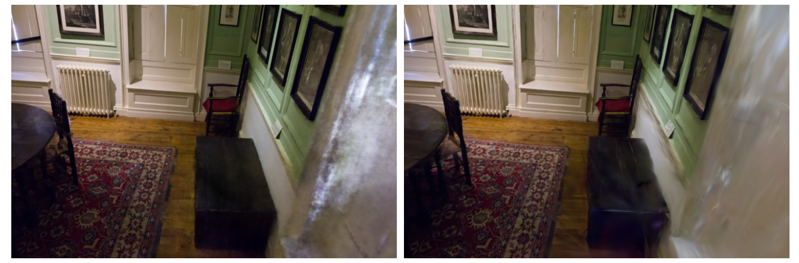
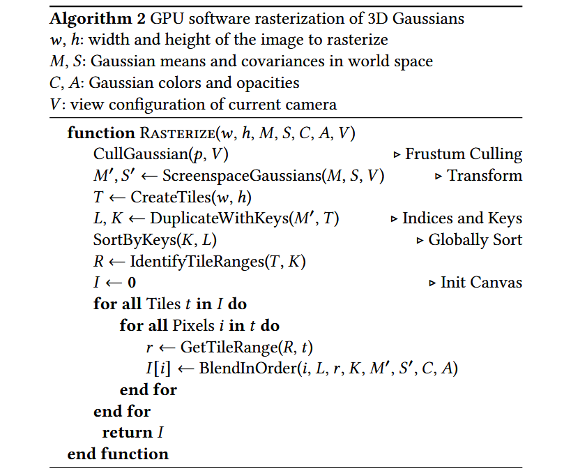

#
<!--more-->

## 0. Abstract

辐射场方法（Radiance Field methods）最近在**多张照片或视频捕捉的场景**的**新视图合成**方面实现了革命性进展。然而，实现高视觉质量仍然需要训练和渲染成本高昂的神经网络，而**最近的快速方法不可避免地以速度换取质量**。对于无界和完整的场景（而非孤立物体）以及1080p分辨率渲染，目前没有任何方法能够实现实时显示速度。我们引入了三个关键元素，使我们能够在保持竞争性训练时间的同时实现最先进的视觉质量，并且重要的是能够在1080p分辨率下进行高质量实时（≥30fps）新视图合成。首先，从**相机标定过程（camera calibration）**中产生的稀疏点云开始，我们用3D高斯来表示场景，这**保留了连续体积辐射场在场景优化中所需的特性，同时避免了在空白区域的不必要计算**；其次，我们对3D高斯进行**交错的优化/密度控制**，特别是**优化各向异性协方差**，以实现对场景的准确表示；第三，我们开发了一种**快速的可见性感知渲染算法**，支持各向异性喷溅，并加速训练并允许实时渲染。我们在多个已建立的数据集上展示了最先进的视觉质量和实时渲染。

>- 传统的方法需要训练和渲染成本高的神经网络，速度慢
>
>- 本文方法能兼顾质量与速度双先进，三个创新点：
>
>  - 1. 通过稀疏点云获得的高斯来表示场景.  
>    2. 交错的优化/密度控制  
>    3. 快速的可见性感知渲染算法
>
>- 

&#9660 这里一开始提到的Radiance Field methods指的是什么？他和NeRF有什么区别嘛？
 <ul> <li>“Radiance Field（辐射场）方法”是一大类新视角合成技术，它们把场景表示成连续的体密度与颜色/辐射函数，并通过**体渲染（ray marching/α-合成）**沿视线积累颜色来成像。NeRF 是其中最知名的一种，但不是全部。论文回顾里明确指出：早期方法用连续可微的密度场做体渲染，NeRF 通过重要性采样与位置编码提升质量，但因为使用大 MLP，训练/渲染都很慢；后续又出现了像 Plenoxels（稀疏体素格）、Instant-NGP（哈希格+小 MLP）等更快的“辐射场”变体。具体可以参考NeRF中的体渲染：</li>  <li>这篇论文提出的 3D Gaussian Splatting (3DGS) 也属于“Radiance Field 方法”，但它不再用体素网格或 MLP 连续场去做射线积分，而是把场景表示为可微的 3D 高斯体元，投影到 2D 后用可见性排序+α-合成直接栅格化/“喷溅”出来——图像形成模型与 NeRF 的体渲染等价，但避免了空域采样开销，因此能在 1080p 达到实时帧率。</li>  <li> 一句话对比：NeRF=连续密度场+射线采样+（通常）MLP；Radiance Field 方法=包含 NeRF 在内的更大族群，也可以是体素/哈希网格/点或本论文的3D 高斯等显式表示，但都遵循类似的体渲染/α-合成成像原理。 </li>  </ul> 

>
>- 
  <ul> <li> 这里的 camera calibration 指多视图结构自运动（SfM）求解出的相机内外参（位姿/焦距等）的标定过程。在做 SfM 标定时，会顺带三角化出一批稀疏三维点云（sparse point cloud）——这些是由跨图像匹配到的特征点重建出来的“地标点”。论文把这一步称为“在相机标定期间估计的稀疏点云”。 </li>  </ul> 
&#9660 这里第一个点提到的camera calibration是什么，从这个过程产生的sparse points 又是什么？

## 1. Introduction

Mesh和点云是最常见的 3D 场景表示，因为它们是明确定义的，并且非常适合快速的 GPU/CUDA 基础光栅化。相比之下，最近的神经辐射场（NeRF）方法基于**连续场景表示**，通常使用**体积光线行进（volumetric ray-marching）**优化多层感知机（MLP），用于"被拍摄场景"的新视角合成。类似地，迄今为止最有效的辐射场解决方案通过插值存储在体素 [Fridovich-Keil 和 Yu et al. 2022]、哈希 [Müller et al. 2022] 网格或点 [Xu et al. 2022] 中的值来建立连续表示。虽然这些方法的连续特性有助于优化，但**渲染所需的随机采样是昂贵的，并且可能导致噪声**。我们提出了一种新方法，结合了**两者的优点**：我们的 3D 高斯表示允许以最先进的视觉质量和具有竞争力的训练时间进行优化，而我们的基于瓦片的喷溅解决方案确保在多个已发布的数据集上以最先进的质量实现 1080p 分辨率的实时渲染 [Barron et al. 2022; Hedman et al. 2018; Knapitsch et al. 2017]（见图 1）。

>- 

 &#9660 这里经常提到的“连续表示”是什么意思？
 <ul> <li> 这段里“continuous scene representations（连续表示）”指的不是“数据结构是连续排布的”，而是在三维空间（再加上视角维度）上定义了一个可在任意位置评价的函数/场：给定任意   $x \in \mathbb{ R } ^ 3 $（和方向 𝑑），都能返回密度 σ(x) 与颜色/辐射 𝑐(𝑥,𝑑)。NeRF 以及很多“快速辐射场”变体，训练/渲染时都是在任意位置取样这个场，因此被称为“连续表示”。论文开头就是在对比显式（explicit）的网格/点与连续的辐射场：前者适合光栅化、速度快；后者依赖体步进（volumetric ray-marching）优化 MLP 或网格/哈希/点上的特征来做新视角合成。 </li> </ul> 

>
>- 

 &#9660 这里提到的通过插值体素/哈希/网格/点云 得到的为什么是连续表示呢？比如点云是离散的，插值过后肯定也是离散的吧？ 
 <ul> <li> 虽然底层采样点/体素是离散的，但渲染/优化时并不是只在这些离散位置取值，而是用插值/核函数把离散样本扩展成对任意位置可评价的场。直觉上可写成一类通式：$F ( x ) = \sum_ k w_ k ( x ) v_ k$，其中$ v_k $是网格结点/体素/点的特征，$ w_ k ( x )$ 是关于连续坐标 x 的连续权重（如三线性插值权重、RBF/高斯核等）。因$ w_ k ( x )$ 随 x 连续变化， $F ( x ) $对任意 x 都有定义，于是形成（至少 $C^ 0$）连续的辐射/密度场。论文把这些方法都归为“建立在连续表示之上（by interpolating values stored in voxel/hash grids or points）”，并指出这种连续性有利于优化，但渲染时的随机/稀疏采样代价高、易有噪声。 </li> <li>离散样本 + 连续插值核 = 连续函数。离散的是存储，连续的是可评价的场</li></ul> 

>
>- 

 &#9660 是结合了Mesh/点云  与  NeRF二者的优点嘛？二者的优缺点分别是啥
<ul> <li>论文的“best of both worlds”指：既保留**连续体辐射场**带来的**可微/可优化**优势，又像**显式表示**那样能用**快速光栅化式流程**实时渲染。其做法是用**3D 高斯**作显式场景原语（一团一团“体元”），既**不依赖 MVS**的稠密几何，又能通过**tile-based splatting**按可见性排序做 **α-blending**，1080p 下实时，同时质量达 SOTA。 </li></ul>

>图1。我们的方法实现了实时渲染辐射场，其质量与之前最佳质量的方法相当[Barron et al. 2022]，同时所需的优化时间与最快三种以前的方法相当[Fridovich-Keil 和 Yu et al. 2022; Müller et al. 2022]。这种性能的关键在于一种新颖的3D高斯场景表示法，结合实时可微分渲染器，为场景优化和新颖视图合成提供了显著的加速。值得注意的是，对于与InstantNGP相当的训练时间[Müller et al. 2022]，我们获得的质量与其相似；虽然这是他们达到的最高质量，但通过训练51分钟，我们达到了最先进的质量，甚至略优于Mip-NeRF360[Barron et al. 2022]。

我们的目标是实现**对通过多张照片捕获的场景进行实时渲染**，并在典型真实场景中以与最有效的先前方法一样快的优化时间创建表示。最近的方法实现了快速训练[Fridovich-Keil and Yu et al. 2022; Müller et al. 2022]，但在达到当前SOTA NeRF方法所获得的视觉质量方面仍然存在挑战，例如Mip-NeRF360 [Barron et al. 2022]，其训练时间最长可达48小时。快速但质量较低的辐射场方法可以根据场景达到互动渲染时间（每秒10-15帧），但在高分辨率下无法实现实时渲染。

>- 这里 把**同属辐射场家族**的方法按**速度/质量的取舍**划分了两档： 
>- 1.  **高质量但慢（SOTA NeRF 类）**：例如 **Mip-NeRF360**，论文写到其**训练可达 48 小时**，**渲染约 10 秒/帧**，属于“质高但慢”的一类。 
>  2.  **快速但质量较低（加速的辐射场变体）**：例如 **Instant-NGP、Plenoxels** 等，用哈希/体素网格插值来加速训练/渲染，能到**交互级 10–15 fps**，但高分辨率实时和最终画质通常不及 SOTA NeRF。 

我们的解决方案建立在三个主要组件之上。我们

- 首先**引入3D高斯分布作为灵活且富有表现力的场景表示**。我们以与之前的类似NeRF方法相同的输入开始，即使用运动重建结构（SfM）[Snavely et al. 2006]进行标定的相机，并用SfM过程中产生的**稀疏点云初始化3D高斯分布的集合**。与大多数需要**多视图立体（MVS）数据**的点云解决方案[Aliev et al. 2020; Kopanas et al. 2021; Rückert et al. 2022]相比，我们**仅使用SfM点云作为输入就能实现高质量的结果**。值得注意的是，对于NeRF合成数据集，我们的方法即使在随机初始化的情况下仍然能够达到高质量。我们证明了3D高斯分布是一个极好的选择，因为它们是**可微分的体积表示**，同时也可以通过将其投射到2D并应用标准的**$\alpha$混合**（$\alpha - blending$），**使用与NeRF等效的图像形成模型非常高效地光栅化**。

  >- 

 &#9660 这里的“多视图立体（MVS）数据”是什么意思？
<ul><li>**MVS（Multi-View Stereo）是在已知相机参数（通常来自 SfM）的前提下，从多视角图像**估计稠密几何**（每张图的**稠密深度图/法线**、或融合后的**稠密点云/网格**）的技术。很多“点为基础”的神经渲染方法**直接把这些 MVS 几何当输入**（例如密点云或带法线的点/面片），再在其上学习外观。论文原文明确对比：多数点方法**需要 MVS 几何**，而本文只用 **SfM 的稀疏点**即可得到高质量结果，不依赖 MVS。</li> <li>  **SfM vs. MVS**：SfM 产出**相机参数 + 稀疏点云**（标定的“副产物”）；MVS 在此基础上再算**稠密**几何。本文输入是**SfM 标定与其稀疏点云**，从这些稀疏点**初始化 3D 高斯**再优化，无需额外的 MVS。  </li> </ul>

  >
  >- 

 &#9660 “本文证明了3D高斯分布是一个极好的选择，因为他们是可微分的体积表示” 这句话怎么理解？
  这句话包含三层含义： <ul> <li>  体积表示 （volumetric）<ul> <li> 每个高斯是 3D 空间中的体密度分布，而不是只在表面（mesh）上定义。论文用各向异性 3D 高斯：$G (x) = exp ( - \frac{ 1 }{ 2 } ( x - \mu ) ^ T \Sigma^ { -1 } ( x - \mu ) )$。再配合一个不透明度参数 α 参与合成。这样一簇高斯在体内形成连续密度场与（用 SH 表示的）方向相关颜色场。 </li> </ul>   </li>  <li> 可微（differentiable）<ul> <li> 前向渲染把 3D 高斯投影到 2D（得到各向异性“斑”/椭圆核），按可见性排序 + 标准 α-blending做体渲染等价的合成；整个过程对 高斯的均值 𝜇协方差 Σ/其因子化参数（尺度 + 旋转）、不透明度 𝛼、以及 SH 系数都是可导的，因此可用梯度下降直接用图像重建损失来优化这些参数（论文还给了导数细节与稳定参数化）。 </li> </ul> </li>  <li> 高效栅格化（rasterizable）<ul> <li> 因为原语是显式的 3D 高斯，可以走tile-based 的 splatting 光栅管线，在 GPU 上用快速排序做可见性控制，并跟踪合成过程中的累计 α 值来实现快速、准确的反向传播，从而兼顾训练效率与1080p 实时渲染。 </li> </ul> </li>  </ul> 一句话：3D 高斯既像连续体一样可微、可优化（有利于从多视图图像端到端学习），又像显式原语一样可被高效投影/栅格化（适配 GPU 实时渲染），这就是“兼得两者优点”的根本原因。 

- 我们方法的第二个组成部分是**对3D高斯分布属性的优化**——**3D位置、不透明度α、各向异性协方差和球面谐波（SH）系数**——与自适应密度控制步骤交错进行，在优化过程中添加和偶尔移除3D高斯分布。优化过程产生了一个相对紧凑、无结构且精确的场景表示（对于所有测试场景，包含100万到500万高斯分布）。

  > -  这其实就是**用损失驱动的可微优化过程**，但与传统“固定参数量”的网络不同，它还**动态改变表示的组成**（克隆/切分/剔除高斯），使得表示既能学外观，也能在训练中“长出/修正”几何。 

- 我们方法的第三个也是最后一个元素是我们的**实时渲染解决方案**，它使用快速的GPU排序算法，并受到基于块的光栅化的启发，遵循最近的研究[Lassner and Zollhofer 2021]。然而，得益于我们的3D高斯表示，我们能够执行**尊重可见性排序的各向异性溅射**——得益于排序和α混合——并通过跟踪所需的多个已排序溅射的遍历来实现快速而准确的反向传递。

综上所述，我们提供以下贡献：

- 引入各向异性**三维高斯**作为辐射场的高质量非结构化表示。  
- 一种**三维高斯属性的优化方法**，交替进行自适应密度控制，从而为捕获场景创建高质量表示。  
- 一种针对GPU的**快速可微渲染方法**，考虑可见性，允许各向异性喷溅和快速反向传播，以实现高质量的新视图合成

我们的结果基于之前发布的数据集，表明我们可以从多视角捕捉中优化我们的三维高斯，达到或超过之前最佳质量隐式辐射场方法的质量。我们还能够实现与最快方法相似的训练速度和质量，并且重要的是提供了第一种高质量的实时渲染，用于新视图合成。

## 2. Related Work

我们首先简要概述传统重建，然后讨论基于点的渲染和辐射场的研究，讨论它们的相似性；**辐射场**是一个广泛的领域，因此我们只关注直接相关的工作。有关该领域的全面覆盖，请参阅最近的优秀综述 [Tewari et al. 2022; Xie et al. 2022]。

### 2.1 传统场景重建与渲染

 最早的新视角合成方法基于光场：一开始需要密集采样的光场 [Gortler et al. 1996; Levoy and Hanrahan 1996]，后来也支持非规则采集 [Buehler et al. 2001]。 结构自运动（SfM）[Snavely et al. 2006] 的出现开启了一个全新方向——可以用一组照片来合成新视角。SfM 在相机标定过程中会估计出一个稀疏点云，最初只是用来做三维空间的简单可视化。随后，多视图立体（MVS）在这些年间发展出了令人印象深刻的完整三维重建算法 [Goesele et al. 2007]，从而催生了多种视图合成方法 [Chaurasia et al. 2013; Eisemann et al. 2008; Hedman et al. 2018; Kopanas et al. 2021]。 这些方法会把输入图像**重投影并混合**到目标相机视角里，并使用几何信息来引导重投影。它们在很多场景里效果很好，但通常**无法从未重建的区域彻底恢复**，或者在 MVS 产生了并不存在的几何（“过度重建”）时也会受影响。

> 

 &#9660 解释与要点 
 <ul> <li> 光场（Light Fields）阶段 <ul>
>    <li> 目标是采样并插值“从空间任意方向到达相机的辐射”（可理解成“把所有视角都拍下来”）。早期要求密集、规则的相机阵列；“非规则光场”允许相机位置不规则，但仍依赖足够密集的采样来做插值。 </li>    </ul></li> <li> SfM → 稀疏几何<ul>  <li> 基于多张互相有重叠的照片，估计出每张图的相机位姿与内参，并三角化出稀疏点云。这批点最初主要用于“在 3D 里看看相机和点的大概位置”，并不够表达细节。 </li>   </ul> </li> <li>MVS → 稠密几何 + 传统 IBR（图像重投影/混合）<ul> <li> 在已知相机的前提下，MVS 进一步估计稠密的深度/网格/点云。随后一类经典方法就用这份几何作为“代理”，把源图像按几何重投影到目标视角，再跨图像混合（加权、缝合、修补）。问题：1）未重建区域（如透明/反光/无纹理处）→ 重投影后会出现洞或拉伸。2）过度重建（MVS 产生了并不存在的表面/鬼面）→ 混合时会重影/糊边。这两类错误一旦出现在几何上，后续再怎么投影与融合都很难彻底抹平。  </li>   </ul></li> <li>神经渲染的优势 <ul><li> 用一个可微的场（如辐射场/体密度+颜色场）来表示场景，直接以重投影误差做端到端优化，对错误几何不那么敏感，能在一定程度上“解释”未建部分，减少 IBR 的典型伪影。另外，渲染时不需要把所有输入图像纹理都常驻 GPU（网络或显式场景参数本身就是紧凑表示），降低了显存压力。</li>    </ul></li> <li> 与本文（3DGS）的联系<ul> <li>这段历史综述的落点是：传统“几何+重投影”对几何质量高度敏感；神经渲染/辐射场虽画质强，但体步进计算重、实时性差。本文提出的3D 高斯表示与tile-based splatting试图兼得两者优点——既保留连续体表示带来的可微/高质量，又像显式原语一样易于高速栅格化，从而在 1080p 达到真正实时，并减少 IBR 那些因几何错误导致的伪影。</li>   </ul> </li> </ul>

 近期的**神经渲染**算法 [Tewari et al. 2022] 在很大程度上减少了这类伪影，并且避免了把所有输入图像都存到 GPU 上这一巨大的开销；总体上在多数方面都优于这些（基于重投影的）方法。 

### 2.2 神经渲染与辐射场

深度学习技术早期被用于新视图合成 [Flynn et al. 2016; Zhou et al. 2016]；卷积神经网络（CNN）被用来估计混合权重 [Hedman et al. 2018]，或者用于纹理空间解决方案 [Riegler 和 Koltun 2020; Thies et al. 2019]。使用基于多视图立体（MVS）的几何结构是这些方法大多数的一个主要缺点；此外，使用CNN进行最终渲染通常会导致**时间上的闪烁**。

新视角合成的体积表示最初由Soft3D [Penner和Zhang 2017] 提出；随后，结合体积光线行进的深度学习技术被提出 [Henzler等人 2019；Sitzmann等人 2019]，基于连续可微分密度场来表示几何形状。使用体积光线行进的渲染成本较高，因为查询体积所需的样本数量巨大。神经辐射场（NeRF）[Mildenhall等人 2020] 引入了**重要性采样和位置编码**来提高质量，但使用了大型多层感知器，负面影响了速度。NeRF的成功导致了一系列后续方法的爆发，这些方法旨在解决质量和速度的问题，通常通过引入正则化策略；在新视角合成的图像质量方面，目前的最先进技术是Mip-NeRF360 [Barron等人 2022]。尽管渲染质量优异，但训练和渲染时间仍然非常高；我们能够在提供快速训练和实时渲染的同时，与之相当或在某些情况下超越这一质量。

> - 这里的体积光线行进就是 采样+$\alpha$-blending 。

最新的方法集中在更快的训练和/或渲染上，主要通过利用三种设计选择：使用空间数据结构来存储（神经）特征，这些特征随后在体积光线行进过程中进行插值，不同的编码和MLP容量。这些方法包括不同变体的空间离散化 [Chen et al. 2022b,a; Fridovich-Keil 和 Yu et al. 2022; Garbin et al. 2021; Hedman et al. 2021; Reiser et al. 2021; Takikawa et al. 2021; Wu et al. 2022; Yu et al. 2021]，代码本 [Takikawa et al. 2022]，以及哈希表等编码 [Müller et al. 2022]，允许使用较小的MLP或完全不使用神经网络 [Fridovich-Keil 和 Yu et al. 2022; Sun et al. 2022]。

> - NeRF用一个神经网络来隐式存储整个“辐射场”，输入坐标，方向 ，输出颜色密度
>
> - 这里是显式存储场景的每个点的颜色密度，对于没存储的位置，通过插值获得。
>
> - 

 &#9660 为什么显示的类别里面还可能用到MLP呢？
 并不是“有了插值就完全不需要网络”。常见有几种原因 :<ul> <li> 1. 视角相关外观需要非线性解码 <ul><li>颜色c会随方向 d 变化（高光、镜面等）。很多方法把空间位置上的**小特征向量**（插值得到）和 d 拼起来，交给**一个很小的 MLP**解码成 σ 与 c。也有人用球谐（SH）替代 MLP——这就是为什么有的用 MLP、有的不用。 </li></ul></li> <li>  2.  把“存储的特征”映射到物理量 <ul><li>   网格/哈希里存的是**低维特征**而不是直接的 σ,c。小 MLP 充当**解码器**，把特征非线性地映射到密度/颜色，表达力更强，也更稳。  </li></ul></li> </ul>

>
> - 

&#9660  采用这种“插值+小网络”为啥**比 NeRF 更快**？ 
<ul> 速度差主要来自**每个射线样本的计算代价**不同： <li>  **NeRF**：每个样本都要过**较大的 MLP**（8–10 层、宽度 256/≥），再做 α-合成。1080p 一帧就要评估上亿次网络，极耗算力。  </li><li>  **插值类方法**： <ul> <li>  **查询**只需做**若干次内存读取 + 三线性插值/哈希查表**（O(1) 级内存访问）  </li> <li>  **解码**要么**不用 MLP**（如直接用 SH 计算颜色，密度直接存），要么用**极小的 MLP**（1–2 层、很窄）。  </li></ul> </li></ul>

这些方法中最显著的是 InstantNGP [Müller et al. 2022]，它使用哈希网格和占用网格来加速计算，并使用较小的 MLP 来表示密度和外观；还有 Plenoxels [Fridovich-Keil and Yu et al. 2022]，它使用稀疏体素网格来插值连续密度场，并能够完全放弃神经网络。这两者都依赖于**球谐函数**：前者直接表示方向效应，后者则对其输入进行编码以用于颜色网络。虽然两者都提供了优秀的结果，但这些方法在有效表示空白空间方面仍然存在困难，这在一定程度上取决于场景/捕获类型。此外，图像质量在很大程度上受到用于加速的结构化网格选择的限制，而渲染速度则受到在给定光线步进中需要查询许多样本的限制。我们使用的非结构化、显式的适合 GPU 的 3D 高斯体素在没有神经组件的情况下实现了更快的渲染速度和更好的质量。

>球谐函数可参考：
>
>

&#9660 为什么要有球谐函数？
<ul><li> 因为外观/辐射通常依赖“方向”：同一点从不同视角看，颜色会变（镜面高光、菲涅耳等）。如果只给每个点存一个固定 RGB，就成了视角无关（很“粉蜡笔”）。 </li><li> SH 提供了一组在单位球面上的正交基，能把“与方向有关的函数”紧凑表示出来——就像傅里叶级数表示一维周期函数一样。这样我们就能在每个空间位置上，用少量系数来表达“随视线方向变化的颜色/辐射”。 </li></ul>

### 2.3 基于点的渲染和辐射场

基于点的方法有效渲染不连通和无结构的几何样本（即点云）[Gross and Pfister 2011]。在最简单的形式中，点样本渲染 [Grossman and Dally 1998] 对一组无结构的固定大小的点进行栅格化，它可能利用图形API本身支持的点类型 [Sainz and Pajarola 2004] 或在GPU上进行并行软件栅格化 [Laine and Karras 2011; Schütz et al. 2022]。尽管忠实于基础数据，点样本渲染却存在孔洞，导致混叠，并且严格不连续。关于高质量点基渲染的开创性工作通过将点原语“溅射”到大于一个像素的范围来解决这些问题，例如圆形或椭圆形盘、椭球体或表面元 [Botsch et al. 2005; Pfister et al. 2000; Ren et al. 2002; Zwicker et al. 2001b]。

> - 

&#9660 光栅化/栅格化是什么？
<ul> <li> 三维重建 vs 渲染：互为逆过程<ul> <li> <b>重建</b>： 已知多张图 + 相机 → 求场景（点云/网格/辐射场参数）。  </li></ul> <ul><li><b>渲染</b>： 已知场景 + 相机 → 出一张图  </li></ul></li> <li>光栅化 vs 体步进：都属于渲染（前向），区别在于扫描顺序与场景表示<ul> <li><b>光栅化=几何顺序（投影式，几何驱动）：</b> 遍历原语（三角形/点/高斯等），把它们投影到屏幕，确定覆盖的像素并着色（Z-buffer、α-混合）。适合显式表示，开销≈“原语数 × 覆盖像素”。例：传统三角网格渲染、点云/高斯的 splatting（3DGS）。 </li>  </ul> <ul> <li> <b>体步进（ray marching) = 图像顺序（射线积分，像素驱动）: </b> 遍历像素，每个像素发一条射线，在体/辐射场里沿深度多次采样，用 α-合成积分得到颜色。适合体/隐式表示，开销≈“像素数 × 每条射线样本数”。
>   例：NeRF 的体渲染。</li>    </ul></li> </ul>
>
> - 这一段描述了 **传统点云渲染**与“**splatting**” 
>
>   - 1.  点云是一堆**离散、没连接关系**的空间采样点（unstructured points）。 
>     2. 点渲染就是将这些零维的点通过光栅化的方式渲染成视角图片，这样可能会出现有的像素为空。
>   - 1. splatting的方法先做光栅化投影，然后将投影得到的2D点 给予一个**大于 1 像素**的**足迹** 扩张成一个椭圆范围，再按足迹权重做混合。而本文的3DGS是在三维就用的3d高斯

最近对可微分基于点的渲染技术引起了关注 [Wiles et al. 2020; Yifan et al. 2019]。点被增强了神经特征并通过CNN进行渲染 [Aliev et al. 2020; Rückert et al. 2022]，这导致了快速甚至实时的视图合成；然而，它们仍然依赖于多视图立体 (MVS) 来获得初始几何形状，因此继承了其伪影，尤其是在特征less/光滑区域或细结构等困难情况下出现的过度或不足重建问题。

基于点的 α-混合和 NeRF 风格的体积渲染本质上共享相同的图像形成模型。具体而言，颜色 C 是通过沿射线的体积渲染给出的：
$$
C = \sum_ { i = 1 } ^  N T_ i ( 1 - exp( -\sigma_ i \delta_ i)) c_ i \\\\
T_ i = exp \left(  - \sum_{ j = 1 } ^ { i - 1 } \sigma_ j \delta_ j \right) \tag 1
$$

沿着光线以间隔 $\delta_ i$ 取样密度 σ、透过率 T 和颜色 c。这可以重写为:
$$
C = \sum_ { i = 1} ^ N T_ i \alpha_ i c_ i \\\\
\alpha_ i = ( 1 - exp( -\sigma_i \delta_ i )) \\\\
T_ i = \prod_ { j = 1 } ^ { i - 1 }( 1 - \alpha_ j)  \tag 2
$$
一种典型的基于神经网络的点状方法（例如，[Kopanas et al. 2022, 2021]）通过混合 N 个重叠在像素上的有序点来计算像素的颜色 C：
$$
C = \sum_ { i \in N} c_ i \alpha_ i \prod_ { j = 1 } ^ { i - 1 } ( 1 - a_ j ) \tag 3
$$
其中 ci 是每个点的颜色，$\alpha _ i$ 通过评估具有协方差 Σ 的 2D 高斯分布 [Yifan et al. 2019] 乘以学习的每点不透明度来给出。

> 上述公式过程就是体渲染的离散$\alpha$-blending 模型，详见：

从方程2和方程3中，我们可以清楚地看到**图像形成模型是相同的**。然而，**渲染算法则非常不同**。NeRF是一个连续表示，隐式地表示空/占用空间；**需要昂贵的随机采样来找到方程2中的样本**，这会导致噪声和计算成本。相反，点是一种非结构化的离散表示，它足够灵活，可以允许几何体的创建、销毁和位移，类似于NeRF。这是通过优化不透明度和位置来实现的，如之前的研究所示[Kopanas等，2021]，同时避免了完全体积表示的缺点。

> 

&#9660 渲染算法不同体现在哪？
 <ul>  <li>公式2：面向<b>NeRF/体渲染</b>。<ul> <li>样本$i= 1, \cdots ,N$是这条像素射线上按深度离散得到的小段； $\alpha_ i = 1 - e^ { - \sigma_ i \delta_ i }$来自该段的体密度$ \sigma_ i $与段长$ \delta_ i $；$ T_ i =\prod_ { j < i } ( 1 - \alpha_ j) $是到第i段前的透射率。渲染是<b>像素驱动</b>的<b>ray marching</b></li></ul>  <li> 公式3：面向<b>点/高斯splatting</b>  <ul> <li>求和的索引是覆盖该像素的那些原语的有序集合 $ N $（按深度从近到远），$ \alpha_ i $来自投影到屏幕后的2D高斯足迹值乘以该点的可学习不透明度；再用同样的前缀透射率$ \prod_ { j < i }( 1 - \alpha_ j )$做权重。渲染是<b>几何驱动的投影/排序/$\alpha$-合成</b></li> </ul> </li>  <li>二者的成像模型是同一个 α-合成真正的差别在样本怎么来与$ \alpha_ i $如何定义。</li> </ul>

Pulsar [Lassner 和 Zollhofer 2021] 实现了快速的球体光栅化，这启发了我们的**基于平铺和排序的渲染器**。然而，基于上述分析，我们希望在排序的 splats 上保持（近似）常规的 α-混合，以获得体积表示的优势：我们的光栅化尊重可见性顺序，这与他们的无顺序方法形成对比。此外，我们对像素中的所有 splats 进行反向传播梯度并光栅化各向异性的 splats。这些元素都为我们结果的高视觉质量做出了贡献（见第 7.3 节）。此外，上述先前的方法也使用 CNN 进行渲染，这导致了时间不稳定性。然而，Pulsar [Lassner 和 Zollhofer 2021] 和 ADOP [Rückert 等 2022] 的渲染速度激励我们开发快速渲染解决方案。

>  Pulsar 给了“如何更快”的灵感；3DGS 保留“体渲染等价的、有顺序的 α-合成 + 各向异性高斯 + 全量反传”，舍弃 CNN 后处理，从而在**速度**与**质量/稳定性**之间取得更好的平衡。 

在专注于镜面效果的同时，Neural Point Catacaustics [Kopanas et al. 2022] 的漫反射点基渲染轨迹通过使用多层感知器（MLP）克服了这种时间不稳定性，但仍然需要多视图立体（MVS）几何作为输入。该类别中最新的方法 [Zhang et al. 2022] 不需要MVS，并且还使用了球谐函数（SH）来表示方向；然而，它只能处理单一物体的场景，并且需要初始化时的遮罩。对于较小的分辨率和低点数，该方法较快，但尚不清楚它如何扩展到典型数据集的场景 [Barron et al. 2022；Hedman et al. 2018；Knapitsch et al. 2017]。我们使用3D高斯分布以实现更灵活的场景表示，避免了对MVS几何的需求，并借助我们的基于切片的渲染算法，实现了实时渲染，适用于投影高斯。

最近的一种方法 [Xu et al. 2022] 使用点来表示辐射场，采用径向基函数方法。他们在优化过程中使用了点修剪和稠密化技术，但使用了体积光线推进，无法达到实时显示速率。

在人类表现捕捉领域，3D高斯已被用于表示捕捉到的人体[Rhodin et al. 2015; Stoll et al. 2011]；更近期，它们被用于体积光线行进的视觉任务中[Wang et al. 2023]。在类似的背景下，神经体积原语被提出[Lombardi et al. 2021]。虽然这些方法激发了我们选择3D高斯作为场景表示，但它们专注于重建和渲染单个孤立物体（一个人体或面孔）的特定情况，导致场景具有较小的深度复杂性。相比之下，我们对各向异性协方差的优化、交错优化/密度控制以及高效的深度排序渲染使我们能够处理完整而复杂的场景，包括背景，无论是室内还是室外，并且具有较大的深度复杂性。

> 

&#9660 为什么要用3D高斯来表示？为什么不用球体呢？
<ul> <li> <b>3D 高斯是更一般的原语</b>：球体只是3D高斯的一个特例 </li>  <li> <b>表达力/用量</b>：各向异性（椭球）能沿表面方向拉伸、法向变窄，<b>更贴几何、原语更少</b>。各向同性（球）要么半径放大变糊，要么需要很多球来铺。 </li> <li> <b>可微/稳定</b>：高斯是平滑核，对位置/形状参数都有连续梯度；而很多“球渲染”是**硬边圆盘+Z-buffer**，对参数不可微或梯度很差。3DGS 用高斯 + **按深度排序的 α-合成**（等价体渲染）→ 既物理一致又好优化。 </li> </ul>

### 3. 概览

我们方法的输入是一组**静态场景的图像**，**以及通过结构光重建（SfM）校准的相机** [Schönberger 和 Frahm 2016]，这作为副作用生成了稀疏点云。基于这些点，我们创建了**一组 3D 高斯分布**（第4节），由位置（均值）、协方差矩阵和不透明度 α 定义，这允许非常灵活的优化机制。这导致对 3D 场景的合理紧凑表示，部分原因是可以使用高度各向异性的体积喷溅紧凑地表示细致结构。辐射场的方向外观成分（颜色）通过球谐（SH）表示，遵循标准做法 [Fridovich-Keil 和 Yu 等 2022; Müller 等 2022]。我们的算法通过一系列 3D 高斯参数的优化步骤创建辐射场表示（第5节），即位置、协方差、α 和 SH 系数，并与自适应控制高斯密度的操作交替进行。我们方法效率的关键在于我们的**瓷砖基础光栅化器**（第6节），它允许各向异性喷溅的 α 混合，得益于快速排序而尊重可见性顺序。我们的快速光栅化器还包括通过跟踪累积的 α 值进行快速反向传递，且对接收梯度的高斯数量没有限制。我们方法的概述在图2中进行了说明。

> 

 &#9660 3dgs的过程为什么要用坐标变换呢？直接用三维世界坐标系不行吗？
<ul>  <li>“世界 → 相机 → 屏幕/像素” 坐标变换，本质上属于 相机投影 + 渲染管线 的标准步骤，是<b>计算机图形学（渲染）与计算机视觉（成像/标定）</b>的共同基础。</li>  </ul>

> 优化从稀疏的 SfM 点云开始，并创建一组 3D 高斯分布。然后，我们优化并自适应地控制这组高斯的密度。在优化过程中，我们使用快速的基于瓦片的渲染器，使得与最先进的快速辐射场方法相比，训练时间具有竞争力。一旦训练完成，我们的渲染器允许对各种场景进行实时导航。

### 4 可微分的 3D 高斯splatting

我们的目标是优化场景表示，以实现高质量的新视图合成，从一组稀疏的（结构从运动SfM）点开始，sfm没有法线(without nomals)。为此，我们需要一种继承可微体积表示特性的原语，同时又是非结构化和显式的，以便实现非常快速的渲染。我们选择3D高斯函数，它是可微的，并且可以轻松投影到2D斑点，以便快速进行α混合渲染。

> 

 &#9660 法线是什么？有什么用
 <ul>  <li> 法线： <ul> <li> 在一个表面的某个点 𝑝上，法线是与该点切平面垂直的单位向量，常记为 𝑛(𝑝)</li> </ul> </li> <li> 法线在图形/渲染里的用处 <ul> <li> <b>定向一个“小面片/斑点（surfel / splat）：</b>点渲染/Surfel 渲染里，一个三维点要在屏幕上画成一个有形状的斑点（圆/椭圆盘）来填洞、变平滑。这块斑点的朝向与形状需要法线来确定：朝向：斑点的平面应与表面切平面一致（法线垂直于它）。形状：当表面斜向镜头时，投影到屏幕会拉长成椭圆；这个拉长的方向也由法线（和视角）决定。没有法线，你很难把斑点“躺”在正确的局部表面上，只能画各向同性小圆点（容易漏、糊、闪烁）。 </li>   </ul>  <ul> <li> <b>着色/光照:</b>漫反射强度∝max⁡(0,𝑛⋅𝑙)（𝑙是光方向），镜面也依赖𝑛。没有法线，很难做真实的方向相关外观（高光、阴影等）。 </li>   </ul>  </li>  </ul>

我们的表示与之前使用2D点的方法有相似之处[Kopanas et al. 2021; Yifan et al. 2019]，它假设每个点是一个带有法线的小平面圆。鉴于SfM点的极端稀疏性，估计法线非常困难。类似地，优化来自这种估计的非常嘈杂的法向量将非常具有挑战性。 相反，**我们将几何形状建模为一组不需要法向量的3D高斯分布**。我们的高斯分布由一个在世界空间中定义的完整3D协方差矩阵Σ定义[Zwicker et al. 2001a]，其中心点为(均值) μ：
$$
G ( x ) = e ^ { - \frac{ 1 }{ 2 } ( x ) ^T \Sigma ^ { -1 } ( x ) } \tag 4
$$
这个高斯在我们的混合过程中被乘以α。

然而，我们需要将我们的3D高斯投影到2D进行渲染。Zwicker等人[2001a]展示了如何将此投影到图像空间。给定一个视图变换W，摄像机坐标中的协方差矩阵Σ′如下所示：
$$
\Sigma ' = J W \Sigma W ^T J ^T \tag 5
$$
其中 J 是投影变换的仿射近似的雅可比矩阵。Zwicker 等人 [2001a] 还表明，如果我们跳过 Σ′ 的第三行和第三列，我们将获得一个 2×2 方差矩阵，其结构和性质与我们从具有法线的平面点开始时相同，如之前的工作 [Kopanas et al. 2021] 所述。

> 

 &#9660 理解
 这里跳过第三行和第三列，因为$\Sigma '$是三维的， 渲染时我们只关心屏幕上的 2D 足迹（u,v），所以把 Σ′的第 3 行和第 3 列（深度 z 相关）去掉，得到 2×2的屏幕椭圆协方差。这就是 splat 的椭圆核。 

一种明显的方法是直接优化协方差矩阵 Σ，以获得表示辐射场的三维高斯分布。然而，协方差矩阵只有在其为半正定时才具有物理意义。在我们对所有参数的优化中，我们使用梯度下降法，但这种方法无法轻易约束以产生有效的矩阵，并且更新步骤和梯度很容易产生无效的协方差矩阵。

因此，我们选择了一种更直观但同样能表达的优化表示方式。3D高斯的协方差矩阵Σ类似于描述椭球体的配置。给定一个缩放矩阵S和旋转矩阵R，我们可以找到相应的Σ：
$$
\Sigma = RSS^ T R^ T
$$
为了允许两个因素的独立优化，我们将它们分别存储：一个用于缩放的 3D 向量 s 和一个用于表示旋转的四元数 q。这些可以轻松转换为各自的矩阵并合并，同时确保对 q 进行归一化以获得有效的单位四元数。

> - 直接对$\Sigma$进行梯度优化，要求$\Sigma$ 必须是对称正定（SPD）才是合法高斯协方差。若把 Σ 当 6 个自由度的对称矩阵直接学，梯度更新后很容易不再正定（出现负特征值/数值不稳定），从而不能表示高斯，训练会崩。 
> - 四元：旋转轴向量：xyz，旋转角度：$\theta$，注意q里面的四元并不是直接存这四个数，只不过涉及到这四个参数，$q= cos \frac{ \theta }{ 2 }, sin \frac{ \theta }{ 2 }x,sin \frac{ \theta }{ 2 }y,sin \frac{ \theta }{ 2 }z$ 具体可以[参考](https://blog.csdn.net/csxiaoshui/article/details/65445633)
> -  **分解成 s 和 q** 的好处：令 $\Sigma = R( q ) diag( s_ x ^ 2 , s_ y ^ 2, s_ z ^ 2 ) R( q ) ^ T$， 只要**把 q 归一化**成单位四元数（保证 R 是正交旋转），并让$s_ x,s_ y,s_ z>0 $**（常用 exp⁡ 或 softplus），那 Σ必然对称正定**。这样**每一步更新后都还是合法协方差**，避免了“跑出可行域”的问题。 

为了避免在训练过程中由于自动微分而产生重大开销，我们显式地推导所有参数的梯度。关于确切导数计算的详细信息请参见[附录A](#A. 梯度计算)。

这种适合优化的**各向异性协方差**表示使我们能够优化 3D 高斯分布，以适应捕获场景中不同形状的几何特征，从而获得相对紧凑的表示。图 3 说明了这种情况。

> 

 &#9660 怎么理解？
 <ul><li>   <b>各向异性协方差</b> 指的是 3D 高斯分布的形状和方向可以有所不同，而不仅仅是简单的球形，这使得它们能够更好地适应现实场景中的复杂几何形状。通过优化 <b>协方差矩阵</b>，可以精细调整高斯分布的形状，使其更好地匹配场景中的不同部分。例如，对于延长的物体，协方差矩阵可以调整，使高斯分布变长，从而更好地适应场景的结构。 </li>   <li> <b>紧凑表示</b>部分强调了使用具有各向异性协方差的 3D 高斯分布的高效性。由于高斯分布可以根据场景几何形状进行调整，因此与其他方法相比，表示复杂细节所需的高斯分布数量较少。这导致了一个 <b>紧凑的表示</b>，既节省内存，又能够准确地捕捉场景的结构。 </li> </ul>  

> 图 3。我们通过将优化后的三维高斯缩小 60%（最右侧）来可视化这些高斯。这清楚地显示了三维高斯在优化后紧凑地表示复杂几何形状的**各向异性**。左侧是实际渲染的图像。
>
> - 从右图可以看出来，横向栏杆这里多采用横向的细长的高斯分布；而边框多采用竖向的高斯分布，这样可以更好适应物体形状，更紧凑。

## 5. 自适应密度控制的 3D 高斯优化

我们方法的核心是优化步骤，它创建了一组密集的三维高斯，准确地表示场景以进行自由视图合成。除了位置 p、α 和方差 Σ， 我们还优化表示每个高斯颜色 c 的球谐系数，以正确捕捉场景的视角依赖外观。**这些参数的优化与控制高斯密度的步骤交错进行**，以更好地表示场景。

### 5.1 优化

优化是基于连续的渲染迭代，并将生成的图像与捕获数据集中训练视图进行比较。由于3D到2D投影的模糊性，几何体不可避免地可能放置不当。因此，我们的优化需要能够创建几何体，**并且如果几何体位置不正确，还需要能够销毁或移动它**。3D高斯的协方差参数的质量对表示的紧凑性至关重要，因为**大的均匀区域可以用少量的大型非均匀高斯来捕获**。

> - 

 &#9660 3dgs中的一个基础就是使用雅可比矩阵来近似，能使用雅可比矩阵的一个前提就是每个高斯要足够小，这里怎么能用大高斯呢？ 
 这一前提的本质是 “高斯覆盖区域的投影变换梯度一致”：若高斯所在区域的几何结构简单（如平整墙面）、相机视角下该区域的深度变化极小（如开阔天空），则该区域内任意点的投影变换（如缩放、旋转、平移）的 “速率”（即雅可比矩阵*J*的元素）几乎无差异，可认为是恒定的。此时，即使高斯尺寸较大，用同一*J*近似其内部所有点的投影变换，误差也会控制在渲染可接受的范围内（不会出现明显的几何失真或颜色偏差）。 

我们使用**随机梯度下降**技巧进行优化，充分利用标准的 GPU 加速框架，并能够为某些操作添加自定义 CUDA 内核，遵循最近的最佳实践 [Fridovich-Keil 和 Yu 等 2022; Sun 等 2022]。特别是，我们的**快速光栅化**（见第 6 节）对于优化的效率至关重要，因为它是优化的主要计算瓶颈。

我们对α使用sigmoid激活函数，以将其限制在[0 − 1)范围内并获得平滑的梯度；同样的原因，我们对协方差的尺度使用指数激活函数。

我们将初始协方差矩阵估计为具有等轴的各向同性高斯，其轴长等于到最近三个点的距离均值。我们使用标准的指数衰减调度技术，类似于Plenoxels [Fridovich-Keil 和 Yu 等，2022]，但仅用于位置。损失函数为 L1 结合 D-SSIM 项：
$$
\mathcal L = ( 1 - \lambda ) \mathcal L _ 1 + \lambda \mathcal L_ { D - SSIM } \tag 7
$$
我们在所有测试中使用 λ = 0.2。我们在第 7.1 节中提供学习计划和其他元素的详细信息。

> - 两项损失分别从**局部像素误差**和**整体结构差异**两个维度约束优化方向 
>   - L1 损失：$\mathcal L_ 1 = \frac{ 1 }{ H \times W } \sum_ { x = 1 } ^ W \sum_ { y = 1 } ^ H |\hat I (x,y) - I( x, y ) | $
>   - $\mathcal L_ { D-SSIM }$： “D” 代表 “Difference”（差异），其本质是 **“1 - SSIM”** 

### 5.2 自适应控制高斯分布

我们从SfM的初始稀疏点集开始，然后应用我们的方法**自适应地控制高斯的数量及其在单位体积内的密度**，使我们能够**从初始稀疏的高斯集转变为一个更密集的高斯集**，从而更好地表示场景，并具有正确的参数。在优化预热之后（见第7.1节），我们每100次迭代进行密化，并**移除任何本质上是透明的高斯，即α小于阈值$\epsilon_ \alpha$的高斯**。

我们的高斯适应控制需要填充空白区域。它关注于缺失几何特征的区域（“重建不足”），同时也关注于高斯覆盖场景中大面积的区域（这通常对应于“重建过度”）。我们观察到**这两种情况都有较大的视空间位置梯度**。直观上，这可能是因为它们对应的区域尚未得到良好的重建，而优化过程**试图将高斯移动**以纠正这一点。

由于这两种情况都是密度化的良好候选者，我们对视空间位置梯度的平均大小进行密度化，设定阈值$\tau _ {pos}$，测试中我们将其设置为0.0002。接下来我们将展示这一过程的详细信息，如图4所示。

>图4. 我们的自适应高斯稠密化方案。顶部行（重构不足）：当小规模几何形状（黑色轮廓）覆盖不足时，我们克隆相应的高斯。底部行（重构过度）：如果小规模几何形状由一个大型斑点表示，我们将其拆分为两个。

对于在**重建不足区域**的小高斯分布，我们需要覆盖必须创建的新几何形状。为此，最好克隆高斯分布，简单地创建一个相同大小的副本，并朝着位置梯度的方向移动它。

另一方面，在**高方差的区域**，大的高斯需要被拆分成更小的高斯。我们用两个新的高斯来替代这些高斯，并将它们的尺度除以实验确定的因子φ = 1.6。我们还通过使用原始的3D高斯作为PDF进行采样来初始化它们的位置。

在第一种情况下，我们检测并处理需要**同时增加系统的总容量和高斯数量**，而在第二种情况下，我们**保持总容量不变但增加高斯数量**。类似于其他体积表示，我们的优化可能会在靠近输入相机的浮动物上陷入困境；在我们的案例中，这可能导致高斯密度的不合理增加。调节高斯数量增加的有效方法是将α值设置为每N = 3000次迭代接近于零。优化随后增加了高斯分布的α值，其中需要这样做，同时使我们的剔除方法能够去除α值小于$\epsilon _ \alpha$的高斯分布，如上所述。高斯分布可能会收缩或扩张，并且与其他高斯分布有显著重叠，但我们定期去除在世界空间中非常大的高斯分布以及在视空间中占据较大空间的高斯分布。这一策略使得我们能够对高斯分布的总数量进行良好的控制。我们模型中的高斯分布始终保持在欧几里得空间中的原始状态；与其他方法[Barron et al. 2022; Fridovich-Keil和Yu et al. 2022]不同，我们不需要对远处或大型高斯分布进行空间压缩、扭曲或投影策略。

>- 

 &#9660 怎么识别出重构过度和重构不足的区域？
  “重构不足” 和 “重构过度” 的区域共享一个核心特征 ——<b>“大的视图空间位置梯度</b> <ul><li><b>3D 高斯的 “位置参数”</b>：3D 高斯在世界空间中是一个具有 “三维位置” 的几何体，其位置由坐标（x,y,z）描述。优化过程中，这个位置是 “可调整的变量”，目的是让高斯的投影能精准匹配真实场景的像素。</li></ul>    <ul><li><b>视图空间</b>：以相机为中心的坐标系</li></ul>   <ul><li><b>视图空间位置梯度</b>：这里的 “梯度” 是指：损失函数对 3D 高斯 “视图空间位置” 的偏导数，它的核心含义是：为了减少渲染图像与真实图像的损失，3D 高斯的 “视图空间位置” 需要向哪个方向、以多大幅度调整。</li></ul>   <ul><li><b>梯度大 → 重构不足 / 过度” 的逻辑</b>：梯度的大小反映了 “当前位置与‘最优位置（能让损失最小的位置）’的差距” <ul><li> 重构不足：场景中某区域（如物体边缘、细小结构）缺乏足够的 3D 高斯覆盖，导致当前高斯的投影无法精准匹配真实像素（比如该亮的地方暗了）。此时，损失很大，优化算法会 “强烈推动” 高斯的位置向更准确的位置移动，因此位置梯度的模长很大。<b>此时协方差矩阵的模较小，延展不足</b></li></ul>  <ul><li> 重构过度：一个大高斯覆盖了 “过大的区域”（比如同时包含物体边缘和背景，而两者的颜色 / 几何差异大），导致它的投影无法同时匹配所有真实像素（一部分对、一部分错）。此时，损失也很大，优化算法会 “强烈推动” 这个大高斯的位置调整，因此位置梯度的模长也很大。<b>此时协方差矩阵的模较大，延展过度</b></li></ul>  </li></ul>     

>
>- 

 &#9660 复制后的高斯往哪放？
  “重构不足” 和 “重构过度” 的区域共享一个核心特征 ——<b>“大的视图空间位置梯度</b> <ul><li>克隆出的高斯会 “沿位置梯度的方向移动”。这样能让新高斯 “朝着需要补充几何的方向” 去填充空白区域，精准覆盖 “重构不足” 的位置</li></ul>  

## 6. 快速可微分的高斯光栅化器

我们的目标是实现快速的整体渲染和快速的排序，以允许近似的α混合——包括各向异性喷溅——并避免在接收梯度的喷溅数量（the number of splats）上出现之前工作中存在的硬性限制[Lassner and Zollhofer 2021]。

> - 

 &#9660 splats是什么？
 splats：指 “3D 高斯的 2D 投影单元”。 3D 高斯在世界空间中是带形状（各向异性时为拉伸的椭球）的几何体，当被投影到 2D 图像平面时，会形成一个有边界、可透明度混合（α-blending）的 “块”，这个投影后的 “块” 就称为 splat。 
 
>
> - 

 &#9660 接收梯度的喷溅数量是什么意思？
避免之前工作中存在的、对 “能接收梯度的 splats 数量” 的硬性限制（如参考文献 [Lassner and Zollhofer 2021] 中，只能让少量 splats 参与梯度更新，多了就无法处理）。”

为了实现这些目标，我们设计了一种基于瓷砖的高斯斑点光栅化器，灵感来自于最近的软件光栅化方法[Lassner and Zollhofer 2021]，以便一次性对整个图像的原始数据进行预排序，避免了以每个像素为单位排序所带来的开销，这在之前的α混合解决方案中造成了障碍[Kopanas et al. 2022, 2021]。我们的快速光栅化器允许对任意数量的混合高斯进行高效的反向传播，额外的内存消耗较低，仅需每个像素的常量开销。我们的光栅化流水线是完全可微的，结合对2D的投影（第4节），可以光栅化各向异性斑点，类似于之前的2D斑点方法[Kopanas et al. 2021]。

我们的方法首先将屏幕分割成16×16的瓦片，然后对视锥体和每个瓷砖进行3D高斯的筛选。具体来说，我们仅保留置信区间为99%与视锥体相交的高斯。此外，我们使用保护带来轻松剔除位于极端位置的高斯（即均值接近近裁剪面且远离视锥体的高斯），因为计算它们的投影2D协方差会不稳定。然后，我们根据它们重叠的瓦片数量对每个高斯进行实例化，并为每个实例分配一个结合视图空间深度和瓦片ID的键。然后，我们使用单一快速的GPU基数排序[Merrill和Grimshaw 2010]根据这些键对高斯进行排序。请注意，没有额外的每像素点的排序，混合是基于这个初始排序进行的。因此，我们的α混合在某些配置中可能是近似的。然而，随着喷溅接近单个像素的大小，这些近似变得微不足道。我们发现，这个选择大大增强了训练和渲染性能，并且在收敛场景中不会产生明显的伪影。

> - 

 &#9660 这里的误差体现在哪里？
  假设一个高斯覆盖两个像素，但是在title级别的排序中是按照高斯中心排序，在alpha blending是按照局部深度排序，所谓的局部深度比如我将一个高斯椭球简单化到2d，然后按照较长的一条直径这个高斯椭球有三个点：ABC，A是长直径的左侧点，B是中心点，C是长直径的右侧点，假设高斯椭球的右侧在像素点2，按理来说做像素的alpha blending是应该按照点c的深度来排序，但实际上3dgs是按照B点的深度来排序

>
> - 步骤1：分块，16*16
>
> - 步骤2：剔除： 为减少无效计算，先排除 “不可能对当前视图有贡献的高斯”： （训练的时候是一张图一张图的训练，每张图对应的就是一个当前视图，这个视图下面不可能包括整个场景，这里筛选出来的是这张图对应的视锥体里面的那些高斯）
>
>   - - **视锥体剔除**：只保留 “99% 置信区间与相机视锥体相交” 的高斯（确保高斯至少有一部分在相机视野内）。
>     - **保护带剔除**：对 “位置极端” 的高斯（如中心靠近近平面且远在视锥外），直接排除 —— 因为这类高斯的 2D 投影协方差计算会不稳定（投影后形状畸变，计算易出错）。
>
> - 步骤3：实例化与排序键（Key）生成
>
>   - - **实例化**：每个 3D 高斯会根据 “覆盖的 tile 数量” 生成多个实例（比如一个高斯覆盖 3 个 tile，就生成 3 个实例，每个实例对应一个 tile）。
>     -  **排序键设计**：给每个实例分配一个键，由 **“视图空间深度”+“tile ID”** 组成。 
>       - - 深度：决定 α 混合的 “前后顺序”（远的高斯先渲染，近的后叠加，符合半透明混合逻辑）。
>         - tile ID：确保每个 tile 能快速找到 “属于自己的高斯列表”。
>
> - 步骤4：快速排序
>
>   - -  用 GPU 的 **基数排序（Radix sort）** 对所有高斯实例按 “排序键” 排序。 先按title id分组，然后按深度排序
>     - 特点：**不逐像素排序**，只按 “tile + 深度” 全局排序。这会让 α 混合 “近似”（不是严格的逐像素深度顺序），但论文验证：当高斯的 2D 投影（splat）接近像素大小时，近似误差可忽略，且能**极大提升排序速度**。
>
> - 步骤5：按 tile 并行 α 混合。 每个 tile 启动一个线程块，流程为： 
>
>   - - **共享内存加载**：线程块协作将高斯数据 “按包” 加载到**共享内存**（GPU 中线程间共享数据的高速区域），减少全局内存访问开销。
>     - **像素级 α 混合**：对 tile 内的每个像素，**从前到后遍历**排序好的高斯列表，累加颜色和 α 值（实现半透明混合）。（该高斯投影得到的splats如果包含此像素，那么就纳入考虑范围）
>     - **饱和停止**：当像素的 α 值接近 1（“饱和”，即再叠加高斯也不会明显改变颜色），对应线程停止计算，避免无效开销。
>     - **tile 级终止**：定期检查 tile 内所有线程，若所有像素都饱和，则整个 tile 的渲染终止。

在对高斯分布进行排序后，我们通过识别给定瓷砖的第一个和最后一个深度排序条目来为每个瓷砖生成一个列表，这些条目将高斯分布投射到该瓷砖。对于光栅化，我们为每个瓷砖启动一个线程块。每个块首先协同加载高斯包到共享内存中，然后对于给定的像素，通过从前到后遍历列表来累积颜色和α值，从而最大化数据加载/共享和处理的并行性。当我们在某个像素中达到目标的α饱和度时，相应的线程停止。在定期间隔内，查询瓷砖中的线程，当所有像素饱和（即α达到1）时，整个瓷砖的处理终止。排序的细节和整体光栅化方法的高层次概述在附录C中给出。

在光栅化过程中，α 的饱和度是唯一的停止标准。与之前的工作不同，我们**不限制接收梯度更新的混合基元数量**。我们强制执行这一属性，以允许我们的方法处理具有任意变化深度复杂度的场景，并准确地学习它们，而不必诉诸于特定场景的超参数调整。在反向传递过程中，因此我们**必须恢复每个像素在正向传递中的完整混合点序列**。一种解决方案是将每个像素的任意长度的混合点列表存储在全局内存中[Kopanas et al. 2021]。为了避免隐含的动态内存管理开销，我们选择重新遍历每个瓦片的列表；我们可以重用正向传递中的已排序高斯数组和瓦片范围。为了方便梯度计算，我们现在反向遍历这些列表。

> - 梯度计算的高效实现
>   - -  反向传播需要知道 “前向过程中每个像素混合了哪些高斯，以及顺序”。若直接存储每个像素的长混合列表到全局内存，动态内存管理开销极大。 
>     - **复用前向数据**：直接使用前向过程生成的 “排序后的高斯数组” 和 “tile 范围”。
>     - **反向遍历**：前向是 “从前到后” 混合，反向则**从后到前遍历**每个 tile 的高斯列表，从而正确回溯每个高斯对像素的贡献，计算梯度。

遍历从影响瓷砖中任何像素的最后一个点开始，加载点到共享内存的过程再次以协作方式进行。此外，只有当每个像素的深度低于或等于在正向传递过程中对其颜色作出贡献的最后一个点的深度时，才会开始（昂贵的）重叠测试和点的处理。在第4节中描述的梯度计算需要在原始混合过程中每一步的累积不透明度值。与其在反向传递中遍历一个显式的逐渐减小的不透明度列表，我们可以通过在正向传递结束时仅存储总的累积不透明度来恢复这些中间不透明度。具体而言，每个点在正向过程中存储最终累积的不透明度α；我们将其除以每个点在我们的前到后遍历中的α，以获得梯度计算所需的系数。

> -  反向传播时对 Tile 内 splats 的 “遍历顺序”，与前向渲染的 “远→近” 相反，是 **“近→远”（back-to-front）**（因为要从最后一个贡献颜色的 splat 开始恢复中间透明度） 
> -  判断 splat 是否覆盖当前像素的计算（overlap testing） 因涉及矩阵运算，相对耗时，需尽量避免无效执行。  splat 的 “中心深度”（排序唯一依据）需≤前向中 “对该像素最后一个有贡献的 splat 的中心深度”（即比 “最近贡献 splat” 更近或同等深度）才进行overlap testing。
> -  梯度计算必须用到前向混合**每一步的累积透明度$T_ i$** （$T_ i = \prod_ { j = 1 } ^ { i - 1 } ( 1 - \alpha_ j )$）， 即混合第*i*个 splat 前的背景透明度。 若前向中存储每个 splat 混合后的$T_ i$   ，每个像素需一个列表，内存开销随 splat 数量线性增加 —— 这对实时渲染不可接受。  论文的核心优化：前向仅存储每个像素的**总累积透明度$T_ { total }$**  ，反向时通过 “除法” 恢复所有中间 $T_ i$ ，无需存储列表，实现 “常数级内存开销” 

## 7. 实施、结果与评估

我们接下来讨论一些实现细节，展示结果，并评估我们的算法与以往工作的对比以及消融研究。

### 7.1 实施

我们在 Python 中使用 PyTorch 框架实现了我们的方法，并为光栅化编写了自定义 CUDA 内核，这些内核是之前方法 [Kopanas et al. 2021] 的扩展版本，并使用 NVIDIA CUB 排序程序进行快速的基数排序 [Merrill and Grimshaw 2010]。我们还使用开源的 SIBR [Bonopera et al. 2020] 构建了一个交互式查看器，以进行交互式查看。我们使用这个实现来测量我们所达到的帧率。源代码和我们所有的数据可在以下网址获取：https://repo-sam.inria.fr/fungraph/3d-gaussian-splatting/

**优化细节**。为了稳定性，我们在较低分辨率下“预热”计算。具体而言，我们使用分辨率小于原图4倍的图像开始优化，在250和500次迭代后进行两次上采样。

SH系数优化对缺乏角度信息非常敏感。对于典型的“类似NeRF”的捕捉，中心物体通过对周围整个半球拍摄的照片进行观察，优化效果良好。然而，如果捕捉到的图像中缺少角度区域（例如，当捕捉场景的角落或执行“内向外” [Hedman et al. 2016] 捕捉时），优化可能会产生零阶分量（即基色或漫反射颜色）完全不正确的值。为了解决这个问题，我们首先仅优化零阶分量，然后在每1000次迭代后引入一个SH带，直到所有4个SH带都被表示。

> 

 &#9660 这段怎么理解？
 <ul><li> <b>SH（Spherical Harmonics，球面谐波）</b>：论文中用于表示 3D 高斯的 “方向依赖外观”（即物体在不同视角下的颜色变化，如漫反射、高光）的数学工具。SH 将 “视角方向与颜色的映射关系” 分解为多个 “波段（Band）”，低波段对应 “不随视角变化的基础颜色”，高波段对应 “随视角变化的细节颜色”。  </li></ul>  <ul><li> <b>SH 的波段（Band）与零阶分量（Zero-Order Component）: </b> 论文中使用 4 个 SH 波段其中：<ul><li>零阶分量（第 0 波段）：是 SH 中最低频的成分，不随视角变化，对应物体的 “漫反射基色”（即物体本身的固有颜色，如红色的苹果无论从哪个角度看，基础红色不变）；</li></ul> <ul><li>1-3 波段（高阶分量）：随视角变化，对应 “视角依赖的颜色细节”（如苹果表面的高光、不同角度下的阴影变化）。</li></ul> </li></ul>  <ul><li> <b>角信息（Angular Information）：</b> 指 “相机从不同角度观察场景的图像数据”。例如：围绕一个雕像拍 “360 度半球照片”，就是完整的角信息；只从正面拍，就是缺失侧面 / 背面的角信息。 </li></ul>  <ul><li> SH 系数的优化目标是 “精准拟合‘视角方向→颜色’的映射关系”，而这种映射需要足够多不同角度的图像数据（角信息） 作为监督。  </li></ul>  <ul><li> NeRF-like 捕获：指类似 NeRF 的 “围绕中心物体的全角度捕获”（如围绕一个花瓶，在半球形范围内拍几十 / 几百张照片），此时角信息完整（覆盖了物体所有可能被观察的角度）。  </li></ul>  <ul><li> 角信息缺失的典型场景 <ul><li> 场景 1：拍摄场景角落：比如拍房间的墙角（两面墙 + 地面的交汇点），相机只能从 “朝向角落的有限角度” 拍摄，无法拍到 “角落背后” 或 “极端侧面” 的角度，导致角信息缺失；  </li></ul><ul><li> 场景 2：Inside-out 捕获：指 “从场景内部向外拍” 的方式（如 VR 设备、手机 AR 的捕获），此时相机只能观察 “内部向外的视角”，无法观察 “场景外部” 或 “被遮挡区域” 的角度，角信息天然不完整。  </li></ul> </li></ul>   <ul><li> 本文做法：<ul><li> 第一步：仅优化零阶分量（迭代初期）。 <ul><li> 目的：在无高阶分量干扰的情况下，先将 “物体的漫反射基色” 拟合正确。  </li></ul><ul><li> 原理：零阶分量不随视角变化，即使角信息缺失，也能通过 “现有角度的图像中‘颜色一致的区域’”（如墙面的纯色部分）拟合出正确的固有颜色 —— 相当于先 “画准物体的底色”，再考虑 “光影细节”。  </li></ul> </li></ul> <ul><li> 第二步：每 1000 次迭代引入一个高阶波段<ul><li> 目的：让高阶分量（视角依赖色）在 “零阶分量正确” 的基础上逐步优化 —— 此时高阶分量的错误不会反向污染已固定的零阶分量，同时能通过 “现有角信息” 拟合出尽可能准确的视角依赖细节（如局部高光）。  </li></ul>  </li></ul>  </li></ul>  

### 7.2 结果与评估

**结果**。我们在总共13个真实场景上测试了我们的算法，这些场景取自先前发布的数据集和合成的Blender数据集[Mildenhall et al. 2020]。特别是，我们在Mip-Nerf360[Barron et al. 2022]中呈现的完整场景集上测试了我们的方法，该集是NeRF渲染质量的最新技术水平，还包括来自Tanks&Temples数据集[2017]的两个场景和Hedman等人提供的两个场景[Hedman et al. 2018]。我们选择的场景具有非常不同的捕获风格，覆盖了有限的室内场景和大型无限的户外环境。我们在所有评估实验中使用相同的超参数配置。除Mip-NeRF360方法外，所有结果均在A6000 GPU上运行（见下文）。

在补充材料中，我们展示了一条渲染视频路径，包含了一些与输入照片相距较远的场景视图。

**真实场景**。在质量方面，目前的最先进技术是Mip-Nerf360 [Barron et al. 2021]。我们将该方法作为质量基准进行比较。我们还与两个最近的快速NeRF方法进行比较：InstantNGP [Müller et al. 2022] 和 Plenoxels [Fridovich-Keil 和 Yu et al. 2022]。

我们对数据集使用训练/测试划分，采用 Mip-NeRF360 提出的 methodology，**每隔第 8 张照片进行测试**，以便进行一致且有意义的比较以生成误差指标，使用文献中最常用的标准 PSNR、L-PIPS 和 SSIM 指标；请参见表 1。表中的所有数字均来自我们对作者代码的独立运行，除了 Mip-NeRF360 在其数据集上的结果，我们为避免对当前 SOTA 的混淆，将该数据从原始出版物中复制。对于我们图中的图像，我们使用了我们自己对 Mip-NeRF360 的运行：这些运行的数字见附录 D。我们还展示了平均训练时间、渲染速度以及用于存储优化参数所需的内存。我们报告了基本配置的 InstantNGP（Base）在 35K 次迭代中的结果，以及作者建议的稍大网络（Big），以及我们配置的 7K 和 30K 次迭代的结果。我们展示了我们在图6中展示了两种配置的视觉质量差异。在许多情况下，7K迭代时的质量已经相当不错。

>表1. 我们的方法与以前工作的定量评估，基于三个数据集进行计算。带有尖十字标记†的结果直接引用自原始论文，所有其他结果均来自我们的实验。

> 图6。对于某些场景（上方），我们可以看到即使在7K迭代（约5分钟）时，我们的方法也能很好地捕捉到火车。在30K迭代（约35分钟）时，背景伪影已显著减少。对于其他场景（下方），差异几乎不可见；7K迭代（约8分钟）的质量已经非常高。

训练时间因数据集而异，我们分别报告它们。请注意，图像分辨率在不同数据集中也有所不同。在项目网站上，我们提供了用于计算所有方法（包括我们的方法和以前的工作）在所有场景上统计数据的测试视图的所有渲染。请注意，我们保持了所有渲染的原始输入分辨率。

该表显示，我们的完全收敛模型在质量上与SOTA Mip-NeRF360方法相当，有时甚至稍稍更好；注意，在相同硬件上，他们的平均训练时间为48小时，而我们的训练时间为35-45分钟，他们的渲染时间为10秒/帧。在经过5-10分钟的训练后，我们的质量与InstantNGP和Plenoxels相当，但额外的训练时间使我们能够达到SOTA质量，而其他快速方法则无法做到。对于Tanks & Temples，我们的质量与基本的InstantNGP在相似的训练时间（在我们案例中约为7分钟）下相似。

我们还在图5展示了我们的方法与之前的方法对于**一个被排除的测试视图（left-out test view）**的视觉效果比较结果；我们方法的结果是经过30K次训练迭代得到的。我们发现，在一些情况下，即使是Mip-NeRF360也有一些我们的方法可以避免的残留伪影（例如，在植物中模糊——在自行车、树桩中——或在房间的墙壁上）。在补充视频和网页中，我们提供了从远处对路径的比较。我们的方法倾向于即使从远处也能保留视觉细节，而这一点并不总是前面方法的情况。

>  “left-out test view” 指的是在论文的 3D 渲染模型训练过程中，从采集的多视图数据集中**特意留出、不用于模型训练**，仅专门用于**测试模型渲染性能**的视角图像（即 “测试视图”），其核心作用是客观评估模型对 “未见过的视角” 的渲染泛化能力，避免因使用训练过的视图导致评估结果失真。 

> 图5。我们展示了我们的方法与之前方法的比较，以及来自保留测试视图的相应真实图像。场景从上到下依次为：来自Mip-NeRF360数据集的自行车、花园、树桩、台面和房间；来自Deep Blending数据集[Hedman等，2018]的游戏室和DrJohnson，以及来自Tanks&Temples的卡车和火车。箭头/插图中突出的质量差异并不明显。

**合成有界场景**。除了现实场景，我们还在合成的Blender数据集上评估我们的方法 [Mildenhall et al. 2020]。相关场景提供了全面的视图集，尺寸有限，并且提供了精确的相机参数。在这种情况下，即使随机初始化，我们也能够实现最先进的结果：我们从一个包围场景边界的体积内的10万均匀随机高斯点开始训练。我们的方法迅速而自动地将它们修剪到大约6到1万个有意义的高斯点。在经过3万次迭代后，训练模型的最终大小达到了每个场景大约20万到50万的高斯点。我们在表2中报告并比较了我们获得的PSNR分数与先前方法的结果，并使用白色背景以保持兼容性。如图10所示（从左侧第二张图）和补充材料中所示。训练的合成场景以180–300 FPS的速率渲染。

> 表 2. 合成 NeRF 的 PSNR 分数，我们从 100K 随机初始化的点开始。来自各自论文的竞争指标。

**紧凑性**。与之前的显式场景表示相比，我们优化中使用的各向异性高斯能够以更少的参数建模复杂形状。我们通过将我们的方法与[Zhang et al. 2022]获得的高度紧凑的基于点的模型进行评估来展示这一点。我们从他们通过前景掩模进行空间雕刻获得的初始点云开始优化，直到我们与他们报告的PSNR分数持平。这通常在2至4分钟内发生。我们在使用大约四分之一的点数的情况下超越了他们报告的指标，平均模型大小为3.8 MB，而他们的为9 MB。我们注意到在这个实验中，我们仅使用了两个球面谐波的度数，类似于他们的做法。

### 7.3 消融

我们隔离了我们所做的不同贡献和算法选择，并构建了一套实验来测量它们的影响。具体而言，我们测试了算法的以下几个方面：从结构光重建(SfM)的**初始化**、我们的**稠密化策略**、**各向异性协方差**、**允许无限数量的样本具有梯度**以及使用**球谐函数**。每个选择的定量影响总结在表3中。

> 表3. 消融实验的PSNR分数。对于本实验，我们手动将每个场景输入图像的高分辨率版本下采样到我们其他实验所设定的渲染分辨率。这样做可以减少随机伪影（例如，由于在预下采样的Mip-NeRF360输入中JPEG压缩引起的伪影）。

从 SfM 初始化。我们还评估了从 SfM 点云初始化 3D 高斯的重要性。对于这个消融实验，我们均匀地抽样一个大小为输入相机边界框范围三倍的立方体。我们观察到我们的方法表现相对较好，即使在没有 SfM 点的情况下也能避免完全失败。相反，它主要在背景中退化，见图 7。对于训练视图覆盖不好的区域，随机初始化方法似乎有更多的浮动点，这些点无法通过优化去除。另一方面，合成 NeRF 数据集没有这种行为，因为它没有背景，并且受到输入相机的很好约束（见上面的讨论）。

>图7. 使用SfM点进行初始化的帮助。上：使用随机点云进行初始化。下：使用SfM点进行初始化。

**稠密化**。接下来，我们评估我们的两种致密化方法，更具体地说是第5节中描述的克隆和分裂策略。我们分别禁用每种方法，并使用其余方法进行优化，保持不变。结果表明，**分裂大型高斯分布对良好的背景重建至关重要**，如图8所示，而**克隆小型高斯分布而不是分裂它们则能实现更好和更快速的收敛**，特别是在场景中出现细结构时。

>图 8. 针对“克隆”和“分裂”两个案例的致密化策略消融（第 5 节）。

**无限深度复杂度的渐变喷溅**。我们评估在前 N 个最前面的点之后跳过梯度计算是否将为我们提供速度而不牺牲质量，如Pulsar所建议的[Lassner和Zollhofer 2021]。在此测试中，我们选择N=10，这比Pulsar中的默认值高出两倍，但由于梯度计算中的严重近似，导致优化不稳定。对于卡车场景，PSNR降低了11dB（见表3，有限带宽），视觉效果如图9中的花园所示。

>  **验证 “跳过‘N 个最靠前（近相机）splats’之后的梯度计算，能否在提升优化速度的同时不牺牲渲染质量”** 

> 图9。如果我们限制接收梯度的点的数量，视觉质量的影响是显著的。左：限制接收梯度的10个高斯。右：我们完整的方法。

**各向异性协方差**。我们方法中的一个重要算法选择是对三维高斯的完整协方差矩阵进行优化。为了展示这一选择的影响，我们进行了一次消融实验，**移除各向异性，通过优化一个控制三维高斯在三个轴上半径的单一标量值。**此优化的结果在图10中以可视化方式呈现。我们观察到，各向异性显著提高了三维高斯与表面对齐的质量，这反过来允许在保持相同点数的情况下实现更高的渲染质量。

> - 去掉各向异性后，3D 高斯会变成 “球体（各向同性高斯）”

> 图10. 我们在禁用和启用高斯各向异性的情况下训练场景。使用各向异性体积点可以对细结构进行建模，对视觉质量产生显著影响。请注意，为了说明，我们限制Ficus在两种配置中使用不超过5000个高斯函数。

球面谐波。最后，球面谐波的使用提高了我们的整体PSNR分数，因为它们补偿了视图依赖效应（表3）。

### 7.4 限制

我们的方法并非没有局限性。在场景观察不佳的区域，我们会出现伪影；在这些区域，其他方法同样面临困难（例如，图11中的Mip-NeRF360）。尽管如上所述各向异性高斯具有许多优点，我们的方法仍可能产生拉长的伪影或“斑驳”的高斯（见图12）；在这些情况下，之前的方法也同样遇到困难。当我们的优化产生较大高斯时，我们偶尔会出现弹跳伪影；这往往发生在具有视图依赖外观的区域。**造成这些弹跳伪影的一个原因是光栅化程序通过保护带轻易地拒绝了高斯。采用更有原则的剔除方法可以缓解这些伪影**。**另一个因素是我们简单的可见性算法，这可能导致高斯突然切换深度/混合顺序。这可以通过抗锯齿来解决**，我们将其留作未来的工作。此外，我们目前在优化过程中没有应用任何正则化；这样做将有助于解决未观察区域和弹跳伪影的问题。尽管我们在全面评估中使用了相同的超参数，早期实验表明，在非常大的场景中（例如城市数据集），降低位置学习率可能是收敛所必需的。

> 图 11. 故障伪影的比较：Mip-NeRF360 有“漂浮物”和颗粒状外观（左，前景），而我们的方法产生粗糙的各向异性高斯，导致低细节视觉效果（右，背景）。训练场景。

> 图12。在与训练期间观察到的视图重叠很少的情况下，我们的方法可能会产生伪影（右）。同样，Mip-NeRF360 在这些情况下也有伪影（左）。DrJohnson 场景。

尽管与之前的基于点的方法相比，我们的内存消耗显著更高，但我们的系统仍然非常紧凑。在大场景的训练过程中，我们未优化原型的峰值 GPU 内存消耗可能超过 20 GB。然而，通过对优化逻辑的仔细底层实现（类似于 InstantNGP），这个数字可以显著降低。渲染训练后的场景需要足够的 GPU 内存来存储完整模型（大规模场景需数百兆字节）以及额外的 30–500 MB 用于光栅化器，具体取决于场景大小和图像分辨率。我们注意到，还有许多机会进一步减少我们方法的内存消耗。点云的压缩技术是一个研究得相当深入的领域 [De Queiroz 和 Chou 2016]；看看这些方法如何适应我们的表示将会很有趣。

## 8. 讨论与结论

我们提出了第一个真正实现实时、高质量辐射场渲染的方法，适用于各种场景和捕获风格，同时训练时间与之前最快的方法相当。我们选择的3D高斯基元保留了体积渲染的优化特性，同时直接允许快速基于点的光栅化。我们的工作表明——与广泛接受的观点相反——**连续表示并不是实现快速高质量辐射场训练的严格必要条件**。我们大约80%的训练时间花费在Python代码中，因为我们在PyTorch中构建了解决方案，使得其他人可以轻松使用我们的方法。只有光栅化例程是作为优化的CUDA内核实现的。我们预计将其余优化完全移植到CUDA中，例如在InstantNGP [Müller等，2022]中所做的，可能会为性能至关重要的应用带来显著的加速。我们还展示了基于实时渲染原则构建的必要性，利用GPU的强大和软件光栅化管道架构的速度。这些设计选择对训练和实时渲染的性能至关重要，为性能提供了相较于之前体积光线行进方法的竞争优势。我们很感兴趣见到我们的高斯是否可以用于捕获场景的网格重建。除了在网格广泛应用下的实际意义外，这将使我们更好地理解我们的方法在体积表示和表面表示之间的连续状态。总之，我们提出了第一个实时渲染辐射场的解决方案，其渲染质量与最昂贵的之前方法相当，训练时间与现存最快的解决方案具有竞争性。

## 附录

### A. 梯度计算

论文附录 A（梯度计算细节）的核心是**通过链式法则推导损失函数对 3D 高斯可优化参数（缩放向量** 、旋转四元数）的梯度**，关键在于厘清 “视图空间协方差$\Sigma'$→世界空间协方差$\Sigma$→中间矩阵$M=RS$→参数$s/q$” 的依赖关系，并分步计算每个环节的梯度。以下结合**矩阵维度、元素定义、导数规则**详细拆解推理过程。

#### 一、前置定义与变量维度

首先明确所有核心变量的物理意义和维度（这是梯度计算的基础，确保矩阵乘法合法）：

| 变量      | 物理意义                                  | 维度         | 关键性质                                                     |
| --------- | ----------------------------------------- | ------------ | ------------------------------------------------------------ |
| $q$       | 单位四元数（优化参数）                    | $4 \times 1$ | 实部$q_r$，虚部$q_i,q_j,q_k$；$\|q\|=1$                      |
| $s$       | 缩放向量（优化参数）                      | $3 \times 1$ | 对应 3D 高斯在 x/y/z 轴的缩放：$s=[s_x,s_y,s_z]^T$           |
| $R$       | 旋转矩阵（由$q$转换而来）                 | $3 \times 3$ | 正交矩阵（$R^T=R^{-1}$）；行列式 = 1                         |
| $S$       | 对角缩放矩阵（由$s$构造）                 | $3 \times 3$ | 对角元$S_{ii}=s_i$，非对角元 = 0：$S=\text{diag}(s_x,s_y,s_z)$ |
| $M$       | 中间矩阵（旋转 + 缩放）                   | $3 \times 3$ | $M=R \cdot S$（先缩放后旋转）                                |
| $\Sigma$  | 世界空间 3D 高斯协方差矩阵                | $3 \times 3$ | 对称半正定矩阵；$\Sigma = M \cdot M^T$                       |
| $W$       | 视图变换矩阵（世界→视图空间）             | $3 \times 3$ | 正交矩阵（刚性变换）                                         |
| $J$       | 投影变换的仿射近似雅可比（视图→图像空间） | $2 \times 3$ | 将 3D 视图坐标投影到 2D 图像坐标                             |
| $U$       | 复合变换矩阵                              | $2 \times 3$ | $U = J \cdot W$（先视图变换再投影）                          |
| $\Sigma'$ | 视图空间 2D 高斯协方差矩阵（用于渲染）    | $2 \times 2$ | 对称矩阵；$\Sigma' = \text{top-left}(U \cdot \Sigma \cdot U^T)$（取$U\Sigma U^T$的左上 2x2 子矩阵） |
| $L$       | 损失函数（渲染图像与真实图像的差异）      | 标量         | 如$L_1 + D\text{-SSIM}$                                      |

#### 二、核心目标与链式法则

梯度计算的最终目标是求损失对可优化参数的梯度（即$\frac{dL}{ds}$和$\frac{dL}{dq}$），用于 SGD 优化。

根据变量依赖关系：$L \leftarrow \Sigma' \leftarrow \Sigma \leftarrow M \leftarrow \{s, q\}$，需通过**链式法则**传递梯度，拆解为 4 个关键步骤：

$ 
\frac{dL}{ds} = \frac{dL}{d\Sigma'} \circ \frac{d\Sigma'}{d\Sigma} \circ \frac{d\Sigma}{dM} \circ \frac{dM}{ds}
 $

$ 
\frac{dL}{dq} = \frac{dL}{d\Sigma'} \circ \frac{d\Sigma'}{d\Sigma} \circ \frac{d\Sigma}{dM} \circ \frac{dM}{dq}
 $

其中 “$\circ$” 表示**张量内积或矩阵乘法**（根据维度匹配选择，本质是梯度的 “链式传递”）。

#### 三、分步推导各环节梯度

##### 步骤 1：计算$\frac{d\Sigma'}{d\Sigma}$（视图协方差对世界协方差的梯度）

$\Sigma'$是$U \cdot \Sigma \cdot U^T$的左上 2x2 子矩阵（因投影到 2D 图像平面，丢弃深度相关的第 3 行 / 列）。需先推导$U\Sigma U^T$对$\Sigma$的导数，再取左上 2x2 部分。

###### 1.1 矩阵乘法展开

$U\Sigma U^T$的元素（$a,b \in \{1,2\}$，对应 2D 图像的 x/y 轴）为：

$ 
(U\Sigma U^T)_{ab} = \sum_{i=1}^3 \sum_{j=1}^3 U_{ai} \cdot \Sigma_{ij} \cdot U_{bj}
 $

（$U_{ai}$是$U$的第$a$行第$i$列元素，$\Sigma_{ij}$是$\Sigma$的第$i$行第$j$列元素）

###### 1.2 偏导数计算

对$\Sigma$的任意元素$\Sigma_{kl}$（$k,l \in \{1,2,3\}$）求偏导，根据 “求和项仅当$i=k,j=l$时含$\Sigma_{kl}$”，得：

$ 
\frac{\partial (U\Sigma U^T)_{ab}}{\partial \Sigma_{kl}} = U_{ak} \cdot U_{bl}
 $

###### 1.3 梯度矩阵维度与形式

$\frac{\partial \Sigma'}{\partial \Sigma_{kl}}$是一个**2x2 矩阵**（因$\Sigma'$是 2x2，$\Sigma_{kl}$是标量），其第$a$行第$b$列元素为$U_{ak} \cdot U_{bl}$。例如：

*   当$k=1,l=1$时，$\frac{\partial \Sigma'}{\partial \Sigma_{11}} = \begin{bmatrix} U_{11}U_{11} & U_{11}U_{21} \\ U_{21}U_{11} & U_{21}U_{21} \end{bmatrix}$

*   当$k=1,l=2$时，$\frac{\partial \Sigma'}{\partial \Sigma_{12}} = \begin{bmatrix} U_{11}U_{12} & U_{11}U_{22} \\ U_{21}U_{12} & U_{21}U_{22} \end{bmatrix}$

由于$\Sigma$是对称矩阵（$\Sigma_{kl}=\Sigma_{lk}$），$\frac{\partial \Sigma'}{\partial \Sigma_{kl}} = \frac{\partial \Sigma'}{\partial \Sigma_{lk}}$，可减少计算量。

##### 步骤 2：计算$\frac{d\Sigma}{dM}$（世界协方差对中间矩阵$M$的梯度）

世界空间协方差$\Sigma = M \cdot M^T$（$M=RS$），且$\Sigma$是对称矩阵（因$\Sigma^T = (MM^T)^T = MM^T = \Sigma$）。

###### 2.1 矩阵导数的对称简化

对于一般矩阵$M$，$\Sigma=MM^T$对$M$的导数是**4 阶张量**（维度$3 \times 3 \times 3 \times 3$，表示$\Sigma_{ij}$对$M_{kl}$的偏导）。但因$\Sigma$对称，工程上可简化为**梯度传递规则**：

$ 
\frac{dL}{dM} = 2 \cdot \left( \frac{dL}{d\Sigma} \right) \cdot M
 $

其中：

*   $\frac{dL}{d\Sigma}$是损失对$\Sigma$的梯度（3x3 矩阵）；

*   乘以$M$后得到 3x3 矩阵，再乘以 2 是因为$\Sigma=MM^T$的导数在对称条件下会产生 2 倍项（本质是$\frac{\partial \Sigma_{ij}}{\partial M_{kl}} = M_{jl}\delta_{ik} + M_{il}\delta_{jk}$，求和后合并为 2 倍）。

文档中 “$\frac{d\Sigma}{dM} = 2M^T$” 是该规则的简化表述（实际是梯度传递时$\frac{dL}{dM}$与$\frac{dL}{d\Sigma}$、$M$的关系）。

##### 步骤 3：计算$\frac{dM}{ds}$（中间矩阵$M$对缩放向量$s$的梯度）

$M = R \cdot S$，且$S=\text{diag}(s_x,s_y,s_z)$（仅对角元依赖$s$），因此$M$的元素可展开为：

$ 
M_{ij} = \sum_{k=1}^3 R_{ik} \cdot S_{kj} = R_{i1} \cdot 0 + \dots + R_{ij} \cdot s_j + \dots + R_{i3} \cdot 0 = R_{ij} \cdot s_j
 $

（因$S_{kj}$仅当$k=j$时为$s_j$，其余为 0）

###### 3.1 偏导数计算

对缩放向量$s$的第$l$个分量$s_l$求偏导：

$ 
\frac{\partial M_{ij}}{\partial s_l} = \begin{cases} 
R_{ij} & \text{ if } j=l  \\
0 &  j \neq l 
\end{cases}
 $

###### 3.2 梯度张量维度

$\frac{dM}{ds}$是**3x3x3 张量**（维度：$M$的行数 ×$M$的列数 ×$s$的维度），可理解为 “3 个 3x3 矩阵的集合”：

*   第 1 个矩阵（对应$s_x$）：仅$M$的第 1 列有值（$R_{i1}$），其余列为 0；

*   第 2 个矩阵（对应$s_y$）：仅$M$的第 2 列有值（$R_{i2}$），其余列为 0；

*   第 3 个矩阵（对应$s_z$）：仅$M$的第 3 列有值（$R_{i3}$），其余列为 0。

##### 步骤 4：计算$\frac{dM}{dq}$（中间矩阵$M$对旋转四元数$q$的梯度）

$M = R \cdot S$，$S$不依赖$q$，因此$\frac{dM}{dq} = \frac{dR}{dq} \cdot S$（矩阵乘法）。核心是先求旋转矩阵对四元数的偏导，再乘以$S$。

###### 4.1 四元数转旋转矩阵的公式

文档给出单位四元数$q=[q_r,q_i,q_j,q_k]^T$到旋转矩阵$R(q)$的转换：

$ 
R(q) = 2 \cdot \begin{bmatrix}
\frac{1}{2} - (q_j^2 + q_k^2) & q_i q_j - q_r q_k & q_i q_k + q_r q_j \\
q_i q_j + q_r q_k & \frac{1}{2} - (q_i^2 + q_k^2) & q_j q_k - q_r q_i \\
q_i q_k - q_r q_j & q_j q_k + q_r q_i & \frac{1}{2} - (q_i^2 + q_j^2)
\end{bmatrix}
 $

（每个元素$R_{ij}$都是$q$的二次函数）

###### 4.2 计算$\frac{\partial R}{\partial q_{comp}}$（$q_{comp} \in \{q_r,q_i,q_j,q_k\}$）

对$q$的 4 个分量分别求偏导，得到 4 个 3x3 矩阵（以$\frac{\partial R}{\partial q_r}$为例）：

*   对$q_r$求偏导：仅含$q_r$的项（如$q_r q_k$、$q_r q_j$）有导数，其余项为 0：

$ 
  \frac{\partial R}{\partial q_r} = 2 \cdot \begin{bmatrix}
  0 & -q_k & q_j \\
  q_k & 0 & -q_i \\
  -q_j & q_i & 0
  \end{bmatrix}
   $

*   对$q_i$求偏导：含$q_i$的项（如$q_i q_j$、$q_i^2$）有导数：

$ 
  \frac{\partial R}{\partial q_i} = 2 \cdot \begin{bmatrix}
  0 & q_j & q_k \\
  q_j & -2 q_i & -q_r \\
  q_k & q_r & -2 q_i
  \end{bmatrix}
   $

（$\frac{\partial R}{\partial q_j}$、$\frac{\partial R}{\partial q_k}$推导逻辑相同，文档已直接给出结果）

###### 4.3 乘以$S$得到$\frac{\partial M}{\partial q_{comp}}$

因$M = R \cdot S$，$S$是对角矩阵，所以：

$ 
\frac{\partial M}{\partial q_{comp}} = \frac{\partial R}{\partial q_{comp}} \cdot S
 $

例如$\frac{\partial M}{\partial q_r}$：

$ 
\frac{\partial M}{\partial q_r} = 2 \cdot \begin{bmatrix}
0 & -q_k & q_j \\
q_k & 0 & -q_i \\
-q_j & q_i & 0
\end{bmatrix} \cdot \begin{bmatrix} s_x & 0 & 0 \\ 0 & s_y & 0 \\ 0 & 0 & s_z \end{bmatrix} = 2 \cdot \begin{bmatrix}
0 & -q_k s_y & q_j s_z \\
q_k s_x & 0 & -q_i s_z \\
-q_j s_x & q_i s_y & 0
\end{bmatrix}
 $

（矩阵乘法规则：第$i$行第$j$列元素 = $\sum_{k=1}^3 \frac{\partial R_{ik}}{\partial q_{comp}} \cdot S_{kj}$，因$S$对角，仅$k=j$时有值）

###### 4.4 梯度张量维度

$\frac{dM}{dq}$是**3x3x4 张量**（维度：$M$的行数 ×$M$的列数 ×$q$的维度），对应 4 个 3x3 矩阵（分别对$q_r,q_i,q_j,q_k$）。

#### 四、梯度整合与参数更新

通过链式法则将上述步骤的梯度整合，最终得到损失对$s$和$q$的梯度：

1.  对缩放向量的梯度：

$ 
   \frac{dL}{ds_l} = \sum_{a=1}^2 \sum_{b=1}^2 \frac{dL}{d\Sigma'_{ab}} \cdot \left( \frac{\partial \Sigma'_{ab}}{\partial \Sigma} : \frac{d\Sigma}{dM} : \frac{\partial M}{\partial s_l} \right)
    $

（“:” 表示张量内积，本质是对所有中间维度求和，最终得到标量$\frac{dL}{ds_l}$，$l=1,2,3$）

1.  对旋转四元数的梯度：

$ 
   \frac{dL}{dq_{comp}} = \sum_{a=1}^2 \sum_{b=1}^2 \frac{dL}{d\Sigma'_{ab}} \cdot \left( \frac{\partial \Sigma'_{ab}}{\partial \Sigma} : \frac{d\Sigma}{dM} : \frac{\partial M}{\partial q_{comp}} \right)
    $

（同理，最终得到标量$\frac{dL}{dq_{comp}}$，$comp \in \{r,i,j,k\}$）

1.  **参数更新约束**：

*   缩放$s$：无显式约束，但通常用指数激活函数确保$s>0$（避免负缩放）；

*   四元数$q$：需保持单位性（$\|q\|=1$），更新后需归一化（$q = q / \|q\|$）。

#### 五、关键总结

附录 A 的推理过程本质是 “从渲染结果反向拆解梯度传递路径”，核心设计思路是：

1.  利用矩阵乘法的导数规则，避免直接处理高维张量（通过维度匹配简化为矩阵运算）；

2.  基于 3D 高斯的协方差矩阵结构（$\Sigma=MM^T$）和四元数的正交性，简化梯度计算；

3.  工程导向：所有梯度最终都转换为可并行计算的矩阵 / 向量操作（适配 GPU/CUDA 实现），确保优化效率。

明确每个矩阵的维度是理解该过程的关键 —— 所有导数计算都需满足 “前向矩阵乘法合法、反向梯度维度匹配”，否则会出现数学错误。

### B. 优化与致密化算法

### C. 光栅化器的详细信息

**排序**。我们的设计基于小块（splat）的高负载假设，因此我们通过在每一帧开始时使用基数排序一次性对小块进行排序来优化这一点。我们将屏幕分割成16x16像素的瓦片（或箱子）。我们通过在每个重叠的16×16瓦片中实例化每个小块来为每个瓦片创建一个小块列表。**这导致处理的高斯数量适度增加**，但通过简化的控制流和优化的GPU基数排序的高并行性得以平摊。[Merrill and Grimshaw 2010]。我们为每个小块实例分配一个最多64位的key，其中低32位编码其投影深度，高位编码重叠瓦片的索引。索引的精确大小取决于在当前分辨率下适合多少个瓦片。因此，深度排序可以通过单个基数排序直接并行解决所有小块。排序后，我们可以高效地生成每个瓷砖的高斯列表，通过识别具有相同瓷砖 ID 的排序数组中的范围的开始和结束。这是并行完成的，每 64 位数组元素启动一个线程，以比较其高 32 位与两个邻居。与 [Lassner 和 Zollhofer 2021] 相比，我们的光栅化完全消除了顺序图元处理步骤，并生成了更紧凑的每个瓷砖列表，以便在前向传递期间遍历。我们在算法 2 中展示了光栅化方法的高级概述。

> - `CullGaussians`（高斯裁剪）步骤里的输入`p`，指的是**3D 高斯的中心在**「相机空间（视图空间）」**中的坐标**。 
> - `L, K ← DuplicateWithKeys(M′, T )`  **输出**：`L`（高斯实例索引列表）、`K`（对应实例的排序键列表） 
> - `R ← IdentifyTileRanges(T , K)` 将高斯分配到不同的title
> - `I ← 0` 初始化画布 ，初始状态为 “全黑 / 全透明”。 
> - `r ← GetTileRange(R, t)`  根据当前 Tile `t`，从`R`中快速获取该 Tile 对应的 “高斯实例在*L*中的范围”。 

**数值稳定性**。在反向传播过程中，我们通过反复将从正向传播中积累的不透明度除以每个高斯的α值来重建计算梯度所需的中间不透明度值。毫无疑问地实现这一过程会导致数值不稳定（例如，除以0）。为了解决这个问题，在正向和反向传播过程中，我们**跳过任何α < ε的混合更新（我们选择ε为1/255）**，并且将α从上方限定为0.99。最后，在高斯被包括在正向光栅化过程中之前，我们计算如果包含它时的累计不透明度，并在其超过0.9999之前停止前到后混合。

