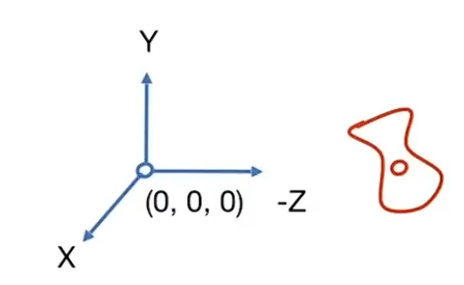

#

<!--more-->

## 1. 什么是视图变换？

- 拍照的过程：
  - 先把场景搭好（模型变换）
  - 然后找一个角度（视图变换），改变相机的位置，朝那看
  - 投影

## 2. 怎么做视图变换

- 如何才能确定一个相机的摆放？
  - 首先，相机的位置很重要，用位置向量$ \vec{ e }$
  - 其次，往哪拍也很重要，用:
    - look-at向量（相机往哪看）：$\hat g$
    - 向上向量（相机头顶的朝向）：$\hat t$

- 为了简化操作，默认相机在原点$\hat g$是y轴，$\hat t$是-z轴

  

  

- 假设相机原始位置为$(x_ e, y_ e, z_ e)$，对他做视图变换：
  - 将相机位置平移到原点：$T _ { view }  = \begin{bmatrix} 1 &0 &0 &-x_ e \\ 0 &1 &0 &-y_e \\ 0 &0 &1 &-z_ e \\ 0 &0 &0 &1 \end{bmatrix}$
  - 将$\hat{ g }$ 旋转到-z轴，将$ \hat t $旋转到y轴，$\hat g \times \hat t$旋转到x轴
    - 直接将$\hat g$旋转到 -z轴不太好操作，旋转矩阵不太好找，可以逆向考虑，考虑先将-z轴根据$R_ { view } ^ { - 1 }$转到$\hat g$，然后由于旋转矩阵的逆矩阵只需要转置就行，求个逆就可以找到旋转矩阵。 $R_ { view } ^ { - 1 } = \begin{bmatrix} x_{ \hat g \times \hat t } &x_ t &x_ { - g } &0 \\ y_ { \hat g \times \hat t } &y_t  &y_ { -g } &0 \\ z_ { \hat g \times \hat t } &z_ t &z_{ -g } &0 \\ 0 &0 &0 &1 \end{bmatrix}$

- 得到$T_ { view }$和$R_ { view }$后，将相机和其他物体都做一个这样的变换

## 3. 投影

>这里的投影并不是指将3D物体映射成2D图片，而是 **把相机前的 3D 视见体（view volume）线性/仿射地映射到一个标准的 3D 盒子里（NDC 立方体），而不是立刻产出二维像素图**。真正变成 2D 图像是在后面的“透视除法 + 视口映射 + 光栅化”阶段 
>
>- 为什么要先变成立方体（而不是直接二维）？
>  - **统一裁剪**：无论正交还是透视，先把视见体变成统一的标准盒子（或在齐次裁剪空间的盒状约束），硬件用同一种裁剪逻辑就能处理，效率高。
>  - **保留深度**：在产出 2D 像素前，需要 zzz 来做隐藏面消除、透明度排序、阴影/雾等效果。
>  - **数值/规范化**：把范围归一到 [−1,1][-1,1][−1,1]（或 z∈[0,1]z\in[0,1]z∈[0,1]）能简化插值、测试和精度控制。

- 有两种投影方式：
  - 正交投影
  - 透视投影
    - 有远小近大

### 3.1 正交投影

- 简略理解：
  - 经过视图变换之后，只需要将z坐标去掉就行了。
  - 然后将结果压缩到$[-1,1] ^2$ （这是一个约定俗称的操作）

- 正式操作：

  - 首先定义空间中的一个立方体：$[l, r] \times [ b, t] \times [f, n]$

  - 然后先将立方体的中心移到原点，然后将xyz分别缩放到[-1,1]
    $$
    M_ { ortho } = 
    \begin{bmatrix}
    \frac{ 2 }{ r - l } &0 &0 &0 \\
    0 &\frac{ 2 }{ t - b } &0 &0 \\
    0 &0 &\frac{ 2 }{ n - f } &0 \\
    0 &0 &0 &1 \\
    \end{bmatrix}
    \begin{bmatrix}
    1 &0 &0 &- \frac{ r+l }{2} \\
    0 &1 &0 &- \frac{ t+b }{2} \\
    0 &0 &1 &- \frac{ n+f }{2} \\
    0 &0 &0 &1
    \end{bmatrix}
    $$
    

### 3.2 透视投影

> 使用最广泛，远小近大，平行线就不再平行了

- 透视投影通过一个视锥观察物体，假设近平面是n，远平面式f，如上图（下），透视投影要做的就是将线的右端点投影到左端点，透视投影跟正交投影的区别就是远平面要大些。

#### 3.2.1 透视投影过程：

- 假设对远平面进行压缩，把他**压缩**成跟近平面一样大，（图下从左到右的过程），然后将远平面的点通过**正交投影**就可以投影到近平面。相当于将透视投影拆分成两个过程：
  1. 压缩平面，将远平面到近平面这里所有的平面都压缩成跟近平面一样大
  2. 对压缩后得到的立方体做正交投影

##### 1）压缩平面

- 几个规定假设：
  - 近平面压缩后不变（例如顶点压缩后还是原来的顶点，中点压缩后还是原来的中点）
  - 远平面压缩后z值不会变化
  - 远平面的中心点压缩后不变

- 对于视锥上的一条线，他在某平面（不一定是远平面）上的点为(x，y，z)，近平面上的点为（x'，y'，z'）这个点压缩后（视锥压缩成立方体），会被压缩成（x‘，y’，z''），且根据三角形相似可知：$y' = \frac{ n }{ z} y $   $x' =  \frac{ n }{ z } x$。对于某平面（不一定是远平面）任意一点$ (x, y,z ,1 )^ T$ 会被压缩成$( \frac{ nx }{ z }, \frac{ ny }{ z } , unknown , 1 )$ :
  $$
  \left (  \begin{matrix} n&0 &0 &0 \\
  0 &n &0 &0 \\ ? &? &? &? \\
  0 &0 &1 &0
  \end{matrix} \right) \times \left (  \begin{matrix} x \\
  y \\ z \\
  1
  \end{matrix} \right) = \left (  \begin{matrix} nx \\
  ny \\ ? \\
  z
  \end{matrix} \right) =\left (  \begin{matrix} \frac{ nx }{ z } \\
  \frac{ ny }{ z } \\ ? \\
  1
  \end{matrix} \right)
  $$

  - $M_ { persp \rightarrow ortho } = \left (  \begin{matrix} n&0 &0 &0 \\
    0 &n &0 &0 \\ ? &? &? &? \\
    0 &0 &1 &0
    \end{matrix} \right)  $ 

- 对于近平面上的点，压缩后不变：
  $$
  \left (  \begin{matrix} n&0 &0 &0 \\
  0 &n &0 &0 \\ 0 &0 &A &B \\
  0 &0 &1 &0
  \end{matrix} \right) \times \left (  \begin{matrix} x \\
  y \\ n \\
  1
  \end{matrix} \right) = \left (  \begin{matrix} nx \\
  ny \\ n^ 2 \\
  n
  \end{matrix} \right) =\left (  \begin{matrix} \frac{ nx }{ n } \\
  \frac{ ny }{ n } \\ n \\
  1
  \end{matrix} \right) \\ An+B=n^2
  $$
  

- 远平面的中心点压缩后不变：$Af + B = f^ 2$

- 根据$\left \{ \begin{matrix}  An+B=n^2  \\ Af + B = f^ 2 \\\end{matrix}\right.$ 得：
  $$
  M_ { persp \rightarrow ortho } = \left (  \begin{matrix} n&0 &0 &0 \\
  0 &n &0 &0 \\ 0 &0 &n+f &-nf \\
  0 &0 &1 &0
  \end{matrix} \right)  
  $$

- 最后$M_ { persp } = M_ { orhto } M _ { persp \rightarrow ortho}$ 

