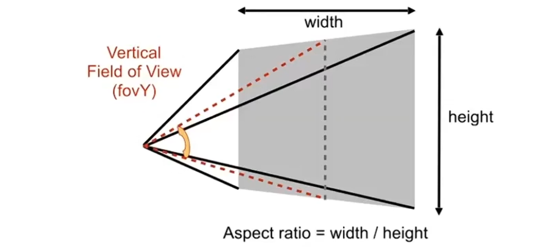

#

<!--more-->

> 经过视图变换之后，物体被放到了[-1,1]的小立方体中，然后需要把他画到屏幕上，这一步就是**光栅化**

## 1. 透视投影

- 在透视投影中，我们通过一个视锥来观测物体，怎么定义这个视锥：
  - 长宽比
  - 垂直可视角度

# 2. 光栅化

> 目标：将之前得到的[-1,1]的3D立方体转换到2D屏幕上

- 首先，不管z轴，只看x，y轴，先将[-1,1]范围的x，y映射到[0, width] x [0, height]的平面：

  - 缩放加平移（之前的原点在立方体中心，变换后在左下角）

  $$
  M_ { viewport } = \left( \begin{matrix} 
  \frac{width }{ 2 } &0 &0 &\frac{ width }{ 2 } \\\\
  0 &\frac{ height }{ 2 } &0 &\frac{ height }{ 2 } \\\\
  0 &0 &1 &0 \\\\
  0 &0 &0 &1
  \end{matrix}  \right)
  $$

  

- 然后，对于一个三角形，如果他包含了这一个像素，就把这个像素点亮。