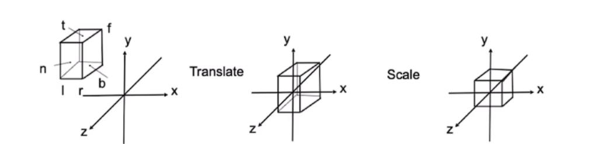
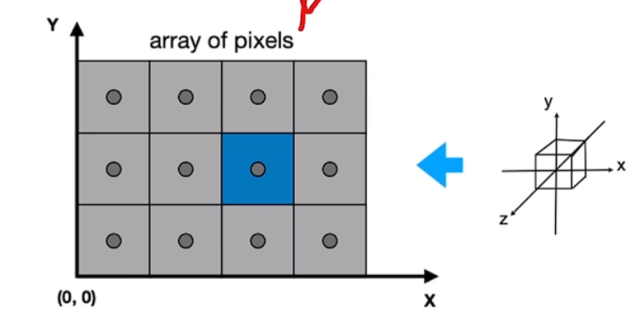
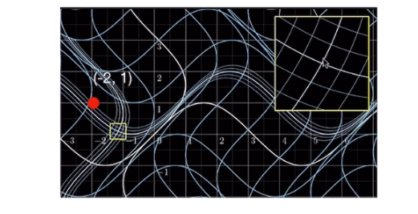

#

<!--more-->

>- 抛雪球是从3D到像素的过程

- NeRF中使用了一个相机模型进行坐标系转换：
  - 世界坐标系
  - 相机坐标系
  - 归一化坐标系
  - 像素坐标系
- CG中有一个更常用的转换：
  1. 观测变换
     - 世界坐标系 -> 相机坐标系
  2. 投影变换
     - 相机坐标系 -> 2D空间
  3. 视口变换
  4. 光栅化

## 1. 观测变换

>假设有一个高斯椭球，我们从不同的角度去看它可能有不同的形态，这个过程的本质还是一个仿射变换


- 从世界坐标系到相机坐标系
- 横看成岭侧成峰，远近高低各不同
- 仿射变换
- $\mathbf{ w } = A \mathbf{ x }+ b$


## 2. 投影变换

>变换到相机角度之后，我们需要将高斯椭球映射到成像平面上，映射方法有两个：正交投影，透视投影


- 3D到2D
- 正交投影，与z无关
  - 与深度无关，没有远小近大（图右）
- 透视投影，与z相关

### 2.1 正交投影

- 立方体$[l,r] \times [b,t] \times [f,n]$ 
- **平移**到原点
- 立方体**缩放**至$[-1,1]^ 3$的正方体
- 仿射变换




$$
M_ { ortho } = 
\begin{bmatrix}
\frac{ 2 }{ r - l } &0 &0 &0 \\
0 &\frac{ 2 }{ t - b } &0 &0 \\
0 &0 &\frac{ 2 }{ n - f } &0 \\
0 &0 &0 &1 \\
\end{bmatrix}
\begin{bmatrix}
1 &0 &0 &- \frac{ r+l }{2} \\
0 &1 &0 &- \frac{ t+b }{2} \\
0 &0 &1 &- \frac{ n+f }{2} \\
0 &0 &0 &1
\end{bmatrix}
$$

## 2.2 透视投影

- 远小近大

- 先把锥体（视锥）“压”程立方体

- 再做正交投影

  

  
  $$
  M_ {persp \rightarrow ortho} = \begin{bmatrix} n &0 &0 &0 \\ 0 &n &0 &0 \\ 0 &0 &n+f &-nf \\ 0 &0 &1 &0  \end{bmatrix}
  $$
  
- 问题：

  - 透视投影是非线性的，即非仿射变换，我们希望高斯椭球一直进行仿射变换

>可以发现投影变换将一个立方体压成了一个正方体，这个过程中w和h的缩放比是不同的，肯定是有一个形变的，这个形变在后面视口变换会解决。

## 3. 视口变换

>经过投影变换之后我们得到了一个$[-1,1]^ 3$范围的正方体，我们再把它拉伸回最开始的$h \times w$大小

- 进行拉伸：

  - 与z无关

  - 将$[-1,1]^ 2$的举行变换至$[0,w] \times [0,h]$

    

    
    $$
    M_{ viewport } = \begin{bmatrix} \frac{ w } { 2 } &0 &0 &\frac{ w } { 2 } \\
    0 &\frac{ h } { 2 } &0 &\frac{ h } { 2 } \\
    0 &0 &1 &0 \\
    0 &0 &0 &1
    \end{bmatrix}
    $$
    

### 3.1 光栅化

> 但是还有一个问题：比如mesh中的一个面片他是连续的，但是我们想把这个东西画到屏幕的时候，屏幕是离散的，这时就需要光栅化

- 定义：

  - 把东西画在屏幕上

  - 连续转离散

  - 使用的方法：采样，看像素的中心点有没有落在面片里

    

    

> 光栅化中经常听到一个词叫形变（Aliasing），比如上图左下角那个像素有点离群，那我们的采样方式可能有点问题，可以采取其他的采样方式使他更自然。

```python
# 对空间中的三个点做光栅化
import numpy as np
frame = create_canvas( 700,700) #700 * 700的画布
angle = 0
eye = [0, 0, 5] #相机位置
pts = [  # 三个点
    [0, 0, -2],
    [0, 2, -2],
    [-2, 0, -2]
]
# 视口变换矩阵
viewport = get_viewport_matrix( 700, 700 )

# get mvp matrix
mvp = get_model_matrix( angle )
# 观测矩阵
mvp = np.dot(get_view_matrix(eye), mvp)
# 投影矩阵
mvp = np.dot(get_proj_matrix(45, 1, 0.1, 50), mvp) # 4*4

# loop points
pts_2d = []
for p in pts: #遍历三个点
    p = np.array(p + [1]) # 3*1 -> 4*1
    p = np.dot(mvp, p) #每个点乘以他的变换矩阵
    p /= p[3] #归一化

    #viewport
    p = np.dot(viewport, p)[:2] #视口变换
    pts_2d.append([int(p[0]), int(p[1])])

```

## 4. 对3d高斯进行变换

### 4.1 3d高斯的观测变换

- 在物理坐标系中，一个3d高斯有如下要素：
  - 高斯核中心（均值）：$t_k = [t_ 0,t_ 1, t_ 2]^ T$ 
  - 协方差矩阵：$V_k ''$
  - 高斯核：$r_ k '' ( t ) = G_ { v_ k '' } ( t - t_k )$

- 观测变换将3d高斯从世界坐标系变到相机坐标系，这是一个仿射变换：
  - 高斯核中心：$u_ k = [u_ 0, u_ 1, u_ 2]^ T$
  - **均值：$u_ k = W t_k + d$**
  - **协方差矩阵：$V_k' = WV_k'' W^ T$**
  - 高斯核：$r_ k ' (u ) = G_ { v_ k '} ( u - u_ k )$

### 4.2 3d高斯的投影变换

>投影变换将锥体压成立方体，然后压成正方体：$x = m( t )$，这个过程是非线性的，且有形变

- 上一步：
  - 均值：$u_ k = [ u_ 0, u_ 1, u_ 2] ^ T$
  - 协方差：$V_k '$

- 高斯核中心：$x_ k = [x_ 0, x_ 1, x_ 2]^ T$
- 高斯核：$r_ k ( x ) = G_ { V_ k } ( x - x_ k )$
- **均值：$x_ k = m( u_ k )$**
  - 对均值来说，它可以这样做，因为它只是一个点他不会形变
- **协方差矩阵？**
  - 协方差矩阵不能直接用投影变换得到，因为投影变换是非线性变换，非仿射变换
  - 因此需要引入**雅可比矩阵**
    - 这里可以理解成拆成两步：
      - 通过雅可比矩阵实现**近似的压缩**（从视锥压缩成立方体
      - 再做正交投影

#### 4.2.1 雅可比矩阵

- 泰勒展开
- 线性逼近

- 例子：

  - 假设有一个坐标（x，y），对他进行一个非仿射变换：
    $$
    \begin{align} 
    f_ 1 ( x ) = x + sin( y ) \\
    f_ 2( y ) = y + sin ( y )
    \end{align}
    $$

  - 这样导致从一个横平竖直的坐标系变成了一个带弯曲的坐标系：(关注某一个点，比如（-2，1）这个点变到了黄色框这个位置，展开这个小框，中心点是（-2，1），其他附近的变换是非线性变化，

    

    

  - 假设把黄色框框进一步缩小，它附近的变换可以近似成一个线性的变换：

    

    

  - 也就是说确定了一个点$x_ 0 , y_ 0$，在他附近就可以通过导数去进行线性的逼近了。具体就叫雅可比矩阵：
    $$
    J = \begin{bmatrix} \frac{ df_ 1 }{ dx } &\frac{ df_ 1 }{ dy } \\ \frac{ df_ 2 }{ dx } &\frac{ df_2 }{ dy } \end{bmatrix} = \begin{bmatrix} 1 & cos( y ) \\ cos( x ) &1 \end{bmatrix}
    $$
    

#### 4.2.2 基于雅可比矩阵的投影变换

- 协方差矩阵：$V_ k = J V_k ' J^ T = JWV_k''W^ T J^ T$

- 已知对于投影变换中的一个点，第一步进行压缩：
  $$
  \left (  \begin{matrix} n&0 &0 &0 \\
  0 &n &0 &0 \\ 0 &0 &n+f &-nf \\
  0 &0 &1 &0
  \end{matrix} \right) \times \left (  \begin{matrix} x \\
  y \\ z \\
  1
  \end{matrix} \right) = \left (  \begin{matrix} nx \\
  ny \\ ( n+ f) z -nf \\
  z
  \end{matrix} \right) =\left (  \begin{matrix} \frac{ nx }{ z } \\
  \frac{ ny }{ z } \\ (n+f)-\frac{ nf }{ 2 } \\
  1
  \end{matrix} \right)
  $$

- 我们发现变换关系是：
  $$
  \begin{bmatrix} f_ 1( x ) \\ f_ 2( y ) \\ f_ 3( z ) \end{bmatrix} = \begin{bmatrix}  \frac{ nx }{ z } \\ \frac{ ny }{ z } \\ ( n+f ) - \frac{ nf }{ z } \end{bmatrix}
  $$

- 因此可以求雅可比矩阵（通常带入的是3d高斯的中心点）：
  $$
  J = \begin{bmatrix} \frac{ n }{ z } &0 &-\frac{ nx }{ z^ 2 } \\ 0 &\frac{ n }{ z } &-\frac{ ny }{ z^2 } \\ 0 &0 &-\frac{ nf }{ z^ 2 }   \end{bmatrix}
  $$
  

> 变换之后，均值和协方差在一个坐标系里吗？

- 均值在NDC坐标系中，[-1,1]的立方体中
- 对于协方差矩阵来说，上面的操作只是将锥体压缩到立方体的一个过程，还没有放到[-1,1]立方体中，所以后面还原的时候，均值需要做视口变换，而协方差不需要

### 4.3 3d高斯的视口变换

>视口变换只需要对高斯核的中心去做，不用对协方差做，因为前面对协方差做投影变换的时候其实没做完

- 投影变换之后：
  - 高斯核中心：$x_ k = [ x_ 0 ,x_ 1, x_ 2 ]^ T$ 
  - 高斯核：$r_ x ( x ) = G_ { V_ k }( x - x_ k )$
  - 足迹函数
- 像素坐标系：
  - 高斯核中心：$\mu = [ \mu_ 1, \mu_ 2, \mu_ 3 ]^ T$
    - 平移+缩放
  - 对协方差：足迹渲染：离散计算（距离均值越近它的值就越大）
    - $G( \hat x ) = exp \left ( -\frac{ 1 }{ 2 }( x - \mu )^ T V_ k ^ { -1 } ( x - \mu) \right)$

