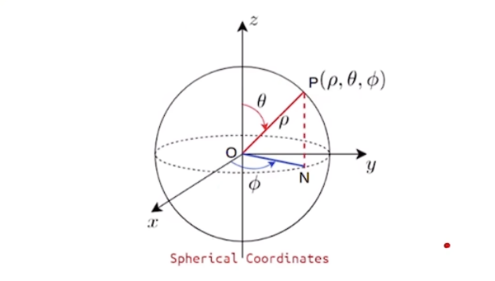
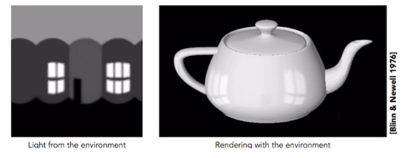

#

<!--more-->

> 之前已经算了雪球有多大有多重，但是雪球还需要颜色

## 0. 基本概念

### 1）基函数

- 任何一个函数可以分解为正弦与余弦的线性组合：
  - $f( x ) = a_ 0 + \sum_ { n = 1 } ^ { + \infty} a_ n cos \frac{ n \pi }{ l } x + b_ n sin \frac{ n \pi }{ l } x$
  - $cos \frac{ n \pi }{ l }x$和$sin \frac{ n \pi }{ l } x$是基函数

### 2）球谐函数

- 任何一个球面坐标的函数可以用多个球谐函数来近似：
  - 什么叫“球面坐标的函数”：这里任意的一个点相当于三维的极坐标下，固定r，只有$\theta$和$\phi$可以变化，所以这里球谐函数就会跟这个点的方向有关系。比如我有一个球，他在不同的方向上反射的光可能是不一样的。这样就把颜色和观测角度建立了联系，颜色就不会单一了。
  - $f( t ) \approx \sum_ l \sum_ { m = -l } ^ l c_ l ^ m y_ l ^ m ( \theta, \phi)$
  - 其中，$c_l ^m$各项系数，$y_l ^m$是基函数

## 1. 球谐函数

$$
\begin{align}
f( t ) \approx &\sum_ l \sum_ { m = -l } ^ l c_ l ^ m y_ l ^ m ( \theta, \phi) \\
= &c_0^0 y_ 0 ^ 0 +\\
&c_ 1 ^ { -1 } y_ 1 ^ { -1 } +c_ 1 ^ 0 y_ 1 ^ 0 + c_ 1 ^ 1 y_ 1 ^1 + \\
& c_ 2^{ -2 } y_ 2^{ -2 } + c_ 2^{ -1 } + y_ 2^{ -1 } + c_ 2^{ 0 } y_ 2^{ 0 } + c_ 2^{ 1 } y_ 2^{ 1 } + c_ 2^{ 2 } y_ 2^{ 2 } + \\
& ...
\end{align}
$$

- 这里$l$是指0阶，1阶，2阶...，我们这里用的是**3阶**

- $$
  y_l ^ m ( \theta , \varphi ) = \left \{   
  \begin{align} 
  \sqrt{ 2 } K_ l ^ m cos( m \varphi )P_l ^m( cos \theta) \space \space \space& ,m> 0 \\
  \sqrt{ 2 } K_ l ^ m sin( -m \varphi )P_l ^{ -m }( cos \theta) \space \space \space& ,m < 0 \\
  K_ l ^ 0 P_ l ^ 0 ( cos \theta ) \space \space \space &, m=0
  \end{align} 
  \right . 
  $$

  - $$
    \begin{align}
    &P_ n ( x ) = \frac{ 1 }{ 2^n \cdot n! } \frac{ d^ n }{ dx^ n } [ ( x^ 2 - 1 )^ n ] \\
    &P_ l ^ m = ( - 1 )^ m ( 1 - x^ 2 )^ { \frac{ m }{ 2 } } \frac{ d^ m }{ dx^ m }( P_ l ( x ) ) \\
    &K_ l ^ m = \sqrt{ \frac{ ( 2l + 1 ) ( l - | m | )! }{ 4 \pi ( l + | m | )! } }
    \end{align}
    $$

  - $$
    \begin{align}
    &y_ 0 ^ 0 = \sqrt{ \frac{ 1 }{ 4 \pi } } = 0.28 \\
    &y_ 1 ^ { - 1 } = - \sqrt{ \frac{ 3 }{ 4 \pi } } \frac{ y }{ r } = -0.49 * \frac{ y }{ r } \\
    &y_ 1 ^ { 0 } =  \sqrt{ \frac{ 3 }{ 4 \pi } } \frac{ z }{ r } = 0.49 * \frac{ z }{ r } \\
    &y_ 1 ^ {  1 } = - \sqrt{ \frac{ 3 }{ 4 \pi } } \frac{ x }{ r } = -0.49 * \frac{ x }{ r } \\
    
    \end{align}
    $$

- 对于球谐函数，$y_ l ^ m$都是已知的常数，只有系数c是未知的。

- 表示颜色需要RGB三个数，因此每个系数c都是三维向量。

- 一共1+3+5+7=16个c，也就是说所有的c可以写成一个[16,3]的矩阵。

## 2. 为什么球谐函数能够更好的表达颜色？

- 直觉上，我们就用RGB[1,3]的矩阵表达颜色，现在换成[16,3]的矩阵，肯定表达的更好。

- 在CG上，有个东西叫做环境贴图，它表达了环境里光的存在，经常会用到球形的环境贴图。

- 如下图的水壶感觉看起来特别有立体性，且表面很光亮，因为壶体有反光。而这个反光我们就是用一个图来表达他的光学性（左侧），通过把这个光贴到壶的面上，我们就感觉这个面很光滑。为什么呢？因为我们知道在现实生活中一个金属越光滑，他的反射就会越强，镜面反射越多。那么假设一个球是绝对光滑的，他就把环境中每一个亮光的地方都反射出来了，他就记录了整个环境中的光。

  

  

- 一个球记录了环境光，然后把球的每个面可以映射到矩形上，再展开就可以得到一个展示环境光的环境贴图。在渲染中我们常用球谐函数来重建光，如果分别使用1阶到6阶还原的效果会越好，如下图（右）当1阶的时候，只有一个颜色，也就是RGB，他不跟方向相关，随着阶数的增加，信息越来越多。

  

## 3. 合成图片

- 直观上进行$\alpha - belding$就行了，实际上高斯做足迹渲染的时候的时候还是对每个像素着色的：先生成一个h*w的空矩阵，然后遍历每个像素进行着色。基于以下公式去求得每个像素的颜色（NeRF公式）：
  $$
  \begin{align} 
  C &= T_ i \alpha c_ i \\
  & = \sum_ { i = 1 } ^ N T_ i ( 1- e^ { -\sigma_ i \delta } ) c_ i \\
  & where T_ i = e^ { - \sum_ { j = 1 }^ { i - 1 } \sigma_ j \delta_ j }
  \end{align}
  $$

  - $T( s )$：在s点之前，光线没有被阻拦的概率
  - $\sigma ( s )$：在s点处，光线碰击例子（光线被粒子阻碍）的概率密度
  - $C( s )$：在s点处，粒子光出的颜色
  - $c_ i $是通过球谐函数算的RGB值
  - 这里还是用了NeRF的公式啊，为什么说他快呢？
    - 他没有根据像素找粒子的过程，他是对高斯椭球按照深度z进行排序。前面我们通过投影将物体映射到[-1,1]的立方体里，我们在渲染的时候，扔雪球是有**先后顺序**的。（可能这就是投影的时候保留z维度的原因）