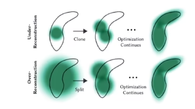

#

<!--more-->

> 最开始虽然设想一个高斯椭球可以影响多个像素，以至于高斯椭球数量可能比点云数量少一些，但实际上并没有少，因为他初始的时候就是用colmap生成的点云，所以说他并没有粒子上的减少，为什么就快了呢？实际上是因为GPU。

# 1. 3dgs为什么快

- cpu相当于一个老教授，GPU相当于一群小学生。
- GPU:
  - 整个splatting部分是用cuda编写的，一个线程负责一个像素，每个像素去找它对应的3d高斯椭球去渲染颜色即可。
- 分区
  - 把整张图拆成16*16块，然后在找自己对应的区域的时候，把高斯也分块了，算第一块的时候，只需要找跟这个快对应的几个高斯就行了，算第二块的时候只需要找跟第二块对应的几个高斯就行了；同时两个块之间也是并行的
  - GPU的每个block负责一个区
  - block之间可以共享内存
- 核心代码中其实只写了对一个像素的处理。

```python
import numpy as np
out_color = np.zeros((H, W, 3))

# loop pixel
for i in range(H): #遍历每个像素，模仿GPU对单一像素的操作
    for j in range(W):
        pixf = [i, j]
        C = [0,0,0] #每个像素给一个初始颜色

        # loop gaussian
        # 由近到远遍历每个高斯球
        for idx in point_list:

            # init helper variables, transmirrance
            T = 1 #最开始的时候不被遮挡的概率=1
            # Resample using conic matrix
            xy = points_xy_image[idx] #高斯球的中心点的 x,y坐标，这里由于投影之后做了视口变换，高斯椭球被投影到2D平面了，所以只有xy坐标
            d = [xy[0] - prixf[0], xy[1] -pixf[1]] # x- \mu
            con_o = conic_opacity[idx] #协方差矩阵
            # 将二维高斯椭球写成椭圆方程： xxxx = const的形式，下面就是e上面的指数，把这个像素的坐标带入进去求得的值
            power = -0.5 * ( con_o[0] * d[0] * d[0] + con_0[2] * d[1] * d[1]) -con_o[1] * d[0] * d[1]
            if power > 0: #说明这个高斯椭球形成的椭圆没有包括这个像素，或者这个像素离高斯椭球中心太远
                continue

            # 椭球本身是有一个透明度的，还要乘以当前这个椭球对当前像素的影响系数（con_o[3]），
            alpha = min( 0.99 , con_o[3] * np.exp(power))
            if alpha < 1/ 255: # 透明度太小就舍弃
                continue
            test_T = T * (1 - alpha) #前面一直都不透明的概率，累乘
            if test_T < 0.0001: #不透明度已经很小了
                break

            color = features[idx] #球谐函数算来的颜色
            for ch in range(3):
                C[ch] += color[ch] * alpha * T #根据NeRF体渲染公式累加颜色
            T = test_T
            
        # get final color
        for ch in range(3): #赋予该像素最终颜色，做了一个alpha blending
            out_color[j, i, ch] = C[ch] + T * bg_color[ch] #如果把所有的高斯椭球都遍历了，他的不透明度还有一定限度的话，就用背景颜色（黑）给他补上
```


## 2. 机器学习与参数评估

- 假设初始点云有10000个点，每个点膨胀乘3d高斯椭球，每个椭球的参数包括：
  - 中心点位置：（x，y，z）
  - 协方差矩阵：R，S  （旋转和缩放矩阵）
  - 球谐函数系数：16*3
  - 透明度：$ \alpha $ 


- 然后进行变换过程（splatting过程）形成一张图片，然后跟GT算loss。

- 关于初始化的3d高斯：
  - ~/gaussian-splatting/submodules
    - diff-gaussian-rateriztion : 渲染部分
    - simple-knn ：

- 为什么有一个simple-knn呢？
  - 最开始的高斯椭球总要有一个形态，这个形态我们就使用一个各向同性的球，他的半径（缩放）如果初始化太小了，可能画面不能完全铺满，会有很多空白的地方；如果太大就会有大量的重叠部分，因此这里使用knn来算半径。
  - 对于每个高斯点，寻找与他近邻的三个邻居，半径就是和三个邻居的距离的平均。这样初始化的时候每个邻居都会相邻性的碰撞一下，就可以铺满整个画面了。

- 算法：
  - 渲染 + SGD
  - $L = ( 1 - \lambda ) L_ 1 + \lambda L _ { D - SSIM } , \lambda = 0 .2 $

- 一个问题：

  - 我们后期可以去优化他的形状、颜色、深浅，但是他初始的用colmap生成的点云的数量是不变的，如果初始用colmap生成的有问题有离群点，强依赖于sfm生成的初始点云。

  - 解决：打补丁（自适应高斯控制器，Adaptive control of Gaussians）：

    

    

    - 太大的高斯给拆开
    - 太小的高斯给复制
    - 存在感太低的删除

