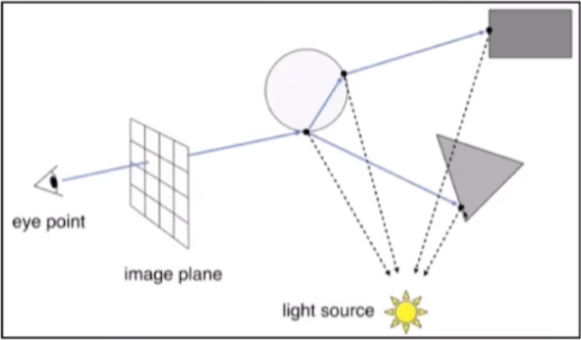
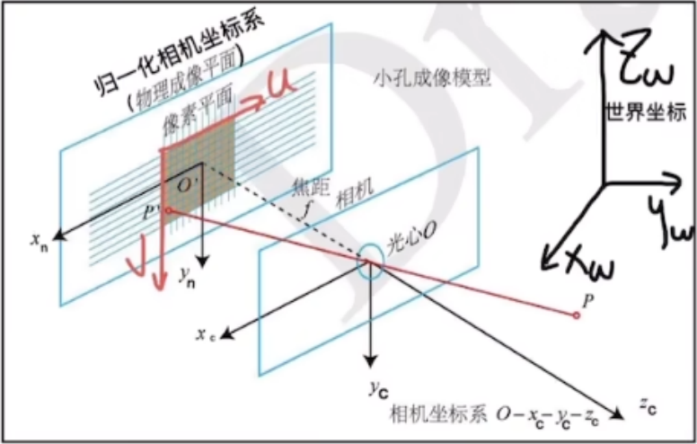
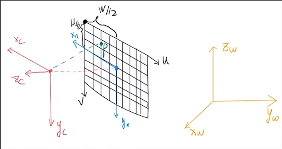
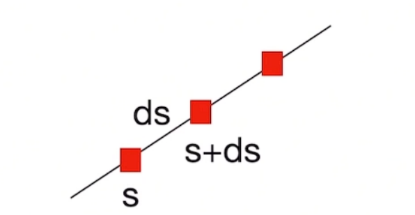
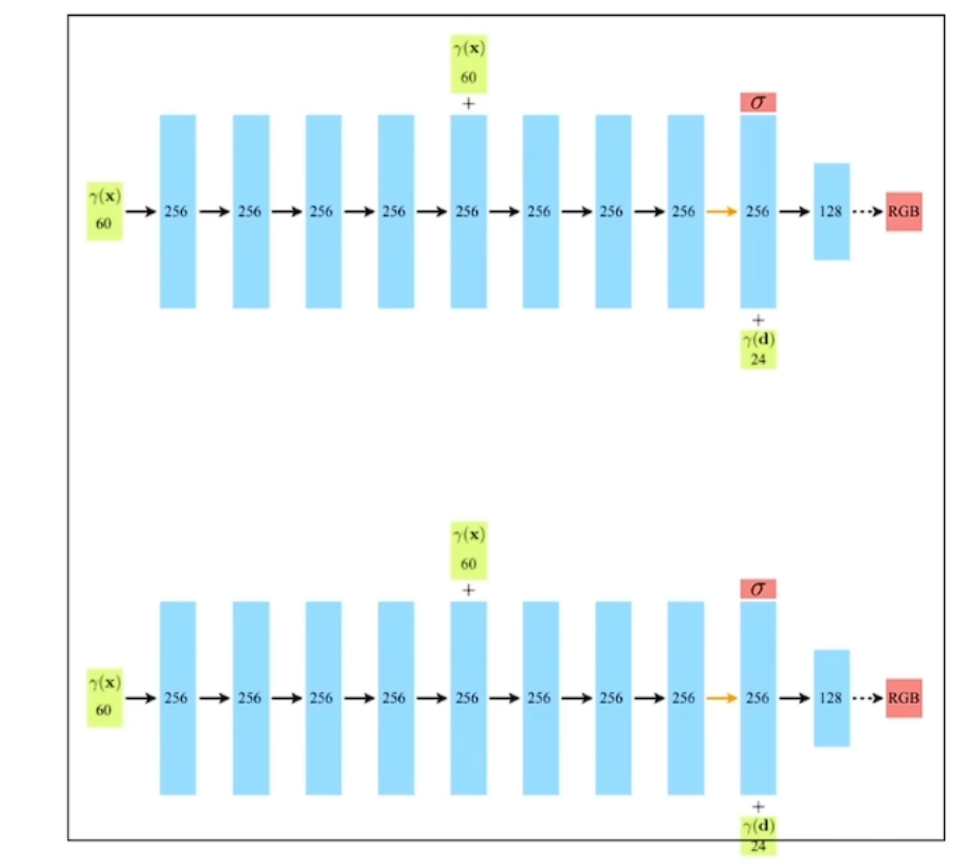

#

<!--more-->

>- 什么是NeRF
>
>- NeRF的输入是什么
>- NeRF的输出是什么
>- 怎么把NeRF的输出转化为一张图片
>- Loss是怎么计算的


## 1. 什么是NeRF

- 使用神经网络（MLP）来隐式存储3D信息的一个presentation（表征）
  - 显式的3D信息：**有明确的x,y,z值**（mesh, voxel体素,点云）
    - 比如mesh会使用一个矩阵$\begin{bmatrix} 1,2,3 \\ 2,3,4 \\3,4,5 \\ 4,5,6 \end{bmatrix}$ 表示有四个顶点，与这四个顶点的xyz坐标。使用$\begin{bmatrix} 1,2,3 \\ 1,2,4 \end{bmatrix}$ 表示有两个表面（三角形）顶点1，2，3之间有连接，顶点1，2，4之间有连接。
  - 隐式的3D信息：无明确的x,y,z值，智能输出指定角度的2D图片。

- 训练时使用给定场景下的若干张图片。

- 推论
  - 模型不具有泛化能力
  - **一个模型智能存储一个3D信息**

## 2. NeRF模型结构

| 问题       | 回答                          | 解释                                                         |
| :--------- | ----------------------------- | :----------------------------------------------------------- |
| 模型是什么 | 8层MLP                        |                                                              |
| 模型输入   | 5D向量，$(x,y,z,\theta,\phi)$ | 这是**粒子**的空间位姿<br>$\theta$表示方向，它可以由两个向量相减得到，因此输入也可以理解为6D |
| 模型输出   | 4D向量，（密度，颜色）        | 这是**粒子**对应的颜色以及密度<br>颜色包括RGB                |

>- 什么是粒子？
>- 输入不应该是图片吗？
>  - 说明应该有一个图片转5D的前处理
>- 输入是谁的位姿？相机的吗？
>- 输出不应该是2D图片吗？
>  - 还应该有一个4D转2D图像的后处理
>- 怎么从4D向量变成图片的？

- NeRF的重点是前/后处理，模型简单。

## 3. 什么是粒子？

### 3.1 相机模型

- 延申到真实场景和相机模型

  - **真实场景**：我们看到东西的时候他会通过多个反射源去打光，然后物体和物体之间也会折射和反射，这些光最后都会打进我们的眼睛。

    - 多个光源

    - 物体折射/反射

      

      

  - 对上面的整个过程进行建模得到的就是一个**相机模型**：连接3D世界与2D图片

    - 世界坐标系

    - 相机坐标系

    - 归一化相机坐标系（物理成像平面）（CCD）

    - 像素坐标系

      

      

- 我们常说的3D建模（3D重建）就是**通过图片去推测光源的位置和强度，以及物体的几何性质**（比如他的材质）。这样操作**建模难度巨大**。在NeRF中就引入了一个概念：**体渲染**

### 3.2 体渲染

- 渲染技术的一个分支，在CG领域中，它是为了解决非刚体（云、烟、果冻）（刚体通常有较大密度）的渲染。我们通常将非刚体抽象成一团飘忽不定的**粒子群**。
- 对于这些非刚体，他在成像的时候是光线在穿过的时候会光子和粒子发生一些碰撞。光子和粒子在发生作用的过程中会有四个过程：
  - 吸收：光子被粒子吸收了
  - 放射：粒子本身也会发光
  - 外射光：其他例子向我们反射过来的光
  - 内射光：我们对其他物体折射的光

- NeRF假设：
  - 物体是一团自发光的粒子
  - 粒子有颜色和密度
  - 外射光和内射光抵消
  - 多个粒子被渲染成指定角度的图片

### 3.3. NeRF的输入输出

- 模型的输入：将物体进行稀疏表示的**单个粒子**的位姿
- 模型输出：该粒子的密度和颜色

- 问题：
  - 模型看上去输入的还是一张图片，输出的也应该是一张图片，我们准备的训练集里面的图片在哪呢？
  - 怎么得到这些粒子？
  - 多少个粒子？这些例子怎么批量输入？
  - 这些粒子是怎么渲染成新的图片的 ？

### 3.4 粒子的采集

- 对于空间中的某一个发光粒子：

  - 空间坐标为：（x,y,z）

  - 发射的光纤通过相机模型成为图片上的像素坐标（u,v）

  - 粒子颜色即为像素颜色

  - （u,v）与）（x,y,z）的公式：相机坐标=相机内参x转换矩阵x世界坐标
    $$
    \begin{bmatrix} u \\ v \\ 1 \end{bmatrix} = \begin{bmatrix} f_x \space \space 0 \space \space c_x \space \space 0 \\ 0 \space \space  f_y \space \space c_y \space \space  0 \\ 0 \space \space  0 \space \space  1 \space \space  0 \end{bmatrix}_ { 3 \times 4 } \begin{bmatrix} R \space \space T \\ 0 \space \space 1 \end{bmatrix}_ { 4 \times 4} \begin{bmatrix} x_w \\ y_w \\ z_w \\ 1 \end{bmatrix}_ { 4 \times 1}
    $$

- 反之，已知观察点A，图片上的像素点B，我们可以找到一条射线。对于图片上的某一个像素（u,v）的颜色：

  - 可以看作**射线**上无数个发光点的“和”
  - 可以利用相机模型，反推射线
  - 这个射线表示为：$r( t ) = o + td$ : 
    - $o$ 为射线原点
    - $d$ 为方向
    - $t$ 为距离
  - 极坐标表示
  - 理论上：t从0到正无穷
  - 对于整张图片有（H,W）条射线

  

  

- 由像素点P(u,v)反推射线

  

  

  - 像素平面坐标系：$（u,v）$
  - 物理成像平面坐标系：$（x_n , y_n）$
    - 像素平面 -> 物理成像平面：$(x_n, y_n) = (-(u - \frac{w}{2}), v- \frac{h}{2})$
  - 相机坐标系$（x_c , y_c , z_c）$
    - 物理成像平面 ->相机坐标系：$( x_c, y_c, z_c)=( x_n, y_n, -f)$
    - 归一化：$( x_c, y_c, z_c)=( \frac{x_ c}{ f }, \frac{y_ c }{ f }, -1)$
    - f是焦距
  - 世界坐标系$（x_w , y_w , z_w）$
    - 相机坐标系 ->世界坐标系：$( x_w, y_w, z_w)=W_{c2w} \cdot ( x_c, y_c, z_c)$

  - 相机位置（世界坐标）已知，像素点世界坐标已知，就可以得到射线的方程，表达射线上的每一个点

- 代码：

  ```python 
  import torch
  import numpy as np
  # 根据像素点获取射线
  def get_rays(H, W, K, c2w):
      i,j = torch.meshgrid( #坐标系索引
          torch.linspace(0,W-1,W), #从0到W-1,一共w个数
          torch.linspace(0,H-1,H)
      )
      # print(i,j)
      i,j = i.t(), j.t()
      # print(i,j)
      dirs = torch.stack( #归一化的相机坐标
          #K[0][0]是f焦距， K[0][2]是w/2，K[1][2]是H/2，K[1][1]是焦距
          [(i-K[0][2]) / K[0][0] , -(j-K[1][2]) / K[1][1] , -torch.ones_like(i)],
          -1
      )
      
      # Rotate ray directions from camera frame to the world frame
      # 射线的方向
      rays_d = torch.sum(dirs[..., np.newaxis, :] * c2w[:3,:3] , -1)  #doct product, equals to: [c2w.dot(dir) for dir in dirs]
      # Translate camera frame's origin to the world frame. It is the origin of all rays.
      # 原点
      rays_o = c2w[:3,-1].expand(rays_d.shape)
      return rays_o,rays_d
  
  # 通常训练不需要全部像素点，只需要采样一定数量的射线
  coords = torch.reshape(coords, [-1,2]) #[HW,2]
  select_inds = np.random.choice(coords.shape[0], size=[N_rand], replace=False) #[N_rand,]
  select_coords = coords[select_inds].long() #[N_rand, 2]
  rays_o = rays_o[select_coords[:, 0], select_coords[:, 1]] #[N_rand, 3]
  rays_d = rays_d[select_coords[:, 0], select_coords[:, 1]] #[N_rand, 3]
  batch_rays = torch.stack([rays_o, rays_d], 0)
  target_s = target[select_coords[:, 0], select_coords[:, 1]] #[N_rand, 3]
  ```

- 理论上，由于射线无限长，t可以取0到正无穷，且可以连续。实际上t是取连续的，而且范围怎么选择呢？

  - 设置near=2，far=6，在near和far之间均匀采样64个点

    ```python
    N_sample = 64
    t_vals = torch.linspace(0. , 1. , steps=N_sample)
    z_vals = near * (1. - t_vals) + far * (t_vals)
    
    # 添加扰动
    if perturb > 0.:
        # get intervals between samples
        mids = .5 * (z_vals[..., 1:] + z_vals[..., :-1])
        upper = torch.cat([mids, z_vals[..., -1:]], -1)
        lower = torch.cat([z_vals[..., :1], mids], -1)
        # stratified samples in those intervals
        t_rand = torch.rand(z_vals.shape)
        z_vals = lower + (upper - lower) * t_rand
    # r(t) = o + dt
    pts = rays_o[..., None, :] + rays_d[..., None,:] * z_vals[...,:,None] #[N_rays, N_samples, 3]
    ```

- 问题：

  - 图片呢？怎么得到这些粒子？
    - 从图片和相机位姿计算射线
    - 从涉嫌上采样粒子
  - 多少个粒子，这些粒子怎么批量输入？
    - 训练时，一张图片取1024个像素，得到1024条射线，每条射线上采样64个粒子
    - 共1024*64个粒子，粒子以batch形式输入模型 [1024\*64, 3]
  - 模型的输入
    - 将物体进行稀疏表示的粒子的位姿
  - 模型的输出
    - 该粒子的密度和颜色

```python
# 方向向量单位化
viewdirs = rays_d
viewdirs = viewdirs / torch.norm(viewdirs, dim=-1, keepdim=True)
viewdirs = torch.reshape(viewdirs, [-1,3]).float()

# 模型输入
# pts: (1024, 64, 3)
# viewdirs: (1024, 3)
# network_fn: 模型函数
raw = network_query_fn(pts, viewdirs, network_fn)
```

## 4. 模型结构


- 8层全连接

- 首先输入的是一个**60D**的向量，半路再次输入位置坐标

- 后半路输出密度$\sigma$

- 后半路输入方向视角（**24D**）

- 最后输出颜色RGB

  >输入为什么是60D和24D？上面讨论的输入不是5D吗？

### 4.1 位置编码

- 实验发现，当只输入（3D位置，3D视角）时，建模结果细节丢失。缺乏高频信息。因此需要引入位置编码：
  $$
  r(p) = ( sin(2^0 \pi p), cos(2^0 \pi p), ... , sin(2^{L-1} \pi p), cos(2^{L-1} \pi p) )
  $$

  - $p$需要归一化到[-1,1]
  - 对于空间坐标$\mathbf{x}$，设定L=10，由于空间位置是3D，所以$r(\mathbf{x})$ 是3\*2\*10 = 60D
  - 对于视角坐标$\mathbf {d}$，设定L=4，$r(\mathbf{d})$ 是3\*2\*4 = 24D
  - 在代码中，加上初始值：$r(\mathbf{x})$ 是 63D；$r(\mathbf{d})$ 是 27D

>- 为什么这里位置的L设置的比视角的L大？
>  - 猜测：对于一个粒子来说他的空间坐标的重要性大于他的视角，所以说在模型结构里输出密度的时候还没加入方向信息，说明粒子的**密度只跟它自己本身的绝对空间坐标有关系**，跟视角无关；但是**颜色在各个角度是不一样的**

### 4.2 损失函数

- 采用自监督：

  - GT是图片某一像素的RGB
  - 将该像素对应射线上的**粒子颜色进行求和**
  - 粒子的颜色和：该像素颜色的预测值
  - [粒子的颜色和]与像素颜色做MSE
  - $L=\sum_ {r \in R} || \hat C ( r ) - C ( r ) ||^ 2 _ 2$
  - $R$是每个batch的射线（1024条）

  #### 4.2.1 粒子如何求和

  >假设有粒子A和B，A在B的前面，如果A异常明亮，那么B的光就不会显示了

  $$
  \begin{align} \hat { C ( s ) } &= \int _0 ^ {+ \infty} T ( s ) \sigma( s ) C ( s ) ds \\ T(s) &= e ^ {- \int_ 0 ^ {s}  \sigma( t ) dt} \end{align}
  $$

  - $T(s)$：在s点之前，光线没有被阻挡的概率

  - $\sigma(s)$：在s点处，光线撞击粒子（光线被粒子阻挡）的概率密度

  - $C(s)$：在s点处，粒子光出的颜色

  - 各点的颜色和概率密度已知

  - $T(s)$的推导：

    

    

    

    

    - 对于点$s+ds$，它不被遮挡的概率是：点s不被遮挡且$ds$这一段也都不被遮挡，由于$ds$很小，$ds$这一段被遮挡的概率都视作$\sigma(s)$

    $$
    \begin{aligned} 
    T(s + ds ) &= T( s )[ 1 - \sigma ( s ) ds] \\
    T(s + ds ) &= T ( s ) - T ( s ) \sigma( s ) ds \\
    T ( s + ds ) - T ( s ) &= -T( s ) \sigma( s ) ds \\
    dT( s ) &= -T( s ) \sigma( s ) ds \\
    \frac{ d T ( s  )}{T ( s )} &= - \sigma( s ) ds \\
    \int_0 ^t \frac{dT ( s )}{T( s )} &= \int_0 ^ t - \sigma( s ) \\
    \int_0 ^t \frac{1}{T( s )} dT ( s ) &= \int_0 ^ t - \sigma( s ) \\
    \text{ ln } T ( s ) |_0 ^t &= \int_0 ^ t - \sigma( s ) \\
    \text{ ln } T ( t ) - \text{ ln } T ( 0 ) &= \int_0 ^ t - \sigma( s ) \\
    \text{ ln } T ( t )  &= \int_0 ^ t - \sigma( s ) \\
    T(t) &= e ^ {- \int_ 0 ^ {t}  \sigma( s ) ds}
    \end{aligned}
    $$

    

### 4.2.2 离散情况下粒子求和 ($\alpha$-blending)

- 将光线[0,s]划分为N各等间距区间$[ T_ n \rightarrow T_{ n + 1 }]$ 

- n=0，1，2，...，N

- 间隔长度为$\delta_ n$

- 假设区间内密度$\sigma_ n $和颜色$C_ n$固定
  $$
  \begin{aligned}
  \hat C( r ) &= \sum_{ i = 1} ^ N T_ i ( 1 - e^ {-\sigma_ i  \delta_ i} ) c_ i \\
  T_i &= e^ { - \sum_{ j = 1 } ^{ i - 1 } \sigma_ j \delta_ j } 
  \end{aligned}
  $$
  
- 我们认为最后的颜色是每一小段光区贡献的光强的累加和：$\hat C = \sum_ { n = 0 } ^ N I ( T_ n \rightarrow T_ {n + 1 })$ 。对于其中的某一段：
  $$
  \begin{aligned}
  I( t_ n \rightarrow t_ { n + 1}) &= \int_{ t_ n } ^ { t_ { n + 1 } } T ( t ) \sigma_n C_n dt \\
  &= \sigma_ n C_ n \int _{ t_ n } ^ { t_ { n+ 1 } } T ( t ) dt \\
  &= \sigma_ n C_ n \int _{ t_ n } ^ { t_ { n+ 1 } } e^ { - \int_ 0 ^ t \sigma ( s ) ds } dt \\
  &= \sigma_ n C_ n \int _{ t_ n } ^ { t_ { n+ 1 } } e^ { - \int_ 0 ^ { t_ n } \sigma ( s ) ds } e^ { - \int_ { t_ n} ^ t \sigma ( s ) ds } dt \\
  &= \sigma_ n C_ n T ( 0 \rightarrow t_ n ) \int _{ t_ n } ^ { t_ { n+ 1 } } e^ { - \int_ { t_ n} ^ t \sigma ( s ) ds } dt \\
  &= \sigma_ n C_ n T ( 0 \rightarrow t_ n ) \int _{ t_ n } ^ { t_ { n+ 1 } } e^ { - \int_ { t_ n} ^ t \sigma_ n ds } dt \\
  &= \sigma_ n C_ n T ( 0 \rightarrow t_ n ) \int _{ t_ n } ^ { t_ { n+ 1 } } e^ { - \sigma_ n ( t - t_ n ) } dt \\
  &= \sigma_ n C_ n T ( 0 \rightarrow t_ n ) [- \frac{1}{ \sigma_ n } e^ { - \sigma_ n ( t - t_ n ) } |_ { t _ n } ^ { t_ n + 1 } ] \\
  &= C_ n T ( 0 \rightarrow t_ n )  ( 1 - e ^ { - \sigma_ n \delta_ n} ) \\
  &= C_ n T( t_ n )  ( 1 - e ^ { - \sigma_ n \delta_ n} ) \\
  &= C_ n  e^ { - \int _ 0 ^ { t_ n} \sigma ( s ) ds }  ( 1 - e ^ { - \sigma_ n \delta_ n} ) \\
  &= C_ n  e^ { - \sum _ {i = 0 } ^ { n - 1 } \sigma_ i \delta_ i }  ( 1 - e ^ { - \sigma_ n \delta_ n} ) \\
  
  \end{aligned}
  $$

  - 令$\alpha_ n = 1 - e ^ { - \sigma_ n \delta_ n }$最终：
    $$
    \begin{aligned}
    \hat C &= \sum_ { n = 0 } ^ N I ( T_ n \rightarrow T_ {n + 1 }) \\
    &= \sum_ { n = 0 } ^ N C_ n  e^ { - \sum _ {i = 0 } ^ { n - 1 } \sigma_ i \delta_ i }  ( 1 - e ^ { - \sigma_ n \delta_ n} ) \\
    &= \sum_ { n = 0 } ^ N C_ n \alpha_ n ( 1 - \alpha_ 0 ) ( 1 - \alpha_ 1 )...( 1 - \alpha_ { n - 1 } )
    \end{aligned}
    $$

    ```python
    # delta_n
    dists = z_vals[..., 1:] - z_vals[..., :-1]
    dists = torch.cat( [dists, torch.Tensor([1e10]).expand(dists[..., :1].shape)], -1)
    dists = dists * torch.norm(rays_d[... , None, :], dim = -1 ) #[N_rays, N_samples]
    
    noise = 0
    if raw_noise_std > 0.:
        noise = torch.randn(raw[..., 3].shape) * raw_noise_std
    
    # 得到alpha, raw模型输出，（1024,4)前3维为rgb，后一维为密度
    raw2alpha = lambda raw, dists, act_fn = F.relu: 1.-torch.exp(-act_fn(raw) * dists)
    alpha = raw2alpha(raw[..., 3] + noise, dists) # [N_rays, N_samples]
    
    # alpha_0, [alpha_1 * (1-alpha_0)]
    # torch.cumpord 累乘
    weights = alpha * torch.cumprod( torch.cat([ torch.ones(( alpha.shape[0], 1)), 1.-alpha + 1e-10], -1) , -1)[:, :-1]
    
    # 颜色权重累加
    rgb = torch.sigmoid( raw[..., :3]) # [N_rays, N_samples, 3]
    rgb_map  = torch.sum(weights[..., None ] * rgb, -2) #[N_rays, 3]
    ```

    

### 4.3 模型输出

- 问题：这些粒子是怎么渲染成新的图片的？
  - 分别计算图片中每一个像素的颜色
  - 计算该像素对应的光线和粒子
  - 将这些粒子通过公式累加
  - 得到该像素最终颜色


### 4.4 模型结构2

- 问题：

  - 由于之前采用的是均匀采样，会采样到无效区域（空白区域和遮挡区域），我们希望有效区域多采样，无效区域少采样。

    

    

- 解决：

  - 可以根据概率密度进行二次采样。

  - 实际上NeRF由两个模型组成：

    - 粗模型：输入均匀采样粒子，输出密度
    - 细模型：根据密度，二次采样

  - 最后输出是采用模型2的输出，粗模型和细模型结构相同

    

    

    - 先根据粗模型的结果，进行逆变换采样。首先根据公式$\hat C = \sum_ { n = 0 } ^ N C_ n \alpha_ n ( 1 - \alpha_ 0 ) ( 1 - \alpha_ 1 )...( 1 - \alpha_ { n - 1 } )$ 取粒子颜色前的权重做softmax：

      $$w = \alpha_ n ( 1 - \alpha_ 0 ) ( 1 - \alpha_ 1 )...( 1 - \alpha_ { n - 1 } ) \\ \hat w_i = \frac{ w_ i }{ \sum _ {j = 1 } ^ {N _ c } w_ i}$$

    - 此时，新的权重和为1，可看作概率密度函数，生成他的cdf

    - 然后得到反函数 invert cdf

    - 用均匀分布drand48()生成一个随机数：invert(drand48)=r，得到的r就是符合pdf分布的随机数。

    - 对于每条光线，重新采样128个粒子，与之前的64个粒子加在一起，即每条光线采样192个粒子。

## 5. 推理

- 输入：h*w条射线上分别采样64个点
- 输出：h\*w\*192\*4
  - 根据4这个维度（$RGB\sigma$）进行体渲染


## 6. 总结

### 6.1 训练流程

1. 前处理：
   - 将图片中的每个像素通过相机模型找到对应的射线
   - 每条射线上进行采样，得到64个粒子
   - 对1024*64个粒子进行位置编码
     - 位置坐标$x,y,z$ -> 63D
     - 方向向量$x', y', z'$ -> 27D

2. 模型1：
   - 8层MLP
   - 输入为[1024, 64, 63] 和 [1024, 64, 27]
   - 输出为[1024, 64, 4]

3. 后处理1：
   - 计算模型1的输出，对射线进行二次采样
   - 每条射线上共采样192个粒子
4. 模型2：
   - 8层MLP
   - 输入为[1024, 192, 63] 和 [1024, 192, 27]
   - 输出为[1024, 192, 4]

5. 后处理2：
   - 将模型2的输出通过体渲染，转换为像素

### 6.2 核心内容

- 体渲染
  - 支撑了整个NeRF的核心，前面怎么做的前处理，后面怎么做的后处理其实都是基于体渲染去衍生的，它其实就是在体渲染的基础上加了一个模型

- 位置编码
  - 使生成的图片不丢失细节信息
- 层级采样
  - 前面一个粗模型进行粗采样，后面一个细模型进行细采样

### 6.3 缺点

- 很慢，训练/推理都慢
- 只能表达静态场景
- 对光照处理的一般
- 没有泛化能力