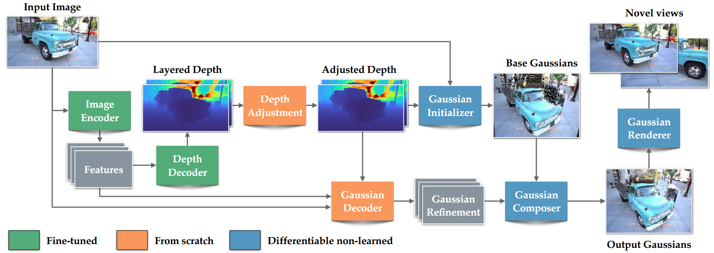

#

<!--more-->

## Abstract

- 单图生3D
- 生成速度快，质量高

## Method

### 1. 模型结构

- 使用Depth Pro模型作为backbone
  - 使用该模型的encoder获取4个feature，输入为1536*1536
  - feature map输入decoder（decoder的最后一层卷积层复制一层）输出两个深度图
  - 模型直接冻结会影响效果，因此encoder的低分辨率部分以及decoder是可训的

- 深度修正
  - 在做深度预测时，网络可能只是通过预测可能结果的平均规模的输出来解决问题，将其用到视图合成时，容易导致视觉伪影
  - unet模块，通过信息瓶颈损失迫使其他模块预测出正确的深度图，尽量不动本模块
- 高斯初始化
  - 使用**修正后的两个深度图**+**输入图**作为输入
  - 下采样1/2到768，768
  - 将输入图上的每一个点，根据深度图，反向投影到3为空间的射线点上（该过程故意不使用内参， 这样网络能在一个**归一化空间**里推理 Gaussian 属性，不必让预测跟不同照片的视场角/FOV 强绑定。  你可以把它理解成：初始化阶段默认一个“canonical camera”，先把几何放到一个统一坐标系；真正渲染到目标视角时，再把源视角/目标视角的相机变换合进投影里处理。如果在该过程中使用内参，就相当于 变成**真实相机坐标系里的 3D 点**  ）
  - 高斯的scale与深度成正比（ **远处的东西**在像素平面上“更密/更小视差”，如果还用同样尺度的 splats，可能覆盖不足或训练更难 ）
  - 颜色直接用输入图的像素颜色
  - 旋转初始化成单位四元数
  - 不透明度固定0.5
  - 两个深度图，一个处理表面，一个处理遮挡

- 高斯解码器
  - 预测属性偏移量
  - DPT结构
    -  **Dense Prediction Transformer (DPT)** 那套做 dense prediction（深度/分割等）的**编码器-解码器范式**：用 ViT/Transformer（或类似多尺度特征的 backbone）做编码，然后用一个“多尺度融合 + 逐级上采样”的解码头把特征还原到高分辨率输出 
    -  “DPT 风格结构” = **多尺度特征（来自编码器） → 自顶向下逐级上采样 + skip 融合 → 卷积 refine → 输出 dense map** 的那套解码器设计思路。 

- 高斯组合器
  -  不是简单相加，而是对不同属性用不同的组合/激活函数 来生成最终属性 

### 2. 训练策略

- 样本由  **input view + novel view** 组成： 
  -  用 input view 预测高斯 
  -  把高斯分别渲染到 input/novel 两个视角 
  -  在渲染结果上计算损失 
-  Stage 1：纯合成数据监督 
  -  先用带**完美图像与深度 GT** 的合成数据训练，让模型学到基本几何/重建规律 
-  Stage 2：自监督微调（SSFT） 
  -  真实数据没有 view synthesis GT 怎么办？ 
  -  他们用 Stage 1 的模型在真实单图上生成 3D 表示并渲染出一个“伪新视角”，然后**交换 input/novel 的角色**来构造训练对：用伪新视角当输入、用真实原图当 novel 的监督目标，从而逼模型适配真实图像分布 

### 损失

-  渲染重建损失 
  -  input/novel 两个视角都做 **L1** 图像损失 
  -  novel view 额外加**感知损失**（feature + Gram matrix），帮助处理遮挡/空洞处的合理补全 
-  Alpha 的 BCE 正则 
  -  在 input view 对渲染的 alpha 做 BCE 惩罚，压制“莫名其妙的半透明像素” 
-  深度相关损失 
  -  只在 input view 的**第一层深度**上，用 disparity 的 L1 去贴合 GT（训练阶段有 GT） 
-  一组“专治伪影”的正则 
  -  第二层深度做 TV 平滑 
  -  抑制 floaters（论文用“disparity 梯度大”的高斯来惩罚） 
    -  **disparity（视差）是立体视觉里用来表示深度的一种量：同一个 3D 点在左右两个相机图像上的水平像素位移差**。  **越近的物体视差越大，越远视差越小**。 
  -  限制高斯 offset 幅度、以及屏幕空间投影方差等 
-  Depth adjustment 的信息瓶颈正则 
  -  对 scale map 做 MAE + multiscale TV，让它只携带“最必要的消歧信息” 

