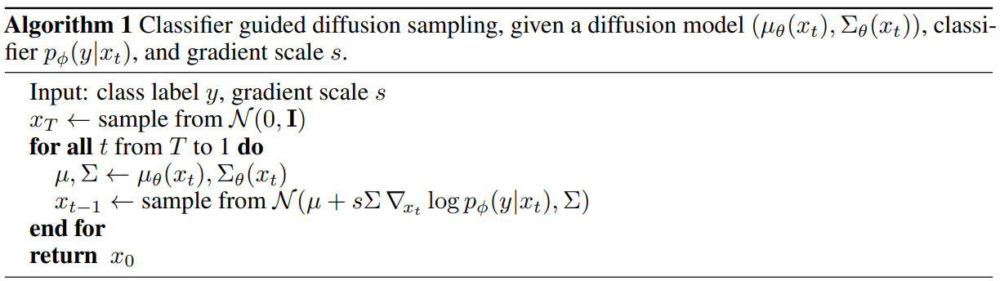
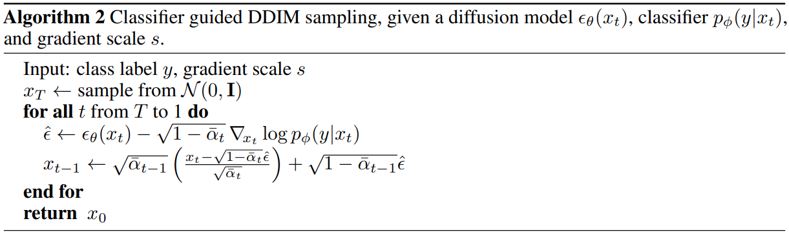
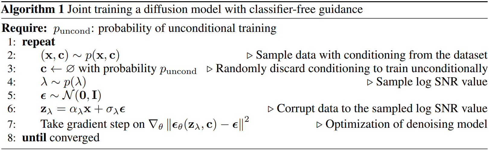
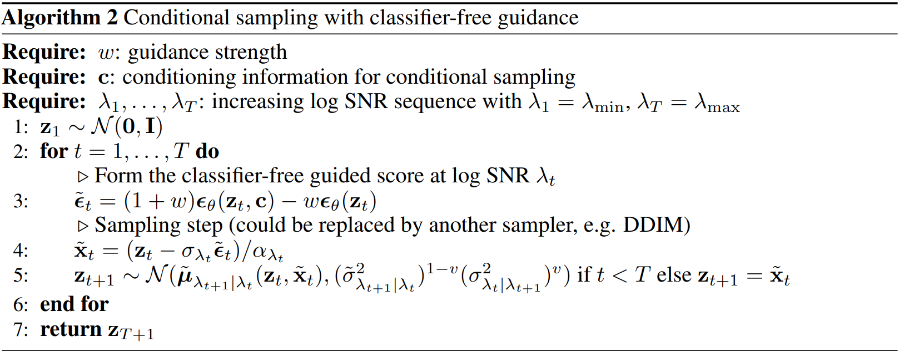

#
<!--more-->

# 1. 扩散模型引导

- 一个问题：我想只生成亚洲人脸，怎么办：
  - 训练集只用亚洲人
  - 跑很多次总能跑出一个
  - 条件生成（条件生成也能降低`fid`）

- 如何给扩散模型引入条件？
- classifier guidance只是个采样策略，不用重新训练

# 2. 公式推导

- 需要解决：$q(X_ {t - 1} | X_ {t}) \rightarrow \hat q (X_ {t - 1 } | X_ { t },y)$
  
- 其中$y$是条件，可以是文本、类别等等。
  
- 使用贝叶斯：

  $$\hat q (X_ {t - 1 } | X_ { t },y) =  \frac{\hat q (X_ {t - 1 } | X_ { t }) \cdot \hat q (y | X_ { t  }, X_ { t - 1 })}{ \hat q (y | X_ { t }) }$$

- 如何求上面的分布：
  - 分母是`y`的分布，是个常数。
  - 分子的两个都是假设出来的，我们都不知道。

## 2.1 三个已知

- 虽然两个分子我们不知道，但是我们希望可以直接使用一个训练好的`DDPM`，因此前向过程是跟`DDPM`一样的：（这个思想跟`DDIM`是一样的）
  - $\hat q (X_ {t } | X_ { t - 1 },y) := q (X_ {t } | X_ { t - 1 })$
  - 此外，训练图像的分布也是不变的：$\hat q( X_ 0) := q( X_ 0)$
- 马尔可夫性质：
  - $\hat q( X_ { 1:T } | X_0 , y) := \prod_{ t = 1} ^ T \hat q( X_ t | X_ { t - 1 }, y)$

## 2.2 分布推导

### 1）解决：$\hat q (X_ {t - 1 } | X_ { t })$

- 根据贝叶斯，结合前向求逆向：
  
- $\hat q (X_ {t - 1 } | X_ { t }) = \frac{ \hat q (X_ t | X_ { t - 1 }) \cdot \hat q(X_ {t - 1})}{ \hat q( X_t)}$
  
- 为了让分子的第一项与已知条件靠拢，应该想办法将`y`引入（通过积分的方式引入）：

  $$\begin{aligned} \hat q (X_ t | X_ { t - 1 }) &= \int_y \hat q( X_ t, y | X{ t - 1 } ) dy \\&=\int_y \hat q(X_ t | y, X_ { t - 1}) \cdot \hat q( y | X_ { t - 1}) dy \\& = \int_y q(X_t | X_{ t - 1}) \cdot \hat q( y | X_ {t - 1 }) dy \\& = q(X_t | X_{ t - 1}) \int_y  \hat q( y | X_ {t - 1 }) dy \\& =  q(X_t | X_{ t - 1}) \cdot 1\end{aligned}$$

- 分子第二项仍然用全概率公式：

    $$ \begin{aligned} \hat q{X_ t} &= \int_ {X_ { 0 \space : \space t-1 }} \hat q( X_ { 0 \space : \space t} ) dX_{ 0 \space : \space t-1} \\&= \int_ {X_ { 0 \space : \space t-1 }} \hat q( X_ { 0 } ) \cdot \hat q( X_ { 1\space : \space t} | X_ 0) dX_{ 0 \space : \space t-1}  \end{aligned} $$
    
    
    - 这里的第二项怎么求：
    
      - $ \begin{aligned} \hat q( X_ { 1\space : \space t} | X_ 0) &= \int_ y \hat q( X_ { 1\space : \space t} , y | X_ 0)dy \\&= \int_ y \hat q( X_ { 1 \space : \space t} |y,X_0 ) \cdot \hat q( y | X_0 ) dy \\&= \int_y \hat q( y | X_ 0) \cdot \prod_ 1 ^ t \hat q( X_ t | X_ { t - 1 }, y) dy \\&= \int_y \hat q( y | X_0 ) \cdot \prod_ 1 ^ t q(X_ t | X_ { t - 1 })dy \\&= \int_ y \hat q( y | X_ 0 ) \cdot q( X_ {1 \space : \space t} | X_ 0 )dy \text{ （马尔可夫性质）} \\&= 1 \cdot q( X_ {1 \space : \space t} | X_ 0 ) \end{aligned} $
      - 算了两次都发现：两次计算的正向的式子都跟`DDPM`是一样的，这也是合理的。
    - 继续计算：
    
    $$ \begin{aligned} \hat q{X_ t} &= \int_ {X_ { 0 \space : \space t-1 }} \hat q( X_ { 0 \space : \space t} ) dX_{ 0 \space : \space t-1} \\&= \int_ {X_ { 0 \space : \space t-1 }} \hat q( X_ { 0 } ) \cdot \hat q( X_ { 1\space : \space t} | X_ 0) dX_{ 0 \space : \space t-1}  \\&= \int_ {X_ {0 \space : \space t-1}} q( X_0 ) \cdot q(X_ { 1\space : \space t} | X_ 0) dX_{ 0 \space : \space t-1} \\&= \int_ {X_ {0 \space : \space t-1}} q( {X_ {0 \space : \space t }} ) dX_{ 0 \space : \space t-1}  \\&= q( X_ t ) \end{aligned}$$
    
    

### 2）解决：$\hat q (y | X_ { t - 1 }, X_ { t })$

$$ \begin{aligned} \hat q (y | X_ { t  }, X_ { t - 1 }) &= \frac{ \hat q( X_t | y, X_{ t - 1 }) \cdot \hat q( y | X_ { t  - 1 }) }{ \hat q( X_ t | X_ { t - 1 }) } \\&= \hat q( X_ t | y, X_{ t-1 } ) \cdot \frac{ \hat q(y, | X_ { t - 1} ) }{ \hat q( X_ t | X_ { t - 1 })} \\&=  q( X_ t |  X_{ t-1 } ) \cdot \frac{ \hat q(y, | X_ { t - 1 } ) }{ \hat q( X_ t | X_ { t - 1 })} \\&= \hat q( X_ t |  X_{ t-1 } ) \cdot \frac{ \hat q(y, | X_ { t - 1 } ) }{ \hat q( X_ t | X_ { t - 1 })} \\&= \hat q(y | X_ { t - 1 }) \end{aligned}$$

## 2.3 综合

- 条件采样可以变成：
  - $\begin{aligned} \hat q (X_ {t - 1 } | X_ { t },y) &= z \cdot q(X_ {t - 1 } | X_ t) \cdot \hat q( y | X_ { t - 1 })  \\&=常数 \cdot DDPM采样 \cdot 分类器 \end{aligned} $
  - 这里的z相当于是一个`normalize factor`，正则化因子，让概率分布和为1。

- 现在就需要两个模型，一个预测$q(X_ {t - 1 } | X_ t) $，一个预测 $ \hat q( y | X_ { t - 1 })   $：
  - 用$P_ \theta (X_t | X_ { t + 1 })$预测$q(X_ {t - 1 } | X_ t) \rightarrow DDPM $
  - 用$P_ \varphi (y| X_t)$预测 $ \hat q( y | X_ { t - 1 })  \rightarrow  $ 分类器

- 当在`t+1`时刻，我们没有$X_t$，此时DDPM还在求他，因此分类器项无法求得确切的值，因此无法通过准确的数学计算得到，只能通过预估得到。

- 处理方法：

  - 对于DDPM项（高斯分布$\sim N( \mu, \Sigma^2)$）：
    
- $log (P_ \theta (X_t | X_ { t + 1 })) = -\frac{1}{2} (X_t - \mu) ^ T \Sigma ^ { -1 } (X_ t  - \mu) + C_1$ 
    
  - 对于分类器项：因为扩散模型的方差都很小（每次注入噪声很少，因此可以合理认为$X_t \approx \mu$，$X_t$在$\mu附近$），我们把$X_t$当作一个变量的话，就可以在$X_t = \mu$处进行泰勒展开（$\nabla = g$是梯度）：
  
  - $\begin{aligned} log P_ \varphi (y| X_t) &= log ( P_ \varphi (y| X_t) |_{X_t = \mu} ) + (X_t - \mu ) \cdot \nabla_ {X_t} log( P_ \varphi (y| X_t) |_{X_t = \mu} ) + o(\space) \\&\approx C_2 + (X_t - \mu ) \cdot \nabla \end{aligned}$
  
  - 两项汇总：

    - $\begin{aligned} log \space \hat q (X_ {t - 1 } | X_ { t },y) &= log (P_ \theta (X_t | X_ { t + 1 })) + log P_ \varphi (y| X_t) \\&= -\frac{1}{2} (X_t - \mu) ^ T \Sigma ^ { -1 } (X_ t  - \mu) + C + (X_t - \mu ) \cdot \nabla \\&= -\frac{1}{2} (X_t - \mu -\Sigma g) ^ T \Sigma ^ { -1 } (X_ t  - \mu - \Sigma g) + \frac{1}{2}g^ T \Sigma g +C \\&= -\frac{1}{2} (X_t - \mu -\Sigma g) ^ T \Sigma ^ { -1 } (X_ t  - \mu - \Sigma g)  + C^ \prime \end{aligned}$

  - 因此$\hat q (X_ {t - 1 } | X_ { t },y) \sim N( \mu + \Sigma g \space , \space \Sigma^2)$

  - 因此$X_t = \mu + \Sigma g + \Sigma \epsilon$，其中：
  
  - $\mu$在DDPM中可以根据预测的噪声计算
    - $g$是分类器的梯度（这也就是条件部分，条件就蕴含在分类器梯度里）
  
    

# 3. 泛用采样

- 一个问题：对于偏移项$\Sigma g$，$\Sigma$是采样方差，但是在比如DDIM等模型中，$\Sigma = 0 $，此时方法不适用了。

- 引入一个概念：分数（score）

  - 对于一个分布$P(X)$，其分数就是他的梯度：$\nabla_ x P( X )$
  - 在DDPM中模型预测的是一个分布，在score based模型中他们认为扩散模型在预测score。
  - 在DDPM中
    - $P(X_ t | X_ 0) \sim N(\sqrt{ \bar { \alpha_{t} } } X_ 0 \space, \space 1- \bar \alpha_ t)$
    - $log \space P(X_ t | X_ 0 ) = -\frac{1}{2} \frac{( X_t - \sqrt{ \bar \alpha_ t} X_0 )^ 2 }{1-\bar \alpha_ t}$

  - 对于$log \space P(X_ t | X_ 0 )$的分数值：$\nabla_ { X_t } log \space P(X_t | X_0 ) = - \frac{  X_t - \sqrt{ \bar \alpha_ t} X_0  }{1-\bar \alpha_ t}$
    - 一个很巧的事：$X_t = \sqrt{ \bar \alpha_ t }X_0 +\sqrt{ 1- \bar \alpha_t} \epsilon \\\epsilon = \frac{X_ t -\sqrt{\bar \alpha_t } X_0 }{ \sqrt{ 1- \bar \alpha_t}}$
    - 上面倒数第一个等式和倒数第三个等式很像：$\begin{aligned} \nabla_ { X_t } log \space P(X_t | X_0 ) &= - \frac{  X_t - \sqrt{ \bar \alpha_ t} X_0  }{1-\bar \alpha_ t} \\&= - \frac{\epsilon }{ \sqrt{1 - \bar \alpha_ t} } \end{aligned}$
    - 上面式子中$\epsilon$是抽样得到的，如果把他改成预测得到的噪声$\epsilon_ \theta$就可以得到预测出的分数：$\nabla_ { X_ t } log \space P_ \theta ( X_t ) = - \frac{\hat \epsilon_ \theta (X_ t ) }{ \sqrt{1 - \bar \alpha_ t} } \space \space \space（3-1）$
    - 而我们需要预测的分数是：
      - $\begin{aligned} \nabla_ { X_ t } log[ P_ \theta (X_ t) \cdot P_ \varphi (y | X_ t)] &= \nabla log \space P_ \theta (X_ t ) + \nabla log \space P_ \varphi (y | X_t) \\&= -\frac{\hat \epsilon_ \theta (X_ t) }{ \sqrt{1 - \bar \alpha_ t} } + g \end{aligned}$
    - 根据(3-1)可以知道分数：$ \nabla_ { X_ t } log[ P_ \theta (X_ t) \cdot P_ \varphi (y | X_ t)] = - \frac{\hat \epsilon_ \theta ^ \prime (X_ t ) }{ \sqrt{1 - \bar \alpha_ t} } $
    - 因此：$- \frac{\hat \epsilon_ \theta ^ \prime  }{ \sqrt{1 - \bar \alpha_ t} } = -\frac{\hat \epsilon_ \theta (X_ t) }{ \sqrt{1 - \bar \alpha_ t} } + g \\ \hat \epsilon ^\prime =  \hat \epsilon_ \theta - \sqrt{ 1 - \bar \alpha_ t} g $
    - 因此这里只需要将DDPM预测出来的噪音做一个微小的偏移，然后就可以使用DDIM采样了。

# 4. 采样算法

## 4.1 采样算法1

- $N( \mu + s \Sigma \nabla_ {x_ t} log \space p_ \phi (y|x_ t ), \Sigma)$其中多了个s，用来控制条件控制强度：
  - $s  \nabla log \space p (y|x_ t ) \rightarrow \nabla lg \space p (y|x_ t )^ s \cdot z  $， 其中z用于归一化（假设当s=1时，比如原本这里的p有两种可能取值：0.9和0.1，当s增大为2时，两个可能取值：$0.9^2，0.1^2$，归一化之后$0.9^2$就变得比原本的0.9更大了。

## 4.2 采样算法2

- 预测处噪声然后做一个偏移，然后用DDIM采样。

# 5. 分类器训练

- 训练数据与扩散模型相同
- 分类器训练的数据是有噪音的，强度随机。

# 6. classifier-free guidance

- 核心思想：用一个模型把条件的和非条件的放到一个模型里一起训练。
  - $\epsilon_ \theta (X_ t, t) \rightarrow \epsilon_ \theta (X_ t, t, y)$ , 直接用右边的模型，然后采样的时候就看你加不加y；如果不加y，他也有一个非条件的生成方式。（他这个没有什么技术可言，完全就是让模型去硬学，原因是现在我们有大数据，大模型，更好的显卡，支持模型可以用这种简单粗暴的方式去训练）

- 从DDPM到classifier-free guidance的时候diffusion模型已经有了很多改变
  - 比如这里时间采样的方式不再是离散的`1...T`，变成了连续的一个随机变量 $\lambda$ 
  - 算法2的采样方式变成了某种方差的1-v次方再乘以之前的方差的v次方
  - $X_T$变成了$Z_1$

- $p_ {uncond }$是一个输入条件，一个概率，用来训无条件扩散模型的概率，

- 从数据集拿出一张图片和对应的分类
- 以$p_ {uncond }$的概率将类别变成空（用这种方式将条件和非条件放到一起训练，只是多了这一步而已）
- 采样一个时间步$\lambda$
- 采样随机噪音
- 一步到位加噪得到$Z_ \lambda$

- 用加权的方式获得噪声：条件模型和非条件模型预测的结果做加权（当c取空时，预测的噪声就是非条件模型预测的噪声）