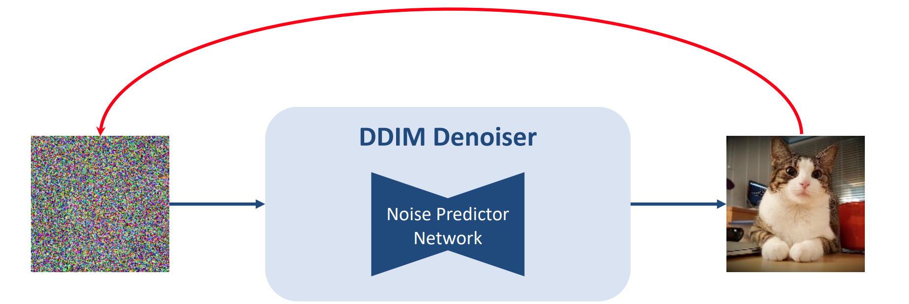

#

<!--more-->

# DDIM Inversion

- 将一张真实图片转换为**生成模型对应的latent**，要求将这个latent输入到生成模型中之后能够重构出原始图片。

- 给定一张无噪声的图片和一个训练好的denoiser，找到一个初始噪声（这个噪声通过去噪可以得到无噪声图片）（红线）

- 这个过程与diffusion的forward前向加噪过程有点像
  - forward过程不断sample一个noise再加上
  - inversion过程中不是加的随机noise，而是通过denoiser推断出来的固定的噪声

# 1. 无条件的DDIM Inversion

## 1.1 加噪过程

- 给定真实图片$x_0$，不断采样高斯噪声$\epsilon$，按照预先定义的scheduler加到latent上。

  $$x_t = \sqrt { \alpha _ t } x_ {t - 1 } + \sqrt{ 1 - \alpha_ t } \epsilon$$

## 1.2 去噪过程

- 给定一个随机高斯噪声，使用网络$\epsilon_ \theta$，不断预测出当前步加的噪声$\epsilon( x_ t, t)$，并减去噪声，从而一步步生成新的图片。

  $$x_ { t-1 } = \frac{1}{\sqrt { \alpha_ t} }( x_ t - \frac{\beta _ t} {\sqrt{ 1- \bar\alpha_ t } } \epsilon_ \theta (x_t, t ) ) + \sigma_ t z$$

- 将上式改写成DDIM去噪过程：

$$
x_{t-1}  =  \sqrt{\overline{\alpha}_{t-1}}
 \Bigl( \frac{ x_{t}  -  \sqrt{\, 1 - \overline{\alpha}_{t}\, } \epsilon_{\theta}(x_{t}, t) }{\sqrt{\,\overline{\alpha}_{t}\,}}\,\Bigr)
\;+\; \sqrt{\,1 - \overline{\alpha}_{t-1} - \sigma_{t}^{2}\,}\,\epsilon_{\theta}(x_{t}, t)
\;+\; \sigma_{t}\,z.
$$

- 将上式反写，已知真实图片，要反推出$x_ T$：

$$
x_{t} 
=
\sqrt{\frac{\overline{\alpha}_{t}}{\overline{\alpha}_{t-1}}}\,x_{t-1}
\;+\;
\sqrt{\overline{\alpha}_{t}}\,
\Bigl(\,
\sqrt{\frac{1}{\overline{\alpha}_{t}} - 1}

\;-\;
\sqrt{\frac{1}{\overline{\alpha}_{t-1}}- 1}

\Bigr)\,
\epsilon_{\theta}\!\bigl(x_{t},\,t\bigr).
$$

- 上式$\epsilon_ \theta (x_ t, t)$，的$x_t$未知，考虑到**基于ODE过程可以在小步长的限制下进行反转的假设** ，我们可以用$\epsilon_ \theta (x_ { t - 1}, t - 1)$或$\epsilon_ \theta (x_ { t - 1}, t )$来对其进行近似。

>DDIM inversion过程是否可以理解成一个确定性的DDIM前向加噪过程？

# 2. 无分类器引导下的DDIM Inversion

- 在stable diffusion中引入了文本条件，每一步的噪声预测：$\epsilon_ \theta( x_ t, t, c)$.

$$
\tilde{\epsilon}_{\theta}\bigl(x_{t},\,t,\,C,\,\varnothing\bigr)
=
w \cdot \,\epsilon_{\theta}\!\bigl(x_{t},\,t,\,C\bigr)
\;\;+\;\;
\bigl(1 - w\bigr)\,\epsilon_{\theta}\!\bigl(x_{t},\,t,\,\varnothing\bigr).
$$

- 如果目标仅仅是重构原始图像（所有过程中文本提示词部分不变），使用$w=1$即可，使用近似的$\epsilon_ \theta( x_t, t)$，每一步的误差几乎可以忽略不计。然而， 在文本引导的图像编辑中，我们在反推出真实图片的 latent 之后，一般会修改文本 prompt，并期望生成结果在保证原始图像整体布局的情况下，对文本 prompt 的修改部分进行编辑。这就要求在重新生图的过程中使用较高的引导系数$w>1$， 此时每一步的误差就会不断累积，对整体布局的重构造成影响，最终生成的图像严重偏离原图像。 

## 2.1 Null Text Inversion

https://blog.csdn.net/qq_36104364/article/details/138966926

 [空文本逆映射 Null-text Inversion_哔哩哔哩_bilibili](https://www.bilibili.com/video/BV1h34y1K7s7/?spm_id_from=333.337.search-card.all.click&vd_source=3988165c7848b1c4da919fec04b512a5) 

- $w=1$ 时反推出的 latent 虽然在 CFG  引导的情况下重构结果不够好，但其实也大差不差，是一个不错的起始点。 基于此，作者们提出了对 Null Text Embedding 进行 Pivotal Tuning 的方法。
- 首先使用$w=1$ 对真实图片进行 DDIM Inversion，得到每一步的噪声 $z_ t ^ *$。将$z_T ^ *$和 新的文本 prompt 输入到模型中进行图像编辑或重构 ， 在此过程汇总，将每一步 CFG 采样出的噪声 $\epsilon_ \theta$计算出的$z_t$向$z_t ^ *$靠近， 计算二者的 MSE 损失，用于参数更新。  更新哪些参数呢？为了保证对模型其他部分不造成影响，作者提出对 null text 的 embedding $\varnothing$ (即CLIP text encoder对空字符串的编码）进行微调， 而所有其他网络以及文本 prompt 的 embedding 都保持不变。 

-  本方法在每一个时间步都会单独优化出一个特定的 null text embedding 。 这样，相当于为每张真实图片都训练出一组 特定 null text embedding，在该 embedding 下进行图像重构或编辑，就可以保持原始图像的布局。 

  

  

- 算法流程：

  1. 给定一张真实图片，与prompt，对prompt进行编码得到embedding：$C$，将$w$设为1，使用DDIM Inversion计算出一系列pivot噪声$z_T ^ *,...,z_0 ^ *$。

  2. 将CFG scale设置为$w=7.5$，将$\bar z_ T$初始化为$z_T ^ *$，$\varnothing_ T$初始化为$\psi("")$，开始训练。

  3. 训练过程中计算损失：$ \min_{\varnothing_{t}} \Bigl\|\,   z_{t-1}^{*}  \;-\;  z_{t-1}\!\bigl(\,\bar{z}_{t},\;\varnothing_{t},\;C\bigr)  \Bigr\|_{2}^{2}.$ 并更新当前步的$\varnothing_ t$
  
  4. 每个时间步的$\varnothing_ t$都要训练，每个时间步训练N次迭代， 第 t 步训练结束后，根据训练好的$\varnothing_ t$初始化第t-1步的$\bar z_ { t-1}$和$\varnothing_ { t - 1}$：
     $$
     \bar z_ { t - 1`} = z_ { t - 1 }(\bar z_ t, \varnothing_ t, C) \\
     \varnothing_ { t - 1 } = \varnothing_ t
     $$
     

## 2.2 Prompt Tuning Inversion

- 与Null Text Inversion相反，使用$w=0$时的$z_ t$作为pivot，然后在生图过程中优化文本prompt的embedding。

### 2.2.1 Negative Prompt Inversion

- Null Text Inversion毕竟还是需要训练的，编辑效率比较低。Negative Prompt Embedding提出一种无需优化的inversion方案， 在编辑效果也不输 Null Text Inversion 的条件下，效率大大提升。 

-  具体方法：在重构或编辑的生图过程中，将 Negative Prompt 从空字符串替换成原图 prompt 即可。 

  1. DDIM Inversion可写成：$z_{t}^ * = \sqrt{\frac{\overline{\alpha}_{t}}{\overline{\alpha}_{t-1}}}\,z^ *_{t-1} \;+\; \sqrt{\overline{\alpha}_{t}}\,
     \Bigl(\, \sqrt{\frac{1}{\overline{\alpha}_{t}} - 1} \;-\; \sqrt{\frac{1}{\overline{\alpha}_{t-1}}- 1} \Bigr)\,
     \epsilon_{\theta}\!\bigl(z^ *_{t-1},\,t-1, C\bigr).$
  2. 将上式结合Null Text Inversion的推导公式：$\bar z_ { t-1} - z_{ t - 1 }^ * = \,z^ *_{t-1} \;+\; \sqrt{\overline{\alpha}_{t-  1 }}\,
     \Bigl(\, \sqrt{\frac{1}{\overline{\alpha}_{t-1}} - 1} \;-\; \sqrt{\frac{1}{\overline{\alpha}_{t}}- 1} \Bigr)\,
      [\tilde \epsilon_{\theta}\!\bigl(\bar z_ {t },\,t, C ,\varnothing_ t \bigr)-\epsilon_ \theta(z_ { t - 1 } ^ *, t - 1 , C) ].$

  3. 在null text inversion中$\bar z_ t$的优化目标是$z_ t ^ *$， Negative Prompt Inversion 在这里假设优化得做够好，即有 $\bar z_t = z_ t ^ *$，即上式最后一项=0：
     $$
     \begin{aligned}
     \epsilon_ \theta(z_ { t - 1 } ^ *, t - 1 , C) &=  \tilde \epsilon_{\theta}\!\bigl(\bar z_ {t },\,t, C ,\varnothing_ t \bigr) \\\\ &=w\epsilon_ \theta( \bar z_ t, t, C)+(1-w)\epsilon_ \theta(\bar z_t, t, \varnothing_ t)
     \end{aligned}
     $$

  4. 又 假设有相邻步的模型预测可以相互近似，即有： 
     $$
     \epsilon_ \theta(z_ { t - 1 } ^ *, t - 1 , C) =\epsilon_ \theta(z_ { t  } ^ *, t , C) =\epsilon_ \theta(\bar z_ { t } , t , C)
     $$

  5. 所以当$\epsilon_ \theta(\bar z_ { t } , t , C) = \epsilon_ \theta(\bar z_ { t } , t , \varnothing_ t)$时，达到最优。 也就是说，Null Text Inversion 的优化结果 $\varnothing_t$ 可以直接由原文本条件 embedding $C$ 来代替。这样我们就可以省略掉麻烦的优化过程，在重构或编辑的生图过程中，直接将 Negative Prompt 从空字符串替换成原图 prompt。  从而， 

     - 在重构时，CFG 中的条件 embedding 和无条件 embedding 相等，都是 $C$ 。从而就相当于没有 CFG 的无条件生成模型，DDIM Inversion 自然可以成立。
     - 在编辑时，直接将 $C$ 当做 Null Text Inversion 中优化得到的 $\varnothing_ t$ ，大大提高了编辑效率。

