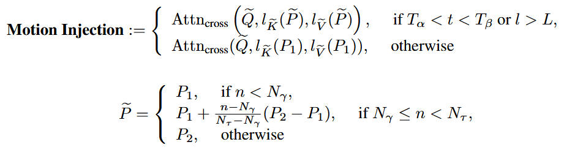

#
<!--more-->

## 方法

### noise rescheduling

- 先随机生成8个$X_T$，然后对他进行扩展：0-8不变，9-12来自0-3的重排，13-18来自4-8的重排。
- 得到16帧，将窗口设置为8，因此一共有3个片段，处理过程还是分片生成，不过这里做fusion的地方是在temporal transformer的输出。
- 对于得到的三个输出，使用mimicmotion的类似方式按照距离进行融合。

### motion injection

- 假设生成长视频使用了两个提示词，论文指出：LDM分别在去噪过程的早期、中期和晚期合成不同级别的视觉内容场景布局、对象形状和精细细节。作者希望在场景布局上保持不变，因此在较大的时候应该都使用同一个提示词（第一个提示词）；当处于中间时间步（或处于unet的decoder部分）的时候进行提示词替换。对于提示词替换，前面的帧使用提示词1，中间部分的帧使用提示词1+提示词2的组合，最后部分的帧使用提示词2 ...