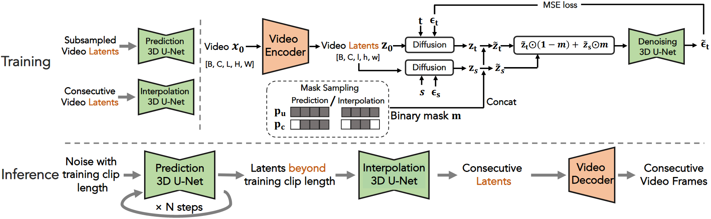

#
<!--more-->

### 两阶段训练

#### 1）自回归预测模型

- 假设我要生成1000帧，取关键帧间隔为10，一次生成10帧

  >- 先生成帧0，10，20 ... , 100 （无条件生成）
  >
  >- 然后将上面的帧100作为条件生成：100，110，... ，200（条件生成）

- 通过掩码设置，使得模型可以在无条件生成与条件生成之间切换
  - 在一次生成中，对于$z_ t = z_t ^ 0 , z_ t ^ 1, \cdots, z_ t ^ {100}$ ，结合对应原视频：
    - $z_ 0 =  z_ 0 ^ 0, \cdots, z_ 0 ^ {100} \in \mathbb{R} ^ {101 \times h \times w \times  c }$
    - $z_ t =  z_ t ^ 0, \cdots, z_ t ^ {100}$
  - 对每一帧都增加一个掩码，加到通道维度
    - $\tilde z_ 0 =  [z_ 0 ^ 0 , M_ 0], \cdots, [z_ 0 ^ {100} , M_ {100} ] \in \mathbb{R} ^ {101 \times h \times w \times ( c+1 )}$
    - $\tilde z_ t =  [z_ t ^ 0 , M_ 0], \cdots, [z_ t ^ {100} , M_ {100} ]$
  - 使用掩码之后就可以融合条件生成与非条件生成：
    - $\tilde Z_t = \tilde z_ t \odot ( 1 - M ) + \tilde z _ 0 \odot M$
    - 对于当前这一帧，如果M=0，那么这一帧的$z_t ^ i = z_ t ^ i$；如果M=1，那么这一帧的$z_t ^ i = z _ 0 ^ i$，相当于将这一帧的$z_t$替换成清晰的帧（类似sr3将清晰帧concat到latent上）

- 训练的时候：
  - 输入一个视频$x_0$，encode后得到$z_ 0$，将$z_ 0$加上噪声$\epsilon$ 得到加噪版本：$z_t$
  - 对于$z_ t$的每一帧，生成一个掩码（每一帧的掩码全是1或者全是0，生成的掩码有两种情况：
    - 0，0，...，0 : 每一帧的$z _ t$都不做改变
    - 1，0，...，0：将第0帧的$z_t ^ 0$替换成$z_ 0 ^ 0$，当作条件
    - 不会出现：0，1...，只有可能是1在前：111...0000

#### 2）层次生成

- 由第一步生成了：0，10，20，... 1000
- 取0，10作为条件，使用插帧模型生成：0，1，2，3，...，10
- 训练的时候掩码设置变成：1，0，0，...，0，0，1（将首尾替换成清晰的帧，作为条件）

#### 3）条件扰动

- 之前是替换成$z_ 0$，可能$z_ 0$作为不加噪的版本跟加噪之后的版本（即使是加一步噪声）分布有很大不同？（论文参考的Cascaded diffusion models for high fidelity image generation.）所以现在替换成$z_s$，s是一个比较小的值。