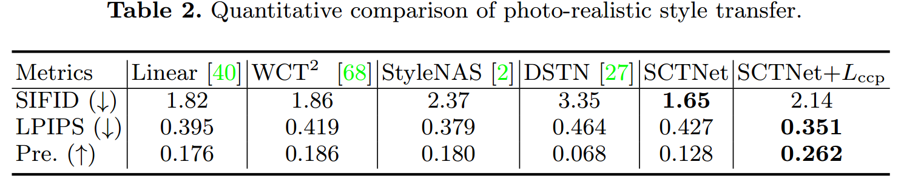

#

<!--more-->

# CCPL: Contrastive Coherence Preserving Loss for Versatile Style Transfer论文理解

- ECCV 2022

- [论文地址](https://arxiv.org/abs/2311.16102)

## 1. Abstract

- 目标：

  - 

设计一种通用多功能的风格迁移方法，能够在训练过程中不看视频的情况下，同时进行艺术性、真实感和视频风格迁移。 &#9660
 we aim to devise a universally versatile style transfer method capable of performing artistic, photo-realistic, and video  style transfer jointly, without seeing videos during training. 

- 之前方法的limitation：

  - 

 以往的单帧方法要求对整个图像有很强的约束，以保持时间一致性，这在很多情况下可能会被违反。 &#9660
 Previous single-frame methods assume a strong constraint on the whole image to maintain temporal consistency, which could be violated in many cases.

- 本文方法：
  - 首先做一个合理的假设：全局不一致性由局部不一致性主导
  - 然后设计了一个应用于局部patch的通用的对比相干保持损失（CCPL）。这个损失可以
    - 在风格转换过程中保持内容源的连贯性，而不会降低风格化。 
    - 具有邻域调节机制，大大减少了局部失真，大大提高了视觉质量。 
    - 用在除通用风格迁移之外的任务，如image to image的翻译
  - 为了更好融合内容特征和风格特征，提出简单协方差变化（SCT）将内容特征的二阶统计量与风格特征对齐。 

## 2. Introduction

### 2.1 视频风格迁移

#### 2.1.1 直觉做法

- 方法：将风格应用到每一帧
- 缺点：没有时间一致性的约束，生成的视频有明显的闪烁伪影和两个连续帧之间的不连贯。 

$ \downarrow  $

#### 2.1.2 以前的解决方法

- 

方法：使用光流作为引导来恢复原视频的“估计运动” &#9660
used optical flow as guidance to restore the estimated motions of the original videos. 

- 缺点：计算量大，并且“估计运动”的准确性严格限制了风格化视频的质量。 

$ \downarrow  $

#### 2.1.3 最近一些方法

- 方法：试图通过单帧正则化（在全局层面进行优化）来提高视频输出的时间一致性。他们试图确保从内容特征到融合特征的线性转换。
  - 基本思想：鼓励在内容源中保留密集的成对关系。
  - 缺点：如果没有明确的指导，“线性性质”很大程度上受到全局样式优化的影响。 因此他们的结果仍然有时间一致性问题。
  
-  

作者注意到很多生成的视频虽然在内容保持上表现的很好，但会局部噪声会影响一致性。因此本文不考虑使用全局约束，而是使用使用局部约束。&#9660 
We notice that most video results show good structure rigidity to their content video inputs, but the local noise escalates the impression of inconsistency. So instead of considering a global constraint that could be easily violated, we start by thinking about a more relaxed constraint defined on local patches.

#### 2.1.4 本文想法

- 方法：

  - 1

    - 对于结果视频$V_ {cs}$中相邻的两帧$I_ {cs} ^A$和$I_ {cs} ^B$，取出相同位置的两个patch：$R'_ A, R'_ B$
    - 对于输入的内容视频$V_ c$对应的两帧$I_ c ^ A$和$I_ c ^ B$，取出对应位置的两个patch：$R_ A, R_ B$
    - $R'_ A, R'_ B$之间的变化类似于$R_ A, R_ B$之间的变化

  - 2

    - 如果相邻两帧的时间间隔很小，那么很可能会在$R_ B$邻近区域找到一个与之相似的patch：$R_ C$ (注意$R_ C$是在相邻帧的邻域)

    $ \downarrow $

    - 可以将同一图像中相邻的两个patch视为连续帧中相同位置的patch。这样就可以仅使用单帧图像应用约束。
    
    $ \downarrow $
    
    - 仅约束这些patch，让他们的变化相同的话会导致输出图像与内容图一样（欠风格化）
    - 采用对比学习的思想，使用InfoNCE loss
    
  - 本文方法可以用于任何现有的图像风格迁移网络，以提高其在图像和视频上的性能 

- 为了能够高效地融合内容和风格特征，本文提出SCTNet。
  
  - 核心模块是：融合风格特征和内容特征的简单协方差变换（SCT）模块。它计算样式特征的协方差，并直接将特征协方差与归一化的内容特征相乘。与AdaIN和Linear中的融合操作相比，SCT操作简单，同时可以捕获精确的风格信息。 

#### 2.1.5 本文贡献

- 提出CCPL用于通用风格迁移
  - 根据相邻patch的差异，可以控制内容相似性
  - 可以嫁接到其他风格迁移方法

- 提出SCT来有效地对齐内容和风格特征的二阶统计量
  - 结构简单，效率高（在512 × 512的尺度下约为每秒25帧） 

## 3. Relate Works

### 3.1 图像风格迁移

- 最先提出：NST
- 加速：将迭代优化过程近似为前馈网络，并通过快速向前传递实现风格迁移 
  - 之前是迭代优化出来一张结果图
  - 现在是网络生成一张结果图
- 更广泛的应用：单个模型可以迁移多个风格

- 从随机图像迁移风格
  - Style-swap methods： 将每个内容patch与最接近的风格patch交换。 
  - WCT：用奇异值分解对图像进行白化和再上色。
  - AdaIN：替换特征的均值和标准差以匹配风格

- 基于注意力
  - 用线性变换来对齐融合特征和风格特征之间的二阶统计量。 
  - 用多通道相关对其进行了改进
  - SANet利用空间相关性与内容特征重新排列风格特征。 
  - AdaAttN结合AdaIN和SANet来平衡全局和局部风格效应。 
  - 用风格感知的归一化损失来平衡风格化 

- photo-realistic风格迁移
  - 。。。

### 3.2 视频风格迁移

- 根据是否使用光流大致可以分为两类

#### 3.2.1 基于光流

> 试图估计原始视频的motion，并将其恢复到生成的视频中。 

- 提出temporal loss，用前一帧的扭曲来调节当前帧，将图像风格传输算法扩展到视频中。 
- 设计RNN结构基线，并在特征域进行warping操作。 
- 在渲染前将之前的风格化帧与当前的内容帧连接起来，形成一个流损失作为约束。 

- 将时间相干性整合到具有混合损失的风格化网络中。 
- 。。。

>- 光流约束虽然可以改善时间一致性，然而光流估计并不完全准确，导致结果出现伪影。
>
>- 当图像较大时，计算量大。

#### 3.2.2 不基于光流

- 为内容特征设计了线性变换，以保持结构亲和性。 
- 用L1归一化取代SANet的softmax运算，得到更平坦的注意力得分分布
- 复合时间正则化来增强网络对运动和光照变化的鲁棒性。 

>与这些方法相比，CCPL对网络架构没有要求，使其对其他网络具有特别的适应性。 

### 3.3 对比学习

## 4. Methods

### 4.1 CCPL

- 假设当两帧时间间隔足够小时，生成帧之间的变化线性依赖于对应的内容帧之间的变化：

    $$\lim \limits_{\Delta t\to0}\mathcal{D}(C_{t+\Delta t},C_t)\simeq\mathcal{D}(G_{t+\Delta t},G_t), \tag 1 $$

	- $\mathcal{ D } (a, b )$表示a和b之间的差异
	  - *~~这种约束可能过于严格，不适用于整个图像，但在技术上适用于局部补丁，这里通常只有简单的图像转换，例如平移或旋转，可以发生。~~*

- 计算过程：

  

  

  1. 将生成图像$G$和内容图$C$送入固定的图像编码器$E$得到特定层的feature maps：$G_f, C_f$

  2. 随机从$G_f$采样N个向量：$G_ a ^ x, \space x=1, \cdots,N$（红点）

  3. 对于每一个$G_a ^x$，选择8个周围最近的向量：$G_n ^{ x,y }，\space y=1, \cdots, 8$ ($n$表示neighbor)

  4. 对于$C_ f$在对应的位置进行同样的操作得到$C_a ^x， C_ n ^ {x,y}$

  5. 用如下方式计算一个中心向量与邻居向量的difference：

     $$d_g^{x,y}=G_a^x\ominus G_n^{x,y} \space \space \space \space , \space \space \space \space d_c^{x,y}=C_a^x \ominus C_n^{x,y} , \tag 2$$

     - 其中$\ominus$表示向量减法
     - $d_ g ^ {x,y }$表示生成图中x中心点与y邻居的difference

  - 为了实现公式1：

    - 方法1：让$d_ g ^ { x,y } = d_c ^ { x,y }$

      - 鼓励生成图=内容图，与风格损失矛盾

    - 方法2：用对比学习的方法

      - 相同位置的$d_g , d_c$作为正对

      - follow [10]  构建一个两层MLP将difference向量映射并归一化到一个单位球体上，然后计算InfoNCE loss：

        $$L_{\mathrm { ccp } } = \sum_ { m=1 }^ {8 \times N } - \log [ \frac { \exp( d_g^ m \cdot d_ c^ m / \tau ) } { \exp( d_ g^ m \cdot  d_ c^ m / \tau ) + \sum_ { n=1, n \neq m }^ {8 \times N } \exp(d_ g^ m \cdot d_ c^ n / \tau ) } ],\tag 3$$

        - $\tau$ 表示温度超参数，默认设置为0.07 
        - 复杂度$O( 8 \times N) ^ 2$

### 4.2 SCT

> 上面设计的CCPL已经保证了时间一致性，下面设计一个简单有效的模块来做风格迁移
>
> - AdaIN： 直接对齐内容和风格特征的通道均值和方差，忽略了通道间的相关性
> - Linear： 设计了一种通道注意力机制，将风格特征的二阶统计量转移到相应的内容特征上。但是我们通过经验发现Linear[40]的结构是可以简化的。 

- 本文设计简单协方差变换模块（SCT）来融合内容特征和风格特征。

- 计算过程：
  1. 对内容特征$f_ c$进行均值方差归一化得到$\bar f_c$
     - $\mu_{c}=\frac{1}{H\times W}\sum_{h=1}^{H}\sum_{w=1}^{W}f_{c}(h,w)\\\sigma_{c}=\sqrt{\frac{1}{H\times W}\sum_{h=1}^{H}\sum_{w=1}^{W}(f_{c}(h,w)-\mu_{c})^{2}}$
     - $\hat{f}_c=\frac{f_c-\mu_c}{\sigma_c}$
  2. 对风格特征$f_s$进行均值归一化得到$\bar f_ s$
  3. 为了降低计算量，将$\bar f_c ， \bar f_ s$分别送入cnet和snet（三个卷积层夹两个relu层）来降维（512 -> 32）得到$f'_c, f'_s$；然后将$f'_s$展平，计算其协方差矩阵$cov(f'_s)$以找出其通道相关性。
  4. 对$f'_c, cov(f'_s)$矩阵相乘融合特征得到$f_g$，然后用卷积层（conv）扩展维度（32->512），然后加上风格特征$f_s$的channel means（$\mu_ s$）

- encoder（vgg19） +  SCT + Decoder = SCTNet
- 风格化效果与Linear相当，同时更快，更轻。

### 4.3 loss Function

$$L_{\mathrm{total}}=\lambda_c\cdot L_\mathrm{c}+\lambda_s\cdot L_\mathrm{s}+\lambda_{ccp}\cdot L_\mathrm{ccp} \tag 4$$

$$  L_\mathrm{c}=\left\|\phi_l(I_g)-\phi_l(I_c)\right\|_F   \tag 5$$

$$L_\mathrm{s}=\sum_l(\|\mu(\phi_l(I_g))-\mu(\phi_l(I_s))\|_F+\|\sigma(\phi_l(I_g))-\sigma(\phi_l(I_s))\|_F) \tag 6$$

- 其中$\phi_i ( \cdot )$表示encoder的第$l$层输出的feature map
- 对于艺术风格迁移用{relu4 1}计算内容损失, {relu1 1, relu2 1, relu3 1, relu4 1}计算风格损失, {relu2 1, relu3 1, relu4 1} 计算CCPL
- 对photo-realistic风格迁移，用{relu3 1}计算内容损失, {relu1 1, relu2 1, relu3 1}计算风格损失, {relu1 1, relu2 1, relu3 1}计算CCPL
- $\lambda_c = 1 , \lambda_s = 10, \lambda_{ ccp } = 5$
- 使用Frobenius范数衡量损失矩阵大小$\|A\|_F=\sqrt{\sum_{i=1}^m\sum_{j=1}^n|a_{ij}|^2}$

## 5. Experiments

### 5.1 实验设置

#### 1）细节

|              |                                                        |                         |
| ------------ | ------------------------------------------------------ | ----------------------- |
| 数据集       | MS-COCO内容图 Wikiart风格图                         | 每个数据集大约80000张图 |
| 优化器       | Adam                                                   |                         |
| 学习率       | le-4                                                   |                         |
| batch size   | 8                                                      |                         |
| 训练迭代次数 | 160K                                                   |                         |
| 图片处理     | 先将较小维度调整为512。然后随机裁剪256 × 256作为输入。 |                         |
| 损失函数处理 | 只将相同内容图像内的差异向量视为负样本                 |                         |

#### 2）指标

| 指标                                                  | 解释                                                         |
| ----------------------------------------------------- | ------------------------------------------------------------ |
| $I_ { cs }$与$I_ s$之间的SIFID                        | 风格分布距离，越小越好                                       |
| LPIPS                                                 | 原本是用来描述生成图像的多样性。 本文中， 较小的LPIPS表示：photo-relastic结果较少的局部失真（扭曲）；两个风格化视频帧之间的变化很小。 LPIPS只考虑了风格化视频帧之间的相关性，忽略了原始视频帧之间的变化 |
| [63]中定义的时间损失                                  | 通过利用两帧之间的光流来对某一帧风格化结果进行扭曲（对图像进行形变以匹配另一个图像的过程）并计算与另一个风格化帧的Frobenius差。 较低的损失表明两帧之间的相干性得到了更好的保存。 |
| 评估了短期一致性（两个相邻帧）和长期一致性（间隔9帧） | 对于短期一致性：直接使用来自MPI Sintel dataset的ground-truth光流。 对于长期一致性：用PWC-Net来估计两帧之间的光流 |

- 解释：假设内容视频是$V_c$, 生成的视频是$V_ {cs}$，对于短期一致性，直接从某个数据集中得到，比如从数据集可以得到内容视频的第三帧$V_c^3$和第四帧$V_c^4$之间的光流，这样就相当知道了Warp操作，然后对于相应的风格化视频$V_ {cs}$的第三帧$V_ {cs}^3$（必须是跟内容视频对应的帧）应用Warp操作得到预测的第四帧：Warp($V_{ cs }^3$)，然后将预测到的第四帧和真实生成的第四帧$V_{cs}^4$计算Frobenius范数就得到了要计算的损失：$L_ {temporal} = || \space Warp(V_{ cs }^3) - V_{ cs }^4 \space || ^ 2 _ F$

### 5.2 实验步骤

| 实验内容                          | 实验步骤                                                     |
| --------------------------------- | ------------------------------------------------------------ |
| 比较图像风格迁移效果              | 10张内容图10张风格图得到100张结果图。计算风格图和结果图平均SIFID度量风格化。 |
| 衡量photo-realistic结果的视觉质量 | 平均LPIPS                                                    |
| 时间一致性                        | 从MPI sinintel数据集随机选择10个视频片段（50帧，每个12 FPS），并分别使用10个风格图像来处理这些视频。然后计算平均LPIPS和时间损失。 |
| 人类评估                          | 50名参与者选择他们最喜欢的风格化图像/视频，考虑视觉质量，风格化效果和时间一致性。在图片和视频方面分别获得了500票。 |

### 5.3 实验结果

#### 5.3.1 视频风格迁移

- SCTNet的SIFID最好，说明其可以获得正确的风格。
- 将CCPL应用于各种模型，发现SIFID略有下降，时间一致性大大提升。
- 本文方法与多帧方法ReReVST在时间一致性上能相当，并在风格化结果上表现更强。

- 短期时间一致性比较：奇数行表示之前的帧。偶数行表示连续帧之间差异的热图。 本文方法的热图与ground truth基本相似。

#### 5.3.2 艺术风格迁移

-  AdaIN有严重的形状畸变（例如，第1行房屋，第3行桥梁）和纹理图案混乱（第4、5行）。 
-  SANet也存在形状畸变，并且遗漏了一些结构细节（第1 ~ 3行）。 

-  Linear和MCCNet的输出相对比较干净。 
  -  Linear丢失了一些内容细节（第1、3行）
  - MCCNet的一些结果在局部区域（第2行衣领周围和第4行嘴角）存在棋盘伪影。 
-  reevst显示出明显的颜色失真（第2 ~ 5行）。
- AdaAttN在减少杂乱纹理方面是有效的，但在某些情况下，风格化效果似乎退化了（第一行）。
- DSTN的结果有严重的明显失真（第3、4行）。
- IE的结果与原始样式（第1、3、5行）不太相似。 
- 最初的SCTNet捕获了准确的样式（第2、3行），但是在生成的图像中也有一些混乱的区域（第4、5行）。 
- 当添加Lnor时，有些结果甚至更混乱（第4、5行）。 
- 当添加CCPL时，通过生动和吸引人的着色很好地保持了其内容源的结构。此外，它的多级方案还加强了这种效果。因此，不规则纹理和局部颜色失真明显减少。它甚至有助于通过更好地保存内容源的语义信息来改进样式化

#### 5.3.3 真实图片风格迁移

- Linear和DSTN生成的结果有细节损失（第3行窗口消失）。
- 对于WCT2和StyleNAS，它们的部分结果显示颜色分布不合理（第2行红色道路）。
- 我们的模型产生的结果与sota相当甚至更好，视觉质量高，风格化适当 

#### 5.3.4 效率分析

- 使用一个12GB的Titan XP GPU 

### 5.3 Ablation

- 使用CCPL的层数（从encoder选择几个层的输出）

- 每层采样的差分向量个数（每层输出的特征图采样几个中心点）
- 损失权重

-  随着CCPL层数的增加 
  - 时间一致性上升
  - 风格化程度降低
  - 计算量增加

- 从三层到四层时一致性变化较小，计算量增加较大，因此选择三层为默认值。

- d和e的蓝线靠近黄线，说明每层采样64个向量更好
- cf表示权重取0.5是个更好的权衡