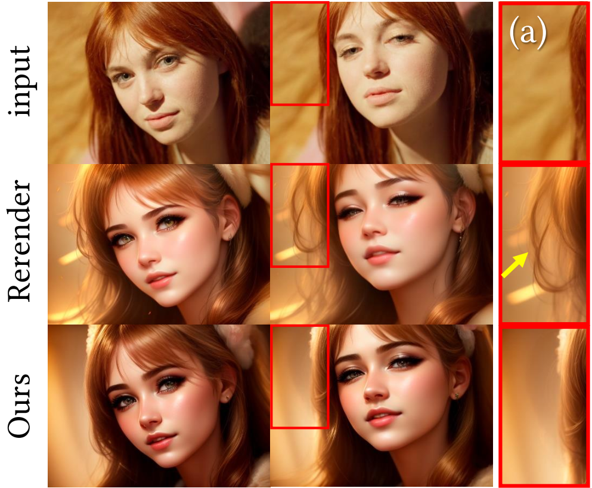
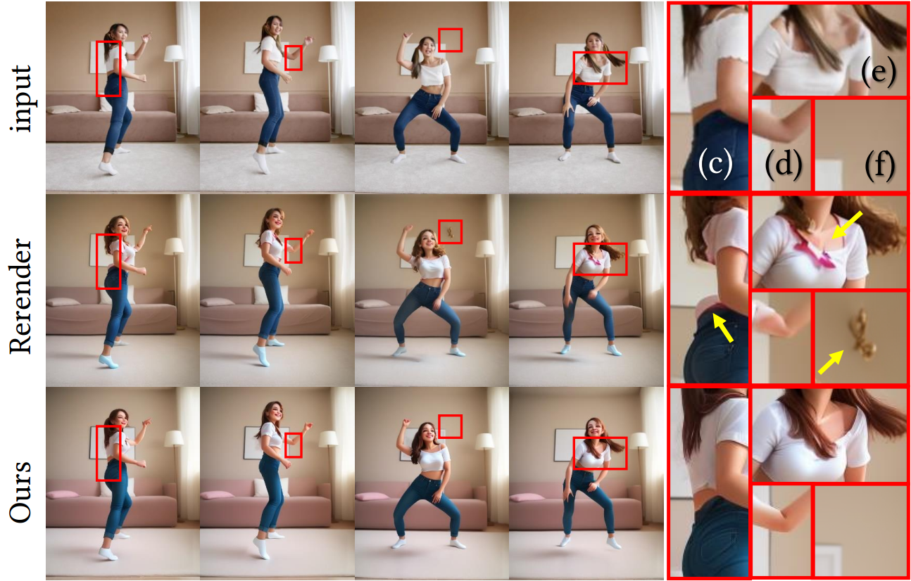
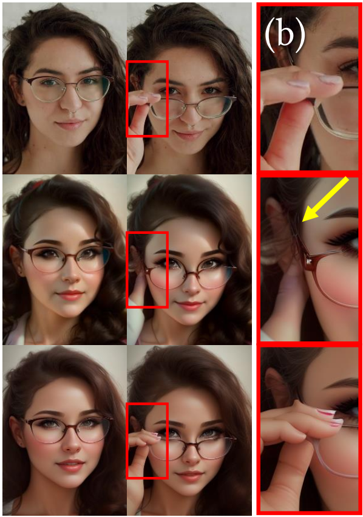
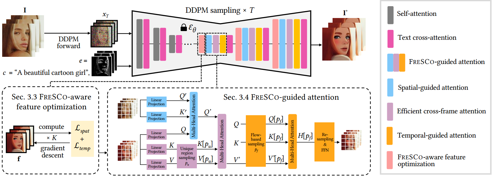
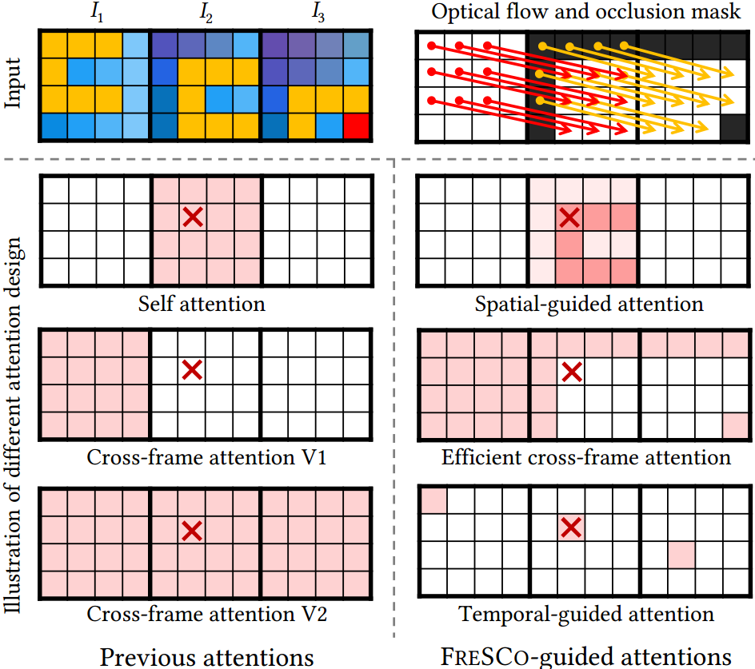

#

<!--more-->

- CVPR 2024
- [论文地址](https://arxiv.org/abs/2403.12962)
- [代码](https://github.com/williamyang1991/FRESCO)

# 0. Abstract

- zero-shot的方法旨在将图像扩散模型扩展到视频，而无需进行模型训练。**最近的方法主要侧重于将帧间对应关系纳入注意力机制。** 然而，这种软约束机制在**确定需要关注的有效特征位置时**，有时是不够的，导致时间一致性不足。 

- 本文引入**FRESCO** :

  - 

在<b>帧间对应</b>的同时引入<b>帧内对应</b>，以建立更稳健的时空约束。&#9660 
这一改进确保了 跨帧的语义相似的内容 的转换 更加一致

  - 

更新特征 &#9660
 实现与输入视频的高度时空一致性，从而显著提高翻译视频的视觉连贯性。 

# 1. Introduction

## 1.1 问题背景

-  视频处理仍然面临着独特的挑战，尤其是在确保自然运动和时间一致性方面。 

- 对于时间一致性运动 ：
  -  在大量视频数据集上训练视频模型或在单个视频上微调重构图像模型 
    - 不划算，不方便
  - zero-shot方法： 改变图像模型的推理过程，增加时间一致性约束 
    - 高效途径
    - 兼容其他辅助技术（controlnet, lora）

## 1.2 现有方法局限

- 现有方法主要关注于完善注意力机制，用**跨帧注意力来代替self attention**，将多个帧的特征汇总在一起。 
  
-  只能确保**粗略的全局风格**一致性。 
  
-  **Rerender-A-Video** [47] 和 **FLATTEN **[5] 等方法假定生成的视频与原始视频保持相同的帧间对应关系。 它们结合原始视频的光流来指导特征融合过程。 三个问题：

  1. **不一致性**： 光流的变化可能会导致**引导**不一致，从而出现前景没有适当移动时前景部分却出现在了静止背景区域的问题 （头发出现在背景）

     

     

  2. **内容缺失（undercoverage）**： 在遮挡或快速运动的区域，准确的光流估算受到阻碍，由此产生的约束条件不足，导致图像失真 (c: 背部衣服和墙混到一起了，e：头发没了)

     

     
     
  3. **不准确**： 逐帧顺序生成仅限于局部优化，导致误差随着时间的推移不断累积 （b:  由于前几帧没有参考手指而导致手指缺失 ）

     

     

## 1.3 本文方法

- 以往的方法主要侧重于限制**帧间的时间对应性**，我们认为保持帧内的**空间对应性**同样重要。我们的方法可确保语义相似的内容得到连贯处理，并在翻译后保持其相似性。 
- 解决两个难题：
  -  防止前景被错误地转换为背景，并增强光流的一致性。 
  -  对于无法获得光流的区域，原始帧内的空间对应关系可以作为一种调节机制 

-  多帧处理策略 ，一个batch中的帧会被集中处理，允许他们彼此引导， 同时，各批次之间共享锚帧，以确保批次间的一致性。 

## 1.4 贡献

- 提出一种新的zero-shot扩散框架， 以帧的时空对应性为指导，实现连贯、灵活的视频转换。 
-  将 FRESCO 引导的特征attention与optimization相结合， 作为帧内和帧间的稳健约束，其一致性和覆盖范围都优于单独的光流。 
-  通过联合处理具有批间一致性的成批帧，实现长视频翻译。 

# 2. related work

## 2.1 图像扩散模型

DALLE-2

CLIP

Imagen

class-free guidance

stable diffusion

- 文本控制

Prompt2Prompt

DDIM inversion

Null-Text Inversion

- 其他控制

SDEdit

ControlNet

## 2.2 zero shot文本引导的视频编辑

- Inversion based 方法

FateZero

Pix2Video

TokenFlow

FLATTEN

- inversion free方法

Text2Video-Zero

ControlVideo

VideoControlNet 

Rerender-A-Video

> 如果没有 DDIM 反转特征的指导，无反转框架很容易出现闪烁。我们的框架也是无反转的，但进一步加入了帧内对应，大大提高了时间一致性，同时保持了较高的可控性。 

# 3. method

## 3.1 基础

## 3.2 整体框架

- 本文的调整集中于将`I`的**空间**和**时间**对应关系纳入 U-Net 中。 本文将时空对应关系定义为：
  - **时间对应性**： 这种**帧间对应**（inter-frame）关系通过相邻帧之间的光流来衡量，是保持时间一致性的关键因素。 将从 $I_i$ 到$I_j$ 的光流和遮挡分别表示为 $w^j_i$ 和 $M^j_i$，我们的目标是确保$I^′_i$ 和 $I^′_{i+1}$ **在非遮挡区域共享$w^{i+1}_i$。** （共享这个光流有什么用？）
  - **空间对应性**： 这种**帧内对应**（intra-frame）关系通过单帧内像素间的自相似性来衡量。目的是使 $I^′ _i$ 与 $I_i$ 共享自相似性，即语义相似的内容被转换为相似的外观，反之亦然。**这种对语义和空间布局的保留隐含地有助于改善翻译过程中的时间一致性**。 （why？）

- 在U-Net的decoder部分进行改进：（原因是：*解码器层的噪声比编码器层小，而且比 xt 潜在空间更具语义意义*）
  - input feature：直接优化特征，使其与`I`达到高度的时空一致性。
  - attention module： 通过对如何以及在何处**注意有效特征**施加软约束，间接提高了一致性。 
    -  空间引导注意力： 根据输入帧的自相似性来聚合特征 
    -  跨帧注意力：用于聚合所有帧的特征。 
    -  时间引导注意力：沿着相同的光流聚合特征，以进一步加强时间一致性。 

## 3.3 特征优化

- 对于decoder层的 每一层的 input feature都通过梯度下降进行更新：

  $$ \mathbb{ \hat f }  = \arg\min\limits_{ f } \mathcal{L}_{\text{temp}}(f) + \mathcal{L}_{\text{spat}}(f)$$

  - 对于时间一致性损失：$\mathcal{L}_{\text{temp}}$， 我们希望每两个相邻帧之间对应位置的特征值是一致的 ：

    $$  \mathcal{L}_{\text{temp}}(\mathbf{f}) = \sum\limits_{i} \left\| M_{i}^{i+1} \left( f_{i+1} - w_{i}^{i+1}(f_{i}) \right) \right\|_{1}$$

  >这里U-Net的输入特诊$f$是一个批次的帧，在$\mathcal{L}_{\text{temp}}$中，对这个批次中每一个帧都进行损失计算然后求和

  

>这部分又是在latent space使用光流，这样有道理吗？

  - 对于空间一致性损失：$\mathcal{L}_ {spat}$，使用特征空间中的**余弦相似性**来衡量$I_i$的空间对应性：

    - 先对$I_i$进行单步DDPM 前向和后向处理，并提取 U-Net 解码器特征$f^r_i$。 由于单步前向处理增加的噪声可以忽略不计，因此$f^r_i$可以作为$I_i$的语义表示 来计算语义相似度。

    - 然后，所有 元素对 之间的余弦相似度可以简单计算为归一化特征（$\tilde{f}$）的gram矩阵。

      $$\mathcal{L}_ { \text{ spat } }(\mathbf{f}) = \lambda_{\text{spat}} \sum_\limits{i} \left\| \tilde{f}_{i} \tilde{f}_{i}^{\top} - \tilde{f}_{i}^{r\top} \tilde{f}_{i}^r \right\|_{2}^{2}$$

      >为什么这里可以用gram矩阵来计算损失？

>特征优化这部分感觉跟rerender差不多，这里把unet的输入特征进行修改，经过Unet后得到的还是符合DDPM的随机噪声嘛？扩散模型的性能会有损失吗？

## 3.4 注意力优化

将ldm的self attention替换成本文的fresco guided attention

### 3.4.1 空间引导注意力

$$Q'_{i} = \text{Softmax}\left(\frac{Q^{r}_{i} K^{r\top}_{i}}{\lambda_{s} \sqrt{d}}\right) \cdot Q_{i}$$

- 先对$I_i$执行单步 DDPM 前向和后向处理，并提取其自注意力层的$Q_i^r$和$K_i^r$，

- $\lambda_s$是缩放因子

- 如上图，对于红叉那个patch，它计算的

