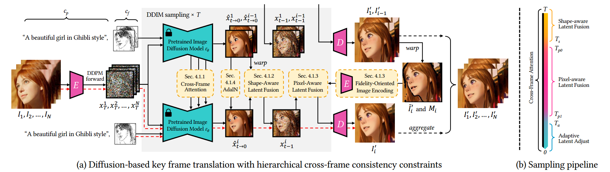
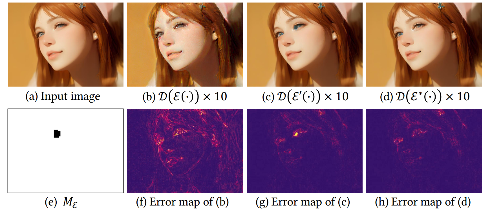
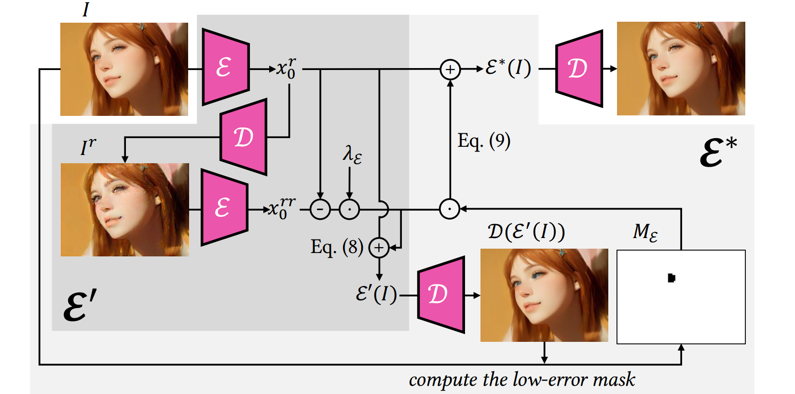
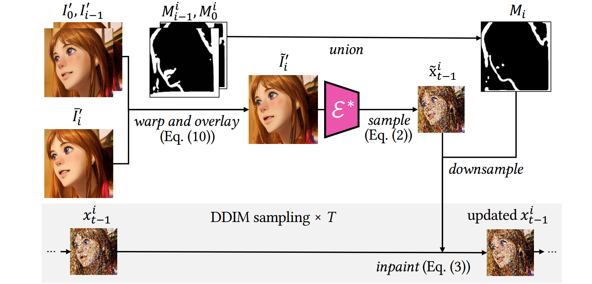

#

<!--more-->

- SIGGRAPH Asia 2023
- [论文地址](https://arxiv.org/abs/2306.07954)
- https://www.linkresearcher.com/theses/3904c8b8-83e0-4d37-bdc2-74e3576d76b0

# 1. Abstract

- 目的：**文生图**扩散模型表现优秀，但应用于视频时，确保帧间时间一致性是一个巨大挑战。

- 方法：本文**提出一种zero-shot的文本引导的video-to-video的翻译框架，它可以使图像模型适用于视频**。框架包含两个部分：

  - 关键帧翻译：

    - 用自适应的diffusion模型来生成关键帧，并用**分层跨帧约束**（hierarchical cross-frame constraints）来加强形状、纹理和颜色的coherence（一致性，连贯性）。 

  - 全视频翻译

    - 

通过时间感知<b>patch匹配</b>和<b>帧混合</b>将关键帧propagates（传播）到其他帧。&#9660
<ul>以下解释来源chat gpt
          <li>patch 匹配: 在图像或视频的不同帧之间找到相似的区域（即“补丁”）。这一技术通常用于合成、去噪和图像重建等任务。基本过程如下：<ul>
              <li>选择patch：在一帧图像中选择一个小区域（patch），通常是一个固定大小的矩形区域。</li><li>搜索匹配：在另一帧图像中搜索与该补丁最相似的区域，通常使用一些相似度度量（如均方误差、结构相似性指数等）来评估匹配质量。</li><li>替换或融合：找到匹配后，可以用该区域替换原始区域，或者通过融合技术将其与原始区域结合，以实现更平滑的过渡。</li>
              </ul></li><li>帧融合: 用于将多帧图像合成一个新图像，以实现平滑的视觉效果。它常用于视频过渡效果和特效处理，帮助生成更自然的动态效果。<ul>
          <li>选择多帧：选择要融合的多帧图像。</li><li>加权融合：对每一帧应用加权系数，通常根据帧与目标帧的时间距离进行加权。接近目标帧的帧权重较大，远离的帧权重较小。</li><li>计算融合结果：将各帧的像素值按权重组合，以生成最终图像。</li>
          </ul></li>
          </ul>

- 方法特点：
  - 以低成本（无需重训或优化）实现全局风格和局部纹理的时间一致性 
  - 与现有的图像扩散技术兼容，能利用如LoRA和ControlNet等工具进行特定主题的定制和空间引导。 

>

# 2. Introduction

- 文生图扩散模型：DALLE-2，Imagen，Stable diffusion

- 多种图像编辑方法：
  - model fine-tuning for customized object generation（Dreambooth）
  - image-to-image translation（Sdedit）
  - image inpainting（Blended latent diffsuion）
  - object editing（prompt-to-prompt image editing）

- **将现有图像扩散模型直接应用于视频会导致严重的闪烁问题**。三种解决方法：
  
  - 大规模视频数据上训练视频模型（Imagen video），计算量大，重新设计的视频模型与现有的现成图像模型不兼容。 
  - 在单个视频上微调图像模型（Tune-a-video），对于长视频来说效率较低。对单个视频的过度拟合（因为这里是在单个视频上微调图像模型）也可能降低原始模型的性能。
  - 零样本方法，采样过程中，**对潜在特征**施加了跨帧约束以保持时间一致性。与现有模型兼容，**然而，目前的跨帧约束仅限于全局样式，无法保持低级一致性，例如，整体样式可能是一致的，但局部结构和纹理可能仍然闪烁。 **
  

>以往的zero-short方法是在latent space，所以本文一开始也是在latent space做约束。

- 将扩散模型用到视频上需要解决三个问题：
  - 时间一致性：cross-frame constraints for low-level consistency
  - 零样本
  - 灵活性，兼容现有模型

- 本文方法：为预训练的图像模型提出了新的**分层跨帧约束**，以产生连贯的视频帧。 

- 关键思想：
  
  - 

使用光流来应用密集的跨帧约束，前一个渲染帧作为当前帧的低级参考，第一个渲染帧作为锚来调节渲染过程，以防止偏离初始外观。&#9660 
“dense”指的是对图像中每一个像素或每一个小区域的约束，而不是只关注某些特定的点或特征。在光流计算中，密集约束意味着在两个连续帧之间，所有像素的运动信息都被考虑到，以便在渲染过程中保持一致性和连贯性。Our key idea is to use optical flow to apply dense cross-frame constraints, with theprevious rendered frame serving as a low-level reference for the current frame and the first rendered frame acting as an anchor to regulate the rendering process to prevent deviations from the initial appearance.

  
  - 在**采样的不同阶段**实现了分层跨帧约束。除了**全局风格一致性**之外，我们的方法还分别在早期、中期、后期阶段强制**形状、纹理、颜色**的一致性。这种创新的轻量级修改实现了全局和局部时间一致性。 
  
  > 第一帧相当于整个视频的“锚点”，用于控制视频的整体走向；后续的每一帧，则都会以前一帧作为参考，防止生成的图像偏离最初的风格、形状、纹理和颜色等。 
  
- 本文框架：分两部分：
  - 关键帧翻译：
    - 用预训练的图像扩散模型与分层跨帧约束来生成关键帧。 
  - 全视频翻译：
    - 使用时间感知patch匹配和帧混合将渲染的关键帧传播到其他帧。 

- 基于diffusion的生成在content creation上表现优异，但采样过程效率低；**基于patch的传播**可以有效地推断像素级连贯帧，但不能产生新的内容。本文结合这两个部分，在质量和效率之间取得了平衡。

- 本文贡献：
  - 提出一种文本引导的video-to-video的zero-shot的视频翻译框架，实现了全局和局部时间一致性，与预训练的图像diffusion模型兼容。
  - 分层跨帧一致性约束，以加强形状，纹理和颜色的时间一致性，使图像扩散模型适应视频。 
  - 将*基于扩散模型的生成*与*基于patch的传播*相结合，在质量和效率之间取得平衡。 

# 3. Related Work

## 3.1 文本驱动的图像生成

- 早期基于`GAN`

- 利用`Transformer`强大的表达能力，提出了自回归模型。

- 基于`diffusion`
  - `DALLE-2`，`Imagen`： 引入了预训练的大型语言模型作为文本编码器，以更好地将图像与文本对齐，并引入级联扩散模型以生成高分辨率图像。 
  - `GLIDE`：引入无分类器引导来改善文本条件 
  - `ldm`： 利用VQ-GAN的低分辨率潜空间来提高效率，而不是在图像空间中进行去噪。 

- diffusion定制化模型：
  - `Textual Inversion`，`DreamBooth`：学习特殊的标记来捕捉新概念，并在给定少量示例图像的情况下生成相关图像。 
  - `LoRA`：通过学习添加到现有权重的低秩权重矩阵加速了大模型的微调
  - `ControlNet`：对新的控制路径进行微调，以提供像素级条件，如边缘地图和姿态，从而实现细粒度图像生成。 

## 3.2 diffusion视频编辑

- 文生视频：
  - `Video Diffusion Models`提出将二维图像U-Net模型扩展为分开的时空U-Net。 
  - `Imagen Video` 利用空间和时间级联的视频超分辨率模型对视频扩散模型进行扩展 
  -  `Dreamix`将其进一步扩展到视频编辑中 
  -  `Make-A-Video`以无监督的方式利用视频数据学习运动来驱动图像模型 
- 上述方法需要大规模的视频数据进行训练：
  - `Tune-A-Video`将图像扩散模型扩展为具有跨帧关注的视频模型，并在单个视频上对其进行微调，生成具有相关运动的视频。 
  - 在此基础上，`Edit-A-Video`、`VideoP2P`和`vid2vid-zero`利用*Null-Text反演*进行精确反演，保留未编辑的区域。 
- 上述方法需要对预训练模型进行微调或对输入视频进行优化，效率较低。 最近的发展已经有zero-shot的方法，这些方法自然地与预训练的扩散变体（如`InstructPix2Pix`或`ControlNet`）兼容，以接受更灵活的条件，如深度和边缘。 
  - `FateZero`基于`Prompt2Prompt`检测到的**编辑掩码**来指示要保留的通道和空间区域，将编辑前后的注意特征进行融合。
  - `Text2Video-Zero`翻译latent直接模拟运动
  - `Pix2Video`将当前帧的latent与前一帧的latent进行匹配。 
- 上述方法主要依赖**跨帧注意力**和**前几步的latent融合**来提高时间一致性。这些策略主要迎合高级风格和形状，并且在纹理和细节层面保持跨帧一致性方面效果较差。 **本文提出了一种新的像素感知的跨帧latent融合，它可以实现像素级的时间一致性**。 

>所以本文第一阶段的方法类似之前的zero-short，只是在high level？到第二阶段采样的时候才是pixel level？

- 另一种zero-shot的方法：使用帧插值，基于一个或多个扩散编辑帧来生成视频。（**~~待理解~~**）
  - `image analogies`使用patch matching将风格效应从一对example迁移到别的图像。（详见）
  - Example-based synthesis of stylized facial animations将image analogy扩展到人脸视频翻译
  - 基于多范例帧的改进的EbSynth，该方法采用了一种新颖的时间混合方法用于general视频翻译。
- 上述这些基于patch的方法可以保留精细的细节，但<u>它们的时间一致性很大程度上依赖于范例帧之间的一致性。因此，我们用于生成相干帧的自适应扩散模型非常适合这些方法</u>。本文**将zero-shot EbSynth集成到我们的框架中**，以实现更好的时间一致性和加速推理 

# 4. Preliminary: Diffusion Models

## 4.1 Stable Diffusion

## 4.2 ControlNet

- **为了构建一个通用的zero-shot video to video框架，我们使用ControlNet从输入视频中提供结构引导，以提高时间一致性**。

>为什么controlnet的结构引导可以提高时间一致性？

# 5. Zero-Shot Text-Guided Video Translation

- 给定一个N帧的视频：$\{I_ i\}_ {i = 0 } ^ N$，目标：渲染成一个新视频$\{I'_ i\}_ {i = 0 } ^ N$ （渲染成：文本提示词或者现成的自定义sd指定的另一种艺术表达方式）。本文框架包含两部分：
  - 关键帧翻译：在预训练的图像扩散模型中**引入了四种分层跨帧约束**，指导**使用锚点帧和先前关键帧**绘制连贯关键帧的过程
  - 完整视频翻译：非关键帧基于相邻的两个关键帧进行插值。 

- 我们的框架可以充分利用不同帧之间的关系来增强输出的时间一致性 

## 5.1 Key Frame Translation

- follow `SDEdit`，本文的$X_T$不是随机噪声，而是对输入视频帧进行T步加噪得到的噪声图。（这样可以通过T控制保留多少细节）
- 采样每一帧时，**使用第一帧作为锚帧**来约束**全局风格一致性**，以及**当前帧的前一帧**来约束**局部时间一致性**
  - 将跨帧注意力用于所有采样步骤，以实现**全局风格一致性** 
  - 前期采样步骤中，将latent feature与前一帧的对应的latent feature融合以实现粗**全局风格一致性**略的形状对齐 （we fuse the latent feature with the aligned latent feature of previous frame to achieve rough shape alignments）
  - 中间采样步骤中， 将潜在特征与编码的扭曲锚帧和前一帧的输出结合，以实现精细的纹理对齐 
  - 后期采样步骤中，调整latent feature分布以实现**颜色一致性**
- 在5.1节，$I_ 0 , I_1$表示前两个关键帧（5.2节用$I_0, I_K$表示前两个关键帧）

>为什么$x_0$和$x_ {i-1}$分别可以约束全局风格和局部时间一致性？

### 5.1.1 风格感知跨帧注意力

- 与其他zero-shot的视频编辑方法类似，本文将U-net中的self attention换成cross-frame attention， 以规范化输出帧$I’_i$的全局风格，使$I'_i$的风格与$I'_1$和$I'_ {i-1}$的风格相匹配。

- ldm中的self-attention: $Self\_Attn(Q,K,V) = softmax( \frac{ QK^ T}{ \sqrt{ d } } ) \cdot V$

  $$Q=W^Q \cdot v_i \space \space, \space \space K=W^K \cdot v_i \space \space, \space \space V=W^v \cdot v_i$$

  - 其中三个$W$都是三个用于特征投影的预训练矩阵，这里都是根据当前帧得到的QKV

- cross-frame attention会用到其他帧：$CrossFrame\_Attn(Q,K',V') = softmax( \frac{ QK'^ T}{ \sqrt{ d } } ) \cdot V'$

  $$Q=W^Q \cdot v_i \space \space, \space \space K'=W^K \cdot [v_1;v_ {i-1}] \space \space, \space \space V=W^v \cdot [v_1;v_ {i-1}] $$

  - 其中[]**应该是**将两个帧做concat。
  
- 直观地说，自注意力可以看作是在单一帧内的块匹配和投票，而跨帧注意力则寻求相似的块，并融合来自其他帧的对应块，这意味着输出帧$I'_i$的风格将继承自$I'_1$和。 $I'_{ i-1 }$

>跨帧注意力局限于全局风格

### 5.1.2 形状感知跨帧latent融合

- 跨帧注意力局限于全局风格，**还需要约束跨帧局部形状和纹理的一致性**，对此本文使用光流对潜在特征进行warp和融合。 

  >这里对于局部形状纹理一致性的约束为什么要在latent space而不在pixel space？是因为之前的工作就是在latent space？

  $$\hat x ^i _ {t \rightarrow 0} \leftarrow M ^ i _ j \cdot \hat x ^i _ {t \rightarrow 0} + ( 1- M^i _ j ) \cdot w ^i _ j (\hat x ^j _ {t \rightarrow 0})$$ 

  - $w_j^i$表示从$I_j$到$I_i$的光流

  - $w$和$M$需要进行下采样，以匹配分辨率（对于$M$，是光流中常用的**遮挡掩码**，遮挡区域的值为1）
  
  - 作者发现：计算光流时，锚帧（j=0）获得的效果比前一帧（j=i-1）效果更好。
  
  - 

作者发现：潜在空间中的插值元素会导致后期步骤的模糊和形状失真（if we attempt to interpolate elements in the latent space , we may run into some unwanted effects, like blurring and shape distortion, especially at later steps）。因此，我们将融合限制在仅早期步骤，以实现粗略的形状指导。 &#9660
We observe that interpolating
    elements in the latent space can lead to blurring and shape
    distortion in the late steps. Therefore, we limit the fusion to
    only early steps for rough shape guidance.
    以下解释来源chatgpt: 
        这可能是因为：<li>信息累积：随着步骤的增加，插值的错误可能会在多个步骤中累积，导致最终结果的模糊。</li>
    <li>特征融合：在后期步骤中，特征的融合可能导致形状和纹理信息的混淆，使得输出不够清晰。</li>
    <li>高频细节：后期步骤往往需要保留高频细节，而插值可能会使得这些细节模糊。</li>因此，作者选择在早期步骤进行融合，以便更好地指导形状，同时避免在后期步骤中可能引起的失真。
    

### 5.1.3 像素感知跨帧latent融合

- 为了在采样中间阶段约束**低级纹理特征**（上一节是在latent space应用光流扭曲，如果一直在latent space会导致模糊和形状失真，所以上一节只在采样前期进行，到中期就在pixel space进行光流扭曲，这两节的作用应该都是**约束局部特征的一致性**），先对前一帧进行warp，然后编码回latent space以一种图像修复的方式进行融合

- 一个问题：有损编码器会引入**失真和颜色偏差**（这里有颜色偏差，所以后面一节会用adain来控制颜色一致性？），一次编码解码可能看不太出来；但是这种偏差会随着帧序列进行累积（相当于I -> E() -> D() ->E() -> D()...，为什么会累积？为了得到x2，需要用I0和I1进行warp，然后通过encoder得到x2，然后通过decoder得到I2，然后根据I0和I2得到I3，然后通过encoder得到x3。这里注意x2，它先经过decoder变成I2然后通过光流得到I3，这里I3包含前面I2的累积信息，I3再通过encoder相当于之前I2的信息经过encoder，后面每次生成时，I2的信息会多次经过encoder, decoder）效果就会比较明显（下图的b，失真较多）：

  

  
  
  - `blended latent diffusion`通过微调decoder的权重以适应每个图像来解决这个问题，但这对长视频来说不切实际。本文提出novel的面向保真度的（fidelity-oriented）零样本图像编码方法。

#### 1） 面向保真度的图像编码

- 作者**观察到**：**在迭代自动编码过程中每次丢失的信息量是一致的**，因此可以将损失的信息预测出来，补上去。

  - 原图：$I  $

  - 编码第一次：$x_ 0 ^ r = \varepsilon ( I )$ 

  - 第一次解码：$I_ r = D( x_ 0 ^ r)$

  - 编码第二次：$x_ 0 ^ { r r } = \varepsilon ( I _ r )$ 

  - 第二次解码：$I_ { r r } = D( x_ 0 ^ { r r })$  

  - 假设目标是无损的latent feature : $x _ 0$ 

  - 假设从$x _ 0$到$x_ 0 ^ r$的损失与从$x_ 0 ^ r$到$x_ 0 ^ { r r } $的损失是线性相关的。

  - 根据补偿信息**重定义编码器**（其中系数$\lambda$设置成1效果就不错）：

    $$ \varepsilon '(I) := x_0 ^ r + \lambda_ \varepsilon (x_ 0 ^ r - x_ 0 ^ { rr })$$ 

  - **此外，还引入了一个mask矩阵**$M _ \varepsilon$（用于避免补偿信息可能引入的伪影，上图c中眼睛存在蓝色伪影）。设置一个阈值，当$\varepsilon '(I)$和$\varepsilon ( I )$之间的误差矩阵上某个值超过预定义的阈值时，$M_ \varepsilon$的相应位置就设置成0（或1？)，因此，最终编码过程：

    $$ \varepsilon ^ *(I) := x_0 ^ r + M_ \varepsilon \cdot \lambda_ \varepsilon (x_ 0 ^ r - x_ 0 ^ { rr })$$ 

    

    

>线性损失的假设合理吗？

#### 2）结构引导的inpainting

$$ \tilde{I}_i^{\prime} = M_0^i\cdot\left(M_{i-1}^i\cdot\bar{I}_i^{\prime}+(1-M_{i-1}^i)\cdot w_{i-1}^i(I_{i-1}^{\prime})\right)+\left(1-M_0^i\right)\cdot w_0^i(I_0^{\prime})$$

- 将锚帧$I' _ 0$和前一帧$I' _ { i - 1 }$ 都根据各自对应的光流进行warp，然后将他们覆盖在$\bar I' _ i$ （不使用5.1.3的像素融合得到的粗略渲染帧）上得到$ \tilde{I}_i^{\prime}$ （这里的M应该跟之前一样，也是用光流做warp时会有的mask）。融合帧$\tilde{I}_i^{\prime}$ 为$I'_i$的采样提供了像素参考，也就是说，我们希望$I'_i$匹配掩模区域（$M_i$）之外的$\tilde{I}_i^{\prime}$ ，并匹配$M_i$内部的ControlNet的结构指导。（这段描述不太懂？来自zt和controlnet结构引导路径？）本文将其表述为一个结构引导的image inpainting任务，并**follow **`Blended latent diffusion（ACM transactions on graphics (TOG) 42.4 (2023): 1-11.）`来更新$x^i _ {t-1}$：

  $$x_{t-1}^{i}\leftarrow M_{i}\cdot x_{t-1}^{i}+(1-M_{i})\cdot\tilde{x}_{t-1}^{i}$$

  - 其中$M_{i}=M_{0}^{i}\cap M_{i-1}^{i}$，$ x_0 = \mathcal { E } ^ * ( \tilde { I } _ i ^ { \prime } ) $ ，$ \tilde x ^ i _ { t - 1 } = DDIMforward( x_ 0)$ 

### 5.1.4 色彩感知自适应latent调整

- 将AdaIN应用于$\hat x ^i _ { t \rightarrow 0}$ ，使其在后期步骤中的channel wise的均值和方差与$\hat x ^1 _ { t \rightarrow 0}$相匹配。

- 

这样可以进一步<b>保持所有的关键帧之间的颜色风格一致性</b>（所有帧都跟锚帧做adain，相当于将锚帧的风格迁移到所有关键帧上，保持他们的风格一致性）&#9660
It can further keep the color style coherent throughout the whole key frames.
  

>为什么要在latent space？为什么要在后面的步骤做adain?

## 5.2 完整视频翻译

-  对于内容相似的帧， Ebsynth可以通过将渲染的帧有效地传播给相邻帧，从而产生可信的结果。 
-  与扩散模型相比，帧插值不能产生新的内容。为了平衡质量和效率，我们提出了一个混合框架，分别使用改进的扩散模型和Ebsynth来渲染关键帧和其他帧。 

•此外，我们发现在翻译过程中，配饰、眼球运动等小细节和细微动作不能很好地保留下来。