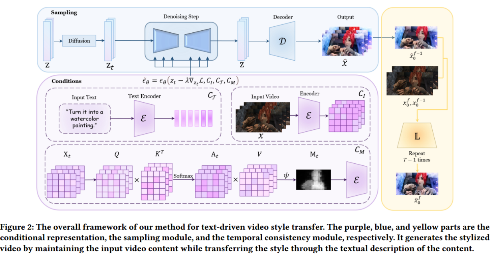
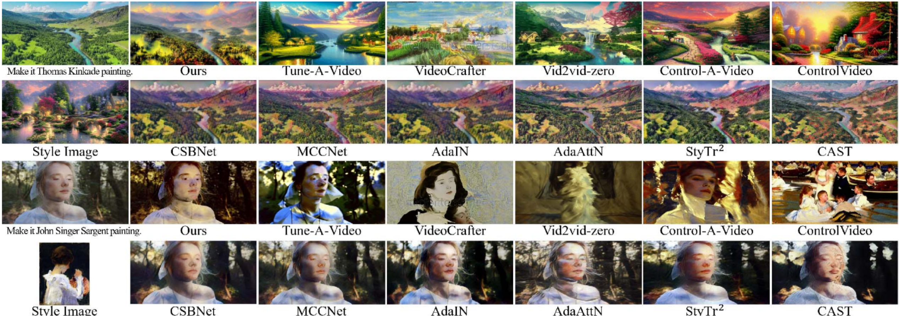
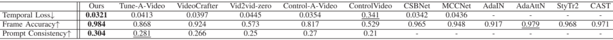
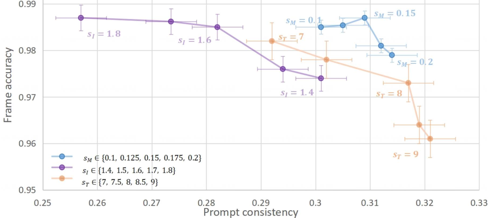
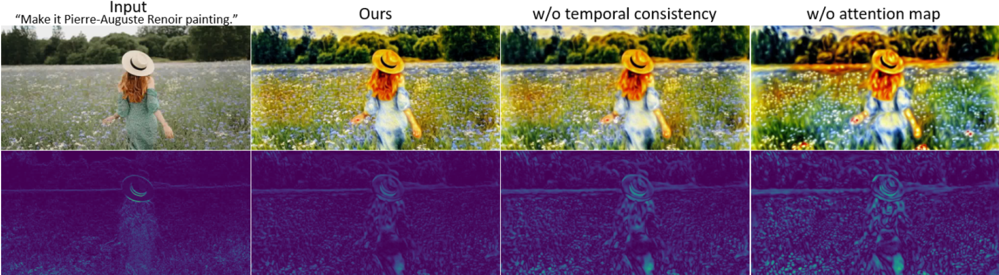
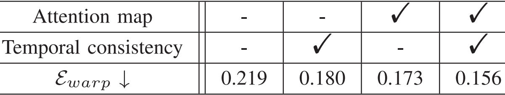

#

<!--more-->

（基于controlnet的特征融合方法？）

通过基于流的正则化网络减少闪烁。

- 优化目标：

$$L=\mathbb{E}_{\mathcal{E}(\boldsymbol{x}),\boldsymbol{c}_I,\boldsymbol{c}_T,\boldsymbol{c}_M,\boldsymbol{\epsilon}\sim\mathcal{N}(0,1),t}\left[\|\boldsymbol{\epsilon}-\boldsymbol{\epsilon}_\theta(\boldsymbol{z}_t;\boldsymbol{c}_I,\boldsymbol{c}_T,\boldsymbol{c}_M,t)\|_2^2\right]$$

垃圾

# 0. Abstract

- 大规模的文生视频扩散模型显示出出色能力。然而：
  -  文本视频数据集和计算资源的有限性阻碍了它们在视频样式化中的直接应用。 
  -  由于噪声添加过程的随机性和破坏性，满足风格迁移任务的内容保存标准是具有挑战性的。 

- 本文介绍了一种简洁的（arxiv中写的是zero short）视频风格化方法，  利用生成式**预训练transformer**（文章里没看到transformer啊？）和图像ldm进行文本控制视频风格化。 
  -  我们改善了去噪过程中的引导条件，以保持艺术表达和结构保存之间的平衡。 
  -  此外，通过集成采样优化模块和时间一致性模块，我们解决帧间闪烁和防止额外的伪影。 

# 1. Introduction

- 文生图得到巨大发展， 这一发展为使用现有的generative works编辑现实世界的视频提供了许多可能性。  然而，用于编辑真实世界视频的扩散模型仍然具有挑战性和要求。 

-  由于难以收集到与文本和视频相匹配的大规模数据，与图像领域相比，视频领域的进步有限。从头开始训练文本引导视频生成范式耗时  ，并且难以获得和推广。 

- 因此，**利用现有的文本-图像模型生成视频更为实用**。同时，基于文本-图像模型的视频方面的研究也取得了可喜的成果。 

-  我们希望实现对任意视频的快速推理，以避免昂贵的计算消耗。 

-  由于扩散模型中噪声添加过程对内容的破坏性和去噪过程的随机性，输入的视频内容往往难以保留。此外，文本-视频模型中的**文本提示只告诉模型用户想要改变什么，而没有传达用户想要保留什么。**因此，文本引导的视频传输工作导致**视频中的内容修改**，这很难满足风格化任务的基本要求。 

-  为了实现**文本提示的风格表示**、**输入视频内容信息的保存**、**帧间一致性**和**推理过程的快速优化**，我们集中在以下几个基本组成部分：
  -  提出了一种新的控制条件组合，包括文本、视频帧和注意图；具体来说，文本用于风格指导，视频框架用于内容指导，注意图用于细节指导。 
  -  采用自定义制导与无分类器制导相结合的方法对噪声预测过程进行调整。  在实现文本引导风格化的同时，很好地维护了输入视频的全局内容。 
  -  我们在推理过程中实现了快速收敛，无需微调或额外的训练，从而实现了文本视频输入的任意风格化任务。 
  -  最后，引入时间一致性来消除闪烁，增强时间相干性。 

- 贡献：
  -  提出了Style-A-Video，这是一个基于扩散模型的任意文本驱动视频样式的新框架。这项工作完全在推理期间内完成，无需额外的每个视频训练或微调（是说不需要针对每个视频训练的任意风格迁移还是说本文是zero-shot的框架？）。 
  -  提出新颖的噪声预测指导公式，实现风格、内容、结构的同步控制。并在推理过程中实现了时间和内容一致性的控制。 

# 2. Relate work

## 2.1 图像/视频风格迁移

- NST
- 二阶统计风格
- AdaIN
- StyTr2
- CAST

。。。

- 本文意在提出一种高效的零镜头视频风格转移方法，该方法在时间一致性和风格表达方面都很成功。 

- 视频风格迁移： 采用参考风格图像，并统计地将其风格应用于输入视频 

  >Coherent online video style transfer.（2017）
  >
  >Arbitrary video style transfer via multi-channel correlation.（2021）
  >
  >Fast video multistyle transfer.（2020）
  >
  >Exploring the Temporal Consistency of Arbitrary Style Transfer: A Channelwise Perspective.（2023）
  >
  >Artistic style transfer for videos.（2016）

  

-  相比之下，我们的方法在受提取的结构数据约束的同时，从输入文本提示符或图像中混合应用样式和内容。通过从数据中**学习生成模型**，我们的方法产生语义一致的输出，而不是匹配特征统计。 

## 2.2 文字到图像的生成/编辑

- gan
- diffusion
- diffusion风格迁移：MGAD，DiffStyler，InST

## 2.3 文字到视频的生成/编辑

-  没有足够的高质量文本和视频对。 

-  CogVideo[20]将CogView-2[8]扩展到文本到视频的生成，利用预训练的文本到图像模型和时间注意力模块来提高视频生成的质量。 

- video diffusion models
- Imagen Video
- make a video
- Text2LIVE
- SinFusion
- Tune a video
- Gen-1

# 3. Method

- 本文目的： 根据文本条件T对输入视频进行风格化编辑，同时保留输入视频的内容和结构。 内容具体定义为输入视频的外观和语义信息。结构是指输入视频的形状和几何特征。 
  -  为了实现这一点，我们将输入帧信息（表示为𝐼）和自关注信息（表示为𝑀）添加到生成模型条件中。 
  -  我们推被断编码的文本T与去噪器的**中间特征**（intermediate features）之间的self-attention map 𝑀。 

-  首先，我们的生成主干的实现被表述为一个条件潜在视频扩散模型。 
-  其次，制导条件是经过计算和编码的。
-  然后，结合制导条件和无分类器制导进行噪声预测。 
-  在采样过程中进行逐步优化。 

## 3.1 Diffusion Model

$$L=\mathbb{E}_{\mathcal{E}(x),c_{I},c_{T},c_{M},\epsilon\sim\mathcal{N}(0,1),t}\left[\|\epsilon-\epsilon_{\theta}\left(z_{t},t,c_{I},c_{T},c_{M}\right)\right)\|_{2}^{2}]$$

- 图像条件（什么图象？）
- 文本提示词条件
- attention map条件

## 3.2 Condition Representation

- 我们**学习一个网络**$\theta$，它可以在给定图像条件，文本提示条件，注意力图条件的情况下，预测噪声。我们最小化下面的ldm目标：

$$L=\mathbb{E}_{\mathcal{E}(x),c_{I},c_{T},c_{M},\epsilon\sim\mathcal{N}(0,1),t}\left[\|\epsilon-\epsilon_{\theta}\left(z_{t},t,c_{I},c_{T},c_{M}\right)\right)\|_{2}^{2}]$$

 输入帧cI作为内容引导，保证最终生成的结果与输入视频的语义内容一致。 

### 1）风格特征

- 我们将类别条件替换为文本提示描述（是在预训练的模型上直接替换还是说强调你的condition是文本，而不是类别？）。目标风格可以从文本提示𝑐T中获得 

### 2）内容特征

-  由于扩散模型的加噪过程对内容图本身的破坏性，以及去噪过程的随机性，很难在内容保留上取得较好的效果。 （？）

- 以往的作品采用CLIP图像嵌入表示内容情况（为什么要跟图像生成对比，应该跟风格迁移对比啊？）。相比之下， 我们在第一个卷积层添加了额外的输入通道，以连接$z_t$和$c_I$ （ci是什么？） 从而使最终生成的结果相对于输入视频在语义内容上具有更大的一致性。 （输入了内容图，所以内容一致性肯定ok啊？）
-  预训练的检查点用于初始化扩散模型的所有可用权值，并将*作用于新添加的输入通道的*权值设置为零。 

### 3）self-features condition

- 最近的large-scale diffusion模型**通过对unet增加attention层来纳入条件**。
- self-attention 更善于捕捉自我特征的内在关联 
-  给定时间步长为𝑡的任意feature map$X_t \in \mathbb{R} ^{(HW)d}$ ,对高度H和宽度W的n-head self attention:

$$Q_t^{(h)}=X_tW_Q^{(h)},\quad K_t^{(h)}=X_tW_K^{(h)} ， W \in \mathbb{R}^{Cd}$$

$$A_t^{(h)}=\mathrm{softmax}\left(Q_t^{(h)}\left(K_t^{(h)}\right)^T/\sqrt{d}\right)$$

$$V_{t}^{(h)}=X_{t}W_{V}^{(h)}$$

$$A_t^{(h)}=A_t^{(h)} \cdot V_{t}^{(h)}$$

$$\psi = mean(A_t) $$

- 定义注意力图：$M_t=\mathbb{1}\left(A_t>\psi\right)$

## 3.3 条件引导

### 1）无分类器引导

-  用于权衡扩散模型生成的样本的质量和多样性。 

-  无分类器引导的实现包括联合训练条件去噪和无条件去噪的扩散模型，并结合推理时的两种分数估计。 

$$\tilde{\epsilon_{\theta}}\left(z_{t},c\right)=\epsilon_{\theta}\left(z_{t},\varnothing\right)+s\cdot\left(\epsilon_{\theta}\left(z_{t},c\right)-\epsilon_{\theta}\left(z_{t},\varnothing\right)\right)$$

### 2）条件引导

$$\epsilon_\theta^{\prime}=\epsilon_\theta\left(z_t,\emptyset,\emptyset\right)$$

$$\begin{aligned}\tilde{\epsilon_{\theta}}\left(z_{t},c_{I},c_{T},c_{M}\right)=&(1-s_{I}-s_{\mathcal{T}}-s_{M})\cdot\epsilon_{\theta}^{\prime}\\&+s_{I}\cdot\epsilon_{\theta}\left(z_{t},c_{I},\varnothing\right)\\&+s_{\mathcal{T}}\cdot\epsilon_{\theta}\left(z_{t},\varnothing,c_{\mathcal{T}}\right)\\&+s_{M}\cdot\epsilon_{\theta}\left(z_{t},c_{M},\varnothing\right).\end{aligned}$$

- 所以这里相当于使用的是stable diffsuion，可以输入两个条件：图片和文字，图片可以输入$c_I$或者$c_M$ ?

## 3.4 采样优化损失

-  **我们希望在保留物体原始 形状和内容 的同时，允许实质性的（substantial）纹理和外观变化。**

- 虽然已经提出了各种各样的内容损失，但是大多数都使用了预训练的VGG模型中提取的特征。（arxiv上没说他的缺点，期刊上把这句删了？）
- 相反， 我们在CLIP特征空间中定义损失。这允许我们对Io的内部CLIP表示施加额外的约束。 （Io是什么？？）
	$$\mathcal{L}_{s}=1-\mathcal{D}_{\cos}\left(x_{0}^{f},x_{t}^{f}\right)$$
- $x^f_0$是输入帧，$x_t^f$是预测的帧

- 然后将这个损失对$z_t$求梯度：$\Delta z_t=\nabla_{z_t}\mathcal{L}_s$ （为什么要这么做？arxiv中说：通过最小化L来optimize网络）
- $\Delta z_t$ 和引导条件一起优化去噪网络：$\tilde{\epsilon}_\theta=\epsilon_\theta(z_t-\lambda\Delta z_t,C_I,C_T,C_M)$

## 3.5 时间一致性

- 输入的视频帧彼此之间在short term和long term上都是globally一致的。但是它可能包含局部闪烁（输入的原始视频包含局部闪烁？？）。先前的工作表明，局部闪烁可以通过基于流的正则化很好地解决。因此本文选择一个经过修改的轻量级模块。

-  向局部细化网络提供两个连续的帧（输入帧）$x_0^f,x_0^{f-1}$以及之前的预测帧$\hat x_0^{f-1}$ 来预测当前帧$\hat x_0^{f} $ 
  - 两个连续帧首先紧接着一些卷积层，然后与$\hat x_0^{f-1}$融合
  - 网络损失：$\mathcal{L}_{temporal}=\left\|M_{f,f-1}\odot\left(x_{0}^{f}-\hat{x_{0}}^{f-1}\right)\right\|_{1}$ （感觉这里$x_0^f$应该写错了，应该是$\hat x_0 ^f$ )
    - $\hat x _0 ^{f-1}$ 是通过将$x_0^{f-1}$使用从t到t-1帧的光流得到的（这里arxiv上没写出loss表达式，也没解释，期刊论文上有解释，但是看着好像错了，应该是从f帧到f-1帧？

# 4. 实验

- 3090
- 512*256的帧需要1s
- 使用Unet架构为Wide-resnet
- 时间步长为30
- Style  a video obviates the need for further training

## 1）qualitative evaluation

- 第一行，与基于diffusion的方法相比，本文内容保持更好。他们明显偏离了目标风格（第二行最左）

-  它在复制艺术作品的纹理、光泽度和光线细微差别方面优于CSBNet  和MCCNet2 

- 传统风格迁移方法（第二列后四个） 虽然在颜色和风格上与参考图像很好地一致，但它们缺乏真实感和生动性。 

-  与上述方法相比，Style-A-Video在艺术表达和结构保存方面表现出色，特别是在保持视频帧间时间一致性的同时减少帧间闪烁等不利的艺术影响。 

## 2）quantitative evaluation

- 选择25个视频进行对比，
  - 为了评估时间一致性：使用常见的时间损失：$\mathcal{L}_{temporal}=||O\circ(W_{X_n\to X_{n-i}}(Y_n)-Y_{n-i}))||$ （这里的时间一致性损失与训练损失冲突吗？）
  - 为了评估风格化帧的准确性：计算输入帧和输出帧的CLIP文本嵌入之间的平均余弦相似度，以此评估内容保存
  - 为了评估风格化效果：计算输出帧和提示词的CLIP文本嵌入之间的平均余弦相似度

## 3）Ablation

- 值越大表示这个条件控制越强，图中相应的指标也越大，另一个指标就变差。（文章并没有说随着$s_I$的变化，其他的；变量是固定的，有没有控制变量？这里的ablation做的对吗？感觉应该是对比用一个条件，两个条件，三个条件之间的效果）

-  通过热图分析进一步评价了自注意掩模条件和时间一致性模块对帧间一致性的影响。 去除自注意图条件会导致精细细节的丢失，而没有时间一致性设计会导致视频帧间出现明显的抖动和闪烁。 

- 使用DVP warping error计算时间一致性：（分别计算当前帧和第一帧/前一帧的temporal loss然后加起来）

  $$\begin{aligned}
  E_{pair}(O_{t},O_{s})& =\frac{1}{\sum_{i=1}^{N}M_{t,s}(x_{i})}\sum_{i=1}^{N}M_{t,s}(x_{i})\|O_{t}(x_{i})-W(O_{s})(x_{i})\|_{1}, \\
  E_{warp}(\{O_t\}_{t=1}^T)& =\frac1{T-1}\sum_{t=2}^T\{E_{pair}(O_t,O_1)+E_{pair}(O_t,O_{t-1})\}, 
  \end{aligned}$$