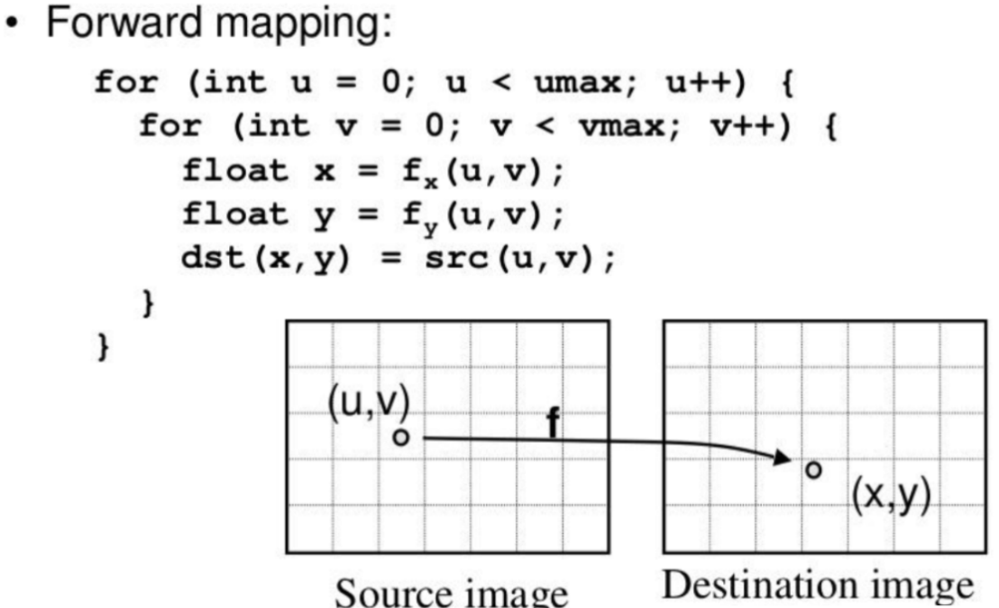
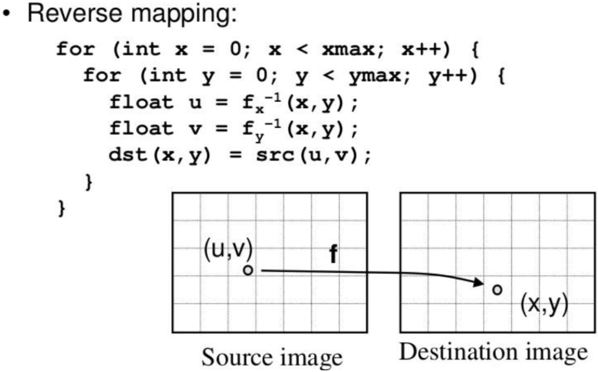
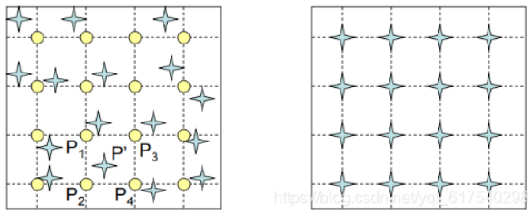

# 

<!--more-->

[参考](https://blog.csdn.net/weixin_54338498/article/details/135751852)

-  **稠密光流**（对图像中的每个像素点都计算光流） 

# 0. Image Warping

- 一种图像Transform的算法

## 0.1 Forward Warping

-  **把source_image中点的值直接warp到destination_image中对应点上** 

  - 遍历`source image`中的每个点`p_source`，乘以从`source image`到`destination image`的`affine matrix`，将其投影到`destination image`中得到`p_destination`，如果`p_destination`的坐标不是整数，则进行四舍五入取整

    

    

  - 这样会产生一个问题： `destination image`中有的位置没有从`source image`中投影过来的点，有的位置有多个从`source image`中投影过来的点，所以会产生很多空洞，产生类似波纹的效果。 

    

    

## 0.2 Backward Warping

-  **把destination_image中的点warp到source_image对应点上，找最近的点的值** 

  - 遍历destination image中的每个点p_destination，乘以destination image到source image的affine matrix，得这个点在source image中的对应点p_source，令p_destination的像素值等于p_source的值，如果p_source的坐标不是整数，则采用插值逼近的方法进行近似，因此不会产生的Forward Warping的问题。

  

  

  - 前面是由source_image + f，将source_image每个点映射到dest_image

  - 现在是对dest_image中的每个点，去source_image找答案

    

    

# 1. 光流（optical flow）

- **光流**是一个**二维速度场**，表示 `每个像素pixel` 从参考图像到目标图像的`运动偏移`。 数学定义如下：
  - 给定两个图像img1，img2 $\in R^ {HW3}$
  - flow $\in R^ {HW2}$ ，其中channel=2分辨描述水平和垂直方向的像素位移。

