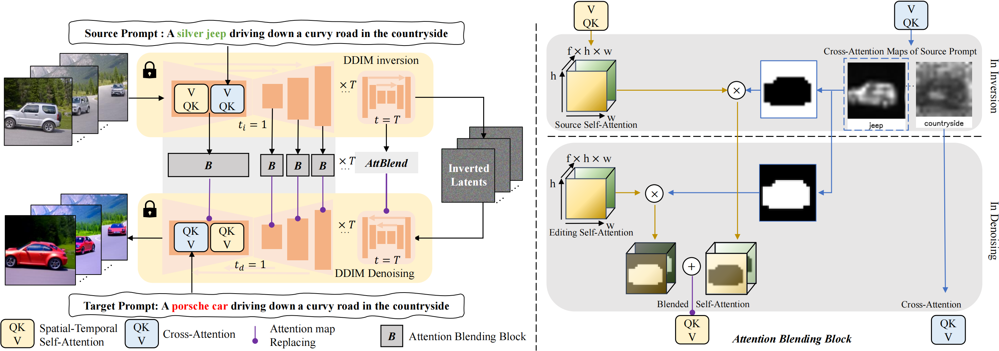
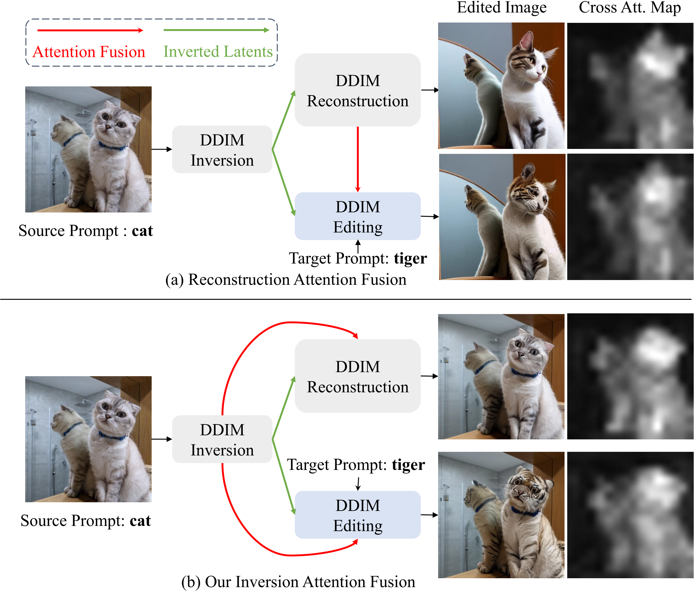
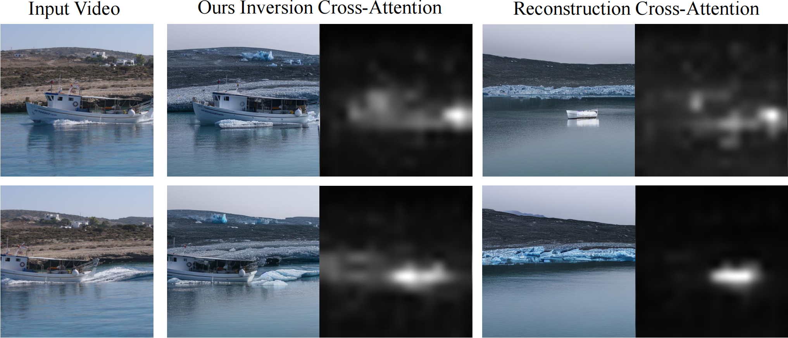
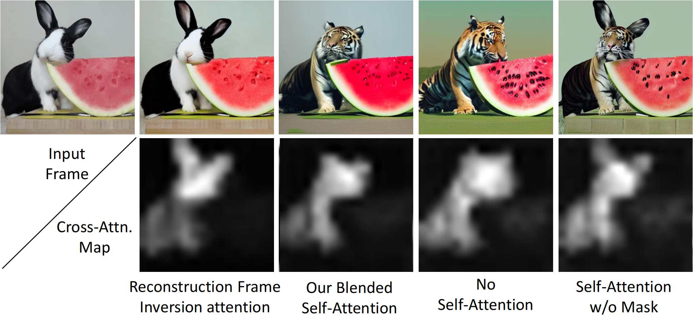

#

<!--more-->

- ICCV 2023
- [论文地址](https://arxiv.org/abs/2303.09535)
- [项目地址](https://github.com/ChenyangQiQi/FateZero)

# 0. Abstract

- 基于扩散的生成模型在基于文本的图像生成中取得了显著的成功。然而，由于它在生成过程中包含巨大的随机性，因此将这种模型应用于**真实世界的视觉内容编辑**仍然具有挑战性，尤其是在视频中。在本文中，我们提出了FateZero，一个**zero shot**的基于文本的真实世界视频的编辑方法，无需按提示训练或特定用途遮罩。为了一致地编辑视频，我们**提出了几种基于预训练模型的技术**。首先，与简单的DDIM反演技术相比，我们的方法**在反演过程中**捕捉中间<u>注意图</u>，有效地**保留了结构和运动信息**。**<u>这些图</u>在编辑过程中直接融合，而不是在去噪过程中生成**。为了进一步最小化源视频的语义泄漏，我们然后将自我注意与混合mask融合，混合mask由源提示中的交叉注意特征获得。此外，我们通过引入**时空注意**来确保帧一致性，从而对UNet去噪中的自注意机制进行了改革。然而简洁，我们的方法是第一个展示零镜头文本驱动的视频风格和从训练好的文本到图像模型进行局部属性编辑的能力的方法。基于文本到视频模型，我们还具有更好的零镜头形状感知编辑能力[51]。大量的实验证明了我们比以前的工作更好的时间一致性和 nnnnnnnnnn编辑能力。

# 3. Method

- 我们的目标是零镜头文本驱动的视频编辑（例如，样式、属性和形状），而没有对每个目标提示进行优化或用户提供的遮罩。
- 通过预训练的文本到图像模型进行视频外观编辑。
- 最后，我们讨论了一个更具挑战性的案例，该案例也支持使用Sec中的视频扩散模型对视频进行形状感知编辑。3.3.
- 注意，所提出的方法是一种通用编辑方法，可以用于各种文本到图像或文本到视频模型中。在本文中，我们主要使用稳定扩散【41】和基于稳定扩散的视频生成模型（Tune-A-Video【51】），因为它具有通用性和泛化能力。

## 3.1 LDM与Inversion

## 3.2 FateZero视频编辑

- 我们使用预训练的文本到图像模型，即稳定扩散，作为我们的基本模型，它包含一个用于T时间步长去噪的UNet。我们**没有直接利用由<u>重建分支的注意力</u>引导的潜在编辑的常规管道**，而是对视频编辑进行了如下几个关键修改。

### 3.2.1 Inversion Attention Fusion

- 使用inversion后的噪声的直接编辑会导致帧不一致，这可能归因于两个因素。
  - 首先，等式中讨论的DDIM的可逆性质仅适用于小步的限制。然而，50个DDIM去噪步骤的当前要求导致每个后续步骤的误差累积。
  - 第二，使用大的无分类器引导$s_ {cfg} $≫1可以增加去噪中的编辑能力，但是大的编辑自由度导致相邻帧不一致。
- 因此，以前的方法需要优化文本嵌入（ Prompt-to-prompt ）或其他正则化（ Zero-shot image-to-image translation. ）。

- 虽然这些问题在单帧的背景下似乎微不足道，但当处理视频时，它们可能会被放大，因为即使帧之间的微小差异也会沿着时间索引被强调。

- 为了缓解这些问题，我们的框架使用**反演步骤中的**注意力图，这是可用的，因为源提示psrc和初始潜在z0在反演期间被提供给UNet。形式上，在反转期间，我们在每个时间步长t将中间自我注意图$[s_ t ^ { src } ]_ { t=1 } ^ T$、交叉注意图$[c_ t ^ { src } ]_ { t=1 } ^ T$和最终潜在特征图zT存储为
  $$
  Z_T , [c_ t ^ { src } ]_ { t=1 } ^ T, [s_ t ^ { src } ]_ { t=1 } ^ T = DDIM-INV(Z_0, P_ { src })
  $$

- 在编辑阶段，我们可以通过**融合来自inversion路径的注意力**来获得 要去除的噪声（noise to remove）：
  $$
  \hat \epsilon_ t = ATT-FUSION(\varepsilon_ \theta ,  z_ t, t, P_{ edit } , c_t ^ { src } , s_ t ^ {src})
  $$

  - $p_ {edit}$是编辑提示词
  - 在函数ATT-FUSION中，我们注入了类似于Prompt-to-Prompt的 **提示词中不变部分的<u>交叉注意图</u>**。我们还**替换了<u>自我注意图</u>**，*以在样式和属性编辑期间保留原始结构和运动*。

- 图3显示了我们的注意力融合方法和（prompt to prompt,  Null text inversion）中用于图像编辑的简单反转然后生成的典型方法之间的玩具比较示例。**反演期间的交叉注意力图捕捉到了源图像中猫的轮廓和姿势**，但是**重建期间的注意力图**具有明显的差异。而在视频中，注意力一致性可能影响时间一致性，如图8所示。这是因为时空自注意力图代表了帧之间的对应关系，现有视频扩散模型（TAV）的时间建模能力并不令人满意。 （时空注意力怎么变成了时空自注意力？？？）

  

  

>Inversion attention compared with reconstruction attention using prompt ‘deserted shore −→ ‘glacier shore’. The attention maps obtained from the reconstruction stage fail to detect the boat’s position, and can not provide suitable motion guidance for zero-shot video editing.

### 3.2.2 Attention Map Blending

>使用稳定扩散的零镜头形状编辑（兔子→老虎）中混合自我注意的研究。第四和第五列：忽视自我关注不能保存原始结构和背景，天真的替换会导致伪影。第三列：使用交叉注意力图混合自我注意力（第二行）从具有相似姿势的目标文本获得新形状，并从输入帧获得背景。

- 反转-时间注意力融合 在局部损耗编辑中可能不足，如图4中所示，在第三列中，**用$s^ { src }$替换自我注意$s^ { edit } \in \mathbb R ^ { h w \times hw}$会带来不必要的结构泄漏**，并且生成的图像在可视化中具有令人不快的混合伪影。

- 另一方面，如果我们在DDIM去噪流水线期间保留$s^ { edit }$，背景和西瓜的结构会发生不必要的变化，原始兔子的姿势也会丢失。

- 受交叉注意图提供图像的语义布局这一事实的启发（prompt to prompt），如图4的第二行所示，我们通过在反转期间用常数τ[2，3]对编辑单词的交叉注意图进行阈值化来获得二进制掩码Mt。然后，编辑阶段$s^ {edit} _ t$和反转阶段$s_ t ^ { src }$的自注意力图与二进制掩模Mt混合，如图2所示。形式上，注意力图融合实现为
  $$
  \begin{aligned}
  M_ t &= heavisidestep( c_ t ^ { src }, \tau) \\\\ s_t ^ { fused  } &= M_t \odot s_ t ^ { edit } + ( 1- M_ t) \odot s_ t ^ { src }
  \end{aligned}
  $$
  

### 3.2.3 Spatial-Temporal Self-Attention

- 前两种设计使我们的方法成为一种强大的编辑方法，可以保留更好的结构，也是视频编辑的一个很大的潜力。然而，单独对每个帧进行去噪仍然会产生不一致的视频。受因果自我注意【15,20,49,50】和最近的一次性视频生成方法【51】的启发，我们在不改变预训练权重的情况下，将原始自我注意重塑为时空自我注意。具体地，我们在时间索引$i \in [1，n]$处实现特征$z^ i$的$attention（Q，K，V）$为：
  $$
  \begin{aligned}
  Q & = W^ Q z^ i , \\
  K & = W^ K [ z^i ; z^ w], \\
  V & = W^ V [z^ i ; z^ w]
  
  \end{aligned}
  $$

  - 其中$[ \cdot ]$表示级联操作
  - 我们发现扭曲中间帧$z^ w = z ^ { Round [ \frac { n } { 2 }] }$以进行属性和样式编辑就足够了

- 因此，时空自我注意图表示为$s_ t ^ { src } \in \mathbb R ^ { hw \times fhw }$，其中f=2是用作键和值的帧数。它同时捕获单个帧的结构和与扭曲帧的时间对应关系。

- 总的来说，所提出的方法为零镜头真实世界视频编辑产生了一种新的编辑方法。我们用反演步骤期间的相应图替换去噪步骤中的注意力图。之后，我们**利用交叉注意图作为掩码**来防止语义泄漏。最后，我们将UNet的自我注意力改革为时空注意力，以获得不同时间帧之间更好的时间一致性。我们在补充材料中包含了一个正式的算法以供参考。

## 3.3 形状感知视频编辑

与外观编辑不同，改造视频中特定物体的形状更具挑战性。为此，需要一个预训练的视频扩散模型。由于没有公开可用的通用视频扩散模型，我们改为在单镜头视频扩散模型（TAV）上执行编辑。在这种情况下，我们将我们的编辑方法与简单的DDIM反演[45]进行比较，其中我们的方法在编辑能力、运动一致性和时间一致性方面也获得了更好的性能。这可能是因为膨胀的模型很难过度拟合输入视频的精确运动。而在我们的方法中，运动和结构在反演过程中由高质量的时空注意力图$s_ t ^ { src }  \in \mathbb R ^ { hw \times fhw}$表示，在编辑过程中进一步与注意力图融合。更多细节可以在图7和supp中找到。录像。